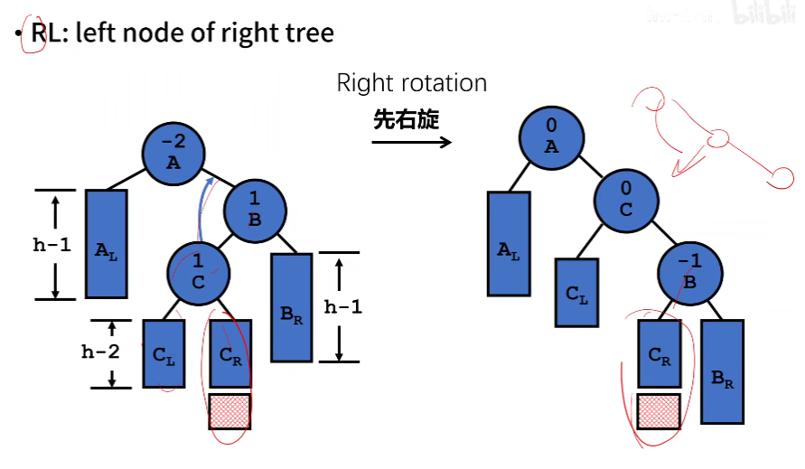
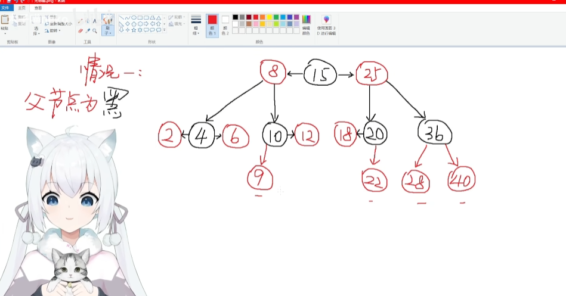
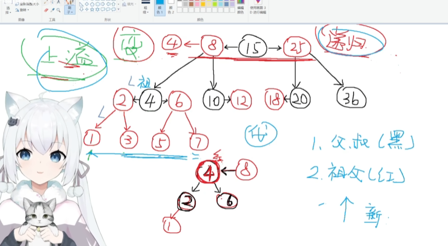

# AVL树

## LL/RR失衡恢复

## LR/RL失衡恢复

AVL树失衡条件很宽松，只要左右子树深度差超过1就会触发平衡调整。这样做虽然可以保证平衡，但调整频率太多，也很浪费时间

# 红黑树

平衡性没有AVL好但有自己的平衡规则，平衡要求相对较低

## 平衡规则

通过颜色来平衡

要求：（红黑树的叶子节点是NULL节点）

1. 每个节点要么是红色，要么是黑色
2. 根节点必须是黑色
3. 红节点的孩子必须是黑节点
4. 对于每个节点，到NULL节点（孩子）的任何路径，所含之黑色节点数必须相同

推论：

1. 红黑树的高度最高为$log_2(n+1)$

## 从234树到红黑树

### 234树

### 234树插入时，超过4节点就上溢

## 红黑树的插入

上述变形有一个特点：四节点的情况下，黑色节点的左右儿子必为红色

如果插入的是根结点，则为黑色，其余情况插入的节点最开始一定为红色

（如果是插入红色节点，仅有一种冲突状况，就是可能出现连续两个红色节点，这时候只需要旋转和变色进行调整）

### 红黑树的插入操作分为12种情况

其中插入节点的父节点为黑色的4种情况是可以直接插入，不做调整的，如下

而另外的8种情况需要做不同程度的调整

### 情况1：LL/RR

单旋转+染色，如插入13 导致8->10->12出现连续两个红色，则进行一次单侧旋转，并把12染成黑色，10和13染成红色，如下：

### 情况2：RL/LR

双旋转+染色，如插入11导致10->12->11出现连续两侧红色，则先父节点12进行右旋，变成10->11->12，然后祖父节点左旋，将新插入的染成黑色，祖父节点10染成红色就行

### 情况1、2总结

这两种情况都是没有叔父节点的（也就是父节点没有兄弟节点）

### 情况3：5节点上溢

只需要变色，将插入节点的父节点和叔父节点变为黑色，祖父节点变为红色，然后将祖父节点作为新节点（变成红色了嘛）插入到其父节点进行递归处理

写代码时需要把四种情况都写出来，也就是1、3、5、7四种情况

## 红黑树的删除

B树中的删除操作，对于非叶子节点，是转换为其前驱/后继节点的删除

如下要删除节点8，则可以选择和前驱（6）或者后继（10）删除，将8与6数据交换，然后删除8

红黑树的删除分为两种情况

1. 红色节点可以直接删除（不会影响性质4）
2. 黑色节点的删除

#### 黑色节点的删除

也分为三种

#### 有2个红色子节点的黑色节点（不做考虑）

可以转化为对子节点的删除，比如右子树的最左边的节点进行交换？然后删除

#### 有1个红色子节点的黑色节点

用唯一的红色子节点来替换被删除的节点

要删除10，就用12替代10（将8指向12），然后删除10，再把替代节点12染成黑色

#### 黑色叶子节点（下溢的情况）

##### 删除节点为根节点，直接删除

##### 删除节点的兄弟节点为黑色（如删除36）

1. 兄弟节点有红色子节点（借用兄弟子节点修复）

   - 情况1：红色节点在左边

   

   1. 删除36节点

   2. 下溢，旋转+染色（LL）

      

   - 情况2：红色节点在右边

     

   1. 删除36节点

   2. 下溢出，双旋+染色（LR），其实就是选一个中间大小的值来做父节点

      

   - 情况3：兄弟节点有两个红色子节点（可以选LL/RR来修复）

   步骤总结：

   1. 在删除节点后进行旋转
   2. 中心节点染为父节点的颜色
   3. 两个子节点染为黑色

2. 兄弟节点没有红色子节点（父节点向下合并）

   - 情况1：父节点是红色

     

     只需要变色

     

   - 情况2：父节点是黑色

     

     需要先删除节点，然后把父节点当作被删除节点来处理，在代码里是先删除，然后调用`after_remove()`来进行变色和旋转，在这个函数中也需要判断节点的颜色，最终效果如下（变成父节点是红色而兄弟节点是黑色且兄弟节点没有红色节点）

     

   步骤总结：

   1. 兄弟节点染红，父节点染黑
   2. 如果父节点为黑色：把父节点当作已被删除的节点处理，递归

##### 删除节点的兄弟节点为红色（转变为黑色处理）

先父节点做旋转，然后把兄弟节点染成黑色，父节点染红，就转为上面的情况1

总结：父节点右旋，兄弟节点染黑，父节点染红，然后使用兄弟为黑色的方法进行修复
