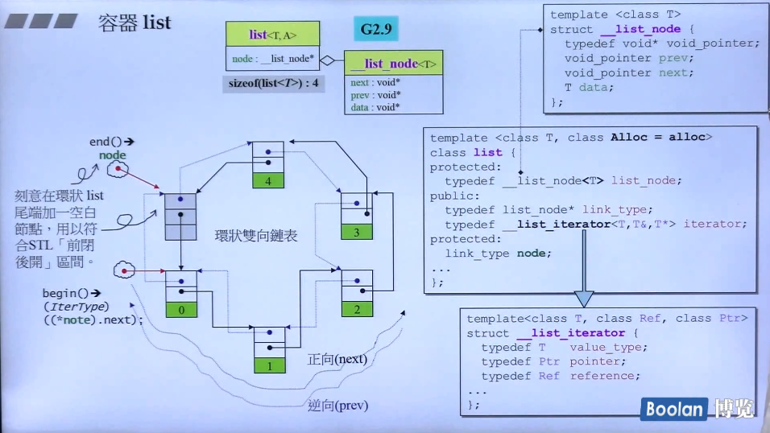
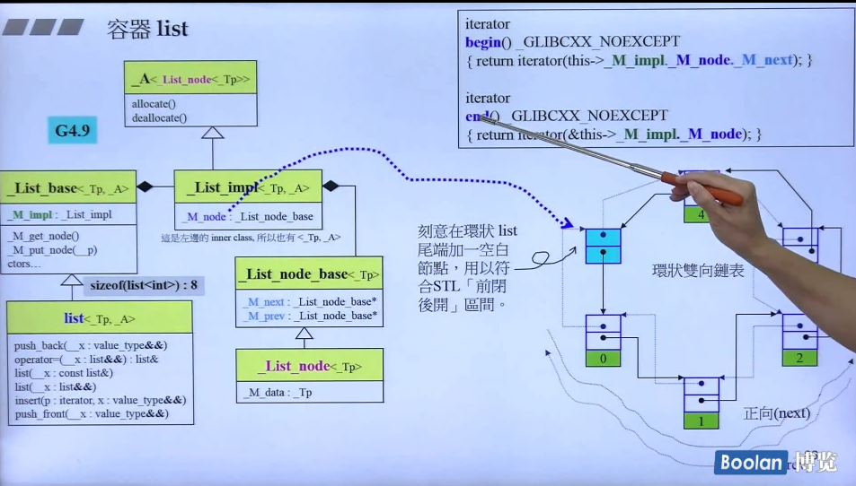
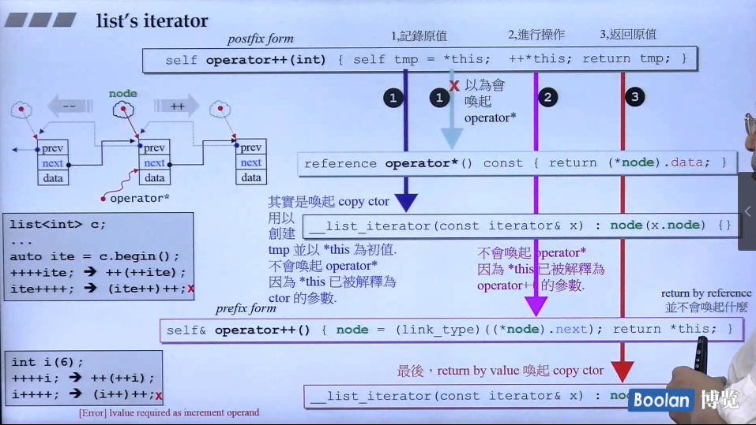
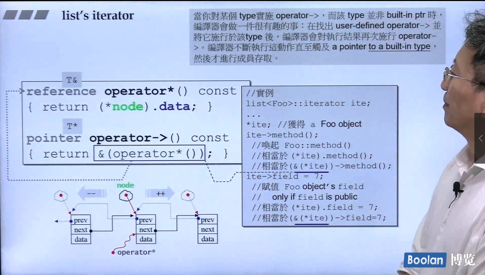
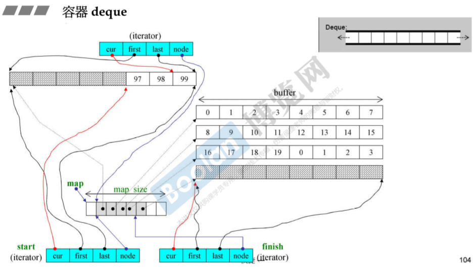
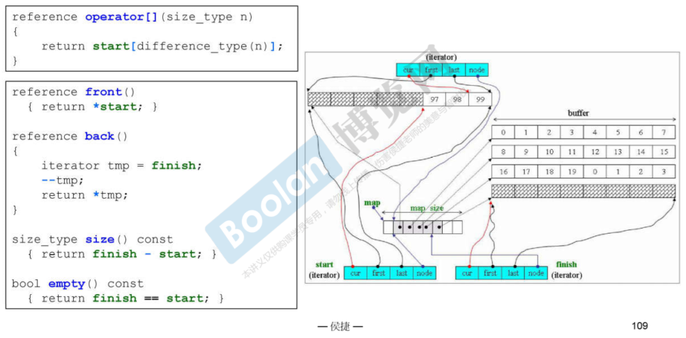
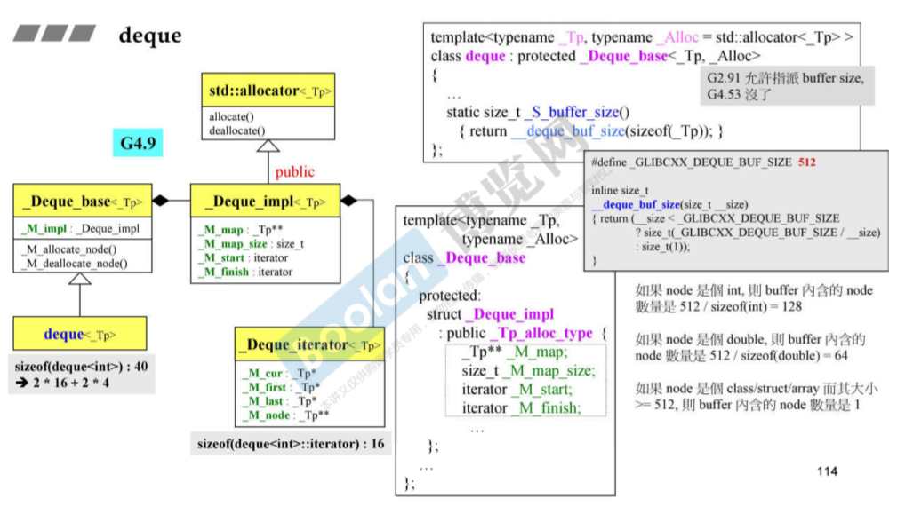

# vector

### vector嵌套的型别定义

```c++
template <class T, class Alloc=alloc>
class vector {
public:
    typedef T			value_type;
    typedef value_type*	pointer;
    typedef value_type*	iterator;
    typedef value_type&	reference;
    typedef size_t		size_type;
    typedef ptrdiff_t	difference_type;
    ...
}
```

似乎没有定义`iterator_catogory`，其实由于vector的迭代器就是普通指针，在算法使用迭代器是，会使用iterator_traits寻找该迭代器的类型，由于vector::iterator是value_type*，也就是`T*`，因此会自动识别成偏特化版本，其中的迭代器默认为Rando Access Iterators类型

> 另外所有具有（或号称）连续空间的容器都得重载`[]`

### vector的迭代器

如上所属，就是普通指针。

### vector的数据结构

用三个迭代器指代连续空间的使用范围

```c++
template <class T, class Alloc=alloc>
class vector {
...
protected:
	iterator start;			//表示目前使用空间的头
    iterator finish;		//表示目前使用空间的尾
    iterator end_of_storage;//表示目前可用空间的尾
...
}
```

运用如上三个迭代器，可以提供各种机能：

```c++
template <class T, class Alloc=alloc>
class vector {
...
public:
    iterator begin() {return start;}
    iterator end() {return finish;}
    size_type size() const {return size_type( end() - begin() ); }
    size_type capacity() const {
        return size_type (end_of_storage-begin();)
    }
    bool empty() const {return begin==end();}
    reference operator[] (size_type n) {return *(begin()+n);}
    
    reference front() { return *begin(); }
    reference back() {return *(end()-1);}
...
};
```

### vector的构造与内存管理

#### 构造函数

```c++
//构造函数
vector(size_type n,const T& value){fill_initialize(n,value);}
//填充并予以初始化
void fill_initialize(size_type n, const T& value){
    start = allocate_and_fill(n,value);
    finish=start+n;
    end_of_storage=finish;
}
//配置而后填充
iterator allocate_and_fill(size_type n, const T& x){
    iterator result=data_allocator::allocate(n);//配置n个元素空间
    uninitialized_fill_n(result,n,x);//2.3节的全局函数，会根据第一参数的型别特征选择直接复制内存（fill_n()）还是反复调用构造函数。填充的是未初始化的空间
    return result;
}
```

#### push_back

如果有空间，也就是`finish!=end_of_storage`，就调用全局函数`construct(finish,x);`来创建，并提高水位`++finish`，否则调用`insert_aux(end(),x);`来处理。

如果没有空间，则动态增加大小。以原大小的**两倍**另外配置一块较大空间，然后将原内容拷贝过来，然后才开始在原内容之后构造新元素，并释放原空间。

> 一旦空间重新配置，指向原vector的所有迭代器就都失效了

### insert(position,n,x);

在vector的某个位置插入n个x值。

分三种情况

```c++
if(备用空间大于等于新增元素个数){
	if(插入点之后的现有元素大于新增元素个数){
		uninitialized_copy();//将finish前n个元素复制到finish后未初始化的空间
        copy_backward();//剩余的元素复制到finish之前
        fill();//填充n个新元素
	}else{//插入点之后的现有元素小于等于新增元素个数
        uninitialized_fill_n();//在finish后n-elems_after(现有元素个数)个x
        uninitialized_copy();//再在上面填充的后面把原有的元素复制到未初始化空间
        fill();//填充n个新元素
    }
}else{//备用空间小于新增元素个数
    ...//先创建一个块区域大小为old_size+max(old_size,n)
    uninitialized_copy();//把原position前的元素复制到未初始化空间
    uninitialized_fill_n();//插入n个新元素
    uninitialized_copy();//把原position后的元素复制到未初始化空间
}
```

## C++中push_back和emplace_back的区别

https://zhuanlan.zhihu.com/p/213853588

将 `emplace_back()` 和 `push_back()` 中区别最大的程序拎出来看：

```c++
_Alloc_traits::construct(this->_M_impl, this->_M_impl._M_finish,
                                 std::forward<_Args>(__args)...); // emplace_back()
_Alloc_traits::construct(this->_M_impl, this->_M_impl._M_finish,
                                 __x);                            // push_back()
```

对于 `std::forward()` 函数而言，本质上是一个类型转换函数，它的声明函数如下所示：

```c++
/**
 *  以下程序来自STL源码 bits/move.h
 *  @brief  Forward an lvalue.
 *  @return The parameter cast to the specified type.
 *
 *  This function is used to implement "perfect forwarding".
 */
template<typename _Tp>
constexpr _Tp &&forward(typename std::remove_reference<_Tp>::type &__t) noexcept {
    return static_cast<_Tp &&>(__t);
}
```

**在强制类型转换中，将参数 `__t` 传递给对应类 `_Tp` 的构造函数，然后调用了该类的构造函数从而完成对象创建过程。**

因此，在 `emplace_back()` 函数中，是支持直接将构造函数所需的参数传递过去，然后构建一个新的对象出来，然后填充到容器尾部的。

# array

不可扩充的序列式容器

```c++
//TR1版本
template<typename _Tp, std::size_t _Nm>
struct array
{
    typedef _Tp			value_type;
    typedef _Tp*		pointer;
    typedef value_type*	iterator;
    
    value_type _M_instance[_Nm ? _Nm:1];
    
    iterator begin()
    {	return iterator(&_M_instance[0]);	}
    
    iterator end()
    {	return iterator(&_M_instance[_Nm]);	}
    
    ...
}
//使用方法
array<int,10> 
```

没有构造函数，析构函数

# list

### 空list的大小

```c++
sizeof(list)=
    //2.9
    4
    //4.9
    8
```

#### 2.9版本



`list<T>`内含一个指向`_list_node<T>`的指针，所以大小为4，一个指针大小

#### 4.9版本



空的list含有一个虚节点，这个虚节点含有两个指针（继承自`_List_node_base`），所以大小为8（64位为16）

### list的节点

```c++
//2.9
template <class T>
struct __list_node {
	typedef void* void_pointer;
    void_pointer prev;	//型别为void*。其实可设为__list_node<T>*
    void_pointer next;
    T data;
};
//4.9
struct _List_node_base
{
    _List_node_base* _M_next;
    _List_node_base* _M_prev;
};
template <typename _Tp>
struct _List_node : public _List_node_base
{
    _Tp _M_data;
};
```

双向链表

### list的迭代器

Bidirectional Iterators

后++先调用重载的=，后调用重载的*





2.9版本需要传入3个参数

```c++
//2.9
template <class T, class Ref, class Ptr>
struct __list_iterator
{
    typedef Ptr pointer;
    typedef Ref reference;
    ...
};
//4.9
template <class _Tp>
struct __List_iterator
{
    typedef _Tp* pointer;
    typedef _Tp& reference;
    ...
};
```

### list的数据结构

2.9版本的list是受一个虚节点node控制的

```c++
//2.9
iterator begin() { return (link_type)((*node).next);}
iterator end() { return node};//保持左闭右开

reference front() { return *begin(); }
reference back() { return *(--end()); }
```


### list的构造与内存管理

```c++
//2.9版
protected:
	//配置一个节点并返回，分配空间
	link_type get_node() {return list_node_allocator::allocate();}
	//释放一个节点
	void put_node(link_type p) { list_node_allocator::deallocate(p); } //一般就是调用free

	//产生（配置并构造）一个节点，带有元素值
	link_type create_node(const T& x) {
        link_type p = get_node();
        construct(&p->data, x);//全局函数，构造/析构基本工具，placement new。
        return p;
    }
	//销毁（析构并释放）一个节点
	void destroy_node(link_type p){
        detroy(&p->data);//删除的是p指向的data的空间，也就是list<T>中的T类型的数据
        put_node(p);//删除p指向的空间，之所以分开两个，是因为T可能是一个类，有自己的构造和析构函数，不能直接free
    }
```

#### insert函数

```c++
//函数目的：在迭代器position所指位置插入一个节点，内容为x
iterator insert(iterator position,const T& x){
    link_type tmp= create_node(x);
    //调整双向指针，使tmp插入进去
    tmp->next = position.node;
    tmp->prev = position.node->prev;
    (link_type(position.node->prev))->next = tmp;
    position.node->prev=tmp;
    return tmp;
}
```

### list的元素操作

push_front，push_back，erase，pop_front，pop_back，clear，remove，unique，splice，merge，reverse，sort

#### 内部函数：迁移操作transfer

这个函数并非公开接口，将某连续范围的元素迁移到某个特定位置之前

```c++
void transfer(iterator position, iterator first, iterator last) {
    if(position!=last){
        //先移动next指针，此时prev指针没改变，可以通过prev指针引导
        (*(link_type((*last.node).prev))).next=position.node;
        (*(link_type((*first.node).prev))).next=last.node;
        (*(link_type((*positionj.node).prev))).next=first.node;
        //接着移动prev指针，因为会出现某个prev指针修改后，无法完成引导，因此先使用局部变量存储
        link_type tmp=link_type((*position.node).prev);
        (*position.node).prev=(*last.node).prev;
        (*last.node).prev=(*first.node).prev;
        (*first.node).prev=tmp;
    }
}
```

#### 基于transfer()的其他操作

```c++
splice()//将某连续范围的元素从一个list移动到另一个（或同一个）list的某个定点

merge()//将另一个list合并到此list上，两个list都要递增排序

reverse()//反转list
    
sort()//排序，但不是STL中的sort()算法，采用快速排序实现
```


#### sort函数

算法时间复杂度相当于快速排序，都实现了$log_2n$次遍历，总时间复杂度为$O(nlog_2n)$。区别在于快排是先遍历，以某个值分出左右两部分，再对左右两部分进行排序。但是list的排序是当凑到$2^n$个元素是，调用merge函数排一次序。

https://blog.csdn.net/qq_31720329/article/details/85535787

# deque

### 概述



deque的连续空间由多个缓冲区组成，多个缓冲区由中控器`map`控制，`map`类型为`T**`，其中的每个元素就是一个指向一个缓冲区的指针，缓冲区才是deque的储存空间主题。

因此，deque的迭代器就不能是普通的指针，而是拥有4个指针的结构体。如上图所示：cur表示迭代器当下所指示的元素，first表示该元素所在缓冲区的头，last表示该元素所在缓冲区的尾，node指向该缓冲区在管控中心的位置

### deque的迭代器

```c++
template<class T, class Ref,class Ptr, size_t BufSiz>
struct __deque_iterator { //未继承std::iterator
    typedef __deque_iterator<T, T&, T*, BufSiz> iterator;
    typedef __deque_iterator<T, const T&, const T*, BufSiz> const_iterator;
    static size_t buffer_size() {return __deque_buf_size(BufSiz,sizeof(T));}
    //未继承std::iterartor，所以必须自行撰写五个必要的迭代器相应的类型
    typedef random_access_iterator_tag iterator_category;//(1)
    typedef T value_type;				//(2)
	typedef Ptr pointer;				//(3)
    typedef Ref reference;				//(4)
    typedef size_t size_type;	
    typedef ptrdiff_t difference_type;	//(5)
    
    typedef __deque_iterator self;
    
    T* cur;				//此迭代器所指之缓冲区中的现行（current）元素
    T* first;			//此迭代器所指之缓冲区的头
    T* last;			//此迭代器所指之缓冲区的尾（含备用空间）
    map_pointer node;	//指向管控中心
    ...
}
```

> 用来决定缓冲区大小的函数buffer_size()
>
> ```c++
> inline size_t __deque_buf_size(size_t n, size_t sz)
> {
>     return n!=0 ? n:(sz < 512 ? size_t(512/sz) : size_t(1));
> }
> ```
>
> - 如果n不为0，传回n，表示buffer size由用户自定义（新版不支持自定义）
> - 如果n为0，表示buffer size使用默认值，那么
>   - 如果sz（元素大小，sizeof(value_type)）小于512，传回512/sz，
>   - 如果sz不小于512，传回1

#### deque如何模拟连续空间



要计算出空间的大小（`size()`函数的实现）就得依靠迭代器，也就是`finish-start`。因此需要重载`operator-`符号

```c++
reference operator*() const
{return *cur;}

pointer operator->() const
{return &(operator*());}

//两根iterators之间的距离相当于
//1. 两根iterators间的buffers的总长度 +
//2. itr至其buffer末尾的长度 +
//3. x 至其buffer起头的长度
difference_type
operator-(const self& x) const
{
    return difference_type(buffer_size()) * (node - x.node -1) + 
        (cur - first ) + (x.last - x.cur);
}
```

> 关于`operator->()`
>
> 一般都是通过`operator*()`实现的，调用时会默认使用`(x.operator->())->()`的形式
>
> ```c++
>     string str="my god";
>     cout<<str.size()<<endl;//6
>     string *s=&str;
>     cout<<s->size()<<endl;//6
>     deque<string> str_list;
>     str_list.push_back(str);
>     deque<string>::iterator it=str_list.begin();
>     cout<<it->size()<<endl;//6
> //it->size()会变成(it.operator->())->size;
> //也就是(&(it.operator*()))->size  
> //it.operator*() ==> *cur ==>str
> //再取地址，相当于上面的 指针s，因此最后 ==> &(*cur)->size()==>s->size();
> ```

迭代器的指针运算，因为涉及到缓冲区的切换，所以再缓冲区边缘时需要特别注意

```c++
void set_node(map_pointer new_node) {
    node = new_node;
    first = *new_node;
    last = first+ difference_type(buffer_size());
}

self& operator++(){
    ++cur;
    if(cur==last){//如果已到达缓冲区末尾（因为左闭右开，所以cur!=last）
        set_node(node+1);
        cur=first;
    }
    return *this;
}

self operator++(int) { //后置式，标注写法
    self tmp =*this;
    ++*this;
    return tmp;
}

self& operator--(){
    if(cur==first){
        set_node(node-1);
        cur=last;
    }
    --cur;
    return *this;
}

self operator--(int){
    self tmp=*this;
    --*this;
    return tmp;
}
// 作为random_access_iterator，需要提供随机存取
// 迭代器可以直接跳跃n个距离
self& operator+=(difference_type n) {
    difference_type offset = n + (cur - first);
    if(offset>=0 && offset<difference_type(buffer_size()))
        //目标再同一缓冲区
        cur += n;
    else{
        //目标的位置不在同一缓冲区
        difference_type node_offset =
            offset > 0 ? offset / difference_type(buffer_size())
            : -difference_type((-offset - 1)) / buffer_size() -1;
        //切换到正确的缓冲区
        set_node(node+ node_offset);
        //切换到正确的元素
        cur = first + (offset - node_offset * difference_type(buffer_size()));
    }
    return *this;
}

self operator+(difference_type n) const {
    self tmp = *this;
    return tmp += n;
}
//利用 operator+=实现operator-=
self& operator-=(difference_type n) { return *this+= -n};

self operator-(difference_type n) const {
    self tmp = *this;
    return tmp -= n;
}
//相对当前迭代器做偏移，这是迭代器的重载，deque也有自己的重载
//比如 iterator it= q.begin()+1; 则it[1]表示的其实是q.begin()+2处的值
reference operator[] (difference_type n) const {return *(*this + n);}
//deque自己的重载
class deque{
    ...
public:
    reference operator[](size_type n){
        return start[difference_type(n)];//调用__deque_it
    }
}
```

### G4.9设计

每个容器基本都会从单一的类设计为如下形式



首先`xx`继承自`_xx_base`； `_xx_base`里有个类型为 `_xx_impl`的数据（也就是xx的实际数据），而 `_xx_impl`继承自`std::allocator`

### deque的构造与内存管理

#### 构造函数

1. 首先调用`create_map_and_nodes`创造deque的结构
   1. 创建map，至少是最少8个，最多是所需节点数+2，取两者最大值。
   2. 分配时将所需的节点放在map的最中央区域，保证头尾两端的扩充能量一样大。
   3. 接着为map内的每个现用节点配置缓冲区
   4. 最后为deque的两个迭代器start和end设定正确内容
2. 为每个节点的缓冲区设定初值，最后一个节点的设定稍有不同（因为尾端可能有备用空间，不必设初值）

#### push_back函数

1. 如果最后缓冲区尚有两个（含）以上的元素备用空间，直接调用全局构造函数创建元素，并调整缓冲区状态
2. 如果只剩一个，则先判断是否需要扩充map，然后创建新的缓冲区`*(finish.node+1)=allocate_node();`。在最后一个位置创建新元素，然后修改节点指向新创建的节点。

#### push_front函数

逻辑上与push_back类似。

#### 重新配置map

首先判断map_size是否大于元素个数的两倍，如果是则将元素调整到map的中央，否则创建出一块`2*map_size+2`（`map_size+(map_size,nodes_to_add)+2`）的空间（`nodes_to_add=1`，因此一般可以认为是两倍的map_size），再把原数据复制来。

### deque的元素操作

#### pop_back, pop_front

需要先判断是否会产生空的缓冲区（pop_back检查**最后**一个缓冲区是否有一个或者更多的元素，pop_front检查第一缓冲区是否有两个或更多元素）。

```c++
void pop_back(){
    if(finish.cur!=finish.first){
        //最后缓冲区有一个（或更多）元素
        --finish.cur;			//调整指针，相当于排除最后元素
        destroy(finish.cur);	//将最后元素析构
    }
    else
    	pop_back_aux();    
}
void pop_front(){
    if(start.cur!=start.last-1){
        //第一缓冲区有两个个（或更多）元素
        destroy(start.cur);		//将第一元素析构
        ++start.cur;			//调整指针，相当于排除第一元素
    }
    else
    	pop_front_aux();    
}
```

> 两个函数析构和调整指针顺序为什么不同？
>
> 因为start和finish的前闭后开，finish的cur指向的是最后一个元素的后面的空间

若产生了空的缓冲区，aux函数还负责释放不用的缓冲区

#### clear

1. 先将头尾以外的缓冲区元素析构并释放缓冲区空间
2. 随后处理头尾缓冲区
   1. 若有头和尾两个缓冲区，则留头缓冲区，析构元素
   2. 若只有一个就保留缓冲区，析构元素
3. 调整状态：`finish=start;`

#### erase

根据要删除元素前后元素的个数决定是从前开始从后

如果前方的元素比较少，就将前方元素向后移，覆盖要删除的元素，再析构冗余元素

反之就将后方元素向前移，覆盖要删除的元素，再析构冗余元素

#### insert

```c++
//在position处插入一个元素，其值为x
iterator insert(iterator position, const value_type& x){
    if(position.cur==start.cur){		//如果插入点是deque最前端
        push_front(x);					//交给push_front去做
        return start;
    }
    else if(position.cur==finish.cur){	//如果插入点是deque最尾端
        push_back(x);					//交给push_back去做
        iterator tmp = finish;
        --tmp;
        return tmp;
    }
    else
        return insert_aux(position,x);
}

template <class T, class Alloc, size_t BufSize>
typename deque<T, Alloc, BufSize>::iterator
deque<T, Alloc, BufSize>::insert_aux(iterator pos,const value_type&x){
    difference_type index = pos - start;	//插入点之前的元素个数
    value_type x_copy=x;
    if(index < size()/2){					//在插入点之前的元素个数比较少
        push_front(front());				//在最前端加入与第一个元素同值得元素
        iterator front1=start;
        ++front1;
        iterator front2=front1;
        ++front2;
        pos = start + index;
        iterator pos1 = pos;
        ++pos1;								//pos1表示要移动数据得尾端，由于是左闭右开，所以要++
        copy(frint2,pos1,front1);
    }
    else{
        push_back(back());
        iterator back1 = finish;
        --back1;
        iterator back2=back1;
        --back2;
        pos = start + index;
        copy_backward(pos,back2,back1);
    }
    *pos = x_copy;
    return pos;
}
```

# stack

编译器对模板不会做全面检查，只有在使用时（创建或者使用函数）才会检查

以deque为底部结构并封闭其头端开口，获得stack，这种“修改某物接口，形成另一种风貌”的性质者，称为**adapter（配接器）**

stack没有迭代器

```c++
template <class T, class Sequence = deque<T> >
class stack{
    //以下的 __STL_NULL_TMPL_ARGS 会展开为<>，见1.9.1节
    friend bool operator== __STL_NULL_TMPL_ARGS (const stack&, const stack&);
    friend bool operator== __STL_NULL_TMPL_ARGS (const stack&, const stack&);
    //等同于friend bool operator== <T> (const stack<T>&, const stack<T>&);
    //是为了实现所谓的bound friend templates，也就是class template的某个具现体与其friend function template的某个具现体有一对一的关系
public:
    typedef typename Sequence::value_type value_type;
    typedef typename Sequence::size_type size_type;
    typedef typename Sequence::reference reference;
    typedef typename Sequence::const_reference const_reference;
protected:
    Sequence c;
public:
    //empty(),top,push,pop完全用c的操作完成
};
```

# queue

与stack类似，由deque完成底层实现

# heap

不归属于STL容器组件，扮演priority queue的助手。STL供应的是max-heap

底部容器vector

## heap算法

### push_heap

```c++
//核心算法
template <class RandomAccessIterator, class Distance, class T>
void __push_heap(RandomAccessIterator first, Distance holeIndex,
                Distance topIndex, T value) {
    Distance parent = (holeIndex - 1) /2 ;//找出父节点
    while(holeIndex > topIndex && *(first+ parent)<value){
        *(first + holdIndex) = *(first + parent);
        holeIndex=parent;
        parent=(holdIndex-1)/2;
    }
    *(first + holeIndex) = value;
}

```

### pop_heap

```c++
//核心算法
template <class RandomAccessIterator, class T, class Distance>
inline void __pop_heap(RandomAccessIterator first, RandomAccessIterator last, RandomAccessIterator result, T value, Distance*){
    *result = *first;//设定尾值为首值，于是尾值即为欲求结果
    
    __adjust_heap(first,Distance(0), Distance(last - first), value);
    //以上欲重新调整heap，洞（空出的位置）为0，即树根处，欲调整值为value(原尾值)
}
//以下这个__adjust_heap()不允许指定“大小比较标准”
//用Distance和topIndex的方式是为了方便实现子树的调整
template <class RandomAccessIterator, class Distance, class T>
void __adjust_heap(RandomAccessIterator first, Distance holeIndex, Distance len, T value){
    Distance topIndex = holeIndex;
    Distance secondChild = 2 * holeIndex + 2;//洞节点的右节点
    while(secondChile < len){//len= Distance(last - first)
        //比较洞节点左右两个子值，secondChild代表大的
        if(*(first + secondChild)< *(first + (secondChild - 1)))
            sencondChild--;
        //下溯：令较大子值为洞值，再另洞下移至较大子节点处
        *(first + holeIndex)=*(first + secondChild);
        holeIndex = secondChild;
        secondChild = 2 * (holdIndex + 1);
    }
    if(secondChild == len){//没有右子节点，只有左子节点
        //下溯：令左子值为洞值，再令洞号下移至左子节点处
        *(first + holeIndex)=*(first + secondChild -1 );
        holeIndex = secondChild - 1;
    }
    
    __push_heap(first, holdIndex, topIndex, value);//再在最后空出的位置插入原先最后的值
}
//pop_heap()之后还要将容器的最后pop();
```

### sort_heap

```c++
template <class RandomAccessIterator>
void sort_heap(RandomAccessIterator first, RandomAccessIterator last){
    //以下，每执行一次pop_heap()，极值（在STL heap中为极大值）即被放在尾端。
    //扣除尾端再执行一次pop_heap()，次极值又被放在新尾端。一直下去，最后即得排序结果
    while(last-first>1)
        pop_heap(first,last--);//没执行pop_heap()一次，操作范围即退缩一格
}
```

### make_heap

```c++
template <class RandomAccessIterator, class T, class Distance>
void __make_heap(RandomAccessIterator first, RandomAccessIterator last, T*, Distance*){
    if(last - first < 2) return;
    Distance len= last - first;
    Distance parent = (len - 2)/2;
    
    while(true){
        __adjust_heap(first, parent, len, T(*(first + parent)));
        if(parent == 0) return;	//z
        parent --;
    }
}
```

# priority_queue

底层max-heap，没有迭代器。

# slist

两个slits互换只要`head`交换互指即可

insert插入指定`iterator ite2`之前，可能是通过

```c++
for(;ite!=ite2;++ite) {
    ite_before=ite;
}
```

找到ite2前一个元素
