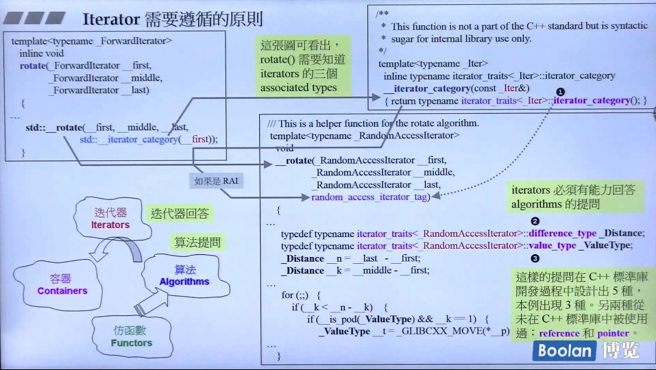
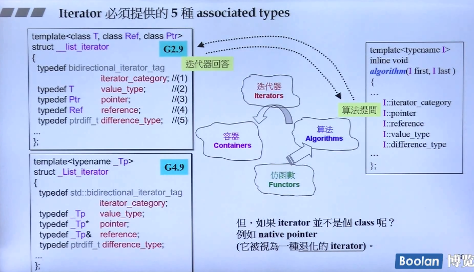
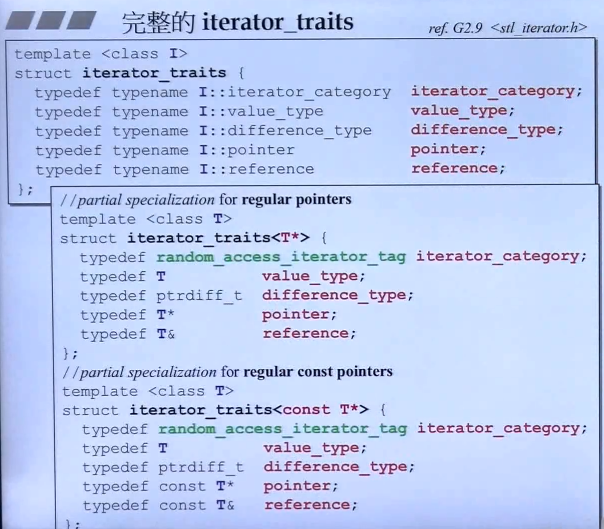

# 设计思维

STL的中心思想：将数据容器和算法分开，彼此独立设计，而迭代器就是两者之间的良好胶着剂。

iterator是算法和容器的桥梁，比如

```c++
vector<int> s;
sort(s.begin(),s.end());
```

上面的begin()和end()就是vector的iterator。

要想用sort()来给vector排序，就要传入vector的iterator。同样，如果要排序其他数据结构，就要传入相应的iterator。

当然，每种数据结构必然是不同的，那么sort处理的对象也不同，sort要想知道自己处理的是哪种对象，就要通过iterator萃取出对象的类型，再根据这种类型进行特殊的处理。



如上所示就是容器和算法之间的交互，算法需要容器“回答”它的三个问题。



虽然如上设计容器就能回答算法的提问，但如果iterator不是class，而是普通的指针，普通指针没有这5种型别，也就回答不了。因此就需要`iterator_traits`，使用它的偏特化来完成

# Traits编程技法——STL源代码门钥

使用traits解决型别问题的两个技巧，一起使用可以解决

### typename的特殊用法

用于声明型别而不是变量，比如存在声明内嵌型别的情况：

```c++
template <class T>
class MyClass{
 typename T::SubType * ptr;
 ...
};
```

当然这个class T必须包含成员变量SubType。而且如果不是class Type，就无法为它定义内嵌型别

### Partial Specialization（偏特化）的意义

定义：针对（任何）template参数更进一步的条件限制所设计出来的一个特化版本

普通泛化版本：

```c++
template <typename T>
class C{...};
```

特化版本

```c++
template <typename T>
class C<T*>{...};//这个特化版本仅适用于“T为原生指针”的情况
//“T为原生指针”便是“T为任何型别”的一个更进一步的条件限制
```

### 最终效果

```c++
template <class I>
struct iterator_traits {
    typedef typename I::value_type value_type;
};
//偏特化指针和常指针
template <class T>
struct iterator_traits<T*> {
    typedef T value_type;
};
template <class T>
struct iterator_traits<cosnt T*> {
    typedef T value_type;//value_type的主要目的是用来声明变量，而声明一个无法被赋值的变量没什么用
};

//泛化
template <class T, class Alloc = alloc>
class vector
{
    ...
};
//偏特化
template < class Alloc = alloc>
class vector<bool, Alloc>
{
    ...
};
//顺带一提特化的写法
template <>
struct iterator_traits<int> {
    typedef int value_type;
};
```

# 迭代器5种型别

其中reference type和pointer type从没用过，但设计时要写出。

这5种型别是迭代器设计时需要提供的



### iterator_category

根据移动特性与施行操作，迭代器被分为五类：

- Input Iterator：只读
- Output Iterator：只写
- Forward Iterator：区间写入
- Bidirectional Iterator：双向移动
- Random Access Iterator：涵盖所有指针的算术能力

这些类按照程度属于concept（概念）与refinement（强化），与类和继承的区别如下：

https://bbs.csdn.net/topics/10069671?list=68079

1. 就继承而严，如果类A继承了类B，而a是A的对象，b是B的对象，那么我们可以说a也是B的对象，却不能说b也是A的对象
2. 相反，如果C1改善了C2，而T1是C1的模型，T2是C2的模型，那么不可以说T1是C2的模型，却能说T2是C1的模型。例如：概念Bidirectional iterators改善了概念Forward iterators，可使用满足后者模型之处，都可使用前者产生的模型，反之不然。

STL算法的命名规则：以算法所能接受之最低阶迭代器类型，来为迭代器型别参数命名。

例如：

```c++
template <class InputIterator, class Distance>
inline void advance(InputIterator& i,Distance n);
```

在是线上使用了五个标记用的classes，并由继承机制实现上面的命名规则，如果某个型别需要特殊处理，就重载该class tag，可将class tag作为第三个参数传入。这些tag如下

```c++
struct input_iterator_tag { };
struct output_iterator_tag { };
struct forward_iterator_tag : public input_iterator_tag { };
struct bidirectional_iterator_tag : public forward_iterator_tag { };
struct random_access_iterator_tag : public bidirectional_iterator_tag { };
```


## std::iterator的保证

为了保证iterator设计顺利，只需继承如下STL提供的iterator class

```c++
template <class Category,
		  class T,
		  class Distace = ptrdiff_t,
		  class Pointer = T*,
		  class Reference = T&>
struct iterator{
    typedef Categoty	iterator_category;
    typedef T			value_type;
    typedef Distance	difference_type;
    typedef Pointer		pointer;
    typedef Reference	reference;
};
//示例
template <class Item>
struct ListIter:
	public std::iterator<std::forward_iterator_tag, Item>
{...}
```

