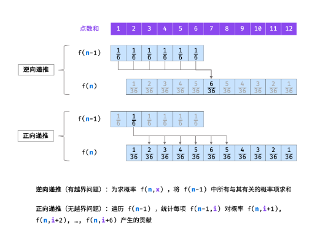
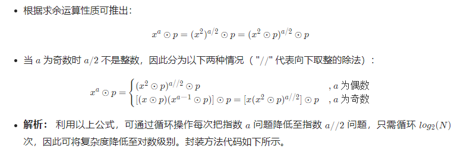
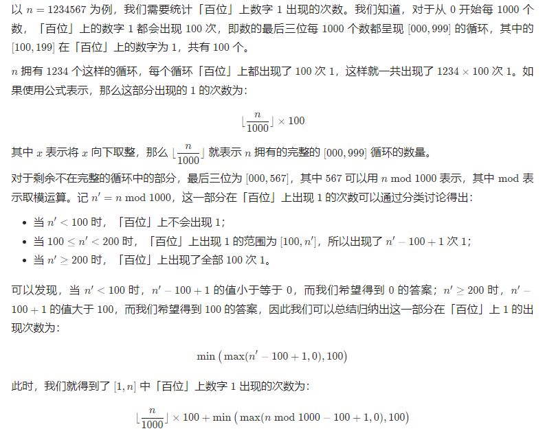

# 栈与队列

## [用两个栈实现队列](https://leetcode.cn/problems/yong-liang-ge-zhan-shi-xian-dui-lie-lcof/)

```c++
class CQueue {
        stack<int> stack1,stack2;
public:
    CQueue() {
while(!stack1.empty()){
        stack1.pop();
    }
    while(!stack2.empty()){
        stack2.pop();
    }
    }
    
    void appendTail(int value) {
    stack1.push(value);
    }
    
    int deleteHead() {
if(stack2.empty()){
        while(!stack1.empty()){
            stack2.push(stack1.top());
            stack1.pop();
        }
    }
   if(stack2.empty()){
       return -1;
   }{
       int deleteItem=stack2.top();
       stack2.pop();
       return deleteItem;
   }
    }
};
```

## [包含min函数的栈](https://leetcode.cn/problems/bao-han-minhan-shu-de-zhan-lcof/)

```c++
class MinStack {
    stack<int> x_stack;
    stack<int> min_stack;
public:
    MinStack() {
        min_stack.push(INT_MAX);
    }
    
    void push(int x) {
        x_stack.push(x);
        min_stack.push(::min(min_stack.top(), x));//这里的双冒号用于指代全局作用域
    }
    
    void pop() {
        x_stack.pop();
        min_stack.pop();
    }
    
    int top() {
        return x_stack.top();
    }
    
    int min() {
        return min_stack.top();
    }
};

```

## [队列的最大值](https://leetcode.cn/problems/dui-lie-de-zui-da-zhi-lcof/)

用一个双端队列存储最大值

```c++
class MaxQueue {
    queue<int> q;
    deque<int> d;
public:
    MaxQueue() {

    }
    
    int max_value() {
        if(d.empty()){
            return -1;
        }else{
            return d.front();
        }
    }
    
    void push_back(int value) {
        while(!d.empty()&&value>d.back()){
            d.pop_back();
        }
        d.push_back(value);
        q.push(value);
    }
    
    int pop_front() {
        if(q.empty()) return -1;
        int ans=q.front();
        if(ans==d.front()){
            d.pop_front();
        }
        q.pop();
        return ans;
    }
};
```

## [滑动窗口的最大值](https://leetcode.cn/problems/hua-dong-chuang-kou-de-zui-da-zhi-lcof/)

可以用上题的最大队列

```c++
class Solution {
public:
    vector<int> maxSlidingWindow(vector<int>& nums, int k) {
        vector<int> ans={};
        if(nums.size()==0) return ans;
        int i=0;
        MaxQueue q;
        for(;i<k;++i){
            q.push_back(nums[i]);  
        }
        ans.push_back(q.max_value());
        for(;i<nums.size();++i){
            q.pop_front();
            q.push_back(nums[i]);
            ans.push_back(q.max_value());
        }
        return ans;
    }
};
```

或者用优先队列（最大堆）

```c++
class Solution {
public:
    vector<int> maxSlidingWindow(vector<int>& nums, int k) {
        int n = nums.size();
        priority_queue<pair<int, int>> q;
        for (int i = 0; i < k; ++i) {
            q.emplace(nums[i], i);
        }
        vector<int> ans = {q.top().first};
        for (int i = k; i < n; ++i) {
            q.emplace(nums[i], i);
            while (q.top().second <= i - k) {
                q.pop();
            }
            ans.push_back(q.top().first);
        }
        return ans;
    }
};

```


# 链表

## [从尾到头打印链表](https://leetcode.cn/problems/cong-wei-dao-tou-da-yin-lian-biao-lcof/)

```c++
class Solution {
    stack<int> stk;
    vector<int> result;
public:
    vector<int> reversePrint(ListNode* head) {
        while(head!=nullptr){
            stk.push(head->val);
            head=head->next;
        }
        while(!stk.empty()){
            result.push_back(stk.top());
            stk.pop();
        }
        return result;
    }
};
```

## [206. 反转链表](https://leetcode.cn/problems/reverse-linked-list/)

给你单链表的头节点 `head` ，请你反转链表，并返回反转后的链表。

```c++
//迭代
class Solution {
public:
    ListNode* reverseList(ListNode* head) {
        ListNode* prenode=nullptr;
        ListNode* currnode=head;
        while(currnode!=nullptr){
            ListNode* next=currnode->next;
            currnode->next=prenode;
            prenode=currnode;
            currnode=next;
        }
        return prenode;
    }
};
//递归
class Solution {
public:
    ListNode* reverseList(ListNode* head) {
        if(head==nullptr||head->next==nullptr)
            return head;
        ListNode* newnode=reverseList(head->next);
        head->next->next=head;
        head->next=nullptr;
        return newnode;
    }
};
```

## [复杂链表的复制](https://leetcode.cn/problems/fu-za-lian-biao-de-fu-zhi-lcof/)

请实现 `copyRandomList` 函数，复制一个复杂链表。在复杂链表中，每个节点除了有一个 `next` 指针指向下一个节点，还有一个 `random` 指针指向链表中的任意节点或者 `null`。

### 分析：

难点：random指向的节点可能还没创建

解决方法：

- 回溯+哈希表

  我们利用回溯的方式，让每个节点的拷贝操作相互独立。对于当前节点，我们首先要进行拷贝，然后我们进行「当前节点的后继节点」和「当前节点的随机指针指向的节点」拷贝，拷贝完成后将创建的新节点的指针返回，即可完成当前节点的两指针的赋值。当我们拷贝完成，回溯到当前层时，我们即可完成当前节点的指针赋值。

- 迭代+节点拆分

  我们首先将该链表中每一个节点拆分为两个相连的节点，对于任意一个原节点 *S*，其拷贝节点 *S*′ 即为其后继节点。

```c++
//回溯+哈希表
class Solution {
public:
    unordered_map<Node*,Node*> Nodemap;//记录节点的复制体
    Node* copyRandomList(Node* head) {
        if(head==nullptr){
            return nullptr;
        }
        while(!Nodemap.count(head)){
            Node* newNode= new Node(head->val);
            Nodemap[head]=newNode;//需要先加入，不然回递归到溢出
            newNode->next=copyRandomList(head->next);
            newNode->random=copyRandomList(head->random);
        }
        return Nodemap[head];
    }
};
//迭代+节点拆分
class Solution {
public:
    Node* copyRandomList(Node* head) {
        if (head == nullptr) {
            return nullptr;
        }
        for (Node* node = head; node != nullptr; node = node->next->next) {
            Node* nodeNew = new Node(node->val);
            nodeNew->next = node->next;
            node->next = nodeNew;
        }
        for (Node* node = head; node != nullptr; node = node->next->next) {
            Node* nodeNew = node->next;
            nodeNew->random = (node->random != nullptr) ? node->random->next : nullptr;
        }
        Node* headNew = head->next;
        for (Node* node = head; node != nullptr; node = node->next) {
            Node* nodeNew = node->next;
            node->next = node->next->next;
            nodeNew->next = (nodeNew->next != nullptr) ? nodeNew->next->next : nullptr;
        }
        return headNew;
    }
};
```

# 字符串（简单）

## [替换空格](https://leetcode.cn/problems/ti-huan-kong-ge-lcof/)

请实现一个函数，把字符串 `s` 中的每个空格替换成"%20"。

```c++
class Solution {
public:
    string replaceSpace(string s) {
    string ans;
    for(auto& c:s){
        if(c==' '){
            ans+="%20";
        } else{
            ans+=c;
        }
    }
        return ans;
    }
};
```

## [左旋转字符串](https://leetcode.cn/problems/zuo-xuan-zhuan-zi-fu-chuan-lcof/)

```
class Solution {
public:
    string reverseLeftWords(string s, int n) {
        return s.substr(n,s.size()-n)+s.substr(0,n);
    }
};
```

# 字符串（中等）

## [表示数值的字符串](https://leetcode.cn/problems/biao-shi-shu-zhi-de-zi-fu-chuan-lcof/)

```c++
//模拟，类似状态转移
class Solution {
public:
    bool isNumber(string s) {
        if(s.size()==0) return false;
        int left=0,right=s.size()-1;
        while(left<=right&&s[left]==' '){
            ++left;
        }
        if(left>right) return false;
        while(left<right&&s[right]==' '){
            --right;
        }
        bool isNum=false;
        bool isDot=false;
        bool isEe=false;
        bool isSign=false;
        for(int i=left;i<=right;++i){
            if(s[i]>='0'&&s[i]<='9'){
                isNum=true;
            }else if(s[i]=='.'&&!isDot&&!isEe){
                isDot=true;
            }else if((s[i]=='E'||s[i]=='e')&&isNum&&!isEe){
                isEe=true;
                isNum=false;//避免以e结尾
            }else if((s[i]=='+'||s[i]=='-')&&(i==left||s[i-1]=='E'||s[i-1]=='e')){
                isSign=true;
            }else{
                return false;
            }
        }
        return isNum;
    }
};
//有限状态机
class Solution {
public:
    enum State {
        STATE_INITIAL,
        STATE_INT_SIGN,
        STATE_INTEGER,
        STATE_POINT,
        STATE_POINT_WITHOUT_INT,
        STATE_FRACTION,
        STATE_EXP,
        STATE_EXP_SIGN,
        STATE_EXP_NUMBER,
        STATE_END
    };

    enum CharType {
        CHAR_NUMBER,
        CHAR_EXP,
        CHAR_POINT,
        CHAR_SIGN,
        CHAR_SPACE,
        CHAR_ILLEGAL
    };

    CharType toCharType(char ch) {
        if (ch >= '0' && ch <= '9') {
            return CHAR_NUMBER;
        } else if (ch == 'e' || ch == 'E') {
            return CHAR_EXP;
        } else if (ch == '.') {
            return CHAR_POINT;
        } else if (ch == '+' || ch == '-') {
            return CHAR_SIGN;
        } else if (ch == ' ') {
            return CHAR_SPACE;
        } else {
            return CHAR_ILLEGAL;
        }
    }

    bool isNumber(string s) {
        unordered_map<State, unordered_map<CharType, State>> transfer{
            {
                STATE_INITIAL, {
                    {CHAR_SPACE, STATE_INITIAL},
                    {CHAR_NUMBER, STATE_INTEGER},
                    {CHAR_POINT, STATE_POINT_WITHOUT_INT},
                    {CHAR_SIGN, STATE_INT_SIGN}
                }
            }, {
                STATE_INT_SIGN, {
                    {CHAR_NUMBER, STATE_INTEGER},
                    {CHAR_POINT, STATE_POINT_WITHOUT_INT}
                }
            }, {
                STATE_INTEGER, {
                    {CHAR_NUMBER, STATE_INTEGER},
                    {CHAR_EXP, STATE_EXP},
                    {CHAR_POINT, STATE_POINT},
                    {CHAR_SPACE, STATE_END}
                }
            }, {
                STATE_POINT, {
                    {CHAR_NUMBER, STATE_FRACTION},
                    {CHAR_EXP, STATE_EXP},
                    {CHAR_SPACE, STATE_END}
                }
            }, {
                STATE_POINT_WITHOUT_INT, {
                    {CHAR_NUMBER, STATE_FRACTION}
                }
            }, {
                STATE_FRACTION,
                {
                    {CHAR_NUMBER, STATE_FRACTION},
                    {CHAR_EXP, STATE_EXP},
                    {CHAR_SPACE, STATE_END}
                }
            }, {
                STATE_EXP,
                {
                    {CHAR_NUMBER, STATE_EXP_NUMBER},
                    {CHAR_SIGN, STATE_EXP_SIGN}
                }
            }, {
                STATE_EXP_SIGN, {
                    {CHAR_NUMBER, STATE_EXP_NUMBER}
                }
            }, {
                STATE_EXP_NUMBER, {
                    {CHAR_NUMBER, STATE_EXP_NUMBER},
                    {CHAR_SPACE, STATE_END}
                }
            }, {
                STATE_END, {
                    {CHAR_SPACE, STATE_END}
                }
            }
        };

        int len = s.length();
        State st = STATE_INITIAL;

        for (int i = 0; i < len; i++) {
            CharType typ = toCharType(s[i]);
            if (transfer[st].find(typ) == transfer[st].end()) {
                return false;
            } else {
                st = transfer[st][typ];
            }
        }
        return st == STATE_INTEGER || st == STATE_POINT || st == STATE_FRACTION || st == STATE_EXP_NUMBER || st == STATE_END;
    }
};
```

## [把字符串转换成整数](https://leetcode.cn/problems/ba-zi-fu-chuan-zhuan-huan-cheng-zheng-shu-lcof/)


```c++
//模拟
class Solution {
public:
    int strToInt(string str) {
        int res=0,sign=1,i=0;
        while(str[i++]==' ');
        --i;
        if(i<str.size()&&(str[i]=='+'||str[i]=='-')){
            sign=str[i]=='+'?1:-1;
            ++i;
        }
        for(;i<str.size();++i){
            if(str[i]>='0'&&str[i]<='9'){
                if(res>INT_MAX/10||(res==INT_MAX/10&&str[i]>'7')){
                    return sign==1?INT_MAX:INT_MIN;
                }
                res=res*10+(str[i]-'0');

            }else{
                break;
            }
        }
        return sign*res;
    }
};
```


# 查找算法（简单）

## 二分法

特殊的双指针

### 1. 左闭右开

每次循环的区间都是[left, right)，在二分的时候，搜索区间去掉mid使得原始区间分为两块[left, mid), [mid+1, right)，这样才能保证整个区间都被检索。
所以left = mid + 1和right = mid。因为right取不到，所以right=nums.size()。

主循环判断条件：left < right，这和我们在其他循环中是一样的。因为要确保left=right时不进入判定，因为左闭右开的原则已经破坏，没有能够选取的元素。
比如for (int i = 0; i < nums.size(); ++i)
左闭右开的写法更常见，c++中迭代器返回的end就是右开的。
在主循环跳出的时候，其实是[left, left)，这个搜索空间为空，主循环确保了整个区间的检索。

返回时left=right，因为right取不到，所以可能需要返回left-1/right-1

> 二分的指针停止时指向的位置
>
> https://blog.csdn.net/u014302425/article/details/110480413
>
> 结束时：
>
> right指向的是序列(7,10,13,16,19)中比12小，且离得最近的元素10
>
> left指向的是序列(7,10,13,16,19)中比12大，且离得最近的元素13

### 2. 左闭右闭

因为循环区间是[left, right]，所以right的值是可以取到的，因此一般right=nums.size()-1

- 主循环判断条件：`left <= right`，这和我们在其他循环中是一样的。
  比如`for (int i = 0; i <= nums.size()-1; ++i)`

## [数组中重复的数字](https://leetcode.cn/problems/shu-zu-zhong-zhong-fu-de-shu-zi-lcof/)

```c++
//遍历数组
class Solution {
public:
    int findRepeatNumber(vector<int>& nums) {
        unordered_set<int> set;
        int result=-1;
        for(auto& num:nums){
            if(set.find(num)!=set.end()){
                return num;
            }else{
                set.insert(num);
            }
        }
        return result;
    }
};
```

## [在排序数组中查找数字 I](https://leetcode.cn/problems/zai-pai-xu-shu-zu-zhong-cha-zhao-shu-zi-lcof/)

统计一个数字在排序数组中出现的次数。

```c++
//二分
class Solution {
public:
    int binarysearch(vector<int>& nums, int target,bool lower){
        int left=0,right=nums.size()-1,ans=nums.size();
        while(left<=right){
            int mid=left+(right-left)/2;
            if(nums[mid]>target||(lower&&nums[mid]>=target)){//寻找第一个大于target的值/第一个大于等于target的值
                right=mid-1;
                ans=mid;
            }else{
                left=mid+1;
            }
        }
        return ans;

    }
    int search(vector<int>& nums, int target) {
        int left=binarysearch(nums, target, true);
        int right=binarysearch(nums, target, false)-1;
        if(left<=right&&right<nums.size()&&nums[left]==target&&nums[right]==target) return right-left+1;
        return 0;
    }
};
```

## [0～n-1中缺失的数字](https://leetcode.cn/problems/que-shi-de-shu-zi-lcof/)

一个长度为n-1的递增排序数组中的所有数字都是唯一的，并且每个数字都在范围0～n-1之内。在范围0～n-1内的n个数字中有且只有一个数字不在该数组中，请找出这个数字。

```c++
//二分
class Solution {
public:
    int missingNumber(vector<int>& nums) {
        int left=0,right=nums.size();
        while(left<right){
            int mid=left+(right-left)/2;
            if(nums[mid]==mid){
                left=mid+1;
            }else{
                right=mid;
            }
        }
        return left;
    }
};
```

# 查找算法（中等）

## [二维数组中的查找](https://leetcode.cn/problems/er-wei-shu-zu-zhong-de-cha-zhao-lcof/)

在一个 n * m 的二维数组中，每一行都按照从左到右递增的顺序排序，每一列都按照从上到下递增的顺序排序。请完成一个高效的函数，输入这样的一个二维数组和一个整数，判断数组中是否含有该整数。

```c++
//线性查找，确保每次只有一种选择，因此从右上角开始
class Solution {
public:
    bool findNumberIn2DArray(vector<vector<int>>& matrix, int target) {
        if(&matrix==nullptr||matrix.size()==0){
            return false;
        }
        int row=matrix.size();
        int col=matrix[0].size();
        int i=0;
        int j=col-1;
        while(i<row&&j>=0){
            if(matrix[i][j]==target){
                return true;
            }else if(matrix[i][j]>target){
                --j;
            }else{
                ++i;
            }
        }
        return false;
    }
};
```

## [旋转数组的最小数字](https://leetcode.cn/problems/xuan-zhuan-shu-zu-de-zui-xiao-shu-zi-lcof/)

把一个数组最开始的若干个元素搬到数组的末尾，我们称之为数组的旋转。

给你一个可能存在 **重复** 元素值的数组 `numbers` ，它原来是一个升序排列的数组，并按上述情形进行了一次旋转。请返回旋转数组的**最小元素**。例如，数组 `[3,4,5,1,2]` 为 `[1,2,3,4,5]` 的一次旋转，该数组的最小值为 1。 

注意，数组 `[a[0], a[1], a[2], ..., a[n-1]]` 旋转一次 的结果为数组 `[a[n-1], a[0], a[1], a[2], ..., a[n-2]]` 。

```c++
class Solution {
public:
    int minArray(vector<int>& numbers) {
        int left=0;
        int right=numbers.size()-1;
        while(left<right){
            int mid=left+(right-left)/2;
            if(numbers[mid]<numbers[right]){
                right=mid;
            }else if(numbers[mid]>numbers[right]){
                left=mid+1;
            }else {
                --right;
            }
        }
        return numbers[left];
    }
};
```

## [第一个只出现一次的字符](https://leetcode.cn/problems/di-yi-ge-zhi-chu-xian-yi-ci-de-zi-fu-lcof/)

在字符串 s 中找出第一个只出现一次的字符。如果没有，返回一个单空格。 s 只包含小写字母。

```c++
//哈希表
class Solution {
public:
    char firstUniqChar(string s) {
        unordered_map<char,int> position;
        for(int i=0;i<s.size();++i){
            if(position.count(s[i])){
                position[s[i]]=-1;
            }else{
                position[s[i]]=i;
            }
        }
        int first=s.size();
        for(auto&[_,pos]:position){
            if(pos!=-1&&pos<first){
                first=pos;
            }
        }
        return first==s.size()?' ':s[first];
    }
};
//哈希表+队列
class Solution {
public:
    char firstUniqChar(string s) {
        unordered_map<char,int> position;
        queue<pair<char,int>> q;
        for(int i=0;i<s.size();++i){
            if(!position.count(s[i])){
                position[s[i]]=i;
                q.push(make_pair(s[i],i));
            }else{
                position[s[i]]=-1;
                while(!q.empty()&&position[q.front().first]==-1){
                    q.pop();
                }
            }
        }
        return q.empty()?' ':q.front().first;
    }
};
```

# 搜索与回溯（简单）

## [从上到下打印二叉树](https://leetcode.cn/problems/cong-shang-dao-xia-da-yin-er-cha-shu-lcof/)

从上到下打印出二叉树的每个节点，同一层的节点按照从左到右的顺序打印。

```c++
class Solution {
    vector<int> result;
public:
    vector<int> levelOrder(TreeNode* root) {
        if(root==nullptr) return result;
        queue<TreeNode *>q;
        q.push(root);
        while(!q.empty()){
            TreeNode* tmp=q.front();
            result.emplace_back(tmp->val);
            q.pop();
            if(tmp->left!=nullptr){
                q.push(tmp->left);
            }
            if(tmp->right!=nullptr){
                q.push(tmp->right);
            }
        }
        return result;
    }
};
```

## [从上到下打印二叉树 II](https://leetcode.cn/problems/cong-shang-dao-xia-da-yin-er-cha-shu-ii-lcof/)

从上到下按层打印二叉树，同一层的节点按从左到右的顺序打印，**每一层打印到一行**。

```c++
class Solution {
    vector<vector<int> > result;
public:
    vector<vector<int>> levelOrder(TreeNode* root) {
        if(root==nullptr)return result;
        queue<TreeNode*> q;
        q.push(root);
        while(!q.empty()){
            int size=q.size();
            vector<int> path;
            while(size--){
                TreeNode* tmp=q.front();
                q.pop();
                path.emplace_back(tmp->val);
                if(tmp->left!=nullptr){
                    q.push(tmp->left);
                }
                if(tmp->right!=nullptr){
                    q.push(tmp->right);
                }
            }
            result.push_back(path);
        }
        return result;
        }    
};
```

## [从上到下打印二叉树 III](https://leetcode.cn/problems/cong-shang-dao-xia-da-yin-er-cha-shu-iii-lcof/)

请实现一个函数按照之字形顺序打印二叉树，即第一行按照从左到右的顺序打印，第二层按照从右到左的顺序打印，第三行再按照从左到右的顺序打印，其他行以此类推。

```c++
class Solution {
    vector<vector<int> > result;
public:
    vector<vector<int>> levelOrder(TreeNode* root) {
        if(root==nullptr)return result;
        queue<TreeNode*> q;
        q.push(root);
        bool reverse_order=false;
        while(!q.empty()){
            int size=q.size();
            vector<int> path;
            while(size--){
                TreeNode* tmp=q.front();
                q.pop();
                path.emplace_back(tmp->val);
                if(tmp->left!=nullptr){
                    q.push(tmp->left);
                }
                if(tmp->right!=nullptr){
                    q.push(tmp->right);
                }
            }
            if(reverse_order){
                reverse(path.begin(),path.end());
            }
            result.push_back(path);
            reverse_order=!reverse_order;
        }
        return result;
        }    
};
```

## [树的子结构](https://leetcode.cn/problems/shu-de-zi-jie-gou-lcof/)

输入两棵二叉树A和B，判断B是不是A的子结构。(约定空树不是任意一个树的子结构)

```c++
class Solution {
public:
    bool compare(TreeNode*A,TreeNode*B){
        if(B==nullptr)return true;//递归结束条件1：A的一个节点B的对应位置没有,可以认为是子结构
        if(A==nullptr||A->val!=B->val) return false;//递归结束条件2：B的一个节点A的对应位置没有 / A,B对应位置节点值不同，此时必然不可能是子结构
        return compare(A->left,B->left)&&compare(A->right,B->right);//返回值：继续在对应位置递归判断
    }
    bool isSubStructure(TreeNode* A, TreeNode* B) {
        if(A==nullptr||B==nullptr) return false; //特殊判断
        // 根节点相同的话直接进入比较（compare(A,B)），根节点不相同看B是不是A的左/右子树的子结构
        return compare(A,B)||isSubStructure(A->left,B)||isSubStructure(A->right, B);
    }
};
```

## [二叉树的镜像](https://leetcode.cn/problems/er-cha-shu-de-jing-xiang-lcof/)

请完成一个函数，输入一个二叉树，该函数输出它的镜像。

```c++
class Solution {
public:
    TreeNode* mirrorTree(TreeNode* root) {
        if(root==nullptr)return nullptr;//递归到最后开始重建
        TreeNode* newNode=new TreeNode(root->val);
        newNode->right=mirrorTree(root->left);
        newNode->left=mirrorTree(root->right);
        return newNode;
    }
};
```

## [对称的二叉树](https://leetcode.cn/problems/dui-cheng-de-er-cha-shu-lcof/)

请实现一个函数，用来判断一棵二叉树是不是对称的。如果一棵二叉树和它的镜像一样，那么它是对称的。

```c++
//递归
class Solution {
public:
    bool isSymmetric(TreeNode* root) {
        if(root==nullptr) return true;
        return ismirror(root->left, root->right);
    }
    bool ismirror(TreeNode* A,TreeNode*B){
        if(A==nullptr&&B==nullptr) return true;
        if(A==nullptr||B==nullptr) return false;
        return A->val==B->val&&ismirror(A->left, B->right)&&ismirror(A->right, B->left);
    }
};
//迭代:用队列实现，依次比较树的对应节点
class Solution {
public:
    bool isSymmetric(TreeNode* root) {
        if(root==nullptr) return true;
        queue<TreeNode*> q;
        q.push(root->left);
        q.push(root->right);
        while(!q.empty()){
            TreeNode* left=q.front();
            q.pop();
            TreeNode* right=q.front();
            q.pop();
            if(left==nullptr&&right==nullptr) continue;
            if(left==nullptr||right==nullptr||left->val!=right->val) return false;
            q.push(left->left);
            q.push(right->right);
            q.push(left->right);
            q.push(right->left);
        }
        return true;
    }
};
```

# 动态规划简单

## [斐波那契数列](https://leetcode.cn/problems/fei-bo-na-qi-shu-lie-lcof/)

```c++
class Solution {
public:
    int fib(int n) {
        int MOD = 1000000007;
        if(n<2) return n;
        int dp[]={0,0,1};
        while(n>1){
            dp[0]=dp[1];
            dp[1]=dp[2];  
            dp[2]=(dp[0]+dp[1])%MOD;
            --n;
        }
        return dp[2];
    }
};
```

## [青蛙跳台阶问题](https://leetcode.cn/problems/qing-wa-tiao-tai-jie-wen-ti-lcof/)

```c++
class Solution {
public:
    int numWays(int n) {
        int MOD=1000000007;
        if(n==0) return 1;
        int dp[]={0,1,1};
        while(n>1){
            dp[0]=dp[1];
            dp[1]=dp[2];  
            dp[2]=(dp[0]+dp[1])%MOD;
            --n;
        }
        return dp[2];
    }
};
```

## [股票的最大利润](https://leetcode.cn/problems/gu-piao-de-zui-da-li-run-lcof/)

```c++
class Solution {
public:
    int maxProfit(vector<int>& prices) {
        int minprice=INT32_MAX,maxprofit=0;
        for(int i=0;i<prices.size();++i){
            maxprofit=max(maxprofit,prices[i]-minprice);
            minprice=min(minprice,prices[i]);
        }
        return maxprofit;
    }
};
```

## [连续子数组的最大和](https://leetcode.cn/problems/lian-xu-zi-shu-zu-de-zui-da-he-lcof/)

```c++
class Solution {
public:
    int maxSubArray(vector<int>& nums) {
        int pre=0,maxAns=nums[0];
        for(auto& num:nums){
            pre=max(pre+num,num);
            maxAns=max(maxAns,pre);
        }
        return maxAns;
    }
};
```

## [礼物的最大价值](https://leetcode.cn/problems/li-wu-de-zui-da-jie-zhi-lcof/)

```c++
class Solution {
public:
    int maxValue(vector<vector<int>>& grid) {
        vector<vector<int>> dp(grid.size(),vector<int>(grid[0].size(),0));
        dp[0][0]=grid[0][0];
        for(int i=1;i<grid.size();++i){
            dp[i][0]=dp[i-1][0]+grid[i][0];
        }
        for(int j=1;j<grid[0].size();++j){
            dp[0][j]=dp[0][j-1]+grid[0][j];
        }
        for(int i=1;i<grid.size();++i){
            for(int j=1;j<grid[0].size();++j){
                dp[i][j]=max(dp[i-1][j],dp[i][j-1])+grid[i][j];
            }
        }
        return dp[grid.size()-1][grid[0].size()-1];
    }
};
//降维
class Solution {
public:
    int maxValue(vector<vector<int>>& grid) {
        vector<int> dp(grid[0].size(),0);
        for(int i=0;i<grid.size();++i){
            for(int j=0;j<grid[0].size();++j){
                if(i==0&&j==0)dp[j]=grid[i][j];
                else if(i==0) dp[j]=dp[j-1]+grid[i][j];
                else if(j==0) dp[j]+=grid[i][j];
                else dp[j]=max(dp[j],dp[j-1])+grid[i][j];
            }
        }
        return dp[grid[0].size()-1];
    }
};
```

## [把数字翻译成字符串](https://leetcode.cn/problems/ba-shu-zi-fan-yi-cheng-zi-fu-chuan-lcof/)

```c++
class Solution {
public:
    int translateNum(int num) {
        string src=to_string(num);
        int p=0,q=0,r=1;
        for(int i=0;i<src.size();++i){
            p=q;
            q=r;
            r=0;
            r+=q;
            if(i==0) continue;
            auto s=src.substr(i-1,2);
            if(s<="25"&&s>="10")
            r+=p;
        }
        return r;
    }
};
```

## [最长不含重复字符的子字符串](https://leetcode.cn/problems/zui-chang-bu-han-zhong-fu-zi-fu-de-zi-zi-fu-chuan-lcof/)


```c++
//滑动窗口
class Solution {
public:
    int lengthOfLongestSubstring(string s) {
        int n=s.size();
        unordered_set<char> set;
        //right指示右指针
        int right=0,len=0;
        //i指示左指针
        for(int i=0;i<s.size();++i){
            if(i!=0){
                set.erase(s[i-1]);
            }
            while(right<n&&!set.count(s[right])){
                set.insert(s[right]);
                ++right;
            }
            len=max(len,right-i);
        }
        return len;
    }
};
//动规
class Solution {
public:
    int lengthOfLongestSubstring(string s) {
        int n=s.size();
        unordered_map<char,int> map;
        vector<int> dp(s.size());
        int len=0;
        for(int i=0;i<n;++i){
            if(i!=0&&map.find(s[i])==map.end()){
                dp[i]=dp[i-1]+1;
            }else if(i==0){
                dp[i]=1;
            }else{
                int j = map[s[i]];
			if (i - j <= dp[i - 1]) {//重复字符在dp[i-1]区间之中
				dp[i] = i - j;
			}
			else {
				dp[i] = dp[i - 1] + 1;//重复字符在dp[i-1]区间之外
			}
            }
            map[s[i]]=i;
            len=max(len,dp[i]);
        }
        return len;
    }
};
```

# 动态规划困难

## [正则表达式匹配](https://leetcode.cn/problems/zheng-ze-biao-da-shi-pi-pei-lcof/)

如果`p[j]==‘*’`，考虑字母 + 星号的组合在匹配的过程中，本质上只会有两种情况：

- 匹配 *s* 末尾的一个字符，将该字符扔掉，而该组合还可以继续进行匹配；
- 不匹配字符，将该组合扔掉，不再进行匹配。

如果`p[j]!=‘*’`，则`dp[i][j]=dp[i-1][j-1]&&(s[i-1]==p[j-1]||p[j-1]=='.');`

```c++
class Solution {
public:
    bool isMatch(string s, string p) {
        int m=s.size(),n=p.size();
        vector<vector<bool>> dp(m+1,vector<bool>(n+1,false));
        dp[0][0]=true;
        for(int j=2;j<=n;++j){
            dp[0][j]=dp[0][j-2]&&p[j-1]=='*';
        }
        for(int i=1;i<=m;++i){
            for(int j=1;j<=n;++j){
                if(p[j-1]=='*'){
                    dp[i][j]=dp[i][j-2]||(dp[i-1][j]&&s[i-1]==p[j-2])||(dp[i-1][j]&&p[j-2]=='.');
                }else{
                    dp[i][j]=dp[i-1][j-1]&&(s[i-1]==p[j-1]||p[j-1]=='.');
                }
            }
        }
        return dp[m][n];
    }
};
```

## [丑数](https://leetcode.cn/problems/chou-shu-lcof/)

用3个指针代表p2,p3,p5，表示下一个丑数是当前指针指向的丑数乘以对应的质因数

```c++
class Solution {
public:
    int nthUglyNumber(int n) {
        if(n==0) return 0;
        vector<int>dp(n);
        dp[0]=1;
        int p2=0,p3=0,p5=0;
        for(int i=1;i<n;++i){
            int num2=dp[p2]*2,num3=dp[p3]*3,num5=dp[p5]*5;
            dp[i]=min(min(num2,num3),num5);
            if(dp[i]==num2){
                ++p2;
            }
            if(dp[i]==num3){
                ++p3;
            }
            if(dp[i]==num5){
                ++p5;
            }
        }
        return dp[n-1];
    }
};
```

## [n个骰子的点数](https://leetcode.cn/problems/nge-tou-zi-de-dian-shu-lcof/)



```c++
class Solution {
public:
    vector<double> dicesProbability(int n) {
        vector<double> dp(6,1.0/6.0);
        for(int i=2;i<=n;++i){
            vector<double> tmp(5*i+1,0.0);
            for(int j=0;j<dp.size();++j){
                for(int k=0;k<6;++k){
                    tmp[j+k]+=dp[j]/6.0;
                }
            }
            dp=tmp;
        }
        return dp;
    }
};
```


# 双指针

## [删除链表的节点](https://leetcode.cn/problems/shan-chu-lian-biao-de-jie-dian-lcof/)

给定单向链表的头指针和一个要删除的节点的值，定义一个函数删除该节点。

返回删除后的链表的头节点。

```c++
class Solution {
public:
    ListNode* deleteNode(ListNode* head, int val) {
        if(head->val == val ) return head->next;
        ListNode * pre=head;
        ListNode * cur=head->next;

        while(cur!= nullptr&&cur->val!=val){
            pre=cur;
            cur=cur->next;
        }
        pre->next=cur->next;
        cur->next=nullptr;
        return head;
    }
};
```

## [链表中倒数第k个节点](https://leetcode.cn/problems/lian-biao-zhong-dao-shu-di-kge-jie-dian-lcof/)

输入一个链表，输出该链表中倒数第k个节点。为了符合大多数人的习惯，本题从1开始计数，即链表的尾节点是倒数第1个节点。

例如，一个链表有 `6` 个节点，从头节点开始，它们的值依次是 `1、2、3、4、5、6`。这个链表的倒数第 `3` 个节点是值为 `4` 的节点。

```c++
class Solution {
public:
    ListNode* getKthFromEnd(ListNode* head, int k) {
        if(k<=0||head==nullptr){
            return head;
        }
        ListNode* fast=head;
        ListNode* slow=head;
        for(int i=0;i<k;++i){
            if(fast==nullptr)return nullptr;
            fast=fast->next;
        }
        while(fast!=nullptr){
            fast=fast->next;
            slow=slow->next;
        }
        return slow;
    }
};
```

## [合并两个排序的链表](https://leetcode.cn/problems/he-bing-liang-ge-pai-xu-de-lian-biao-lcof/)

输入两个递增排序的链表，合并这两个链表并使新链表中的节点仍然是递增排序的。

```c++
class Solution {
public:
    ListNode* mergeTwoLists(ListNode* l1, ListNode* l2) {
        if(l1==nullptr) return l2;
        if(l2==nullptr) return l1;
        ListNode* dummy=new ListNode(0);
        ListNode* cur=dummy;
        while(l1!=nullptr&&l2!=nullptr){
            if(l1->val<l2->val){
                cur->next=l1;
                l1=l1->next;
                cur=cur->next;
            }else{
                cur->next=l2;
                l2=l2->next;
                cur=cur->next;
            }
        }
        if(l1!=nullptr){
            cur->next=l1;
        }
        if(l2!=nullptr){
            cur->next=l2;
        }
        return dummy->next;
    }
};
```

## [两个链表的第一个公共节点](https://leetcode.cn/problems/liang-ge-lian-biao-de-di-yi-ge-gong-gong-jie-dian-lcof/)

输入两个链表，找出它们的第一个公共节点。

```c++
class Solution {
public:
    ListNode *getIntersectionNode(ListNode *headA, ListNode *headB) {
        if(headA==nullptr||headB==nullptr) return nullptr;
        ListNode* pa=headA,*pb=headB;
        while(pa!=pb){
            pa=pa==nullptr?headB:pa->next;
            pb=pb==nullptr?headA:pb->next;
        }
        return pa;
    }
};
```

## [调整数组顺序使奇数位于偶数前面](https://leetcode.cn/problems/diao-zheng-shu-zu-shun-xu-shi-qi-shu-wei-yu-ou-shu-qian-mian-lcof/)

输入一个整数数组，实现一个函数来调整该数组中数字的顺序，使得所有奇数在数组的前半部分，所有偶数在数组的后半部分。

```c++
class Solution {
public:
    vector<int> exchange(vector<int>& nums) {
        int left=0,right=nums.size()-1;
        while(left<right){
            while(left<right&&nums[left]%2==1){
                ++left;
            }
            while(left<right&&nums[right]%2==0){
                --right;
            }
            swap(nums[left],nums[right]);
        }
        return nums;
    }
};
```

## [和为s的两个数字](https://leetcode.cn/problems/he-wei-sde-liang-ge-shu-zi-lcof/)

输入一个递增排序的数组和一个数字s，在数组中查找两个数，使得它们的和正好是s。如果有多对数字的和等于s，则输出任意一对即可。

```c++
class Solution {
public:
    vector<int> twoSum(vector<int>& nums, int target) {
        int left=0,right=nums.size()-1;
        while(left<right){
            int sum=nums[left]+nums[right];
            if(sum==target){
                return {nums[left],nums[right]};
            }else if(sum>target){
                --right;
            }else{
                ++left;
            }            
        }
        return {};
    }
};
```

## [翻转单词顺序](https://leetcode.cn/problems/fan-zhuan-dan-ci-shun-xu-lcof/)

输入一个英文句子，翻转句子中单词的顺序，但单词内字符的顺序不变。为简单起见，标点符号和普通字母一样处理。例如输入字符串"I am a student. "，则输出"student. a am I"。

```c++
class Solution {
public:
    string reverseWords(string s) {
        string res;
        int n = s.size();
        if(n == 0) return res;
        int right = n - 1;
        while(right >= 0){
            //从后往前寻找第一字符
            while(right >= 0 && s[right] == ' ') right--;//前面的right>=0防止越界（r）
            if(right < 0) break;

            //从后往前寻找第一个空格
            int left = right;
            while( left >= 0 && s[left] != ' ' ) left--;

            //添加单词到结果
            res += s.substr(left + 1, right - left);
            res += ' ';

            //继续往前分割单词
            right = left;
        }
        //去除最后一个字符空格
        if (!res.empty()) res.pop_back();
        return res;
    }
};
```

# 搜索与回溯算法（中等）

## [矩阵中的路径](https://leetcode.cn/problems/ju-zhen-zhong-de-lu-jing-lcof/)

```c++
class Solution {
    vector<vector<int>> directions={{-1,0},{0,1},{1,0},{0,-1}};
public:
    bool backtracking(vector<vector<char>>& board, string word,int i,int j,int k,vector<vector<bool>>& visited){
        if(board[i][j]!=word[k]){
            return false;
        }
        else if(k==word.size()-1){
            return true;
        }
        visited[i][j]=true;
        for(auto& dic:directions){
            int x=i+dic[0];
            int y=j+dic[1];
            if(x>=0&&x<board.size()&&y>=0&&y<board[0].size()&&!visited[x][y]){
                bool flag=backtracking(board, word, x, y, k+1, visited);
                if(flag) return true;
            }
        }
        visited[i][j]=false;
        return false;
    }
    bool exist(vector<vector<char>>& board, string word) {
        int m=board.size(),n=board[0].size();
        vector<vector<bool>> visited(m,vector<bool>(n,false));
        for(int i=0;i<m;++i){
            for(int j=0;j<n;++j){
                bool flag=backtracking(board, word, i, j, 0, visited);
                if(flag) return true;
            }
        }
        return false;
    }
};
```

## [机器人的运动范围](https://leetcode.cn/problems/ji-qi-ren-de-yun-dong-fan-wei-lcof/)

```c++
//深搜，可以缩减为向右向下
class Solution {
    vector<vector<int>> directions={{1,0},{0,1}};
public:
    bool checkValid(int i,int j,int k){
        int sum=(i%10)+(j%10);
        while(i>=10){
            i/=10;
            sum+=i;
        }
        while(j>=10){
            j/=10;
            sum+=j;
        }
        if(sum>k){
            return false;
        }
        return true;
    }
    void backtracking(int i,int j,int k,int m,int n,vector<vector<bool>>& visited,int &count){
        if(!checkValid(i,j,k)) return;
        visited[i][j]=true;
        ++count;
        for(auto& dic:directions){
            int x=i+dic[0];
            int y=j+dic[1];
            if(x>=0&&x<m&&y>=0&&y<n&&!visited[x][y]){
                backtracking(x,y,k,m,n,visited,count);
            }
        }
        return;
    }
    int movingCount(int m, int n, int k) {
        int count=0;
        vector<vector<bool>> visited(m,vector<bool>(n,false));
        backtracking(0, 0, k, m, n, visited, count);
        return count;
    }
};
//广搜
class Solution {
    vector<vector<int>> directions={{1,0},{0,1}};
public:
    bool checkValid(int i,int j,int k){
        int sum=(i%10)+(j%10);
        while(i>=10){
            i/=10;
            sum+=i;
        }
        while(j>=10){
            j/=10;
            sum+=j;
        }
        if(sum>k){
            return false;
        }
        return true;
    }
    int movingCount(int m, int n, int k) {
        if(!k) return 1;
        vector<vector<bool>> visited(m,vector<bool>(n,false));
        queue<pair<int ,int>> q;
        q.push(make_pair(0,0));
        int count=1;
        visited[0][0]=true;
        while(!q.empty()){
            auto [i,j]=q.front();
            q.pop();
            for(auto dic:directions){
                int x=i+dic[0];
                int y=j+dic[1];
                if(x>=0&&x<m&&y>=0&&y<n&&!visited[x][y]&&checkValid(x,y,k)){
                    q.push(make_pair(x,y));
                    ++count;
                    visited[x][y]=true;
                }
            }
        }
        return count;
    }
};
```

## [二叉树中和为某一值的路径](https://leetcode.cn/problems/er-cha-shu-zhong-he-wei-mou-yi-zhi-de-lu-jing-lcof/)

```c++
/**
 * Definition for a binary tree node.
 * struct TreeNode {
 *     int val;
 *     TreeNode *left;
 *     TreeNode *right;
 *     TreeNode() : val(0), left(nullptr), right(nullptr) {}
 *     TreeNode(int x) : val(x), left(nullptr), right(nullptr) {}
 *     TreeNode(int x, TreeNode *left, TreeNode *right) : val(x), left(left), right(right) {}
 * };
 */
class Solution {
    vector<int> path;
    vector<vector<int>> result;

public:
    void backtracking(TreeNode* root,int target,int sum){
        if(root->left==nullptr&&root->right==nullptr){
            if(sum==target){
                result.push_back(path);
            }
            return;
        }
        if(root->left!=nullptr){
            path.push_back(root->left->val);
            backtracking(root->left, target, sum+root->left->val);
            path.pop_back();
        }
        if(root->right!=nullptr){
            path.push_back(root->right->val);
            backtracking(root->right, target, sum+root->right->val);
            path.pop_back();
        }
        return;
    }
    vector<vector<int>> pathSum(TreeNode* root, int target) {
        if(root!=nullptr){
            path.push_back(root->val);
            backtracking(root, target, root->val);
        }
        return result;
    }
};
```

## [二叉搜索树与双向链表](https://leetcode.cn/problems/er-cha-sou-suo-shu-yu-shuang-xiang-lian-biao-lcof/)

中序遍历+双向链表转换

```c++
class Solution {
    Node* pre=nullptr,*head=nullptr;
public:
    void dfs(Node* root){
        if(root->left!=nullptr){
            dfs(root->left);
        }
        if(pre!=nullptr) pre->right=root;
        else{
            head=root;
        }
        root->left=pre;
        pre=root;
        if(root->right!=nullptr){
            dfs(root->right);
        }
    }
    Node* treeToDoublyList(Node* root) {
        if(root==nullptr) return root;
        dfs(root);
        head->left=pre;
        pre->right=head;
        return head;
    }
};
```

## [二叉搜索树的第k大节点](https://leetcode.cn/problems/er-cha-sou-suo-shu-de-di-kda-jie-dian-lcof/)

反向中序遍历。二叉搜索树的中序遍历是从小到大，那么反向中序遍历就是从大到小

```c++
class Solution {
public:
    void dfs(TreeNode* root, int &k,int &ans){
        if(root==nullptr||k==0){
            return;
        }
        dfs(root->right,k,ans);
        if(--k==0){
            ans=root->val;
            return;
        }
        dfs(root->left,k,ans);
    }
    int kthLargest(TreeNode* root, int k) {
        int ans=0;
        dfs(root,k,ans);
        return ans;

    }
};
```

## [二叉树的深度](https://leetcode.cn/problems/er-cha-shu-de-shen-du-lcof/)

```c++
//递归（深度优先）
class Solution {
public:
    int maxDepth(TreeNode* root) {
        if(root==nullptr) return 0;
        return max(maxDepth(root->left),maxDepth(root->right))+1;
    }
};
//广度优先
class Solution {
public:
    int maxDepth(TreeNode* root) {
        queue<TreeNode*> q;
        if(root!=nullptr){
            q.push(root);
        }
        int ans=0;
        while(!q.empty()){
            int size=q.size();
            while(size--){
                TreeNode * cur=q.front();
                q.pop();
                if(cur->left!=nullptr) q.push(cur->left);
                if(cur->right!=nullptr) q.push(cur->right);
            }
            ++ans;
        }
        return ans;
    }
};
```

## [二叉搜索树的最近公共祖先](https://leetcode.cn/problems/er-cha-sou-suo-shu-de-zui-jin-gong-gong-zu-xian-lcof/)

```c++
//两次遍历
class Solution {
public:
    vector<TreeNode*> getpath(TreeNode* root,TreeNode* target){
        vector<TreeNode*> path;
        TreeNode * node=root;
        while(node!=target){
            path.push_back(node);
            if(node->val<target->val){
                node=node->right;
            }else{
                node=node->left;
            }
        }
        path.push_back(node);
        return path;
    }
    TreeNode* lowestCommonAncestor(TreeNode* root, TreeNode* p, TreeNode* q) {
        vector<TreeNode*> path_p=getpath(root, p);
        vector<TreeNode*> path_q=getpath(root, q);
        TreeNode* ancestor;
        for(int i=0;i<path_p.size()&&i<path_q.size();++i){
            if(path_p[i]==path_q[i]){
                ancestor=path_p[i];
            }else{
                break;
            }
        }
        return ancestor;
    }
};
//一次遍历
class Solution {
public:
    TreeNode* lowestCommonAncestor(TreeNode* root, TreeNode* p, TreeNode* q) {
        TreeNode* ancestor=root;
        while(true){
            if(p->val<ancestor->val&&q->val<ancestor->val){
                ancestor=ancestor->left;
            }else if(p->val>ancestor->val&&q->val>ancestor->val){
                ancestor=ancestor->right;
            }else{
                break;
            }
        }
        return ancestor;
    }
};
```


## [二叉树的最近公共祖先](https://leetcode.cn/problems/er-cha-shu-de-zui-jin-gong-gong-zu-xian-lcof/)

```c++
//递归
class Solution {
public:
    TreeNode* ans=nullptr;
    bool dfs(TreeNode* root, TreeNode* p, TreeNode* q){
        if(root==nullptr) return false;
        bool lson=dfs(root->left,p,q);
        bool rson=dfs(root->right,p,q);
        if((lson&&rson)||((lson||rson)&&(root->val==p->val||root->val==q->val))){
            ans=root;
        }
        return lson||rson||root->val==p->val||root->val==q->val;
    }
    TreeNode* lowestCommonAncestor(TreeNode* root, TreeNode* p, TreeNode* q) {
        dfs(root, p, q);
        return ans;
    }
};
```

## [求1+2+…+n](https://leetcode.cn/problems/qiu-12n-lcof/)

要求不能使用乘除法、for、while、if、else、switch、case等关键字及条件判断语句（A?B:C）。

```c++
//用逻辑符号代替return n==0?0:n+sumNums(n-1);
class Solution {
public:
    int sumNums(int n) {
        n && (n+=sumNums(n-1));
        return n;
    }
};
//利用快速乘思想(用循环和位运算计算A*B)
/*
int quickMulti(int A, int B) {
    int ans = 0;
    for ( ; B; B >>= 1) {
        if (B & 1) {
            ans += A;
        }
        A <<= 1;
    }
    return ans;
}
*/
//然后手动展开14层循环
class Solution {
public:
    int sumNums(int n) {
        int ans = 0, A = n, B = n + 1;

        (B & 1) && (ans += A);
        A <<= 1;
        B >>= 1;

        (B & 1) && (ans += A);
        A <<= 1;
        B >>= 1;

        (B & 1) && (ans += A);
        A <<= 1;
        B >>= 1;

        (B & 1) && (ans += A);
        A <<= 1;
        B >>= 1;

        (B & 1) && (ans += A);
        A <<= 1;
        B >>= 1;

        (B & 1) && (ans += A);
        A <<= 1;
        B >>= 1;

        (B & 1) && (ans += A);
        A <<= 1;
        B >>= 1;

        (B & 1) && (ans += A);
        A <<= 1;
        B >>= 1;

        (B & 1) && (ans += A);
        A <<= 1;
        B >>= 1;

        (B & 1) && (ans += A);
        A <<= 1;
        B >>= 1;

        (B & 1) && (ans += A);
        A <<= 1;
        B >>= 1;

        (B & 1) && (ans += A);
        A <<= 1;
        B >>= 1;

        (B & 1) && (ans += A);
        A <<= 1;
        B >>= 1;

        (B & 1) && (ans += A);
        A <<= 1;
        B >>= 1;

        return ans >> 1;
    }
};

```

## [序列化二叉树](https://leetcode.cn/problems/xu-lie-hua-er-cha-shu-lcof/)

层序遍历

```
class Codec {
public:

    // Encodes a tree to a single string.
    string serialize(TreeNode* root) {
        string ans="";
        queue<TreeNode*> q;
        if(root!=nullptr){
            q.push(root);
        }
        while(!q.empty()){
            TreeNode* cur=q.front();
            q.pop();
            if(cur!=nullptr){
                q.push(cur->left);
                q.push(cur->right);
                ans+=to_string(cur->val)+",";
            }else{
                ans+="NULL,";
            }
        }
        return ans;
    }

    // Decodes your encoded data to tree.

    TreeNode* deserialize(string data) {
        if(data=="") return nullptr;
        vector<TreeNode*> nodes;
        int i=0;
        string tmp="";
        while(i<data.size()){
            if(data[i]==','){
                if(tmp=="NULL"){
                    nodes.push_back(nullptr);
                }else{
                    nodes.push_back(new TreeNode(stoi(tmp)));
                }
                tmp.clear();
            }else{
                tmp+=data[i];
            }
            ++i;
        }
        int pos=1;
        for(auto x:nodes){
            if(x==nullptr) continue;
            x->left=nodes[pos++];
            x->right=nodes[pos++];
        }
        return nodes[0];
    }
};
```

## [字符串的排列](https://leetcode.cn/problems/zi-fu-chuan-de-pai-lie-lcof/)

经典回溯

```c++
class Solution {
    vector<string> result;
    string path;
public:
    void backtracking(const string &s,vector<bool> &visited){
        if(path.size()==s.size()){
            result.emplace_back(path);
            return;
        }
        for(int i=0;i<s.size();++i){
            if(i>0&&s[i]==s[i-1]&&visited[i-1]==false){
                continue;
            }
            if(visited[i]==false){
                path.push_back(s[i]);
                visited[i]=true;
                backtracking(s, visited);
                visited[i]=false;
                path.pop_back();
            }
        }
        return;
    }
    vector<string> permutation(string s) {
        sort(s.begin(),s.end());
        vector<bool> visited(s.size(),false);
        backtracking(s, visited);
        return result;
    }
};
```


# 排序

## [把数组排成最小的数](https://leetcode.cn/problems/ba-shu-zu-pai-cheng-zui-xiao-de-shu-lcof/)

输入一个非负整数数组，把数组里所有数字拼接起来排成一个数，打印能拼接出的所有数字中最小的一个。

### 思路

改变排序规则

```c++

class Solution {
public:
    string minNumber(vector<int>& nums) {
        vector<string> strs;
        for(int i = 0; i < nums.size(); i++)
            strs.push_back(to_string(nums[i]));
        quicksort(strs,0,strs.size()-1);
        string res;
        for(string s : strs)
            res.append(s);
        return res;

    }
    void quicksort(vector<string>&strs,int l,int r){
        if(l >= r) return;
        int i=l,j=r;
        while(i<j){
            while(i<j && (strs[j]+strs[l]>=strs[l]+strs[j])) j--;//先右后左，因为退出条件是i==j，i退出时指向的大于l的值，如果先左，则会导致大于的值被交换到前面
            while(i<j && (strs[i]+strs[l]<=strs[l]+strs[i])) i++;
            swap(strs[i],strs[j]);
        }
        swap(strs[i], strs[l]);
        quicksort(strs, l, i - 1);
        quicksort(strs, i + 1, r);

    }
};
```

## [ 扑克牌中的顺子](https://leetcode.cn/problems/bu-ke-pai-zhong-de-shun-zi-lcof/)

从**若干副扑克牌**中随机抽 `5` 张牌，判断是不是一个顺子，即这5张牌是不是连续的。2～10为数字本身，A为1，J为11，Q为12，K为13，而大、小王为 0 ，可以看成任意数字。A 不能视为 14。

### 思路

$max-min<5$

```c++
//排序
class Solution {
public:
    bool isStraight(vector<int>& nums) {
        sort(nums.begin(),nums.end());
        int count=0;
        int diff=0;
        for(int i=0;i<nums.size()-1;++i){
            if(nums[i]==0){
                count++;
            }else if(nums[i]==nums[i+1]){
                return false;
            }
        }
        if(nums[4]-nums[count]<5)return true;
        return false;
    }
};
//集合
class Solution {
public:
    bool isStraight(vector<int>& nums) {
        unordered_set<int> set;
        int max=INT32_MIN,min=INT32_MAX;
        for(auto& num:nums){
            if(num==0) continue;
            if(set.count(num)) return false;
            set.insert(num);           
            max=::max(num,max);
            min=::min(num,min);
        }
        if(max-min<5) return true;
        return false;
    }
};
```

## [最小的k个数](https://leetcode.cn/problems/zui-xiao-de-kge-shu-lcof/)

```c++
//大顶堆（优先队列，底层为max_heap）
class Solution {
public:
    vector<int> getLeastNumbers(vector<int>& arr, int k) {
        vector<int> ans(k,0);
        if(k==0) return ans;
        priority_queue<int> Q;
        for(int i=0;i<k;++i){
            Q.push(arr[i]);
        }
        for(int i=k;i<arr.size();++i){
            if(Q.top()>arr[i]){
                Q.pop();
                Q.push(arr[i]);
            }
        }
        for(int i=0;i<k;++i){
            ans[i]=Q.top();
            Q.pop();
        }
        return ans;
    }
};
```

## [数据流中的中位数](https://leetcode.cn/problems/shu-ju-liu-zhong-de-zhong-wei-shu-lcof/)(困难)

```c++
class MedianFinder {
    priority_queue<int, vector<int>, less<int>> queMin;//最大堆，存小于中位数的
    priority_queue<int, vector<int>, greater<int>> queMax;//最小堆，存大于中位数的
public:
    /** initialize your data structure here. */
    MedianFinder() {

    }
    
    void addNum(int num) {
        if(queMin.empty()||num<=queMin.top()){
            queMin.push(num);
            if(queMax.size()+1<queMin.size()){
                queMax.push(queMin.top());
                queMin.pop();
            }
        }else{
            queMax.push(num);
            if(queMax.size()>queMin.size()){
                queMin.push(queMax.top());
                queMax.pop();
            }
        }
    }
    
    double findMedian() {
        if(queMax.size()==queMin.size()){
            return (queMax.top()+queMin.top())/2.0;
        }else{
            return queMin.top();
        }
    }
};

/**
 * Your MedianFinder object will be instantiated and called as such:
 * MedianFinder* obj = new MedianFinder();
 * obj->addNum(num);
 * double param_2 = obj->findMedian();
 */
```

## [平衡二叉树](https://leetcode.cn/problems/ping-heng-er-cha-shu-lcof/)

```c++
//自顶向下的递归(O(n^2))
class Solution {
public:
    int height(TreeNode* root) {
        if (root == NULL) {
            return 0;
        } else {
            return max(height(root->left), height(root->right)) + 1;
        }
    }

    bool isBalanced(TreeNode* root) {
        if (root == NULL) {
            return true;
        } else {
            return abs(height(root->left) - height(root->right)) <= 1 && isBalanced(root->left) && isBalanced(root->right);
        }
    }
};

//自底向上的递归(O(n))
class Solution {
public:
    int height(TreeNode* root){
        if(root==nullptr) return 0;
        int leftheight=height(root->left);
        int rightheight=height(root->right);
        if(leftheight==-1||rightheight==-1||abs(leftheight-rightheight)>1){
            return -1;
        }
        return max(leftheight,rightheight)+1;
    }
    bool isBalanced(TreeNode* root) {
        return height(root)>=0;
    }
};
```

# 分治算法

## [重建二叉树](https://leetcode.cn/problems/zhong-jian-er-cha-shu-lcof/)

从前序中序创建二叉树

```c++
//递归   inorder_right可以省略
class Solution {
    unordered_map<int,int> index;
public:
    TreeNode* Buildroot(vector<int>& preorder, vector<int>& inorder,int preorder_left,int preorder_right,int inorder_left,int inorder_right){
        if(preorder_left>preorder_right){
            return nullptr;
        }
        int preorder_root=preorder_left;
        int inorder_root=index[preorder[preorder_root]];

        TreeNode* root=new TreeNode(preorder[preorder_root]);
        int left_size=inorder_root-inorder_left;
        root->left=Buildroot(preorder, inorder, preorder_left+1, preorder_left+left_size,inorder_left,inorder_root-1);
        root->right=Buildroot(preorder, inorder,preorder_left+left_size+1,preorder_right,inorder_root+1,inorder_right);
        return root;
    }   
    TreeNode* buildTree(vector<int>& preorder, vector<int>& inorder) {
        int n=preorder.size();
        for(int i=0;i<n;++i){
            index[inorder[i]]=i;
        }
        return Buildroot(preorder,inorder,0,n-1,0,n-1);
    }递归  
};
//迭代
class Solution {
public:
    TreeNode* buildTree(vector<int>& preorder, vector<int>& inorder) {
        if(preorder.size()==0){
            return nullptr;
        }
        stack<TreeNode*> stk;
        TreeNode* root=new TreeNode(preorder[0]);
        stk.push(root);
        int inorderIndex=0;
        for(int i=1;i<preorder.size();++i){
            int preorderVal=preorder[i];
            TreeNode* cur=stk.top();
            if(cur->val!=inorder[inorderIndex]){
                cur->left= new TreeNode(preorderVal);
                stk.push(cur->left);
            }else{
                while(!stk.empty()&&stk.top()->val == inorder[inorderIndex]){
                    cur=stk.top();
                    stk.pop();
                    ++inorderIndex;
                }
                cur->right=new TreeNode(preorderVal);
                stk.push(cur->right);
            }
        }
        return root;
    }
};
```

## [数值的整数次方](https://leetcode.cn/problems/shu-zhi-de-zheng-shu-ci-fang-lcof/)

实现 [pow(*x*, *n*)](https://www.cplusplus.com/reference/valarray/pow/) ，即计算 x 的 n 次幂函数（即，xn）。不得使用库函数，同时不需要考虑大数问题。

### 思路

#### 快速幂

- 当我们要计算$ x^n$ 时，我们可以先递归地计算出 $y = x^{\lfloor n/2 \rfloor}$，其中$ \lfloor a \rfloor$表示对 $a$进行下取整；
- 根据递归计算的结果，如果 n*n* 为偶数，那么$ x^n = y^2$；如果 n为奇数，那么$ x^n = y^2 \times x$；
- 递归的边界为 $n = 0$，任意数的 $0$ 次方均为 $1$。

由于每次递归都会使得指数减少一半，因此递归的层数为 $O(\log n)$，算法可以在很快的时间内得到结果。

```c++
//快速幂+递归
class Solution {
public:
    double quickmult(double x,long long n){
        if(n==0) return 1.0;
        double y=quickmult(x, ceil(n/2));
        return n%2==0?y*y:y*y*x;
    }

    double myPow(double x, int n) {
        long long N=n;
        return N>=0?quickmult(x, N):1.0/quickmult(x, -N);
    }   
};
```

整数的二进制拆分

```c++
//快速幂+迭代
class Solution {
public:
    double quickmult(double x,long long N){
        double ans=1.0;
        double x_contribute=x;
        while(N>0){
            if((N&1) == 1){
                ans*=x_contribute;
            }
            x_contribute*=x_contribute;
            N>>=1;
        }
        return ans;
    }

    double myPow(double x, int n) {
        long long N=n;
        return N>=0?quickmult(x, N):1.0/quickmult(x, -N);
    }   
};
```

## [二叉搜索树的后序遍历序列](https://leetcode.cn/problems/er-cha-sou-suo-shu-de-hou-xu-bian-li-xu-lie-lcof/)

输入一个整数数组，判断该数组是不是某二叉搜索树的后序遍历结果。如果是则返回 `true`，否则返回 `false`。假设输入的数组的任意两个数字都互不相同。

### 思路

#### 递归分治

```c++
class Solution {
public:
    bool recur(vector<int>& postorder,int i,int j){
        if(i>=j) return true;
        int p=i;
        while(postorder[p]<postorder[j]) ++p;
        int m=p;
        while(postorder[p]>postorder[j]) ++p;
        return p==j&&recur(postorder,i,m-1)&&recur(postorder,m,j-1);

    }
    bool verifyPostorder(vector<int>& postorder) {
        return recur(postorder, 0, postorder.size()-1);
    }
};
```

### 利用单调栈

后序遍历的倒叙：根节点|右子树|左子树。当出现$r_i>r_{i+1}$时。说明$r_{i+1}$时某个根节点的左子节点，且右边的值都小于根节点。因此弹出栈，弹出到最后即为根节点。如果接下来出$r_i>root$，则说明不是后序遍历

```c++
class Solution {
public:
    bool verifyPostorder(vector<int>& postorder) {
        stack<int> stk;
        int root=INT32_MAX;
        for(int i=postorder.size()-1;i>=0;--i){
            if(postorder[i]>root) return false;
            while(!stk.empty()&&postorder[i]<stk.top()){
                root=stk.top();
                stk.pop();
            }
            stk.push(postorder[i]);
        }
        return true;
    }
};
```

## [打印从1到最大的n位数](https://leetcode.cn/problems/da-yin-cong-1dao-zui-da-de-nwei-shu-lcof/)


```c++
class Solution {
    vector<string> res;
    string cur;
    char NUM[10]={'0','1','2','3','4','5','6','7','8','9'};
public:
    void dfs(int x,int len){
        if(x==len){
            res.emplace_back(cur);
            return;
        }
        int startindex= x==0?1:0;
        for(int i=startindex;i<10;++i){
            cur.push_back(NUM[i]);
            dfs(x+1,len);
            cur.pop_back();
        }
        return;
    }
    vector<int> printNumbers(int n) {
        vector<int> res_int;
        for(int i=1;i<=n;i++){
            dfs(0,i);
        }

        for(int i=0;i<res.size();++i){
            res_int.push_back(stoi(res[i]));
        }
        return res_int;
    }
};
```

## [数组中的逆序对](https://leetcode.cn/problems/shu-zu-zhong-de-ni-xu-dui-lcof/)

当归并排序合并时，按理说左边数字都比右边小。当左边比右边大时，就会出现逆序对（两个数），此时可以边合并边计算。可以两种方式计算

1. 计算能和左边的数合成逆序对的，当遍历完左边的数时计算完成。若右边先放入正确序列，则左边剩下的能和右边所有数产生逆序对
2. 计算能和右边的数合成逆序对的，当遍历完右边的数时计算完成。若左边先放入正确序列，则左边已经没有能和右边的数产生逆序对的数了，则+0，也就是不用加了

```c++
class Solution {
public:
    int merge_sort(vector<int>& nums,int l,int r,vector<int>& tmp){
        if(l>=r){
            return 0;
        }
        int mid=l+(r-l)/2;    
        int res=merge_sort(nums,l,mid,tmp)+merge_sort(nums,mid+1,r,tmp);
        int i=l,j=mid+1,k=l;
        while(i<=mid&&j<=r){
            if(nums[i]<=nums[j]){
                tmp[k++]=nums[i++];
            }else{
                tmp[k++]=nums[j++];
                res+=mid-i+1;
            }
        }
        while(i<=mid){
            tmp[k++]=nums[i++];
        }
        while(j<=r){
            tmp[k++]=nums[j++];
        }
        for(i=l;i<=r;++i){
            nums[i]=tmp[i];
        }
        return res;
    }
    int reversePairs(vector<int>& nums) {
        vector<int> tmp(nums.size());
        return merge_sort(nums,0,nums.size()-1,tmp);
    }
};
```


# 位运算

## [二进制中1的个数](https://leetcode.cn/problems/er-jin-zhi-zhong-1de-ge-shu-lcof/)

`n&=(n-1)`可以消除一个二进制1；

```c++
class Solution {
public:
    int hammingWeight(uint32_t n) {
        int ans=0;
        while(n){
            n&=(n-1);
            ++ans;
        }
        return ans;
    }
};
```

## [不用加减乘除做加法](https://leetcode.cn/problems/bu-yong-jia-jian-cheng-chu-zuo-jia-fa-lcof/)

| *a*(*i*) | b(i) | 无进位和 n(i) | 进位 c(i+1) |
| :------: | :--: | :-----------: | :---------: |
|    0     |  0   |       0       |      0      |
|    0     |  1   |       1       |      0      |
|    1     |  0   |       1       |      0      |
|    1     |  1   |       0       |      1      |

**无进位和** 与 **异或运算** 规律相同，**进位** 和 **与运算** 规律相同（并需左移一位）。

```c++
class Solution {
public:
    int add(int a, int b) {
        while(b!=0){
            int c=(unsigned int)(a&b)<<1;//左移负数时转为unsigned int防止溢出，因为左移相当于乘以2，若a&b == 1073741824，乘以2将得到2147483648，该值大于INT_MAX。或者c=-2147483648时再左移也会溢出。
            a=a^b;
            b=c;
        }
        return a;
    }
};
```

## [数组中数字出现的次数](https://leetcode.cn/problems/shu-zu-zhong-shu-zi-chu-xian-de-ci-shu-lcof/)

一个整型数组 `nums` 里除两个数字之外，其他数字都出现了两次。请写程序找出这两个只出现一次的数字。要求时间复杂度是O(n)，空间复杂度是O(1)。

### 思路

分组异或

```c++
class Solution {
public:
    vector<int> singleNumbers(vector<int>& nums) {
        int ret=0;
        for(int i=0;i<nums.size();++i){
            ret^=nums[i];
        }
        int div=1;
        while((div&ret)==0){
            div<<=1;//找到两个数字不同的位
        }
        int a=0,b=0;
        for(int num:nums){
            if(div&num){
                a^=num;
            }else{
                b^=num;
            }
        }
        return vector<int>{a,b};
    }
};
```

## [**数组中数字出现的次数** II](https://leetcode.cn/problems/shu-zu-zhong-shu-zi-chu-xian-de-ci-shu-ii-lcof/)

在一个数组 `nums` 中除一个数字只出现一次之外，其他数字都出现了三次。请找出那个只出现一次的数字。

### 思路

通过**与运算**与**无符号右移**获得各位上1出现的次数，再利用 **左移操作** 和 **或运算**，恢复所得

```c++
class Solution {
public:
    int singleNumber(vector<int>& nums) {
        vector<int> count(32,0);
        for( int &num:nums){//因为num>=1所以 int右移也可以，如果有负数，则需要改成unsigned int
            for(int i=0;i<32;++i){
                count[i]+=num&1;
                num>>=1;
            }
        }
        int res=0;
        for(int i = 0; i < 32; ++i){
            res<<=1;//先左移，否则在结束的最后值会多左移一次。0左移还是0
            res|=(count[31-i]%3);
        }
        return res;
    }
};
```

状态机：

```c++
class Solution {
public:
    int singleNumber(vector<int>& nums) {
        int ones=0,twos=0;//用 00 01 10 记录每一位的3种状态，需要2位。左边位twos，右边位ones。int有32位，因此需要两个数记录（twos记录高位ones记录低位）。
        for(int num:nums){
            ones=ones^num&~twos;
            twos=twos^num&~ones;
        }
        return ones;//最终一个的数字结果要么为00要么位01，因此范围ones就行
    }
};
```

# 数学

## [数组中出现次数超过一半的数字](https://leetcode.cn/problems/shu-zu-zhong-chu-xian-ci-shu-chao-guo-yi-ban-de-shu-zi-lcof/)

数组中有一个数字出现的次数超过数组长度的一半，请找出这个数字。

### 思路

候选人算法，与候选人相同则count+1，否则count-1，当count=0时，更换候选人

```c++
class Solution {
public:
    int majorityElement(vector<int>& nums) {
        int count=0;
        int candidate=-1;
        for(int & num:nums){
            if(num==candidate){
                ++count;
            }else{
                if(--count<0){
                    candidate=num;
                    count=1;
                }
            }
        }
        return candidate;
    }
};
```

## [构建乘积数组](https://leetcode.cn/problems/gou-jian-cheng-ji-shu-zu-lcof/)

```c++
class Solution {
public:
    vector<int> constructArr(vector<int>& a) {
        int n=a.size();
        if(n==0)  return {};
        vector<int> ans(n);
        vector<int> L(n),R(n);
        L[0]=1;
        for(int i=1;i<n;++i){
            L[i]=L[i-1]*a[i-1];
        }
        R[n-1]=1;
        for(int i=n-2;i>=0;--i){
            R[i]=R[i+1]*a[i+1];
        }
        for(int i=0;i<n;++i){
            ans[i]=L[i]*R[i];
        }
        return ans;
    }   
};
//空间为O(1)
class Solution {
public:
    vector<int> productExceptSelf(vector<int>& a) {
        int length = a.size();
        vector<int> answer(length);

        // answer[i] 表示索引 i 左侧所有元素的乘积
        // 因为索引为 '0' 的元素左侧没有元素， 所以 answer[0] = 1
        answer[0] = 1;
        for (int i = 1; i < length; i++) {
            answer[i] = a[i - 1] * answer[i - 1];
        }

        // R 为右侧所有元素的乘积
        // 刚开始右边没有元素，所以 R = 1
        int R = 1;
        for (int i = length - 1; i >= 0; i--) {
            // 对于索引 i，左边的乘积为 answer[i]，右边的乘积为 R
            answer[i] = answer[i] * R;
            // R 需要包含右边所有的乘积，所以计算下一个结果时需要将当前值乘到 R 上
            R *= a[i];
        }
        return answer;
    }
};
```

## [剪绳子](https://leetcode.cn/problems/jian-sheng-zi-lcof/)

把长绳子以3来等分，面积最大

```c++
class Solution {
public:
    int cuttingRope(int n) {
        if(n<=3) return n-1;
        int a=n/3;
        int b=n%3;
        if(b==0) return pow(3,a);
        if(b==1) return pow(3,a-1)*4;
        return pow(3,a)*2;
    }
};
```

## [和为s的连续正数序列](https://leetcode.cn/problems/he-wei-sde-lian-xu-zheng-shu-xu-lie-lcof/)

输入一个正整数 `target` ，输出所有和为 `target` 的连续正整数序列（至少含有两个数）。

```c++
//枚举+求和
class Solution {
public:
    vector<vector<int>> findContinuousSequence(int target) {
        vector<vector<int>> result;
        vector<int> path;
        int limit=target/2;
        for(int x=1;x<=limit;++x){
            long long delta=1-4*(x - 1ll*x*x-2*target);//x^2可能溢出，需要转为long long
            if(delta<0){
                continue;
            }
            int delta_sqrt=(int) sqrt(delta);
            if(delta==1ll*delta_sqrt*delta_sqrt&&(delta_sqrt-1)%2==0){
                int y=(-1+delta_sqrt)/2;
                if(x<y){
                    path.clear();
                    for(int i=x;i<=y;++i){
                        path.emplace_back(i);
                    }
                    result.emplace_back(path);
                }
            }
        }
        return result;
    }
};
//双指针
class Solution {
public:
    vector<vector<int>> findContinuousSequence(int target) {
        vector<vector<int>> result;
        vector<int> path;
        for(int l=1,r=2;l<r;){
            int sum=(l+r)*(r-l+1)/2;
            if(sum==target){
                path.clear();
                for(int i=l;i<=r;++i){
                    path.emplace_back(i);
                }
                result.emplace_back(path);
                ++l;
            }else if(sum<target){
                ++r;
            }else{
                ++l;
            }
        }
        return result;
    }
};
```

## [圆圈中最后剩下的数字](https://leetcode.cn/problems/yuan-quan-zhong-zui-hou-sheng-xia-de-shu-zi-lcof/)

用递归思想

最后保留的元素，必定在每次序列中都保留；

在长n序列保留，必定在长n-1序列保留；

长n-1序列保留的右移m距离，即为长n序列保留的序号；

设`y=f(n,m)`为长度为n最后保留的序列（从0开始），`x=f(n-1,m)`为长度为n-1的序列（从0开始）。则$f(n,m)=(f(n-1,m)+m)\%n$

```c++
//递归
class Solution {
public:
    int f(int n,int m){
        if(n==1) return 0;
        int x=f(n-1,m);
        return (m+x)%n;
    }
    int lastRemaining(int n, int m) {
        return f(n,m);
    }
};
//迭代
class Solution {
public:
    int lastRemaining(int n, int m) {
        int f=0;//i=1是f=0
        for(int i=2;i<=n;++i){
            f=(m+f)%i;  //i表示长度
        }
        return f;
    }
};
```

## [剪绳子 II](https://leetcode.cn/problems/jian-sheng-zi-ii-lcof/)

相比于[剪绳子](https://leetcode.cn/problems/jian-sheng-zi-lcof/)，n的大小变大了，会产生溢出

用快速幂求余降低复杂度



```c++
class Solution {
public:
    int cuttingRope(int n) {
        if(n<=3)return n-1;
        int b=n%3, p = 1000000007;
        long rem=1,x=3;
        for(int a=n/3-1;a>0;a/=2){
            if(a%2==1) rem=(rem*x)%p;
            x=(x*x)%p;
        }
        if(b==0) return  rem*3%p;
        if(b==1) return rem*4%p;
        return  rem*6%p;
    }
};
```

## [1～n 整数中 1 出现的次数](https://leetcode.cn/problems/1nzheng-shu-zhong-1chu-xian-de-ci-shu-lcof/)



```c++
class Solution {
public:
    int countDigitOne(int n) {
        long long mult=1;
        int ans=0;
        for(;n>=mult;mult*=10){
            ans+=(n/(mult*10))*mult +min(max(n%(mult*10)-mult+1,0ll),mult);//不够100就是0个
        }
        return ans;
    }
};
```

## [数字序列中某一位的数字](https://leetcode.cn/problems/shu-zi-xu-lie-zhong-mou-yi-wei-de-shu-zi-lcof/)


```c++
class Solution {
public:
    int findNthDigit(int n) {
        int digit=1;
        long start=1,count=9;
        while(n>count){
            n-=count;
            ++digit;
            start*=10;
            count=digit*start*9;
        }
        long num=start+(n-1)/digit;
        int pos=(n-1)%digit;
        return to_string(num)[pos]-'0';
    }
};
```


# 模拟

## [顺时针打印矩阵](https://leetcode.cn/problems/shun-shi-zhen-da-yin-ju-zhen-lcof/)

```c++
//顺序模拟
class Solution {
private:
    static constexpr int directions[4][2] = {{0, 1}, {1, 0}, {0, -1}, {-1, 0}};
public:
    vector<int> spiralOrder(vector<vector<int>>& matrix) {
        if (matrix.size() == 0 || matrix[0].size() == 0) {
            return {};
        }
        
        int rows = matrix.size(), columns = matrix[0].size();
        vector<vector<bool>> visited(rows, vector<bool>(columns));
        int total = rows * columns;
        vector<int> order(total);

        int row = 0, column = 0;
        int directionIndex = 0;
        for (int i = 0; i < total; i++) {
            order[i] = matrix[row][column];
            visited[row][column] = true;
            int nextRow = row + directions[directionIndex][0], nextColumn = column + directions[directionIndex][1];
            if (nextRow < 0 || nextRow >= rows || nextColumn < 0 || nextColumn >= columns || visited[nextRow][nextColumn]) {
                directionIndex = (directionIndex + 1) % 4;
            }
            row += directions[directionIndex][0];
            column += directions[directionIndex][1];
        }
        return order;
    }
};
//按层模拟
class Solution {
public:
    vector<int> spiralOrder(vector<vector<int>>& matrix) {
        if(matrix.size()==0||matrix[0].size()==0){
            return {};
        }
        int rows=matrix.size(),cols=matrix[0].size();
        vector<int> order;
        int left=0,right=cols-1,top=0,buttom=rows-1;
        while(left<=right&&top<=buttom){
            for(int col=left;col<=right;++col){
                order.push_back(matrix[top][col]);
            }
            for(int row=top+1;row<=buttom;++row){
                order.push_back(matrix[row][right]);
            }
            if(left<right&&top<buttom){
                for(int col=right-1;col>left;--col){
                    order.push_back(matrix[buttom][col]);
                }
                for(int row=buttom;row>top;--row){
                    order.push_back(matrix[row][left]);
                }
            }
            ++left;
            --right;
            ++top;
            --buttom;
        }
        return order;
    }
};
```

## [栈的压入、弹出序列](https://leetcode.cn/problems/zhan-de-ya-ru-dan-chu-xu-lie-lcof/)

```c++
class Solution {
public:
    bool validateStackSequences(vector<int>& pushed, vector<int>& popped) {
        stack<int> stk;
        int i=0;
        for(const int&push:pushed){
            stk.push(push);
            while(i<pushed.size()&&!stk.empty()&&stk.top()==popped[i]){
                stk.pop();
                ++i;
            }
        }
        return stk.empty();
    }
};
```

