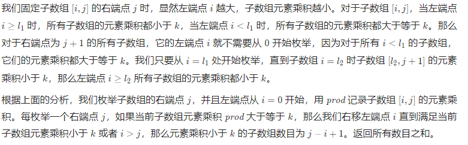

# 整数

## [整数除法](https://leetcode.cn/problems/xoh6Oh/)

由于int数中，负数比正数多一个。全用正数计算会导致溢出，因此选用负数计算。

先排除溢出的可能。

用一个数组存储$b^0,b^1,...,b^k$，其中$b^k$刚好严格小于$a$。最后的ans肯定时$b^0,b^1,...,b^{k-1}$的某些的和

```c++
class Solution {
public:
    int divide(int a, int b) {
       if(a==INT_MIN){
           if(b==1) return INT_MIN;
           if(b==-1) return INT_MAX;
       }
       if(b==INT_MIN){
           return a==INT_MIN?1:0;
       }
       if(a==0){
           return 0;
       }
       bool rev=false;
       if(a>0){
           a=-a;
           rev=!rev;
       }
       if(b>0){
           b=-b;
           rev=!rev;
       }
       vector<int> candidate={b};
       while(candidate.back()>=a-candidate.back()){
           candidate.push_back(candidate.back()+candidate.back());
       }
       int ans=0;
       for(int i=candidate.size()-1;i>=0;--i){
           if(candidate[i]>=a){
               ans+=1<<i;
               a-=candidate[i];
           }
       }
       return rev?-ans:ans;
    }
};
```

## [二进制加法](https://leetcode.cn/problems/JFETK5/)

```c++
class Solution {
public:
    string addBinary(string a, string b) {
        string res;
        reverse(a.begin(),a.end());
        reverse(b.begin(), b.end());
        int carry=0;
        int n=max(a.size(),b.size());
        for(int i=0;i<n;++i){
            carry+=i<a.size()?(a[i]=='1'):0;
            carry+=i<b.size()?(b[i]=='1'):0;
            res.push_back((carry%2)?'1':'0');
            carry/=2;
        }
        if(carry){
            res.push_back('1');
        }
        reverse(res.begin(), res.end());
        return res;
    }
};
```

## [前 n 个数字二进制中 1 的个数](https://leetcode.cn/problems/w3tCBm/)

### 法一：Brian Kernighan 算法

$ x=x~\&~(x-1)$，将$x$的二进制表示的最后一个1变成0。

```c++
class Solution {
public:
    int countOnes(int x) {
        int ones = 0;
        while (x > 0) {
            x &= (x - 1);
            ones++;
        }
        return ones;
    }

    vector<int> countBits(int n) {
        vector<int> bits(n + 1);
        for (int i = 0; i <= n; i++) {
            bits[i] = countOnes(i);
        }
        return bits;
    }
};
```

### 法二：动态规划

只有当遍历到2的整数次幂时，才会正好只有最高位为1。因此$count[i]=count[i-highbit]+1$

```c++
class Solution {
public:
    vector<int> countBits(int n) {
        vector<int> count(n+1);
        int highbit=0;
        for(int i=1;i<n+1;++i){
            if((i&(i-1))==0){
                highbit=i;
            }
            count[i]=count[i-highbit]+1;
        }
        return count;
    }
};
```

## [只出现一次的数字 ](https://leetcode.cn/problems/WGki4K/)

位运算比较好理解

```c++
class Solution {
public:
    int singleNumber(vector<int>& nums) {
        int res=0;
        for(int i=0;i<32;++i){
            int total=0;
            for(auto num:nums){
                total+=((num>>i)&1);
            }
            if(total%3){
                res|=(1<<i);
            }
        }
        return res;
    }
};
```

## [单词长度的最大乘积](https://leetcode.cn/problems/aseY1I/)

用位运算记录每个单词所含的字母，a在第一位，b在第二位。

如果满足$mask[i]\&mask[j]==0$，则说明他们字符不同，可以把比较字符的复杂度降为$O(1)$

```C++
class Solution {
public:
    int maxProduct(vector<string>& words) {
        int n= words.size();
        vector<int> masks(n);
        for(int i=0;i<n;++i){
            string word=words[i];
            int len=word.size();
            for(int j=0;j<len;++j){
                masks[i]|=1<<(word[j]-'a');
            }
        }
        int maxProd=0;
        for(int i=0;i<n;++i){
            for(int j=i+1;j<n;++j){
                if((masks[i]&masks[j])==0){
                    maxProd=max(maxProd,int(words[i].size()*words[j].size()));
                }
            }
        }
        return maxProd;
    }
};
```

### 优化位运算

有可能会遇到字符相同但长度不同的字符串，此时重复遍历会浪费时间。可以用一个哈希表记录相同mask的最大长度，这样遍历时只需要遍历不同的mask就行

```c++
class Solution {
public:
    int maxProduct(vector<string>& words) {
        unordered_map<int,int> map;
        int length = words.size();
        for (int i = 0; i < length; i++) {
            int mask = 0;
            string word = words[i];
            int wordLength = word.size();
            for (int j = 0; j < wordLength; j++) {
                mask |= 1 << (word[j] - 'a');
            }
            if(map.count(mask)) {
                if (wordLength > map[mask]) {
                    map[mask] = wordLength;
                }
            } else {
                map[mask] = wordLength;
            }
            
        }
        int maxProd = 0;
        for (auto [mask1, _] : map) {
            int wordLength1 = map[mask1];
            for (auto [mask2, _] : map) {
                if ((mask1 & mask2) == 0) {
                    int wordLength2 = map[mask2];
                    maxProd = max(maxProd, wordLength1 * wordLength2);
                }
            }
        }
        return maxProd;
    }
};
```

## [排序数组中两个数字之和](https://leetcode.cn/problems/kLl5u1/)

```c++
class Solution {
public:
    vector<int> twoSum(vector<int>& numbers, int target) {
        int left=0,right=numbers.size()-1;
        while(left<right){
            int sum=numbers[left]+numbers[right];
            if(sum==target){
                return {left,right};
            }else if(sum>target){
                --right;
            }else{
                ++left;
            }
        }
        return {};
    }
};
```

# 数组

## [数组中和为 0 的三个数](https://leetcode.cn/problems/1fGaJU/)

还是要二重循环，但可以通过双指针剪枝

```c++
class Solution {
public:
    vector<vector<int>> threeSum(vector<int>& nums) {
        vector<vector<int>> ans;
        int n=nums.size();
        sort(nums.begin(),nums.end());
        for(int first=0;first<n;++first){
            if(first>0&&nums[first]==nums[first-1]){
                continue;
            }
            int third=n-1;
            int target=-nums[first];
            for(int second=first+1;second<n;++second){
                if(second>first+1&&nums[second]==nums[second-1]){
                    continue;
                }
                while(second<third&&nums[second]+nums[third]>target){
                    --third;
                }
                if(second==third){
                    break;
                }
                if(nums[second]+nums[third]==target){
                    ans.push_back({nums[first],nums[second],nums[third]});
                }
            }
        }
        return ans;
    }
};
```

## [和大于等于 target 的最短子数组](https://leetcode.cn/problems/2VG8Kg/)

```c++
//滑动窗口
class Solution {
public:
    int minSubArrayLen(int target, vector<int>& nums) {
        int n = nums.size();
        if (n == 0) {
            return 0;
        }
        int ans = INT_MAX;
        int start = 0, end = 0;
        int sum = 0;
        while (end < n) {
            sum += nums[end];
            while (sum >= target) {
                ans = min(ans, end - start + 1);
                sum -= nums[start];
                start++;
            }
            end++;
        }
        return ans == INT_MAX ? 0 : ans;

    }
};
```

## [乘积小于 K 的子数组](https://leetcode.cn/problems/ZVAVXX/)

滑动数组



```c++
class Solution {
public:
    int numSubarrayProductLessThanK(vector<int>& nums, int k) {
        int n = nums.size();
        if (n == 0) {
            return 0;
        }
        int left=0,right=0;
        int mult=1;
        int count=0;
        while(right<n){
            mult*=nums[right];
            while(left<=right&&mult>=k){
                mult/=nums[left];
                ++left;
            }
            count+=right-left+1;
            ++right;
        }
        return count;
    }
};
```

## [和为 k 的子数组](https://leetcode.cn/problems/QTMn0o/)

因为例子中有负数，不太好用滑动数组，因此可以用前缀和

用`map`记录前缀和，当`mp.find(pre-k)!=mp.end()`，说明存在两个前缀和之间的差为`k`。初始化`mp[0]=1`表示初始状态（可认为下标为-1）时，这样可以保证前缀正好是k时也能准确算上。

```c++
class Solution {
public:
    int subarraySum(vector<int>& nums, int k) {
        unordered_map<int,int> mp;
        mp[0]=1;
        int pre=0;
        int count=0;
        for(auto &n:nums){
            pre+=n;
            if(mp.find(pre-k)!=mp.end()){
                count+=mp[pre-k];
            }
            ++mp[pre];
        }
        return count;
    }
};
```

## [0 和 1 个数相同的子数组](https://leetcode.cn/problems/A1NYOS/)

前缀和+哈希表。因为要计算长度，初始`mp[0]=-1`

```c++
class Solution {
public:
    int findMaxLength(vector<int>& nums) {
        unordered_map<int,int> mp;
        int pre=0;
        int maxlen=0;
        mp[0]=-1;
        for(int i=0;i<nums.size();++i){
            if(nums[i]==0){
                --pre;
            }else{
                ++pre;
            }
            if(mp.find(pre)!=mp.end()){
                maxlen=max(maxlen,i-mp[pre]);
            }else{
                mp[pre]=i;
            }

        }
        return maxlen;
    }
};
```

## [左右两边子数组的和相等](https://leetcode.cn/problems/tvdfij/)

左边和+中间数+右边和=总和。所以先计算总和，在记录左边和

```c++
class Solution {
public:
    int pivotIndex(vector<int>& nums) {
        int total=accumulate(nums.begin(), nums.end(), 0);
        int sum=0;
        for(int i=0;i<nums.size();++i){
            if(2*sum==total-nums[i]){
                return i;
            }
            sum+=nums[i];
        }
        return -1;
    }
};
```

## [二维子矩阵的和](https://leetcode.cn/problems/O4NDxx/)

```c++
class NumMatrix {
    vector<vector<int>> sum;
public:
    NumMatrix(vector<vector<int>>& matrix) {
        int m=matrix.size(),n=matrix[0].size();
        sum.resize(m+1,vector<int>(n+1,0));
        for(int i=1;i<=m;++i){
            for(int j=1;j<=n;++j){
                sum[i][j]=sum[i-1][j]+sum[i][j-1]-sum[i-1][j-1]+matrix[i-1][j-1];
            }
        }
    }
    
    int sumRegion(int row1, int col1, int row2, int col2) {
        return sum[row2+1][col2+1]-sum[row2+1][col1]-sum[row1][col2+1]+sum[row1][col1];
    }
};
```

