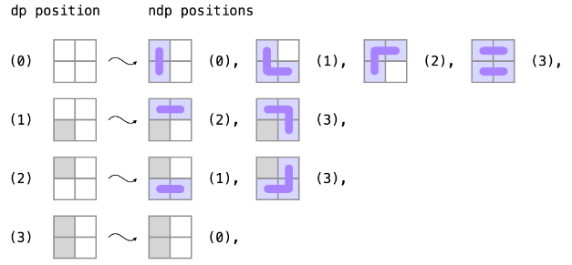

### [5. 最长回文子串](https://leetcode.cn/problems/longest-palindromic-substring/)

给你一个字符串 `s`，找到 `s` 中最长的回文子串。

**示例 1：**

```
输入：s = "babad"
输出："bab"
解释："aba" 同样是符合题意的答案。
```

**示例 2：**

```
输入：s = "cbbd"
输出："bb"
```

**提示：**

- `1 <= s.length <= 1000`
- `s` 仅由数字和英文字母组成

#### 法一：动态规划

算法复杂度$O(n^2)$，核心思想是使用二维数据记录$i$ 到$j$ 是否是回文，若是，且 $s[i-1]==s[j+1]$，则$i-1$到$j+1$也是回文  。

首先长度为1肯定是回文。接着从长度为2开始循环。但是不能按照左右节点循环，因为$i、j$之间的回文状态无法得到及时更新。

```c++
class Solution {
public:
    string longestPalindrome(string s) {
        int n=s.size();
        if(n==1){
            return s;
        }
        int max_len=1,max_left=0;
        vector<vector<bool> > is_Palidrome(n,vector<bool>(n,false));
        for(int i=0;i<n;++i){
            is_Palidrome[i][i]=true;
        }
        for(int L=2;L<=n;++L){
            for(int i=0;i<n;++i){
                int j=i+L-1;
                if(j>=n){
                    break;
                }
                if(L==2){
                    if(s[i]==s[j]){
                        is_Palidrome[i][j]=true;
                        if(max_len<2){
                        max_len=2;
                        max_left=i;
                        } 
                    }
                }else{
                    if(is_Palidrome[i+1][j-1]&&s[i]==s[j]){
                        is_Palidrome[i][j]=true;
                        if(L>max_len){
                            max_len=L;
                            max_left=i;
                        }
                    }
                }
            }
        }
        return s.substr(max_left,max_len);
    }
};
//官方
#include <iostream>
#include <string>
#include <vector>

using namespace std;

class Solution {
public:
    string longestPalindrome(string s) {
        int n = s.size();
        if (n < 2) {
            return s;
        }

        int maxLen = 1;
        int begin = 0;
        // dp[i][j] 表示 s[i..j] 是否是回文串
        vector<vector<int>> dp(n, vector<int>(n));
        // 初始化：所有长度为 1 的子串都是回文串
        for (int i = 0; i < n; i++) {
            dp[i][i] = true;
        }
        // 递推开始
        // 先枚举子串长度
        for (int L = 2; L <= n; L++) {
            // 枚举左边界，左边界的上限设置可以宽松一些
            for (int i = 0; i < n; i++) {
                // 由 L 和 i 可以确定右边界，即 j - i + 1 = L 得
                int j = L + i - 1;
                // 如果右边界越界，就可以退出当前循环
                if (j >= n) {
                    break;
                }

                if (s[i] != s[j]) {
                    dp[i][j] = false;
                } else {
                    if (j - i < 3) {
                        dp[i][j] = true;
                    } else {
                        dp[i][j] = dp[i + 1][j - 1];
                    }
                }

                // 只要 dp[i][L] == true 成立，就表示子串 s[i..L] 是回文，此时记录回文长度和起始位置
                if (dp[i][j] && j - i + 1 > maxLen) {
                    maxLen = j - i + 1;
                    begin = i;
                }
            }
        }
        return s.substr(begin, maxLen);
    }
};
```

#### 法二：中心扩展

$$ \left\{\begin{aligned}P(i,i) & =true\\ P(i,i+1) & =(S_i==S_{i+1})\\P(i,j) & = P(i+1,j-1)^(S_i==S_j) \end{aligned} \right.$$

可以发现，**所有的状态在转移的时候的可能性都是唯一的**。也就是说，我们可以从每一种边界情况开始「扩展」，也可以得出所有的状态对应的答案。

边界情况即为子串长度为 1 或 2 的情况。

```c++
class Solution {
public:
    pair<int,int> expand(int left,int right,const string &s){
        while(left>=0&&right<s.size()&&s[left]==s[right]){
            --left;
            ++right;
        }
        return {left+1,right-1};
    }
    string longestPalindrome(string s) {
        int start=0,len=1;
        for(int i=0;i<s.size();++i){
            auto [left1,right1]=expand(i,i,s);
            auto [left2,right2]=expand(i,i+1,s);
            if(right1-left1+1>len){
                len=right1-left1+1;
                start=left1;
            }
            if(right2-left2+1>len){
                len=right2-left2+1;
                start=left2;
            }
        }
        return s.substr(start,len);
    }
};
```

## [多米诺和托米诺平铺](https://leetcode.cn/problems/domino-and-tromino-tiling/)

有两种形状的瓷砖：一种是 `2 x 1` 的多米诺形，另一种是形如 "L" 的托米诺形。两种形状都可以旋转。



```c++
class Solution {
public:
    int numTilings(int n) {
        int mod=1e9+7;
        vector<long> dp={1,0,0,0};
        for(int i=0;i<n;++i){
            vector<long> ndp={0,0,0,0};
            ndp[0b00]=(dp[0b00]+dp[0b11])%mod;
            ndp[0b01]=(dp[0b00]+dp[0b10])%mod;
            ndp[0b10]=(dp[0b00]+dp[0b01])%mod;
            ndp[0b11]=(dp[0b00]+dp[0b10]+dp[0b01])%mod;
            dp=ndp;
        }
        return (int)dp[0];
    }
};
```

