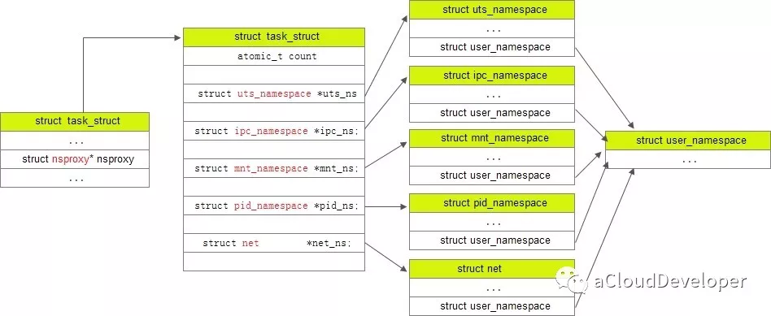

# 底层实现

Docker 底层的核心技术包括 Linux 上的命名空间（Namespaces）、控制组（Control groups）、Union 文件系统（Union file systems）和容器格式（Container format）。

我们知道，在操作系统中，包括内核、文件系统、网络、PID、UID、IPC、内存、硬盘、CPU 等等，所有的资源都是应用进程直接共享的。 要想实现虚拟化，除了要实现对内存、CPU、网络IO、硬盘IO、存储空间等的限制外，还要实现文件系统、网络、PID、UID、IPC等等的相互隔离。 前者相对容易实现一些，后者则需要宿主机系统的深入支持。

随着 Linux 系统对于命名空间功能的完善实现，程序员已经可以实现上面的所有需求，让某些进程在彼此隔离的命名空间中运行。大家虽然都共用一个内核和某些运行时环境（例如一些系统命令和系统库），但是彼此却看不到，都以为系统中只有自己的存在。这种机制就是容器（Container），利用命名空间来做权限的隔离控制，利用 cgroups 来做资源分配。

## 基础架构

Docker 采用了 `C/S` 架构，包括客户端和服务端。Docker 守护进程 （`Daemon`）作为服务端接受来自客户端的请求，并处理这些请求（创建、运行、分发容器）。

客户端和服务端既可以运行在一个机器上，也可通过 `socket` 或者 `RESTful API` 来进行通信。

## 命名空间

命名空间是 Linux 内核一个强大的特性。每个容器都有自己单独的命名空间，运行在其中的应用都像是在独立的操作系统中运行一样。命名空间保证了容器之间彼此互不影响。

### pid 命名空间

不同用户的进程就是通过 pid 命名空间隔离开的，且不同命名空间中可以有相同 pid。**所有的 LXC (Linux containers) 进程**在 Docker 中的**父进程为 Docker 进程**，每个 LXC 进程具有不同的命名空间。同时由于允许嵌套，因此可以很方便的实现嵌套的 Docker 容器。

### net 命名空间

网络隔离是通过 net 命名空间实现的， 每个 net 命名空间有独立的 网络设备，IP 地址，路由表，/proc/net 目录。这样每个容器的网络就能隔离开来。Docker 默认采用 veth 的方式，将容器中的虚拟网卡同 host 上的一 个Docker 网桥 docker0 连接在一起。

### ipc 命名空间

容器中进程交互还是采用了 Linux 常见的进程间交互方法(interprocess communication - IPC)， 包括信号量、消息队列和共享内存等。然而同 VM 不同的是，容器的进程间交互实际上还是 host 上具有相同 pid 命名空间中的进程间交互，因此需要在 **IPC 资源申请时加入命名空间信息**，每个 IPC 资源有一个唯一的 32 位 id。

### mnt 命名空间

类似 chroot（改变程序执行时所参考的根目录位置），将一个进程放到一个特定的目录执行。mnt 命名空间允许不同命名空间的进程看到的文件结构不同，这样每个命名空间 中的进程所看到的文件目录就被隔离开了。同 chroot 不同，每个命名空间中的容器在 /proc/mounts 的信息只包含所在命名空间的 mount point。

### uts 命名空间

UTS("UNIX Time-sharing System") 命名空间允许每个容器拥有独立的 hostname 和 domain name， 使其在网络上可以被视作一个独立的节点而非 主机上的一个进程。

### user 命名空间

每个容器可以有不同的用户和组 id， 也就是说可以在容器内用容器内部的用户执行程序而非主机上的用户。

---


## **控制组**

控制组（[cgroups](https://en.wikipedia.org/wiki/Cgroups)）是 Linux 内核的一个特性，主要用来对共享资源进行隔离、限制、审计等。只有能控制分配到容器的资源，才能避免当多个容器同时运行时的对系统资源的竞争。

控制组技术最早是由 Google 的程序员在 2006 年提出，Linux 内核自 2.6.24 开始支持。

控制组可以提供对容器的内存、CPU、磁盘 IO 等资源的限制和审计管理。

> linux的cgroups详解
>
> https://blog.csdn.net/f80407515/article/details/118554991
>
> https://blog.csdn.net/fly910905/article/details/123642233

## 联合文件系统

Linux文件系统由bootfs和rootfs两部分组成:

- bootfs：包含bootloader（引导加载程序）和kernel（内核）。
- rootfs：root文件系统，包含的就是典型的Linux系统中的/dev，/proc，/etc等标准目录和文件。
- 不同的Linux发行版，bootfs基本一样，而rootfs不同，如Ubuntu和CentOS等。

### 根文件系统(rootfs)

根文件系统首先是一种文件系统，该文件系统不仅具有普通文件系统的存储数据文件的功能，但是相对于普通的文件系统，它的特殊之处在于，它是内核启动时所挂载（mount）的第一个文件系统，内核代码的映像文件保存在根文件系统中，系统引导启动程序(bootloader)会在根文件系统挂载之后从中把一些初始化脚本（如rcS,inittab）和服务加载到内存中去运行。**文件系统**和**内核**是完全**独立**的两个部分。在嵌入式中移植的内核下载到开发板上，是没有办法真正的启动Linux操作系统的，会出现无法加载文件系统的错误。

### 存储驱动

也就是实现镜像的基本存储方式。在可能的情况下，[推荐](https://docs.docker.com/storage/storagedriver/select-storage-driver/) 使用 `overlay2` 存储驱动，`overlay2` 是目前 Docker 默认的存储驱动，以前则是 `aufs`。你可以通过配置来使用以上提到的其他类型的存储驱动。

#### overlay2运作方式

overlay2主要由merged、lowerdir、upperdir、workdir组成。

其中，lowerdir对应底层文件系统，也就是那一层层“commit”的内容，它是能被上层文件系统upperdir所共享的只读层。workdir则可以理解为overlay2运作的一个工作目录，用于完成copy-on-write等操作。copy-on-write这点我们会在实操中谈到它。

overlay2运作时，会将lowerdir、upperdir和workdir联合挂载到merged目录，为使用者提供一个“统一视图”。


overlay的原理示意图，不过也能帮助我们理解overlay2的运作方式。这里要注意的是，overlay2中lowerdir可以有很多层，这里只画了一层，我们可以脑补它为很多层。

具体操作变更细节参考如下

https://blog.csdn.net/qq_45858169/article/details/115918469

总结：

- merged文件夹和upperdir文件夹内可修改
- 修改lowerdir时，lowerdir内部文件不会改变，但会在upperdir中复制一份修改后的内容。
- 删除lowerdir内文件后，会在upperdir内生成一个特殊的字符设备文件，而lowerdir内文件依然存在。而overlay2在联合挂载时，看到这个特殊的字符设备文件，会选择性的忽略lowerdir中对应的内容。

```bash
drwx--x--- 4 root root 4096 Jul  6 14:48 066a025afddc841620921428ad80efda97f218ac46efe283be909cb28ef79040
drwx--x--- 5 root root 4096 Jul  5 16:29 0ddca0c74e25da762639be906dcd409ff7a411b3095063b1bb28aead4731a525
drwx--x--- 4 root root 4096 Jul  5 16:29 0ddca0c74e25da762639be906dcd409ff7a411b3095063b1bb28aead4731a525-init
drwx--x--- 4 root root 4096 Jul  5 16:29 0f8634b1f9ed76312e59310c867c3d15f6da0923fbfe61728e02f26ca5ebb722
drwx--x--- 3 root root 4096 Jul  4 16:28 136f7ce2fd488de91e6893d6c70656e46264d881d2ecc793e60eb583876f7c68
drwx--x--- 4 root root 4096 Jul  8 17:08 2c3598d892f85300cce68072a9043f2206cd5c293dfe2f2eef8a02580b36429c
drwx--x--- 4 root root 4096 Jul  5 15:29 47cc2cdf886fb70a2a1c69b297d4fd7561c52bd96dc890870318c30f4d32fe30
drwx--x--- 4 root root 4096 Jul  5 15:28 4f9ae1258334463fd33fc126c20cba0af41336685b835800f3ef96c1d17a2bd6
drwx--x--- 4 root root 4096 Jul  9 10:18 58b9c1e90e9683eeafff031025b57dd4a1c5db6c49190392edb907abdc6b2061
drwx--x--- 4 root root 4096 Jul  9 10:01 58b9c1e90e9683eeafff031025b57dd4a1c5db6c49190392edb907abdc6b2061-init
drwx--x--- 3 root root 4096 Jul  8 17:07 68e39dea6b84836f8dfd80a6d170b583316c2b953855762dd6d690ee1e2adc57
drwx--x--- 4 root root 4096 Jul  5 15:28 7759c3f498a721c27c26572910ccf81084aee3630fca2af3f1185126492a47b4
drwx--x--- 4 root root 4096 Jul  8 17:08 7bc1f63c725f8ab9bcb66c017d00ca1827751ec91fe06ed599ba7b23f8ad235d
drwx--x--- 4 root root 4096 Jul  8 17:31 84903c9663c951a28b5312f7bcfa6cf7b35e38125bac23212364b5a86b16557f
drwx--x--- 4 root root 4096 Jul  9 10:01 9564b521d0a4a3a5b84a1245ee577bd0f0eeba917444a6e52f09f79cf23cec55
drwx--x--- 4 root root 4096 Jul  8 17:32 98afafb214d26d2e7395f03b9aff803f2774f150540a55c6abc536915bbd5846
drwx--x--- 3 root root 4096 Jul  8 17:58 b0879d508986333d23ea8766918cff4a45b006a22826c5a64f487608867ba573
drwx--x--- 4 root root 4096 Jul  5 15:28 b30cfd61c5049c98f8a1190b78934a28877793a2641c000b1cef3ede2ed53cff
drwx--x--- 4 root root 4096 Jul  5 15:28 b558d1eb43ffbd8770d0280fa5bd6a7418f0b0fb498bc15906aee8f1a3ce77f6
drwx--x--- 4 root root 4096 Jul  9 10:01 c308578fde952026cd26d54a9433fd0e3e116f0d2b5d948b10bd1a80f0a945d3
drwx--x--- 4 root root 4096 Jul  8 17:32 d2aa65eff6cc5f75a4cac0ecce8d1a28ef92948c57762a1e11b6c4fe528a2435
drwx--x--- 5 root root 4096 Jul  5 15:29 d404e7ea54da4f87ed7122b1b0cec98e4f07502097e7c0f6fa76f635130aff01
drwx--x--- 4 root root 4096 Jul  5 15:33 d404e7ea54da4f87ed7122b1b0cec98e4f07502097e7c0f6fa76f635130aff01-init
drwx--x--- 3 root root 4096 Jul  5 15:28 de3c554589ff6626c6b2f8d7af45a4ac485d2e04dba5ec0f2e5cc4f899656fa3
drwx--x--- 3 root root 4096 Jul  4 16:01 fa905236df23f3985a2ba05d99e48531c2e7ae7915c86753dcf50f7361ff245a
drwx------ 2 root root 4096 Jul  9 10:01 l

```

```bash
#nginx:v2
"LowerDir": "/var/lib/docker/overlay2/0ddca0c74e25da762639be906dcd409ff7a411b3095063b1bb28aead4731a525-init/diff: \
/var/lib/docker/overlay2/0f8634b1f9ed76312e59310c867c3d15f6da0923fbfe61728e02f26ca5ebb722/diff: \
/var/lib/docker/overlay2/47cc2cdf886fb70a2a1c69b297d4fd7561c52bd96dc890870318c30f4d32fe30/diff: \
/var/lib/docker/overlay2/b30cfd61c5049c98f8a1190b78934a28877793a2641c000b1cef3ede2ed53cff/diff: \
/var/lib/docker/overlay2/b558d1eb43ffbd8770d0280fa5bd6a7418f0b0fb498bc15906aee8f1a3ce77f6/diff: \
/var/lib/docker/overlay2/4f9ae1258334463fd33fc126c20cba0af41336685b835800f3ef96c1d17a2bd6/diff: \
/var/lib/docker/overlay2/7759c3f498a721c27c26572910ccf81084aee3630fca2af3f1185126492a47b4/diff: \
/var/lib/docker/overlay2/de3c554589ff6626c6b2f8d7af45a4ac485d2e04dba5ec0f2e5cc4f899656fa3/diff",
#nginx
"LowerDir": "/var/lib/docker/overlay2/d404e7ea54da4f87ed7122b1b0cec98e4f07502097e7c0f6fa76f635130aff01-init/diff: \
/var/lib/docker/overlay2/47cc2cdf886fb70a2a1c69b297d4fd7561c52bd96dc890870318c30f4d32fe30/diff: \
/var/lib/docker/overlay2/b30cfd61c5049c98f8a1190b78934a28877793a2641c000b1cef3ede2ed53cff/diff: \
/var/lib/docker/overlay2/b558d1eb43ffbd8770d0280fa5bd6a7418f0b0fb498bc15906aee8f1a3ce77f6/diff: \
/var/lib/docker/overlay2/4f9ae1258334463fd33fc126c20cba0af41336685b835800f3ef96c1d17a2bd6/diff: \
/var/lib/docker/overlay2/7759c3f498a721c27c26572910ccf81084aee3630fca2af3f1185126492a47b4/diff: \
/var/lib/docker/overlay2/de3c554589ff6626c6b2f8d7af45a4ac485d2e04dba5ec0f2e5cc4f899656fa3/diff"
```

## 容器格式

最初，Docker 采用了 `LXC` 中的容器格式。从 0.7 版本以后开始去除 LXC，转而使用自行开发的 [libcontainer](https://github.com/docker/libcontainer)，从 1.11 开始，则进一步演进为使用 [runC](https://github.com/opencontainers/runc) 和 [containerd](https://github.com/containerd/containerd)。

## **网络**

Docker 的网络实现其实就是利用了 Linux 上的网络命名空间和虚拟网络设备（特别是 veth pair）

### 基本原理

首先，要实现网络通信，机器需要至少一个网络接口（物理接口或虚拟接口）来收发数据包；此外，如果不同子网之间要进行通信，需要路由机制。

Docker 中的网络接口默认都是虚拟的接口。虚拟接口的优势之一是转发效率较高。 Linux 通过在内核中进行数据复制来实现虚拟接口之间的数据转发，发送接口的发送缓存中的数据包被直接复制到接收接口的接收缓存中。对于本地系统和容器内系统看来就像是一个正常的以太网卡，只是它不需要真正同外部网络设备通信，速度要快很多。

Docker 容器网络就利用了这项技术。它在本地主机和容器内分别创建一个虚拟接口，并让它们彼此连通（这样的一对接口叫做 `veth pair`）。

---

# 源码解析

## 命名空间

Docker 和虚拟机技术一样，从操作系统级上实现了资源的隔离，它本质上是宿主机上的进程（容器进程），所以资源隔离主要就是指进程资源的隔离。

隔离意味着可以抽象出多个轻量级的内核（容器进程），这些进程可以充分利用宿主机的资源，宿主机有的资源容器进程都可以享有，但彼此之间是隔离的，同样，不同容器进程之间使用资源也是隔离的，这样，彼此之间进行相同的操作，都不会互相干扰，安全性得到保障。

为了支持这些特性，Linux namespace 实现了 6 项资源隔离，基本上涵盖了一个小型操作系统的运行要素，包括主机名、用户权限、文件系统、网络、进程号、进程间通信。

| namespace | 系统调用参数  | 隔离内容                   | 内核版本 |
| --------- | ------------- | -------------------------- | -------- |
| UTS       | CLONE_NEWUTS  | 主机名和域名               | 2.6.19   |
| IPC       | CLONE_NEWIPC  | 信号量、消息队列和共享内存 | 2.6.19   |
| PID       | CLONE_NEWPID  | 进程编号                   | 2.6.24   |
| Network   | CLONE_NEWNET  | 网络设备、网络栈、端口等   | 2.6.29   |
| Mount     | CLONE_NEWNS   | 挂载点（文件系统）         | 2.4.19   |
| User      | CLONE_NEWUSER | 用户和用户组               | 3.8      |

这 6 项资源隔离分别对应 6 种系统调用，通过传入上表中的参数，调用 clone() 函数来完成。

```c
int clone(int (*child_func)(void *), void *child_stack, int flags, void *arg);
```

通过调用 clone()，并传入需要隔离资源对应的参数，就可以建立一个容器了（隔离什么我们自己控制）。

一个容器进程也可以再 clone() 出一个容器进程，这是容器的嵌套。


如果想要查看当前进程下有哪些 namespace 隔离，可以查看文件 /proc/[pid]/ns （注：该方法仅限于 3.8 版本以后的内核）。

```bash
[root@centos1 mynginx]# ll /proc/1/ns
total 0
lrwxrwxrwx 1 root root 0 Jul  6 10:03 ipc -> ipc:[4026531839]
lrwxrwxrwx 1 root root 0 Jul  6 10:03 mnt -> mnt:[4026531840]
lrwxrwxrwx 1 root root 0 Jul  6 10:03 net -> net:[4026531956]
lrwxrwxrwx 1 root root 0 Jul  6 10:03 pid -> pid:[4026531836]
lrwxrwxrwx 1 root root 0 Jul  6 10:03 user -> user:[4026531837]
lrwxrwxrwx 1 root root 0 Jul  6 10:03 uts -> uts:[4026531838]
```

可以看到，每一项 namespace 都附带一个编号，这是唯一标识 namespace 的，如果两个进程指向的 namespace 编号相同，则表示它们同在该 namespace 下。

```c
       #define _GNU_SOURCE
       #include <sys/wait.h>
       #include <sys/utsname.h>
       #include <sched.h>
       #include <string.h>
       #include <stdio.h>
       #include <stdlib.h>
       #include <unistd.h>

       #define errExit(msg)    do { perror(msg); exit(EXIT_FAILURE); \
                               } while (0)

       static int              /* Start function for cloned child */
       childFunc(void *arg)
       {
           struct utsname uts;

           /* Change hostname in UTS namespace of child */

           if (sethostname(arg, strlen(arg)) == -1)
               errExit("sethostname");

           /* Retrieve and display hostname */

           if (uname(&uts) == -1)
               errExit("uname");
           printf("uts.nodename in child:  %s\n", uts.nodename);

           /* Keep the namespace open for a while, by sleeping.
              This allows some experimentation--for example, another
              process might join the namespace. */

           sleep(200);

           return 0;           /* Child terminates now */
       }


       #define STACK_SIZE (1024 * 1024)    /* Stack size for cloned child */

       int
       main(int argc, char *argv[])
       {
           char *stack;                    /* Start of stack buffer */
           char *stackTop;                 /* End of stack buffer */
           pid_t pid;
           struct utsname uts;

           if (argc < 2) {
               fprintf(stderr, "Usage: %s <child-hostname>\n", argv[0]);
               exit(EXIT_SUCCESS);
           }

           /* Allocate stack for child */

           stack = malloc(STACK_SIZE);
           if (stack == NULL)
               errExit("malloc");
           stackTop = stack + STACK_SIZE;  /* Assume stack grows downward */

           /* Create child that has its own UTS namespace;
              child commences execution in childFunc() */

           pid = clone(childFunc, stackTop, CLONE_NEWUTS | SIGCHLD, argv[1]);
           if (pid == -1)
               errExit("clone");
           printf("clone() returned %ld\n", (long) pid);

           /* Parent falls through to here */

           sleep(1);           /* Give child time to change its hostname */

           /* Display hostname in parent's UTS namespace. This will be
              different from hostname in child's UTS namespace. */

           if (uname(&uts) == -1)
               errExit("uname");
           printf("uts.nodename in parent: %s\n", uts.nodename);

           if (waitpid(pid, NULL, 0) == -1)    /* Wait for child */
               errExit("waitpid");
           printf("child has terminated\n");

           exit(EXIT_SUCCESS);
       }

```

现象如下

```bash
[root@centos1 namespace_test]# ./uts_test alex
clone() returned 21696
uts.nodename in child:  alex		#子进程中uts已经改变
uts.nodename in parent: centos1
```

其他namespace基本也可以用clone()来修改。

### 内核

#### 从内核进程描述符 task_struct 开始切入

由于 Linux namespace 是用来做进程资源隔离的，所以在进程描述符中，一定有 namespace 所对应的信息，我们可以从这里开始切入代码。

首先找到描述进程信息 task_struct，找到指向 namespace 的结构 `struct *nsproxy`（sched.h）：

```c
struct task_struct {
......
/* namespaces */
struct nsproxy *nsproxy;
......
}
```

其中 nsproxy 结构体定义在 nsproxy.h 中：

```c
struct nsproxy {
 atomic_t count;
 struct uts_namespace *uts_ns;
 struct ipc_namespace *ipc_ns;
 struct mnt_namespace *mnt_ns;
 struct pid_namespace *pid_ns;
 struct net        *net_ns;
};
extern struct nsproxy init_nsproxy;
```

这个结构是被所有 namespace 所共享的，只要一个 namespace 被 clone 了，nsproxy 也会被 clone。注意到，由于 user namespace 是和其他 namespace 耦合在一起的，所以没出现在上述结构中。

同时，nsproxy.h 中还定义了一些对 namespace 的操作，包括 copy_namespaces 等。

```c
int copy_namespaces(unsigned long flags, struct task_struct *tsk);
void exit_task_namespaces(struct task_struct *tsk);
void switch_task_namespaces(struct task_struct *tsk, struct nsproxy *new);
void free_nsproxy(struct nsproxy *ns);
int unshare_nsproxy_namespaces(unsigned long, struct nsproxy **,
 struct fs_struct *);
```

task_struct，nsproxy，几种 namespace 之间的关系如下所示：



#### 各个 namespace 的初始化

在各个 namespace 结构定义下都有个 init 函数，nsproxy 也有个 init_nsproxy 函数，init_nsproxy 在 task 初始化的时候会被初始化，附带的，init_nsproxy 中定义了各个 namespace 的 init 函数，如下：

在 init_task 函数中（init_task.h）:

```c
#define INIT_TASK(tsk)  \
{
......
 .nsproxy  = &init_nsproxy,        
......
}
```

继续跟进 init_nsproxy，在 nsproxy.c 中：

```c
struct nsproxy init_nsproxy = {
 .count      = ATOMIC_INIT(1),
 .uts_ns      = &init_uts_ns,
#if defined(CONFIG_POSIX_MQUEUE) || defined(CONFIG_SYSVIPC)
 .ipc_ns      = &init_ipc_ns,
#endif
 .mnt_ns      = NULL,
 .pid_ns_for_children  = &init_pid_ns,
#ifdef CONFIG_NET
 .net_ns      = &init_net,
#endif
};
```

可见，init_nsproxy 中，对 uts, ipc, pid, net 都进行了初始化，但 mount 却没有。

#### 创建新的 namespace

初始化完之后，下面看看如何创建一个新的 namespace，通过前面的文章，我们知道是通过 clone 函数来完成的，在 Linux kernel 中，fork()、vfork()和__clone()库函数都根据各自需要的参数标志去调用clone()，然后由clone()去调用do_fork()。所以关键是这个do_fork()函数。

```c
/*
*  Ok, this is the main fork-routine.
*
* It copies the process, and if successful kick-starts
* it and waits for it to finish using the VM if required.
*/
long do_fork(unsigned long clone_flags,
       unsigned long stack_start,
       unsigned long stack_size,
       int __user *parent_tidptr,
       int __user *child_tidptr)
{
 // 创建进程描述符指针
 struct task_struct *p;
 int trace = 0;
 long nr;

 /*
  * Determine whether and which event to report to ptracer.  When
  * called from kernel_thread or CLONE_UNTRACED is explicitly
  * requested, no event is reported; otherwise, report if the event
  * for the type of forking is enabled.
  */
 if (!(clone_flags & CLONE_UNTRACED)) {
   if (clone_flags & CLONE_VFORK)
     trace = PTRACE_EVENT_VFORK;
   else if ((clone_flags & CSIGNAL) != SIGCHLD)
     trace = PTRACE_EVENT_CLONE;
   else
     trace = PTRACE_EVENT_FORK;

   if (likely(!ptrace_event_enabled(current, trace)))
     trace = 0;
 }

 // 复制进程描述符，返回值是 task_struct
 p = copy_process(clone_flags, stack_start, stack_size,
      child_tidptr, NULL, trace);
 /*
  * Do this prior waking up the new thread - the thread pointer
  * might get invalid after that point, i 	f the thread exits quickly.
  */
 if (!IS_ERR(p)) {
   struct completion vfork;
   struct pid *pid;

   trace_sched_process_fork(current, p);

   // 得到新进程描述符的 pid
   pid = get_task_pid(p, PIDTYPE_PID);
   nr = pid_vnr(pid);

   if (clone_flags & CLONE_PARENT_SETTID)
     put_user(nr, parent_tidptr);

   // 调用 vfork() 方法，完成相关的初始化工作  
   if (clone_flags & CLONE_VFORK) {
     p->vfork_done = &vfork;
     init_completion(&vfork);
     get_task_struct(p);
   }

   // 将新进程加入到调度器中，为其分配 CPU，准备执行
   wake_up_new_task(p);

   // fork() 完成，子进程开始运行，并让 ptrace 跟踪
   /* forking complete and child started to run, tell ptracer */
   if (unlikely(trace))
     ptrace_event_pid(trace, pid);

   // 如果是 vfork()，将父进程加入等待队列，等待子进程完成
   if (clone_flags & CLONE_VFORK) {
     if (!wait_for_vfork_done(p, &vfork))
       ptrace_event_pid(PTRACE_EVENT_VFORK_DONE, pid);
   }

   put_pid(pid);
 } else {
   nr = PTR_ERR(p);
 }
 return nr;
}
```

do_fork() 首先调用 copy_process 将父进程信息复制给子进程，然后调用 vfork() 完成相关的初始化工作，接着调用 wake_up_new_task() 将进程加入调度器中，为之分配 CPU。最后，等待子进程退出。

**copy_process():**

```c
static struct task_struct *copy_process(unsigned long clone_flags,
         unsigned long stack_start,
         unsigned long stack_size,
         int __user *child_tidptr,
         struct pid *pid,
         int trace)
{
 int retval;
 // 创建进程描述符指针
 struct task_struct *p;

 // 检查 clone flags 的合法性，比如 CLONE_NEWNS 与 CLONE_FS 是互斥的
 if ((clone_flags & (CLONE_NEWNS|CLONE_FS)) == (CLONE_NEWNS|CLONE_FS))
   return ERR_PTR(-EINVAL);

 if ((clone_flags & (CLONE_NEWUSER|CLONE_FS)) == (CLONE_NEWUSER|CLONE_FS))
   return ERR_PTR(-EINVAL);

 /*
  * Thread groups must share signals as well, and detached threads
  * can only be started up within the thread group.
  */
 if ((clone_flags & CLONE_THREAD) && !(clone_flags & CLONE_SIGHAND))
   return ERR_PTR(-EINVAL);

 /*
  * Shared signal handlers imply shared VM. By way of the above,
  * thread groups also imply shared VM. Blocking this case allows
  * for various simplifications in other code.
  */
 if ((clone_flags & CLONE_SIGHAND) && !(clone_flags & CLONE_VM))
   return ERR_PTR(-EINVAL);

 /*
  * Siblings of global init remain as zombies on exit since they are
  * not reaped by their parent (swapper). To solve this and to avoid
  * multi-rooted process trees, prevent global and container-inits
  * from creating siblings.
  */
  // 比如CLONE_PARENT时得检查当前signal flags是否为SIGNAL_UNKILLABLE，防止kill init进程。
 if ((clone_flags & CLONE_PARENT) &&
       current->signal->flags & SIGNAL_UNKILLABLE)
   return ERR_PTR(-EINVAL);

 /*
  * If the new process will be in a different pid or user namespace
  * do not allow it to share a thread group or signal handlers or
  * parent with the forking task.
  */
 if (clone_flags & CLONE_SIGHAND) {
   if ((clone_flags & (CLONE_NEWUSER | CLONE_NEWPID)) ||
       (task_active_pid_ns(current) !=
       current->nsproxy->pid_ns_for_children))
     return ERR_PTR(-EINVAL);
 }

 retval = security_task_create(clone_flags);
 if (retval)
   goto fork_out;

 retval = -ENOMEM;
 // 复制当前的 task_struct
 p = dup_task_struct(current);
 if (!p)
   goto fork_out;

 ftrace_graph_init_task(p);

 rt_mutex_init_task(p);

#ifdef CONFIG_PROVE_LOCKING
 DEBUG_LOCKS_WARN_ON(!p->hardirqs_enabled);
 DEBUG_LOCKS_WARN_ON(!p->softirqs_enabled);
#endif
 retval = -EAGAIN;

 // 检查进程是否超过限制，由 OS 定义
 if (atomic_read(&p->real_cred->user->processes) >=
     task_rlimit(p, RLIMIT_NPROC)) {
   if (p->real_cred->user != INIT_USER &&
       !capable(CAP_SYS_RESOURCE) && !capable(CAP_SYS_ADMIN))
     goto bad_fork_free;
 }
 current->flags &= ~PF_NPROC_EXCEEDED;

 retval = copy_creds(p, clone_flags);
 if (retval < 0)
   goto bad_fork_free;

 /*
  * If multiple threads are within copy_process(), then this check
  * triggers too late. This doesn't hurt, the check is only there
  * to stop root fork bombs.
  */
 retval = -EAGAIN;
 // 检查进程数是否超过 max_threads，由内存大小定义
 if (nr_threads >= max_threads)
   goto bad_fork_cleanup_count;

 // ......

 // 初始化 io 计数器
 task_io_accounting_init(&p->ioac);
 acct_clear_integrals(p);

 // 初始化 CPU 定时器
 posix_cpu_timers_init(p);

 // ......

 // 初始化进程数据结构，并为进程分配 CPU，进程状态设置为 TASK_RUNNING
 /* Perform scheduler related setup. Assign this task to a CPU. */
 retval = sched_fork(clone_flags, p);
 
 if (retval)
   goto bad_fork_cleanup_policy;

 retval = perf_event_init_task(p);
 if (retval)
   goto bad_fork_cleanup_policy;
 retval = audit_alloc(p);
 if (retval)
   goto bad_fork_cleanup_perf;
 /* copy all the process information */
 // 复制所有进程信息，包括文件系统，信号处理函数、信号、内存管理等
 shm_init_task(p);
 retval = copy_semundo(clone_flags, p);
 if (retval)
   goto bad_fork_cleanup_audit;
 retval = copy_files(clone_flags, p);
 if (retval)
   goto bad_fork_cleanup_semundo;
 retval = copy_fs(clone_flags, p);
 if (retval)
   goto bad_fork_cleanup_files;
 retval = copy_sighand(clone_flags, p);
 if (retval)
   goto bad_fork_cleanup_fs;
 retval = copy_signal(clone_flags, p);
 if (retval)
   goto bad_fork_cleanup_sighand;
 retval = copy_mm(clone_flags, p);
 if (retval)
   goto bad_fork_cleanup_signal;
 // !!! 复制 namespace
 retval = copy_namespaces(clone_flags, p);
 if (retval)
   goto bad_fork_cleanup_mm;
 retval = copy_io(clone_flags, p);
 if (retval)
   goto bad_fork_cleanup_namespaces;
 // 初始化子进程内核栈
 retval = copy_thread(clone_flags, stack_start, stack_size, p);
 if (retval)
   goto bad_fork_cleanup_io;
 // 为新进程分配新的 pid
 if (pid != &init_struct_pid) {
   pid = alloc_pid(p->nsproxy->pid_ns_for_children);
   if (IS_ERR(pid)) {
     retval = PTR_ERR(pid);
     goto bad_fork_cleanup_io;
   }
 }

 // ......

 // 返回新进程 p
 return p;
}
```

copy_process 主要分为三步：首先调用 dup_task_struct() 复制当前的进程描述符信息 task_struct，为新进程分配新的堆栈，第二步调用 sched_fork() 初始化进程数据结构，为其分配 CPU，把进程状态设置为 TASK_RUNNING，最后一步就是调用 copy_namespaces() 复制 namesapces。我们重点关注最后一步 copy_namespaces()：

```c
/*
* called from clone.  This now handles copy for nsproxy and all
* namespaces therein.
*/
int copy_namespaces(unsigned long flags, struct task_struct *tsk)
{
 struct nsproxy *old_ns = tsk->nsproxy;
 struct user_namespace *user_ns = task_cred_xxx(tsk, user_ns);
 struct nsproxy *new_ns;

 if (likely(!(flags & (CLONE_NEWNS | CLONE_NEWUTS | CLONE_NEWIPC |
           CLONE_NEWPID | CLONE_NEWNET)))) {
   get_nsproxy(old_ns);
   return 0;
 }

 if (!ns_capable(user_ns, CAP_SYS_ADMIN))
   return -EPERM;

 /*
  * CLONE_NEWIPC must detach from the undolist: after switching
  * to a new ipc namespace, the semaphore arrays from the old
  * namespace are unreachable.  In clone parlance, CLONE_SYSVSEM
  * means share undolist with parent, so we must forbid using
  * it along with CLONE_NEWIPC.
  */
 if ((flags & (CLONE_NEWIPC | CLONE_SYSVSEM)) ==
   (CLONE_NEWIPC | CLONE_SYSVSEM)) 
   return -EINVAL;

 new_ns = create_new_namespaces(flags, tsk, user_ns, tsk->fs);
 if (IS_ERR(new_ns))
   return  PTR_ERR(new_ns);

 tsk->nsproxy = new_ns;
 return 0;
}
```

可见，copy_namespace() 主要基于“旧的” namespace 创建“新的” namespace，核心函数在于 create_new_namespaces：

```c
/*
* Create new nsproxy and all of its the associated namespaces.
* Return the newly created nsproxy.  Do not attach this to the task,
* leave it to the caller to do proper locking and attach it to task.
*/
static struct nsproxy *create_new_namespaces(unsigned long flags,
 struct task_struct *tsk, struct user_namespace *user_ns,
 struct fs_struct *new_fs)
{
 struct nsproxy *new_nsp;
 int err;

// 创建新的 nsproxy
 new_nsp = create_nsproxy();
 if (!new_nsp)
   return ERR_PTR(-ENOMEM);

//创建 mnt namespace
 new_nsp->mnt_ns = copy_mnt_ns(flags, tsk->nsproxy->mnt_ns, user_ns, new_fs);
 if (IS_ERR(new_nsp->mnt_ns)) {
   err = PTR_ERR(new_nsp->mnt_ns);
   goto out_ns;
 }
//创建 uts namespace
 new_nsp->uts_ns = copy_utsname(flags, user_ns, tsk->nsproxy->uts_ns);
 if (IS_ERR(new_nsp->uts_ns)) {
   err = PTR_ERR(new_nsp->uts_ns);
   goto out_uts;
 }
//创建 ipc namespace
 new_nsp->ipc_ns = copy_ipcs(flags, user_ns, tsk->nsproxy->ipc_ns);
 if (IS_ERR(new_nsp->ipc_ns)) {
   err = PTR_ERR(new_nsp->ipc_ns);
   goto out_ipc;
 }
//创建 pid namespace
 new_nsp->pid_ns_for_children =
   copy_pid_ns(flags, user_ns, tsk->nsproxy->pid_ns_for_children);
 if (IS_ERR(new_nsp->pid_ns_for_children)) {
   err = PTR_ERR(new_nsp->pid_ns_for_children);
   goto out_pid;
 }
//创建 network namespace
 new_nsp->net_ns = copy_net_ns(flags, user_ns, tsk->nsproxy->net_ns);
 if (IS_ERR(new_nsp->net_ns)) {
   err = PTR_ERR(new_nsp->net_ns);
   goto out_net;
 }

 return new_nsp;
// 出错处理
out_net:
 if (new_nsp->pid_ns_for_children)
   put_pid_ns(new_nsp->pid_ns_for_children);
out_pid:
 if (new_nsp->ipc_ns)
   put_ipc_ns(new_nsp->ipc_ns);
out_ipc:
 if (new_nsp->uts_ns)
   put_uts_ns(new_nsp->uts_ns);
out_uts:
 if (new_nsp->mnt_ns)
   put_mnt_ns(new_nsp->mnt_ns);
out_ns:
 kmem_cache_free(nsproxy_cachep, new_nsp);
 return ERR_PTR(err);
}
```

在create_new_namespaces()中，分别调用 create_nsproxy(), create_utsname(), create_ipcs(), create_pid_ns(), create_net_ns(), create_mnt_ns() 来创建 nsproxy 结构，uts，ipcs，pid，mnt，net。

## 控制组


