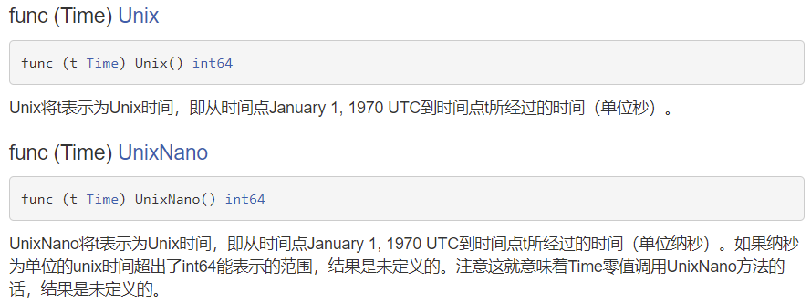
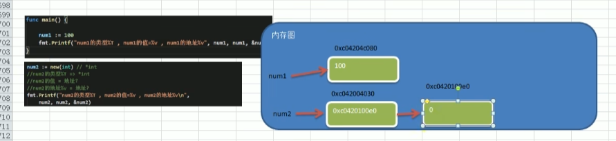

学习方向

1. 区块链研发工程师
2. Go服务器端/游戏软件工程师：数据处理，处理大并发
3. Golang分布式/云计算软件工程师

# 应用领域

1. 区块链
2. 后台服务：并发
3. 云计算：内容分发网络（CDN）

# 语言特点

1. 从C语言中继承了很多理念，包括表达式语法，控制结构，基础数据类型，调用参数传值，指针等等，也保留了和C语言一样的编译执行方式及弱化的指针

   ```go
   func testPtr(num *int){
       *num = 20
   }
   ```

2. 引入**包的概念**，用于组织程序结构，Go语言的一个文件都要归属于一个包，而不能单独存在。

   ```go
   package main//一个go文件需要在一个包
   ```

3. 垃圾回收机制，内存自动回收，不需开发人员管理

4. 天然并发（**重要**）

   - 从语言层面支持并发，实现简单
   - goroutine，轻量级线程，可实现大并发处理，高校利用多核。
   - 基于CPS并发模型(Communicating Sequential Processes)实现

5. 吸收了管道通信极值，形成Go语言特有的管道channel，通过管道channel，可以实现不同的goroutine之间的通信

6. 函数可以返回多个值。

   ```go
   func getSumAndSub(n1 int, n2 int)(int,int){
       sum := n1 + n2
       sub := n1 - n2
       return sum , sub
   }
   ```

7. 新的创新：比如切片slice、延时执行defer等


# windows下搭建Go开发环境-安装和配置SDK

https://studygolang.com/dl

## 配置环境变量

Path环境变量，SDK的安装目录，到bin文件夹为止

# Go语言快速开发入门


1. go文件的后缀是.go

2. package main

   表示该hello.go文件所在的包是main，在go中，每个文件都必须归属于一个包/

3. import "fmt"

   表示：引入一个包，包名fmt，引入该包后，就可以使用fmt包的函数，比如：fmt.Println

4. func是一个关键字，表示一个函数

   main 是函数名，是主函数，即我们程序的入口

5. fmt.Println("hello") 

   表示调用fmt包的函数Println输出"hello"

## 执行

- 用`go build`对该go文件进行编译，生成 `.exe` 文件

- 运行

## go build后运行和go run直接运行区别

go build编译时会把程序运行依赖的库文件含在可执行文件中，换到没有安装go开发环境的机器上仍然可以运行，但go run需要机器上有开发环境

## 编译和运行

-o 指定文件名

win: go build -o myhello.exe hello.go

## 开发注意事项

1. Go编译器是一行行进行编译的，因此一行就写一条语句，也没有分号区分(Go语言会再每行后自动加分号)，不能把多条语句写在同一行，否则会报错
2. go语言**定义的变量**或者**import的包**如果没有使用到，代码不能编译通过
3. 同一个文件夹内只能由一个包含`main()`函数的.go文件，且`main()`函数必须包含在main包里

## 转义字符

1. `\t`：制表符，实现对齐功能
2. `\n`：换行符
3. `\\`：一个\
4. `\"`：一个"
5. `\r`：一个回车：先输出前面的内容，然后把后面的内容从前再输出，会覆盖

## Golang开发常见问题和解决方法

1. 

2. 语法错误

## 注释

和c++一样

- 行注释：`//`
- 块注释：`/* */`。块注释里不能包含块注释

## 规范的代码风格

1. 推荐行注释

2. 正确的缩进和空白，shift+tab整体向左，tab整体向右

   gofmt -w hello.go，可以自动调整

3. 运算符两边习惯性加空格

4. 左大括号要跟在函数右边

5. 行长约定：一行最长不超过80个字符，超过的使用换行展示

## Go官方编程指南

https://golang.org/#

API：应用程序编程接口，就是Go的各个包的各个函数

https://studygolang.com/pkgdoc

---

# 变量

`var i int` 定义int型变量`i`

`i=10`定义

`fmt.Println("i=",i)`使用

## 使用注意事项

1. 变量使用的三种方式

   - 第一种：指定变量类型，声明后若不赋值，就是用默认值

     ```Go
     var i int
     fmt.Println("i=",i)
     //结果为0，int的默认值为0
     ```

   - 根据值自行判定变量类型（类型推导）

     ```Go
     var num = 10.11
     fmt.Println("num=",num)
     ```

   - 省略var，注意 `:=` 左侧的变量不应该是已经声明过的，否则会导致编译错误

     ```Go
     name := "tom"//等价于var name string  name = "tom"
     fmt.Println("name=",name)
     ```

2. 多变量声明

   ```Go
   var n1, n2, n3 int//方式1
   var n1, n2, n3=100, "tom",888//方式2，n1= 100 n2= tom n3= 888
   n1, n2, n3:=100, "tom",888//方式3,此方式不能声明全局变量
   //原因是此语句等于两句 var n3 int  + n3 = 100
   //而n3 = 100这样的语句不能在函数体外执行
   ```

3. 一次性声明多个全局变量

   ```Go
   var(		//局部变量也能这么声明
   	n1=10
   	n2 = 3
   	n3 ="bb"
   )
   ```

4. 变量数据类型不能改变

   ```Go
   var i int = 10
   i=20 //ok
   i=1.3 //error
   ```

5. 变量在同一个作用域内不能重名

6. int默认值0，小数默认值0，字符串默认空串

## 变量的数据类型


| 类型  | 有无符号 | 占用存储空间 |       表数范围        |
| :---: | :------: | :----------: | :-------------------: |
| int8  |    有    |    1字节     |     $-128\sim127$     |
| int16 |    有    |    2字节     | $-2^{15}\sim2^{15}-1$ |
| int32 |    有    |    4字节     | $-2^{31}\sim2^{31}-1$ |
| int64 |    有    |    8字节     | $-2^{63}\sim2^{63}-1$ |

|  类型  | 有无符号 | 占用存储空间 |    表数范围     |
| :----: | :------: | :----------: | :-------------: |
| uint8  |    无    |    1字节     |   $0\sim255$    |
| uint16 |    无    |    2字节     | $0\sim2^{16}-1$ |
| uint32 |    无    |    4字节     | $0\sim2^{32}-1$ |
| uint64 |    无    |    8字节     | $0\sim2^{64}-1$ |

| 类型 | 有无符号 |       占用存储空间       |                     表数范围                     |             备注             |
| :--: | :------: | :----------------------: | :----------------------------------------------: | :--------------------------: |
| int  |    有    | 32位4字节<br />64位8字节 | $-2^{31}\sim2^{31}-1$<br />$-2^{63}\sim2^{63}-1$ |                              |
| uint |    无    | 32位4字节<br />64位8字节 |       $0\sim2^{32}-1$<br />$0\sim2^{64}-1$       |                              |
| rune |    有    |       与int32一样        |              $-2^{31}\sim2^{31}-1$               | 表示中文字符<br />unicode码  |
| byte |    无    |       与unit8等价        |                    $0\sim255$                    | 当要存储字符时<br />选用byte |

## 整型的使用细节

1. Golang的整型默认声明为int型
2. 查看变量数据类型 `fmt.Printf("n1的类型%T",n1)`
3. 查看变量数据大小 `fmt.Printf("n1占用的字节数是%d",n1,unsafe.Sizeof(n1))`
4. 在保证程序正确运行下，尽量使用占用空间小的数据类型

## 小数

|     类型      | 占用存储空间 |         表数范围          |
| :-----------: | :----------: | :-----------------------: |
| 单精度float32 |    4字节     |  $-3.403E38\sim3.403E38$  |
| 双精度float64 |    8字节     | $-1.798E308\sim1.798E308$ |

1. 浮点数都是有符号位的。浮点数=符号位+指数位+尾数位
2. 尾数部分可能丢失，造成精度损失。
3. Golang的浮点类型默认是float64

## 字符类型

Go中没有专门的字符类型，一般用byte保存

传统的字符串是由字符组成的，而Go的字符串是由字节组成的

输出：

```Go
var c1 byte = 'a'
fmt.Printf("c1=%c",c1)//需要按照字符的方式输出时需要格式化输出fmt.Printf 和%c
```

注意：

1. Go语言的字符使用UTF-8编码，英文字母1个字节，汉字3个字节
2. 在Go中，字符的本质是一个整数，直接输出时，是该字符对应的UTF-8编码码值
3. 可以直接给某个变量赋一个整数，然后按格式化输出的%c，输出对应的unicode（UTF-8编码）字符
4. 字符类型可运算，相当于整数

## 布尔类型

1. 只允许取值true和false，不能存其他整数
2. 占1个字节

## 字符串类型

1. 字符串一旦赋值了，字符串就不能修改了，在Go中字符串是不可变的

2. 字符串的两种形式

   - 双引号，会识别转义字符

   - 反引号（`），以字符串的原生形式输出，包括换行和特殊字符，可以实现防止攻击、输出源代码等效果

     ```go
     var str1  string = "abc\ncba"
     fmt.Println(str1)
     
     var str2 string =`package main
     import (
     	"fmt" //引入一个包 fmt
     
     )
     `
     fmt.Println(str2)
     ```

3. 字符串的拼接方式

   ```go
   var str1  string = "hello "
   str2 := "world\n"
   str2+="haha"
   fmt.Println(str1+str2)
   ```

4. 当拼接太长要分行是，需要在行后留"+"（因为默认+";"，有"+"后就不会加了）

   ```go
   var str3 string ="hi" +
   "my" +"name"+"is"+
   "limei"
   fmt.Println(str3)
   ```

## 基本数据类型的默认值

```go
var a int //0
var b float32 //0
var isNum bool //false
var name string// ""
```

## 基本数据类型的转换

### 主要区别

**只能显示转换**，不能自动转换，不管是从高精度到低精度，还是从低精度到高精度

### 基本语法

```go
var i float64 = 100.00000874
var j   = float32(i)
fmt.Println(j)
var n1 int32 =932
var n2 int64 = int64(n1)
fmt.Println(n2)
```

### 细节说明

1. 被转换的是变量存储的数据，变量本身的数据类型没有变化（说白了只是传值）
2. 从大到小转换编译不会报错，但是转换的结果按照溢出处理（应该是直接按位转换）

```go
var n1 int32 = 12
var n3 int8
var n4 int8
n3 = int8(n1) + 127//编译通过，但是会溢出
n4 = int8(n1) + 128//编译不通过，因为128放不进去
```

## 基本数据类型和string的转换

方法1：`fmt.Sprintf("%参数",表达式)` 【推荐】

```go
var num1 int =99
var num2 float64= 23.456
var b bool = true
var myChar byte='h'
var str string
str=fmt.Sprintf("%d",num1)
fmt.Printf("str type is %T str=%q\n",str,str)//%q结果加""
str=fmt.Sprintf("%.2f",num2) //四射五入保留到小数点后2位
fmt.Printf("str type is %T str=%q\n",str,str)
str=fmt.Sprintf("%t",b)
fmt.Printf("str type is %T str=%q\n",str,str)
str=fmt.Sprintf("%c",myChar)
fmt.Printf("str type is %T str=%q\n",str,str)
```

方法2：strconv包

```go
import "strconv"

var num1 int =99
var num2 float64= 23.456
var b bool = true

var str string
str=strconv.FormatInt(int64(num1),10)//10代表转成十进制，且int需要是64位
fmt.Printf("str type is %T str=%q\n",str,str)
str=strconv.FormatFloat(num2 , 'f',10,64)//'f'表示输出格式，10表示小数位后保留10位，64表示小数是float64
fmt.Printf("str type is %T str=%q\n",str,str)
str=strconv.FormatBool(b)
fmt.Printf("str type is %T str=%q\n",str,str)
```

方法3：strconv包中的函数`Itoa` （int64要转换）

```Go
var num5 int = 4567; //int64
str := strconv.Itoa(num5)//int(num5)
fmt.Printf("str type is %T str=%q\n",str,str)
```

## string转基本数据类型

```go
var str string = "true"
var b bool
b , _= strconv.ParseBool(str)//ParseBool 返回两个值，第一个为bool，第二个为error。必须接收但可以用“_”忽略

var str2 string = "127"
var n1 int64
n1 , _= strconv.ParseInt(str2,10,64)//返回的是64位，所以必须用64位接收，但是ParseInt的参数可以是32或更小，精度会不同

var str3 string = "127.0020"
var f1 float64
f1 , _= strconv.ParseFloat(str3,64)//同上
```

> 在将string类型转成基本数据类型时，要确保string类型能够转成有效的数据。如果不能，Golang直接将其转成0。bool默认为false

## 指针

```go
var i int =10
var p *int = &i
```

## 值类型和引用类型

- 值类型：基本数据类型int系列，float，bool，string；数组和结构体struct
- 引用类型：指针，slice切片，map，管道chan，interface等

 区别：

值类型通常分配在栈上（存的是值）

引用类型**通常**分配在堆上（存的是地址，地址指向堆区）

## 标识符命名规则

所有可以命名的都是标识符

### 基本规则

1. 由26个字母大小写，0-9，_ 组成
2. 不能数字开头
3. 严格区分大小写
4. 不能由空格
5. “_” 本身就是特殊的标识符，不能单独使用。单独时作为占位符使用

### 注意事项

- 包名：保持package的名字和目录一致，尽量取简短且有意义的包名，不要和标准库冲突

- 变量、函数、常量名用驼峰法：`var stuName string`，首字母（第一个单词）小写，后面的首字母大写

- 如果变量名、函数名、常量名首字母大写，则可以被其他的包访问；如果首字母小写，则只能在本包中使用。可以简单理解成首字母大写公有，首字母小写私有。**注意**：Golang里没有public、private的关键字

  ```go
  //main
  package main
  import (
  	"go_code/project1/model"
  	"fmt" 
  )
  
  func main(){
  fmt.Println("helloName=",model.HelloName)
  }
  //pac.go
  package model
  var HelloName int = 91
  ```

---

# 运算符

## 算数运算符

- go里面没有三目运算符

- 自增自减只有后置，没有前置。且只能**独立使用**（单独一行），不能形如`b := a++`
- 取模运算可以等价为$a\%b=a-a/b*b$

## 关系运算符/逻辑运算符/赋值运算符

没什么特殊，赋值运算符也有`+= -=`等复合赋值

赋值运算符运算顺序从右往左，左边只能是变量，右边可以是变量、表达式、常量值

## 运算符优先级

没什么特殊，只有单目和赋值从右往左运算

1. 括号，`++，--，. ，->`
2. 单目运算符，`!，&，*`等
3. 算术运算符
4. 移位运算符
5. 关系运算符
6. 位运算符
7. 逻辑运算符
8. 赋值运算符
9. 逗号

# 输入语句

`fmt.Scanln` 。在换行时停止

```go
	var name string
	var age byte
	var sal float32
	var isPass bool

	fmt.Println("请输入姓名 ")
	fmt.Scanln(&name)//注意取地址符号

	fmt.Println("请输入年龄 ")
	fmt.Scanln(&age)

	fmt.Println("请输入薪水 ")
	fmt.Scanln(&sal)
	
	fmt.Println("请输入是否通过考试 ")
	fmt.Scanln(&isPass)

	fmt.Println(name , age, sal, isPass)
```

`fmt.Scanf` 。在空格停止

```go
	fmt.Println("请输入姓名 年龄 薪水 是否通过考试，用空格隔开 ")
	fmt.Scanf("%s %d %f %t",&name , &age, &sal, &isPass)

	fmt.Printf(" 名字是%v \n 年龄是%v \n 薪水是%v \n 是否通过考试%v \n",name,age,sal,isPass)
```

注意：变量前需要取地址符号

# 进制输入输出

输入：八进制“0”开头，十六进制“0x开头”

输出：%b 二进制

# 原码、反码、补码

1. 正数的原码、反码、补码都一样

2. 负数的反码=原码符号位不变，其他位取反

   1 ==>原码[00000001]反码[00000001]补码[00000001]

   -1==>原码[10000001]反码[11111110]补码[11111111]

3. 负数的补码=反码+1

4. 0的反码补码都是0

5. 运算时，都是用补码的方式来运算

# 流程控制

## 顺序控制

程序从上到下逐行地执行，中间没有任何判断和跳转

### 注意事项

Golang中定义变量时采用合法地前向引用：先声明再用

## 分支控制

### 单分支

```go
if 条件表达式{//条件表达式也可以加()但不推荐
    执行代码块
}
```

> 注意：`{}`必须有，即使代码只有一行。与c++不同

```go
var age int
fmt.Scanln(&age)
if age>=18{
	fmt.Println("成年了")
}else {
	fmt.Println("没成年")
}
```

#### 特殊写法

golang支持在if中，直接定义一个变量（只能一个变量），如下

```go
if age :=20; age>=18{
	fmt.Println("成年了")
}
```

### 双分支

```go
if 条件表达式{
    执行代码块
} else {     //这个else不能写在下一行
  	执行代码块2  
}
```

> 注意：else不能换行

### 多分支

```go
if 条件表达式{
    执行代码块
} else if 条件表达式2{
    执行代码块2
} 
  ...
  else {     //这个else不能写在下一行
  	执行代码块3  
}
```

至多执行一个分支

### 注意事项总结

1. 条件表达式也可以加()但不推荐

2. `{}`必须有，即使代码只有一行。与c++不同

3. else不能换行

4. 条件表达式不能是别的表达式(如赋值表达式)，否则编译不通过，与c++不同

   ```go
   var b bool =true
   if b=false{  //b
       执行代码块
   } 
   ```


### 嵌套分支

建议最多三层

### switch

匹配项后面**不需要加break**，默认会有

case可以有多个表达式，用`,`隔开

```go
switch 表达式 {
    case 表达式1,表达式2,...:
    	语句块
    case 表达式3,表达式4,...:
    	语句块
    default:
    	语句块
}
```

示例

```go
	var key byte
	fmt.Scanf("%c",&key)
	switch key {
	case 'a':
		fmt.Println("day1")
	case 'b':
		fmt.Println("day2")
	case 'c':
		fmt.Println("day3")
	default:
		fmt.Println("input error")
	}
```

#### 使用细节

1. case/switch后是一个表达式（即：常量值、变量、一个有返回值的函数等都可以）

2. case表达式的数据类型要和switch保持一致，否则编译出错

   ```go
   	var key byte
   	fmt.Scanf("%c",&key)
   	switch float32(key) {
   	case float64('a'):
   		fmt.Println("day1")
       default:
   		fmt.Println("input error")
   ```

   `invalid case float64('a') in switch on float32(key) (mismatched types float64 and float32)`

3. case后面可以带多个表达式，使用逗号间隔：`case 'a','d':`

4. case后表达式如果是个**常量(字面量)**，则要求不能重复，如果是变量，则编译能通过

5. case后面不需要带break，带了编译也能过

6. default语句不是必须

7. switch后也可以不带表达式，类似if-else来使用。其实就是默认switch后是true，case后需要跟条件判断

   ```go
   	var key int
   	fmt.Scanf("%d",&key)
   	switch  {
   	case key==10:
   		fmt.Println("day1")
   		break
   	case key>10:
   		fmt.Println("day2")
   	case key<10:
   		fmt.Println("day3")
   	}
   ```

8. switch后也可以直接声明/定义一个变量，分号结束，不推荐。

   ```go
   switch  key:=10; {
   	case key>10:
   		fmt.Println("day1")
   	case key<10:
   		fmt.Println("day2")
   	case key==10:
   		fmt.Println("day3")
   	default:
   		fmt.Println("day99")
   	}
   ```

9. switch穿透：`fallthrough`，如果在case语句块后增加`fallthrough`，则会继续执行下一个case，也叫switch穿透。只能穿透一层

   ```go
   	key:=90;
   	switch  key {
   	case 90:
   		fmt.Println("day1")
   		key++
   		fallthrough
   	case 91:
   		fmt.Println(key)
   	case 92:
   		fmt.Println("day3")
   		fallthrough
   	default:
   		fmt.Println(key)
   	}
   ```

   结果：

   ```
   day1
   91
   ```

10. Type Switch：switch语句还可以被用于type-switch来判断某个interface变量中实际指向的变量类型

    ```go
    func test(int ) float32{
    	return 1.0
    }
    func main(){
    	var x interface{}
    
    	x = test
    	switch i := x.(type){
    	case nil:
    		fmt.Printf("x的类型：%T",i)
    	case int:
    		fmt.Printf("x是int型")
    	case float64:
    		fmt.Printf("x是float64")
    	case func(int) float64:
    		fmt.Printf("x是func(int)")
    	case bool,string:
    		fmt.Printf("x是bool或者string")
    	default:
    		fmt.Printf("未知")
    	}
    }
    ```

    

## 循环控制

### for

```go
for i:=1;i<=10;i++{
	fmt.Println(i)
}
```

#### 注意事项

1. 循环条件是返回bool的表达式

2. 第二种表达方式：初始化和迭加写在别处，而不用加`;`。但是如果写了三者中的两个，则必须补满`;`

   ```go
   i:=1
   for i<=10{
   	fmt.Println(i)
   	i++
   }
   ```

3. 啥都不加相当于`for(;;)`死循环

   ```go
   for {//也可以for ;;
   		fmt.Println(i)
   		break
   	}
   ```

4. for-range方式，方便字符串和数组的遍历

   ```go
   	var str string = "hello, world!"
   //index也可以置空 _ ，应该是表示不在乎，但必须要有个这个位置
   	for index, val:=range str{
   		fmt.Printf("index=%d, val=%c\n",index,val)
   	}
   ```

   这种方式即使字符串里存有中文字（不同编码方式），也可以正常输出（但是index会按照字符大小进行增加，汉字3字节），普通方式不行。

   ```go
   index=0, val=h
   index=1, val=e
   index=2, val=l
   index=3, val=l
   index=4, val=o
   index=5, val=!
   index=6, val=北 //注意顺序变了
   index=9, val=京 
   ```

   普通方法需要用切片`[]rune`，如下

   ```go
   	var str string = "hello, world!北京"
   	str2 := []rune(str)
   	for i:=0;i<len(str2);i++{
   		fmt.Printf("%c \n",str2[i])
   	}
   ```

### while和do...while

Go语言没有while和do...while！需要用for实现效果

### break

```go
count:=0
for{
    //time.Now().Unix() 返回一个从1970:01:01到现在的秒数
	rand.Seed(time.Now().Unix())//UnixNano()纳秒更随机
	n:=rand.Intn(100)+1
	count++
	if(n==99){
		break
	}
}
fmt.Println(count)
```

#### 注意事项

1. break语句出现在多层嵌套语句块中时，可以通过标签指明要终止到哪一层语句块

   ```go
   lable1:
   for i:=0;i<4;i++ {	
   	for j:=0;j<10;j++ {
   		if j==2 {
   			break lable1
   		}
   		fmt.Println(j)
   	}
   }
   
   ```

### continue

### goto

尽量避免使用goto

1. 可以无条件转移到程序指定行
2. 通常与条件语句配合

```go
n:=30
fmt.Println("ok1")
fmt.Println("ok2")
if n>20{
	goto lable1
}
fmt.Println("ok3")
fmt.Println("ok4")
fmt.Println("ok5")
lable1:
fmt.Println("ok6")
fmt.Println("ok7")
fmt.Println("ok8")
```

# 函数

基本语法

```go
func 函数名 (形参列表) (返回值列表) {
    执行语句...
    return 返回值列表
}
```

1. 函数可以有返回值，也可以没有

## 包的引入

包的本质实际上就是创建不同的**文件夹**，来存放程序文件

go的每一个文件都是属于一个包的，也就是说go是以包的形式来管理文件和项目目录结构的

### 包的作用

1. 区分相同名字的函数、变量等标识符
2. 当程序文件很多时，可以很好的管理项目
3. 控制函数、变量等访问范围，即作用域

### 包的基本语法

打包：`package 包名`

引入包：`import "包的路径"`

示例：

```go
//main.go
package main
import(
	"fmt"
	"go_code/project2/utils"
)
func main(){
	var n1 float64 =1.2
	var n2 float64 =3.2
	var operator byte ='-'
	res :=utils.Cal(n1,n2,operator) 
	fmt.Printf("res=%T, res=%f",res,res)
}
//utils.go
package utils
import(
	"fmt"
)

func Cal(n1 float64, n2 float64, operator byte) (float64){  //Cal要大写
	var res float64
	switch operator{
	case '+': 
		res=n1+n2
	case '-': 
		res=n1-n2
	case '*': 
		res=n1*n2
	case '/':
		res=n1/n2
	default : 
		fmt.Println("操作符错误")
	}
	return res
}

```

- 由于go是以包的形式来管理文件和项目目录结构的，则一个包就是一个文件夹，因此go的每个文件都要属于一个文件夹（包）
- 包的路径：环境变量`${GOPATH}/src`开始，到包的**文件夹**

### 包的注意事项

1. 在给一个文件打包时，该包对应一个文件夹。比如utils文件夹对应的包名就是utils，文件的包名**通常**和文件所在的文件夹名一致，一般为小写字母。

2. 当一个文件要使用其他包函数或变量时，需要先引入对应的包

   1. package在第一行，然后是import
   2. 在import包时，路径从$GOPATH的src下开始，不用带src，编译器会自动从src下开始引入

3. 为了让其他包的文件，可以访问到本包的函数，则该函数名的首字母需要大写，类似其他语言的public，这样才能跨包访问。

4. 在访问其他包函数时，语法是`包名.函数名`

5. 如果包名较长，Go支持给包去别名，取别名后，原来的包名就不能使用了

   ```go
   import(
   	"fmt"
   	test_pac "go_code/project2/utils"
   )
   func main(){
   	var n1 float64 =1.2
   	var n2 float64 =3.2
   	var operator byte ='-'
   	res :=test_pac.Cal(n1,n2,operator) 
   	fmt.Printf("res=%T, res=%.2f",res,res)
   }
   ```

6. 在同一个包下，不能有相同的函数名，否则报重复定义

7. 如果要编译成一个可执行文件，就需要将这个包声明为main，即package main。这个就是一个语法规范

   编译时需要编译main包所在的文件夹

   编译后生成一个有默认名的可执行文件，在$GOPATH目录下，可以指定名字和目录，比如：放在bin目录下：`go build -o bin/my.exe go_code/project/main`。（路径默认带src）

8. 编译完后会生成一个和src同级的文件夹pkg，里面包含一个.a的库文件

### return语句

1. 如果返回多个值时，在接收时，希望忽略某个返回值，则使用`_`符号表示占位忽略
2. 如果返回值只有一个，(返回值类型列表)可以不写()

### 函数注意事项和细节

1. 函数的形参列表可以是多个，返回值列表也可以是多个

2. 形参列表和返回值列表的数据类型可以是值类型和引用类型。

3. 函数的命名遵循标识符命名规范，首字母不能是数字，首字母大写该函数可以被本包文件和其他包文件使用，类似public，首字母小写，只能被本包文件使用，其他包文件不能使用，类似private

4. 函数中的变量是局部的，函数外不生效

5. 基本数据类型和数组默认都是值传递，即进行值拷贝。在函数内修改，不会影响到原来的值

6. 如果希望函数内的变量能修改函数外的变量，可以传入变量的地址&，函数内以指针的方式操作变量。从效果上看类似引用

7. **Go函数不支持重载！**

8. 在Go中，函数也是一种数据类型，可以赋值给一个变量，则该变量就是一个函数类型的变量了。通过该变量可以对函数调用。

   ```go
   func getSum(n1 int, n2 int) int {
   	return n1 + n2
   }
   func main(){
   	a := getSum
   	fmt.Printf("a的类型%T,getSum类型是%T\n",a,getSum)
   
   	res := a(10,40)//等价于 res:= getSum(10,40)
   	fmt.Println("res=",res)
   }
   ```

9. 函数既然是一种数据类型，因此在Go中，函数可以作为形参，并且调用

   ```go
   func getSum_Sub(n1 int, n2 int) (sum int, sub int) {
   	sum =n1 + n2
   	sub =n1 - n2
   	return 
   }
   func myFun(funvar func(int,int) (int,int), num1 int, num2 int) (int , int ){
   	return funvar(num1, num2)
   }
   func main(){
   	a := getSum_Sub
   	fmt.Printf("a的类型%T,getSum类型是%T\n",a,getSum_Sub)
   
   	res,_ := a(10,40)//等价于 res:= getSum(10,40)
   	fmt.Println("res=",res)
   
   	b:=myFun
   	fmt.Printf("b的类型%T,myFun类型是%T\n",b,myFun)
   
   	sum,sub:=b(getSum_Sub,50,20)
   	fmt.Println("sum=",sum,"sub=",sub)
   }
   ```

10. 为了简化数据类型定义，Go支持自定义数据类型

    基本语法：`type 自定义数据类型名 数据类型`  （相当于一个别名，相当于typename）。但是Go语言会认为这两个是不同类型

    ```go
    //自定义变量类型
    type myInt int
    var num1 myInt
    vat num2 int
    num1 =40
    num2= int(num1)//需要显示转换成int，因为Go认为两个是不同类型
    //自定义函数类型
    func getSum_Sub(n1 int, n2 int) (sum int, sub int) {
    	sum =n1 + n2
    	sub =n1 - n2
    	return 
    }
    
    type mySum func(int,int)(int,int)
    
    func myFun(funvar mySum, num1 int, num2 int) (int , int ){
    	return funvar(num1, num2)
    }
    ```

11. 支持对函数返回值命名

    ```go
    func cal(n1 int,n2 int)(sum int, sub int){
    	sum = n1 + n2
        sub = n1 - n2
        return
    }
    ```

12. 使用`_`标识符，忽略返回值

13. Go中支持可变参数

    ```go
    //支持0到多个参数
    func sum(args... int) (sum int){
        
    }
    //支持1到多个参数
    func sum(n1 int, args... int) (sum int){
        
    }
    ```

    1. args是slice切片，通过args[index] 可以访问到各个值。
    2. 如果一个函数的形参列表中有可变参数，则可变参数需要放在形参列表最后

    ```go
    func sum_test(n1 int, args... int) (sum int) {
    	sum =n1
    	//遍历args
    	for i:=0;i<len(args);i++ {
    		sum += args[i] //args[0]表示取出args切片的第一个元素值，其他依此类推
    	}
    	return 
    }
    func main(){
        res2:= sum_test(10)
    	fmt.Println("res2=",res2)
    
    	res3 := sum_test(1,2,3,4,5)
    	fmt.Println("res3=",res3)
    }
    ```

    

## init函数

每一个源文件都可以包含一个init函数，该函数会在main函数执行前，被Go运行框架调用，也就是说init会在main函数前被调用。

通常可以在init函数中，完成初始化工作

### 注意事项和细节

1. 如果一个文件同时包含全局变量定义，init函数和main函数，则执行的流程是变量定义->init函数->main函数
2. init函数最主要的作用，就是完成一些初始化工作。可以在引入包中进行初始化，这样main执行时，**先执行包的初始化**

如果main.go和utils.go都含有变量定义，init函数时，执行流程如下：


## 匿名函数

Go支持匿名函数，如果某个函数只是希望使用一次，可以考虑使用匿名函数，匿名函数也可以实现多次调用。

### 使用方式

1. 在定义匿名函数时直接使用

   ```go
   func main(){
   	res1 := func (n1 int,n2 int) int {
   		return n1+n2
       }(10,20)  //定义到}为止，后面(10,20)直接调用
   
   	fmt.Println("res1=",res1)
   }
   ```

   

2. 将匿名函数赋给一个变量（函数变量），再通过该变量来调用匿名函数

   ```go
   	a := func (n1 int,n2 int) int {
   		return n1+n2
   	}
   	res1:=a(1,2)
   	fmt.Println("res1=",res1)
   ```

3. 全局匿名函数

   如果将匿名函数赋值给一个全局变量，那么这个匿名函数，就称为一个全局匿名函数，可以在程序有效

   
   
   

## 闭包

基本介绍：闭包就是一个函数和与其相关的引用环境组合的一个整体（实体）

```go
//累加器
func AddUpper() func(int) int {
	var n int =10
	return func(x int) int{
		n+=x
		return n
	}
}

func main(){
	a:=AddUpper()
	var res int
	res=a(1)
	fmt.Println("res=",res)
	res=a(2)
	fmt.Println("res=",res)
}
```

上面代码说明：

1. `AddUpper`是一个函数，返回的数据类型是`func(int) int`

2. 闭包说明

   ```go
   var n int =10
   return func(x int) int{
   	n+=x
   	return n
   }
   ```

   `AddUpper`返回的是一个匿名函数，但是这个匿名函数引用到函数外的`n`。因此这个匿名函数就和n形成一个整体，构成闭包。

3. 可以理解为：闭包是类，函数是操作，`n`是字段。函数和它使用到的`n`构成闭包

4. 当我们反复的调用f函数时，因为`n`初始化一次，因此每次调用`n`都会进行累加

5. 要搞清楚闭包的关键，就是要分析出返回的函数使用到哪些变量。因为函数和它引用道德变量共同构成闭包

> Go语言能通过escape analyze识别出变量的作用域，自动将变量在堆上分配。

```go
//由于n1没有形成闭包，因此会在栈上创建，而n在堆上
func AddUpper() func(int) int {
	var n int =10
	var n1 int =20
	return func(x int) int{
		n+=x
		fmt.Println("n=",n,"n1=",n1)
		return n
	}
}
a:=AddUpper()//这里不能省略这个()，类似于类的构造函数。称作返回一个闭包
	res=a(1)
	fmt.Println("res=",res)//n= 11 n1= 20 res= 11
	res=a(1)
	fmt.Println("res=",res)//n= 12 n1= 20 res= 12
```

示例：

```go
func makeSuffix(suffix string) func (string) string{
	return func (name string) string {
		//如果name没有指定后缀，则加上，否则就返回原来的名字
		if !strings.HasSuffix(name ,suffix){
			return name + suffix
		}
		return name

	}
}


func main(){
	f:=makeSuffix(".jpg")
	fmt.Println("output:",f("a.jpg"))
	fmt.Println("output:",f("b"))
}
```

传统函数虽然也能实现，但是每次都需要重新传入后缀名。用闭包可以向类一样确定好就不用再写了

## defer

在函数中，程序员经常需要创建资源（比如：数据库连接、文件句柄、锁等），为了在函数执行完毕后，及时释放资源，Go的设计者提供defer（延时机制）

```go
func sum (n1 int,n2 int) int{
	//当执行到defer时，暂时不执行，会将defer后面的语句压入到独立的栈（defer栈）
	//当函数执行完毕后，再从defer栈，按照先入后出的方式出栈，执行
	defer fmt.Println("ok1 n1=",n1)
	defer fmt.Println("ok2 n2=",n2)
    n1++
	n2++
	res := n1 +n2
	fmt.Println("ok3 res=",res)
	return res
}

func main(){
	res := sum(10,20)
	fmt.Println("res=",res)
}
```

结果：

```go
ok3 res= 32
ok2 n2= 20
ok1 n1= 10
res= 32
```

### defer的细节说明

1. 当执行到defer时，暂时不执行，会将defer后面的语句压入到独立的栈，然后继续执行函数下一个语句。
2. 当函数执行完毕后，再从defer栈中，依次从栈顶取出语句执行（遵从先入后出）
3. 在defer将语句放入到栈时，也会将相关的值拷贝同时入栈

### 主要价值

defer最主要的价值在于，当函数执行完毕后，可以及时的释放函数创建的资源。

```go
func test(){
	file = openfile("xxx")
	defer file.close()
}
```

## 参数传递方式

- 值传递：复制变量
- 引用传递：相当于C++的地址传递，复制地址

## 变量作用域

和c++差不多

注意：

```go
var Age int =20//ok
Name := "tom" // 报错：相当于 var Name string  Name = "tom"。赋值语句不能在函数体外执行
func main(){
    fmt.Println("name",Name)
}
```

可以在函数体外进行全局变量定义及初始化，但是不能赋值

```go
var Age int =20//ok
var Name string //ok

//不能赋值
Name = "tom"//不行
Test:= "tom"//同样不行
```

## 字符串常用的系统函数

1. 统计字符串的长度，按字节`len(str)`。中文字符3字节，比如`hello北`，输出为8

2. 字符串遍历，同时处理有中文的问题 `r:=[]rune(str)`

3. 字符串转整数：`n,err := strconv.Atoi("12")`

   ```go
   n,err := strconv.Atoi("123")
   if err!= nil {
       fmt.Println("转换错误",err)
   }else {
       fmt.Println("转成的结果是",n)
   }
   ```

   

4. 整数转字符串：`str = strconv.Itoa(12345)`

5. 字符串转`[]byte`

   ```go
   var bytes = []byte("hello go")
   fmt.Printf("bytes=%v\n",bytes)
   ```

6. `[]byte`转字符串

   ```go
   str = string([]byte{97,98,99})//对应结果为abc（对应ascii码）
   ```

7. 10进制转2，8，16进制（字符串）：

   ```go
   str := strconv.FormatInt(123,2)
   fmt.Printf("123对应的二进制是=%v\n",str)
   str = strconv.FormatInt(123,16)
   fmt.Printf("123对应的16进制是=%v\n",str)
   ```

8. 查找子串是否在指定的字符串中，返回`bool`

   ```go
   b:=strings.Contains("seafood","foo")
   fmt.Printf("是否含有=%v\n",b)
   ```

9. 统计一个字符串有几个指定的子串：

   ```go
   num := strings.Count("ceheEs","e")
   fmt.Printf("num=%v",num)//结果：2
   ```

10. 不区分大小写的字符串比较（==是区分字母大小写的）

    ```go
    b = strings.EqualFold("abc","Abc")
    fmt.Printf("b=%v\n",b)//true
    ```

11. 返回子串在字符串第一次出现的index值，如果没有，返回`-1`

    ```go
    index := strings.Index("NLT_abc","abc")
    fmt.Printf("index=%v\n",index)//4
    ```

12. 返回子串在字符串最后一次出现的index，如没有，返回`-1`

    ```go
    index := strings.LastIndex("go golang","go")
    fmt.Printf("lasindex=%v\n",index)//3
    ```

13. 将指定的子串替换成另外一个子串：`func Replace(s, old, new string, n int) string`    （`n`可以指定你希望替换几个，如果`n=-1`表示全部替换）

    ```go
    str := strings.Replace("go golang","go","北京",-1)//返回一个新串
    fmt.Printf("str=%v\n",str)
    ```

14. 按照指定的某个字符(如`,`)为分割标识，将一个字符串拆分成字符串数组

    ```go
    strArr := strings.Split("hello,world,ok",",")
    fmt.Printf("strArr=%v\n",strArr)
    ```

15. 将字符串的字母进行大小写转换：

    ```go
    str="Hello goLang"
    str=strings.ToLower(str)//转小写，ToUpper转大写
    fmt.Printf("str=%v\n",str)//hello golang
    ```

16. 将字符串左右两边的空格去掉：

    ```go
    str=strings.TrimSpace("    Hello goLang         ")
    fmt.Printf("str=%q\n",str)//%q 会加上双引号："Hello goLang"
    ```

17. 将字符串左右两边指定的字符去掉：

    ```go
    str=strings.Trim("!   ! Hello goLang!  !!"," !")
    fmt.Printf("str=%q\n",str)
    ```

18. 去掉左边（或右边）：`strings.TrimLeft`（`strings.TrimRight`）

19. 判断字符串是否以指定的字符串开头：

    ```go
    b=strings.HasPrefix("ftp://192.168.10.1","ftp")
    fmt.Printf("b=%v\n",b)
    ```

20. 判断字符串是否以指定的字符串结束：`strings.HasSuffix`

## 时间和日期相关函数

1. 需要导入`time`包

2. `time.Time`类型，用来表示时间

   ```go
   now := time.Now()//获取当前时间
   fmt.Printf("Now: %v,类型%T",now,now)
   //Now: 2022-08-03 15:47:48.2543597 +0800 CST m=+0.003611801,类型time.Time
   ```

3. 如何获取到其他日期信息

   ```go
   //通过now可以获取到年月日，时分秒
   fmt.Printf("年: %v\n",now.Year())		//年: 2022
   fmt.Printf("月: %v\n",now.Month())		//月: August	
   fmt.Printf("月: %v\n",int(now.Month()))	//月: 8
   fmt.Printf("日: %v\n",now.Day())			//日: 3
   fmt.Printf("时: %v\n",now.Hour())		//时: 15
   fmt.Printf("分: %v\n",now.Minute())		//分: 53
   fmt.Printf("秒: %v\n",now.Second())		//秒: 0
   ```

4. 格式化日期时间

   方式1：就是使用Printf或者Sprintf

   ```go
   fmt.Printf("当前年月日 %d-%d-%d  %d:%d:%d\n",now.Year(),now.Month(),now.Day(),
   now.Hour(),now.Minute(),now.Second())
   
   dateStr:= fmt.Sprintf("当前年月日 %d-%d-%d  %d:%d:%d",now.Year(),now.Month(),now.Day(),
   now.Hour(),now.Minute(),now.Second())
   fmt.Println(dateStr)
   //当前年月日 2022-8-3  15:58:19
   //当前年月日 2022-8-3  15:58:19
   ```

   方式2：`fmt.Printf(now.Format("2006/01/02 15:04:05"))`

   这个时间是固定的（间隔符可以改变），**必须这么写**。但是可以自由组合，只显示日期，或者时间

   ```go
   fmt.Printf(now.Format("2006/01/02 15:04:05"))
   fmt.Println()
   fmt.Printf(now.Format("2006-01-02"))
   fmt.Println()
   fmt.Printf(now.Format("15 04 05"))
   fmt.Println()
   /*
   2022/08/03 16:02:19
   2022-08-03
   16 02 19
   */
   ```

5. 时间的常量

   定义在time包中

   ```go
   const (
       Nanosecond  Duration = 1//纳秒
       Microsecond          = 1000 * Nanosecond//微秒
       Millisecond          = 1000 * Microsecond//毫秒
       Second               = 1000 * Millisecond//秒
       Minute               = 60 * Second//分钟
       Hour                 = 60 * Minute//小时
   )
   //使用
   100*time.Millisecond
   ```

6. 结合使用`sleep()`使用常量

   ```go
   i:=0
   for {
   	i++
   	fmt.Println(i)
   	//休眠
   	time.Sleep(time.Millisecond*20)//只能乘以大于1的整数，不能小于或者除
       if i==10{
           break
       }
   }
   ```

7. Unix时间戳和Unixnano时间戳（作用是可以获取随机数字）

   下面的形式叫方法，与函数有一些区别

   

   ```go
   fmt.Printf("Unix:%v,UnixNano:%v\n",now.Unix(),now.UnixNano())
   //Unix:1659514601,UnixNano:1659514601927962800
   ```

8. 获取间隔秒数

   ```go
   start := time.Now().Unix()
   test()
   end:= time.Now().Unix()
   fmt.Printf("执行test()耗费的时间为%v秒",end-start)
   ```

## 内置函数

1. len

2. new：用来分配内存，主要用来分配值类型，如`int`,`float64`，返回指针

   ```go
   num1 :=100
   fmt.Printf("num1的类型%T, 值=%v, 地址 %v\n",num1,num1,&num1)
   
   num2 := new(int)
   *num2 =200
   fmt.Printf("num2的类型%T, 值=%v, 地址 %v ,存的值=%v\n",num2,num2,&num2,*num2)
   /*
   num1的类型int, 值=100, 地址 0xc000014088
   num2的类型*int, 值=0xc0000140c0, 地址 0xc000006030  存的值=200    //因为是指针，所以值是地址
   */
   ```

   

3. make：用来分配内存，主要用来分配引用类型，比如`channel`、`map`、`slice`。

## 错误处理机制

1. 在默认情况下，当发生错误后（panic），程序就会退出
2. 如果希望发生错误时，可以捕获到错误，并进行处理，保证程序可以继续执行。还可以在捕获到错误后，给管理员一个提示

### 基本说明

1. 不支持`try...catch...finally`
2. Go处理方式：`defer`,`panic`,`recover`
3. Go中可以抛出一个`panic`的异常，然后在`defer`中通过`recover`捕获这个异常，然后正常处理

```go
package main
import(
	"fmt"
	"time"
)

func test(){
	//使用defer + recover 来捕获和处理异常
	defer func(x int){
		err := recover() //recover()内置函数，可以捕获到异常
		if  err != nil { //说明捕获到错误
			fmt.Println("err=",err,x)
			//这里就可以将错误信息发送给管理员...
			fmt.Println("发送给管理员")
		}
	}(1)//匿名函数调用加个()就行，因为此函数不用参数，如果有参数就填入参数
	num1 :=10
	num2 :=0
	res := num1/num2
	fmt.Println("res=",res)
}
func main(){
	for{
		test()
		fmt.Println("main()下面的代码...")
		time.Sleep(time.Second)
	}
}
```

### 自定义错误

Go程序中，也支持自定义错误，使用erroes.New和panic内置函数

1. errors.New("错误说明")。会返回一个error类型的值，表示一个错误
2. panic内置函数。接收一个interface()类型的值（也就是任何值）作为参数。可以接收error类型的变量，输出错误信息，并退出程序

```go
func readConf(name string) (err error){
	if name == "config.ini"{
		//读取...
		return nil
	} else {
		//返回一个自定义错误
		return errors.New("读取文件错误")
	}
}


func test02(){
	err := readConf("config2.ini")
	if err != nil {
		//如果读取文件发生错误，就输出这个错误，并终止程序
		panic(err)
	}
	fmt.Println("test02继续执行....")
}
func main(){
	test02()
	fmt.Println("main()下面的代码...")
}
```

---

# 数组

```go
var intArr [3] int
fmt.Println(intArr)
fmt.Printf("intArr的地址=%p intArr[0]的地址=%p intArr[1]的地址=%p",
	&intArr, &intArr[0], &intArr[1])
//intArr的地址=0xc000012198 intArr[0]的地址=0xc000012198 intArr[1]的地址=0xc0000121a0
//1与0相差8字节，所以地址差8，地址按照字节数递增
```

1. 数组的地址可以同过 `&数组名` 方式获取（与c++不同的是，c++的数组名本身就是指向数组头地址的指针）
2. 数组的第一个元素的地址，就是数组的首地址
3. 数组的各个元素的地址间隔是依据数组的类型决定（int32->4， int64->8）

## 四种初始化数组的方式

```go
var numArr01 [3] int = [3] int{1,2,3}
fmt.Println("numArr01=",numArr01)//numArr01= [1 2 3]

var numArr02  = [3] int{5,6,7}
fmt.Println("numArr01=",numArr02)//numArr01= [5 6 7]

var numArr03  = [...] int{8,9,10}//自行推导。注意：...是规定写法，不能改
fmt.Println("numArr01=",numArr03)//numArr01= [8 9 10]

numArr04 := [...] int{1:800, 0:900,2:999}//指定下标的初始化方法，
fmt.Println("numArr01=",numArr04)//numArr01= [900 800 999]
```

## 数组的遍历

方式1：常规遍历

方式2：`for-range`结构遍历

```go
for index,value := range array01{
    ...
}
```

说明：

1. 第一个返回值index是数组的下标
2. 第二个`value`是在该下标位置的值
3. 他们都是仅在for循环内部可见的局部变量
4. 遍历数组元素的时候，如果不想使用下标`index`，可以直接把下标`index`标为下划线`_`
5. `index`和`value`的名称不是固定的，即程序员可以自行指定，一般命名为`index`和`value`

```go
for i,v  := range heroes {
	fmt.Printf("i=%v,v=%v\n",i,v)
}
for _,v  := range heroes {
	fmt.Printf("元素的值=%v\n",v)
}
```

## 数组使用注意事项和细节

1. 数组是多个相同类型数据的组合，一个数组一旦声明/定义了，其长度是固定的，不能动态变化。

2. `var arr []int` 这时`arr`就是一个slice切片

3. 数组中的元素可以是任何数据类型，包括值类型和引用类型，但是不能混用。

4. 数组创建后，如果没有赋值，有默认值

5. 使用数组的步骤1. 声明数组并开辟空间 2. 给数组各个元素赋值 3. 使用数组

6. 数组下标从0开始

7. 数组下标必须在指定范围内使用，否则报panic：数组越界。

8. Go的数组属于值类型，在默认情况下是值传递，因此会进行值拷贝。数组间不会相互影响。

9. 如想在其它函数中，去修改原来的数组，可以使用引用传递（指针方式）

   ```go
   func test02(arr *[3]int){
       (*arr)[0] = 88 //不能直接*arr
   }
   ```

10. 长度是**数组类型的一部分**，在传递函数参数时，需要考虑数组的长度。

    ```go
    func modify(arr []int){
        arr[0]=100 //出错，因为[]int是切片类型，[3]int才是数组。
    }
    ```

## 数组的复杂应用——反转

```go
for i:=0;i<len(heroes)/2;i++ {
	temp:=heroes[len(heroes)-1-i]
	heroes[len(heroes)-1-i]=heroes[i]
	heroes[i]=temp
}
```

# 切片

动态数组，但和数组有些区别

## 基本介绍

1. 切片是数组的一个引用，因此切片是引用类型，在进行传递时，遵守引用传递的机制
2. 切片的使用和数组类似，遍历切片、访问切片的元素和求切片长度len(slice)都一样
3. 切片的长度是可以变化的，因此切片是一个可以动态变化的数组

## 基本语法

```go
//var 切片名 []类型
var a []int
```

演示：

```go
//演示切片的基本使用
var intArr [13] int= [...]int{1,22,33,66,99,100,1293,20403,20301,2223,403,1,30}
//声明/定义一个切片
sl:= intArr[1:3]// sl引用到intArr这个数组下标[1,3)的值

fmt.Println("intArr=",intArr)
fmt.Println("slice 的元素是 =",sl)
fmt.Println("slice 的元素个数 =",len(sl))
fmt.Println("slice 的容量 =",cap(sl))//切片的容量是可以动态变化的 
/*
intArr= [1 22 33 66 99 100 1293 20403 20301 2223 403 1 30]
slice 的元素是 = [22 33]
slice 的元素个数 = 2
slice 的容量 = 12//这个数量应该是从起始位置到原数组尾部的容量
*/
```

有点类似vector定义，但vector默认是两倍增长，除了同样有size 和capcity的函数外别的又有点区别

## 切片在内存中形式


```go
fmt.Printf("slice的地址=%p,slice[0]的地址=%p,intArr[1]的地址=%p",&slice,&slice[0],&intArr[1])
//slice的地址=0xc000096060,slice[0]的地址=0xc000086068,intArr[1]的地址=0xc000086068
```


slice其实是一个数据结构

```go
type slice struct{
	ptr *[2]int//如果只有2个数据
	len int
	cap int
}
```

## 切片的使用

方式1：如上引用已经创建好的数组

方式2：通过make来创建切片

```go
var 切片名 []类型 = make([]类型,len ,[cap])//cap可以不写，但cap必须大于等于len
```

```go
var slice []float64=make([]float64,5,10)//不make 默认大小为0
slice[1]=10
slice[3]=20

fmt.Println(slice)
fmt.Println("slice的size=",len(slice))
fmt.Println("slice的cap=",cap(slice))
```

1. 通过make方式创建切片可以指定切片的大小和容量
2. 如果没有给切片的各个元素赋值，那么就会使用默认值[int,float==>0  string ==>"" bool==>false]
3. 通过make方式创建的切片对应的数组是由make底层维护，对外不可见，即只能通过slice去访问各个元素

方式3：定义一个切片，直接就指定具体数组，使用原理类似make的方式

```go
var slice []int=[]int {1,2,3}
fmt.Println("Slice=",slice)
fmt.Println("Slice size=",len(slice))
fmt.Println("Slice cap=",cap(slice))
```

## 切片的注意事项

1. 切片初始化时 `var slice = arr[startIndex:endIndex]`

   从`arr`数组下标`startIndex`，取到下标为`endIndex`的元素（不含`arr[endIndex]`）

2. 切片初始化时，仍然不能越界。范围在[0-len(arr)]之间，但是可以动态增长

   1. `var slice = arr[0:end]`可以简写`var slice = arr[:end]`
   2. `var slice = arr[start:len(arr)]`可以简写：`var slice = arr[start:]`
   3. `var slice = arr[0:len(arr)]`可以简写：`var slice = arr[:]`

3. `cap`是一个内置函数，用于统计切片的容量，即最大可以存放多少个元素

4. 切片定义完后，还不能使用，因为本身是一个空的，需要让其引用到一个数组，或者`make`一个空间供切片来使用

5. 切片可以继续切片：`slice2 := slice[1:2]`

6. 用`append`内置函数，可以对切片进行动态追加

   ```go
   arr := [...]int{100,200,300}
   var slice []int=arr[:]
   slice=append(slice,400,500)//扩展的cap似乎默认是个偶数，比如扩完是5个则cap=6，7个cap=8
   fmt.Println(slice)
   slice= append(slice,slice...)//也可以扩展别的slice且只能有一个，但是...不能丢
   fmt.Println(slice)
   ```

   底层原理：

   1. 切片`append`操作的本质就是对数组扩容
   2. go底层会创建一下新的数组newArr（安装扩容后大小）
   3. 将slice原来包含的元素拷贝到新的数组newArr
   4. slice重新引用到newArr
   5. 注意newArr是底层用来维护的，程序员不可见

7. 切片的拷贝操作

   切片使用copy内置函数完成拷贝

   ```go
   arr :=[...]int{100,200,300}
   slice1:=arr[:]
   slice2:= make([]int,10,20)
   copy(slice2,slice1)//slice2和slice1都是切片类型，把slice1复制给slice2
   fmt.Println(slice2)//[100 200 300 0 0 0 0 0 0 0]
   fmt.Println(len(slice2))//10
   fmt.Println(cap(slice2))//20
   ```

   

   如果slice大小不够，也不会有什么问题，有多少存多少

   ```go
   slice2:= make([]int,1,20)
   copy(slice2,slice1)
   fmt.Println(slice2)//[100]
   ```

8. 切片是引用类型，所以在传递时 ，遵守引用传递机制。

## string和slice

1. string底层是一个byte数组，因此string也可以进行切片处理

```go
str:="hello@atguigu"
slice:=str[6:]
fmt.Println("slice=",slice)//slice= atguigu
```

2. string是不可变的，也就是不能通过`str[0]='z'`来修改字符串

3. 如果需要修改字符串，可以先将`string-->[]byte/[]rune`（byte切片或rune切片）然后修改，再转为`string`

   ```go
   str:="hello@atguigu"	
   arr:=[]byte(str)
   arr[0]='z'
   str=string(arr)
   fmt.Println(str)//zello@atguigu
   ```

   转成`[]byte`后，可以处理英文和数字，但不能处理中，因为`[]byte`按字节来处理，而汉字是3个字节

   处理中文需要转成`[]rune`切片，因为`[]rune`是按字符处理，兼容汉字

   ```go
   str:="hello@atguigu"
   arr:=[]rune(str)
   arr[0]='牛'
   str=string(arr)
   fmt.Println(str)//牛ello@atguigu
   fmt.Printf("str type =%T",str)//str type =string
   ```

   

## 二维数组

### 声明和定义

使用方式1：先定义后赋值：语法：`var 数组名 [大小][大小] 类型`

内存分布：按行排列的连续空间


使用方式2：直接初始化

```go
var arr [2][3] int =[2][3]int{{1,2,3},{4,5,6}}
fmt.Println(arr)
```

和一维数组一样，也有四种写法

```go
var 数组名 [大小][大小] 类型 = [大小][大小]类型{{初值...},{初值...}}
var 数组名 [大小][大小] 类型 = [...][大小]类型{{初值...},...,{初值...}}
var 数组名  = [大小][大小]类型{{初值...},{初值...}}
数组名  := [...][大小]类型{{初值...},{初值...}}
```

### 遍历

1. 普通方法：二层循环

2. `for-range`

   ```go
   arr  :=[...][3]int{{1,2,3},{4,5,6}}
   for i,v :=range arr {
   	for j,p :=range v{
   		fmt.Printf("arr[%d][%d]=%d ",i,j,p)
   	}
   	fmt.Println()
   }
   /*
   arr[0][0]=1 arr[0][1]=2 arr[0][2]=3 
   arr[1][0]=4 arr[1][1]=5 arr[1][2]=6
   */
   ```

   

# map

## 基本语法

```go
var 变量名 map[keytypre] valuetype
```

key可以是bool，数字，string，指针，channel。还可以是只包含前面几个类型的接口，结构体，数组

> 注意：slice，map还有function不可以做key，因为这几个没法用==来判断

valuetype基本和key 一致

```go
var a map[string]string
var a map[string]int
var a map[int]string
var a map[string]map[string]string
```

> 注意：声明是不会分配内存的，初始化需要make，分配内存后才能赋值和使用。

```go
var a map[string]string = make(map[string]string,2)//make大小似乎无所谓，可以自动扩展。这里的2代表1对key-value的空间，可以省略，则默认为1
a["one"]="IRONMAN"
a["two"]="black WIDOW"
a["three"]="八戒"
fmt.Println(a)
//map[one:IRONMAN three:八戒 two:black WIDOW]   map是无序的
```

说明：

1. map用之前一定要make，大小可以省略，默认为1
2. map的key重复使用会覆盖
3. map的value可以重复
4. map是无序的

## map使用

1.  先定义后make

2. 定义并make

   ```go
   cities:=make(map[int]string)
   cities[1]="北京"
   cities[2]="New York"
   fmt.Println(cities)
   ```

3. 定义时直接赋值

   ```go
   heros := map[int]map[string]int{
   	1: {"iron man":3,"black widow":5},
   	2: {"阿童木":4},//这里的','不能缺
   }
   fmt.Println(heros)
   ```

## map的增删改查操作

### map删除

`delete(map,"key")`，delete是一个内置函数，如果key存在，就删除该key-value，如果不存在，不操作也不报错


```go
cities:=make(map[int]string)
cities[1]="北京"
cities[2]="New York"
delete(cities,1)
fmt.Println(cities)//map[2:New York]
```

1. 如果要删除map的所有key，没有专门一次删除的方法，可以遍历key，逐个删除

2. 或者`map=make(...)`，make一个新的，让原来的成位垃圾，被gc回收

   ```go
   cities =make(map[int]string)
   ```

### map查找

```go
val,ok:=heroes[1] //val为返回的值，ok为一个true/false的bool值，用于返回z
if ok {
	fmt.Println("has value",val)
}else{
	fmt.Println("no value")
}
```

### map遍历

只能for-range遍历

```go
heroes := map[string]map[string]int{
	"no1": {"iron man":3,"black widow":5},
	"no2": {"阿童木":4},//这里的','不能缺
}
for k1,v1 := range heroes{
	fmt.Printf("k1=%v",k1)
	for k2,v2 := range v1{
	fmt.Printf("\t k2=%v v2=%v \n",k2,v2)
	}
	fmt.Println()
}
```

### map的长度

还是可以用`len()`返回

## map切片

map切片 slice of map。用切片，map的个数就可以动态增加。相当于map数组

```go
//声明一个map切片
var monsters  []map[string]string
monsters= make([]map[string]string,2)//一个结构体，可以理解为存的是map[string]string数组
if(monsters[0]==nil){
	monsters[0]= make(map[string]string,3)
	monsters[0]["name"]="牛魔王"
	monsters[0]["age"]="500"
	monsters[0]["attack"]="100"
}
if(monsters[1]==nil){
	monsters[1]= make(map[string]string,3)
	monsters[1]["name"]="玉兔精"
	monsters[1]["age"]="200"
	monsters[1]["attack"]="10"
}
//用切片的append函数，可以动态增加monster
fmt.Println(monsters)

newMonster :=map[string]string{
	"name":"新妖怪",
	"age":"300",
}
monsters =append(monsters,newMonster)
fmt.Println(monsters)
```

## map排序

1. golang中没有一个专门的方法针对map的key进行排序
2. golang中的map默认是无序的，注意也不是按照添加的顺序存放的，每次遍历得到的输出可能不一样
3. golang中map的排序，是先将key进行排序，然后根据key值遍历输出即可

### 排序方法

1. 先将map的key放入到切片中
2. 对切片排序
3. 遍历切片，然后按照key来输出map的值

```go
map1 := make(map[int]int)
map1[10]=100
map1[1]=13
map1[4]=56
map1[8]=90

fmt.Println(map1)

// 1. 先将map的key放入到切片中
// 2. 对切片排序
// 3. 遍历切片，然后按照key来输出map的值

var keys []int
for k,_ :=range map1 {
	keys = append(keys,k)
}
sort.Ints(keys)
fmt.Println(keys)

for _,k := range keys{
	fmt.Printf("map1[%v]=%v\n",k,map1[k])
}
```

## map使用细节

1. map是引用类型，遵守引用类型传递的机制，在一个函数接收map，修改后，会直接修改原来的map
2. map的容量达到后，再想map增加元素，会自动扩容，并不会发生panic，也就是说map能动态的增长键值对（key-value）
3. map的value也经常使用struct类型，更适合管理复杂的数据（比前面value是一个map更好）

# 结构体

## Golang语言面向对象编程说明

1. Golang也支持面向对象编程（OOP），但是和传统的面向对象编程有区别，并不是纯粹的面向对象语言。所以我们说Golang支持面向对象编程特性是比较准确的。
2. Golang没有类（class），Go语言的结构体（struct）和其他编程语言的类（class）有同等的地位，你可以理解Golang是基于`struct`来实现OOP特性的
3. Golang面向对象编程非常简洁，去掉了传统OOP语言的继承、方法重载、构造函数和析构函数、隐藏的this指针等等。
4. Golang仍然有面向对象编程的继承，封装和多态的特性，只是实现的方式和其他OOP语言不一样，**比如继承**：Golang没有`extends`关键字，继承是通过匿名字段来实现
5. Golang面向对象（OOP）很优雅，OOP本身就是语言类型系统（type system）的一部分，通过接口（interface）关联，**耦合性低**，也非常灵活。在Golang中**面向接口编程**是非常重要的特性。

## struct的内存布局

```go
type Cat struct {
	Name string
	Age int
	Color string
	Hobby string
}

var cat1 Cat
cat1.Name="1"
cat1.Age=1
cat1.Color="白色"
cat1.Hobby="asdfeazdf"
fmt.Printf("name address:%p\n age address:%p\n color address:%p\n" +
"hobby address:%p\n",&cat1.Name,&cat1.Age,&cat1.Color,&cat1.Hobby)

/*
name address:0xc000154000
 age address:0xc000154010
 color address:0xc000154018
hobby address:0xc000154028
*/
```

连续存储，不知道会不会对齐

## 结构体的声明和使用陷阱

### 声明

```go
type 标识符 struct{
	field1 type
    field2 type
}
```

字段的类型可以为：基本类型、数组或引用类型，也可以是结构体

注意：字段里有引用类型时，要先make再用，如map、slice

## 创建实例的四种方式

1. 先声明后定义

   如上

2. 快捷声明并定义

   ```go
   cat1:= Cat{}
   cat1.Name="heizi"
   cat1.Age=3
   //或
   cat2:=Cat{"二狗",1}
   fmt.Println(cat1,cat2)
   ```

3. new

   ```go
   var cat3 *Cat = new(Cat)
   (*cat3).Name="peter"
   cat3.Age=4 //为了简化也能直接用指针这样赋值，类似c++的->操作符，Go编译器自动转换
   fmt.Println(*cat3)
   ```

4. `&结构体{}`

   ```go
   var cat4 *Cat = &Cat{"niuniu",8}//也可以置空，后面再赋值
   fmt.Println(*cat4)
   ```

5. 把字段名和字段值写在一起，这种写法就不依赖字段的定义顺序了

   ```go
   var cat5 = Cat{
       Age:5,
       Nmae:"花花",
   }
   ```

   

## 注意事项和使用细节

1. 结构体是用户单独定义的类型，和其他类型进行转换时需要有**完全相同的字段**（名字、个数和类型）

2. 结构体进行type重新定义（相当于取别名），Golang认为是新的数据类型，但是相互之间可以强转（因为满足1的条件）

3. struct的每个字段上，可以写上一个tag，该tag可以通过反射机制获取，常见的使用场景就是序列化和反序列化

   由于结构体无论是自身命名还是成员命名都需要首字母大写才能在包外使用，因此当需要将其转为其他格式（如JSON）时，名字也只能大写，这时可以用tag进行辅助转换

   ```go
   type Cat struct {
   	Name string `json:"name"`// `json:"name"` 就是strcut tag ，注意不是单引号
   	Age int `json:"age"`
   }
   cat1:= Cat{}
   cat1.Name="小白"
   cat1.Age=3
   jsoncat,_:=json.Marshal(cat1)//返回[]byte,error
   fmt.Println("jsoncat",string(jsoncat))
   ```

   

# 方法

Golang中的方法是**作用在指定的数据类型**上的（即：和指定的数据类型绑定），因此自定义类型，都可以有方法（类似类的成员函数）

## 声明

```go
func (recevier type) methodName (参数列表) (返回值列表){
    	方法体
    	return 返回值
}
```

1. type可以是结构体，也可以是其他的自定义类型，比如`int`，`float64`也可以有

```go
type A struct{
    Num int
}
func (a A) test(){
    fmt.Println(a.Num)
}
```

1. 表示结构体A有一个方法，方法名为`test`
2. `(a A)`体现`test`方法是和A类型绑定的

示例：

```go
type Person struct{
    Name string
}
func (p *Person) test(){
	p.Name="Tom"
    fmt.Println("test()", p.Name)
}

func (person Person) speak(){
    fmt.Println(person.Name,"is a good man")
}

var p Person
var p Person
p.Name="jack"
p.test()
(&p).speak()//也可以p.speak()，编译器优化
fmt.Println(p.Name)
```

1.  test方法和Person类型绑定
2. test方法只能通过Person类型的变量来调用，而不能直接调用，也不能使用其他类型变量来调用
3. `func(p Person) test()`中`p`类似函数传参，是值传递。也可以传指针

## 方法注意事项和细节讨论

1. 结构体类型是值类型，在方法调用中，遵守值类型的传递机制，是值拷贝传递方式

2. 如程序员希望在方法中，修改结构体变量的值，可以通过结构体指针的方式来处理

3. Golang中的方法作用在指定的数据类型上的（即和指定的数据类型绑定），因此自定义类型，都可以有方法，比如`int`，或者`type integer int`

4. 方法的访问范围控制的规则和函数一样，方法名大小写规则也一致

5. 如果一个类型实现了`String()`这个方法，那么`fmt.Println`默认会调用这个变量的`String()`进行输出（类似重写）

   ```go
   type Student struct{
   	Name string
   	Age int
   }
   func (stu *Student) String() string{//注意这里String需要大写
   	str :=fmt.Sprintf("调用方法Name=[%v] Age=[%v]",stu.Name,stu.Age)
   	return str
   }
   
   func main(){
   	stu :=Student{
   		Name : "tom",
   		Age : 20,
   	}
   	fmt.Println(&stu)//调用方法Name=[tom] Age=[20]
   	fmt.Println(stu)//{tom 20}
   }
   ```

## 方法和函数的区别

1. 调用方式不一样

   函数的调用方式：函数名(实参列表)

   方法的调用方式：变量.方法名(实参列表)

2. 对于普通函数，接收者为值类型时，不能将指针类型的数据直接传递，反之亦然

3. 对于方法（如struct的方法），接收者为值类型时，可以直接用指针类型的变量调用方法，反过来同样也可以

   ```go
   func (studen Student) test() {
   	studen.Name="jack"
   	fmt.Println("test",studen.Name)
   }
   
   stu.test()//test jack
   (&stu).test()//同样是值拷贝，test jack
   fmt.Println(stu)//调用方法Name=[tom] Age=[20]
   ```

   

## 工厂模式

Golang的结构体没有**构造函数**，通常可以使用工厂模式来解决这个问题。类似类的继承

假设如下的结构体

```go
package model
type student struct{
    Name string
    Age int
}
```

`student`首字母小写了，这样进入model包后，就不能使用`student`结构体了，可以用工厂模式解决

```go
//utils包
package utils

type student struct{
	Name string
	Age int
}

func Newstudent (n string, a int) *student{
	return &student{n,a}
}

//main包
package main
import(
	"fmt"
	"go_code/project2/utils"
)

func main(){
    
	stu :=utils.Newstudent("tom",8)
	fmt.Println(*tu)
}
```

如果`student`的字段`Age`首字母小写，则在其他包不可以直接方法，我们可以提供一个方法来访问

```go
//utils
func (a *student) Age() int{
	return a.age
}
//main
fmt.Println("name=",stu.Name, "age=",stu.Age())
```

> 注意：如果只是初始化，不明确是用stu的成员，则不会报错，因为在利用工厂模式产生构造函数时，显示定义了。但如果调用stu.age，则会报错

# Go的面向对象实现

## 封装

### 好处

1. 隐藏实现细节
2. 可以对数据进行验证，保证安全合理

### 如何体现

1. 对结构体中的属性进行封装（把属性小写，类似private，只能通过大写的方法调用）
2. 通过方法，包实现封装

### 实现步骤

1. 将结构体、字段的首字母小写
2. 给结构体所在包提供一个工厂模式的函数，首字母大写。类似一个构造函数
3. 提供一个首字母大写的Set方法（类似public），用于对属性赋值
4. 提供一个首字母大写的Get方法（类似public），用于获取属性的值

## 继承

为了简化相似结构体的代码

### 实现方式

嵌套匿名结构体

```go
type Goods struct{
    Name string
    Price int
}

type Book strcut{
    Goods  //这里就是直接嵌套匿名结构体Goods
    Writer string
}
```

### 示例

```go
type Student struct{
	Name string
	Age int 
	Score int
}
//将Pupil和Graduate共有的方法也绑定到*Student

func (stu *Student) ShowInfo() {
	fmt.Printf("学生名=%v 年龄=%v 成绩=%v\n", stu.Name , stu.Age ,stu.Score)
}

func (stu *Student) Setscore(score int){
	stu.Score=score
}

//大学生
type Graduate struct{
	Student //嵌入了Student匿名结构体
}
func (g *Graduate) testing(){
	fmt.Println("大学生正在考试中......")
}

//小学生
type Pupil struct{
	Student 
}
func (p *Pupil) testing(){
	fmt.Println("小学生正在考试中......")
}
func main(){

	pupil :=&Pupil{}
	pupil.Student.Name = "tom"
	pupil.Student.Age=9
	pupil.testing()
	pupil.Student.Setscore(70)
	pupil.Student.ShowInfo()


	graduate :=&Graduate{}
	graduate.Student.Name = "jim"
	graduate.Student.Age=28
	graduate.testing()
	graduate.Student.Setscore(90)
	graduate.Student.ShowInfo()

}
```

### 深入讨论

1. 结构体可以使用嵌套匿名结构体所有的字段和方法，即：首字母大写或者小写的字段、方法，都可以使用

2. 匿名结构体字段访问可以简化

   ```go
   pupil.Student.Name = "tom"
   //可以简化为
   pupil.Name = "tom"
   ```

3. 当结构体和匿名结构体有相同的字段或者方法时，编译器采用就近访问原则访问，如希望访问匿名结构体的字段和方法，可以通过匿名结构体来区分

   ```go
   type Pupil struct{
   	Name string
   	Student 
   }
   pupil.Name = "tom"//定义的是Pupil的
   pupil.Student.Name = "jack"//定义的是Student的
   //调用ShowInfo()时返回"jack"，因为这是针对Student结构体的方法
   ```

4. 结构体嵌入两个（或多个）匿名结构体，如两个匿名结构体有相同的字段和方法（同时结构体本身没有同名的字段和方法），在访问时，就必须明确指明匿名结构体名字，否则编译报错。

5. 如果一个结构体嵌套了一个**有名**结构体，这种模式就是**组合**，如果是组合关系，那么在访问组合的结构体的字段或方式时，必须带上结构体的名字

   ```go
   type Pupil struct{
   	A Student 
   }
   	pupil :=&Pupil{}
   	pupil.A.Name = "tom"
   	pupil.A.Age=9
   	pupil.testing()
   	pupil.A.Setscore(70)
   	pupil.A.ShowInfo()
   ```

6. 嵌套匿名结构体后，也可以在创建结构体变量（实例）时，直接指定各个匿名结构体字段的值

   ```go
   type Goods struct{
   	Name string
   	Price float64
   }
   type Brand struct{
   	Name string
   	Address string
   }
   
   type TV struct{
   	Goods
   	Brand
   }
   func main(){
   tv1 := TV{Goods{"海尔",5000.99},Brand{"夏普","北京"}}
   tv2:=TV{
   	Goods{
   		Price:20143.4,
   		Name:"TCL",
   	},
   	Brand{
   		Name:"AOC",
   		Address:"南京",
   	},
   }
   fmt.Println(tv1,tv2)
       //{{海尔 5000.99} {夏普 北京}} {{TCL 20143.4} {AOC 南京}}
   }
   ```

7. 也可以嵌套匿名结构体指针

   ```go
   type TV2 struct{
   	*Goods
   	*Brand
   }
   tv3 := TV2{&Goods{"电视1",7000.99},&Brand{"创维","天津"}}
   fmt.Println(*tv3.Goods,*tv3.Brand)//{电视1 7000.99} {创维 天津}
   ```

8. 结构体的匿名字段是基本数据类型，可以直接通过类型名访问。如果有多个相同的数据类型，需要指定名字来区分

   ```go
   type A struct{
   	Name string
   	Age int
   }
   type B struct{
   	A
   	int//这里是匿名
       n int//这里也是int，需要指定名字区分
   }
   
   func main(){
   	b:=B{}
   	b.Name="jacky"
   	b.Age=10
   	b.int=80
       b.n=1
   	fmt.Println(b)//{{jacky 10} 80 1}
   }
   ```

### 多重继承

1. 如嵌入的匿名结构体有相同的字段名或者方法名，则在访问时，需要通过匿名结构体类型名来区分
2. 为了保证代码的简洁性，建议大家尽量不使用多重继承


## 多态

usb的例子就体现了多态

1. 多态参数

   在Usb接口案例中，`usb Usb` ，既可以接收手机变量，又可以接收相机变量，就体现了Usb接口多态

2. 多态数组

   案例：给一个Usb数组中，存放Phone结构体和Camera结构体变量，Phone还有一个特有的方法`call()`，请遍历Usb数组，如果是Phone变量，除了调用Usb接口声明的方法外，还需要调用Phone特有方法`call()`

   ```go
   type Usb interface{
   	//声明了两个没有实现的方法
   	Start()
   	Stop()
   }
   
   type Phone struct{
   	Name string
   }
   type Camera struct{
   	Name string
   }
   type Compu struct{
   	Name string
   }
   
   //让Phone 实现 Usb接口的方法
   func (p Phone) Start() {
   	fmt.Println("手机开始工作...")
   }
   func (p Phone) Stop() {
   	fmt.Println("手机停止工作...")
   }
   func (p Phone) call(){
   	fmt.Println("手机在打电话...")
   }
   
   //让Camera 实现Usb接口的方法
   func (c Camera) Start() {
   	fmt.Println("相机开始工作...")
   }
   func (c Camera) Stop() {
   	fmt.Println("相机停止工作...")
   }
   
   //计算机
   type Computer struct{
   
   }
   //编写一个方法Working，方法接收一个Usb接口类型变量
   //只要是实现了Usb接口
   func (c Computer) Working(usb Usb){ //引用传递，因为接口是引用类型
   
   	//通过usb接口变量来调用Start()和Stop方法
   	usb.Start()
   	if phone,ok:=usb.(Phone);ok{
   		phone.call()
   	}
   	usb.Stop()
   }
   //var usbArr [3]Usb=[3]Usb{Phone{},Phone{},Camera{}}
   func main(){
   var usbArr [3]Usb
   usbArr[0]=Phone{"vivo"}
   usbArr[1]=Phone{"小米"}
   usbArr[2]=Camera{"尼康"}
   fmt.Println(usbArr)
   	var computer Computer
   	for _,u :=range usbArr{
   		computer.Working(u)
   		fmt.Println()
   	}
   	fmt.Println(usbArr)
   }  
   }
   
   ```

   

---

# 接口

Golang中多态特性主要是通过接口来体现的

## 示例：

```go
//声明一个接口
type Usb interface{
	//声明了两个没有实现的方法
	Start()
	Stop()
}

type Phone struct{

}
type Camera struct{

}

//让Phone 实现 Usb接口的方法
func (p Phone) Start() {
	fmt.Println("手机开始工作...")
}
func (p Phone) Stop() {
	fmt.Println("手机停止工作...")
}

//让Camera 实现Usb接口的方法
func (c Camera) Start() {
	fmt.Println("相机开始工作...")
}
func (c Camera) Stop() {
	fmt.Println("相机停止工作...")
}

//计算机
type Computer struct{

}
//编写一个方法Working，方法接收一个Usb接口类型变量
//只要是实现了Usb接口
func (c Computer) Working(usb Usb){ //引用传递，因为接口是引用类型

	//通过usb接口变量来调用Start()和Stop方法
	usb.Start()
	usb.Stop()
}
func main(){

	computer :=Computer{}
	phone := Phone{}
	camera := Camera{}

	computer.Working(phone)
	computer.Working(camera)

}
```

对比于c++的多态相当于：

1. 定义一个函数，传入的是基类指针，调用基类的虚函数；
2. 派生类重写该虚函数
3. 调用函数时传入派生类指针，则自动使用派生类重写过的函数

```c++
class Shape {
protected:
    int width, height;
public:
    Shape( int a=0, int b=0)
    {
        width = a;
        height = b;
    }
    virtual int area()
    {
        cout << "Parent class area :" <<endl;
        return 0;
    }
};
class Rectangle: public Shape{
public:
    Rectangle( int a=0, int b=0):Shape(a, b) { }
    int area ()
    {
        cout << "Rectangle class area :" <<endl;
        return (width * height);
    }
};
class Triangle: public Shape{
public:
    Triangle( int a=0, int b=0):Shape(a, b) { }
    int area ()
    {
        cout << "Triangle class area :" <<endl;
        return (width * height / 2);
    }
};
//定义方法
void show(Shape* shape){
    shape->area();
}
int main( )
{
    Rectangle rec(10,7);
    Triangle  tri(10,5);
    show(&rec);
    show(&tri);
}
```

## 基本介绍

interface类型可以定义一组方法，但是这些不需要实现（纯虚函数？）。并且interface**不能包含任何变量**。到某个自定义类型（比如结构体Phone）要使用的时候，再根据具体情况把这些方法写出来。

## 基本语法

```go
type 接口名 interface{
    method1(参数列表)返回值列表
    method2(参数列表)返回值列表
    ...
}

//自定义类型实现
func (t 自定义类型) method1 (参数列表) 返回值列表{
    //方法实现
}
func (t 自定义类型) method2 (参数列表) 返回值列表{
    //方法实现
}
```

说明：

1. 接口里的所有方法都没有方法体，即接口的方法都是没有实现的方法。接口体现了程序设计的多态和高内聚低耦合的思想。
2. Golang中的接口，不需要**显式的实现**（不用具体指定是哪个接口）。只要一个变量，含有接口类型的所有方法，那么这个变量就实现这个接口。因此，Golang中没有implement这样的关键字
3. 如果某个接口定义了三个方法，而某个自定义类型只实现了其中两个，则该接口不能使用

## Go接口应用场景说明

### 场景一

`sort`包中的方法`func Sort`

`func Sort(data Interface)`

只要一个接口体定义了`data Interface`中的3个方法，就可以通过调用`Sort(x struct)`的方式来进行排序

### 场景二


## 注意事项和细节

1. 接口本身不能创建实例，但是可以指向一个实现了该接口的自定义类型的变量（实例）

   ```go
   var cam Camera//实现了Usb中所有方法的结构体
   var usb Usb = cam 
   usb.Start()
   ```

2. 接口中所有的方法都没有方法体，即都是没有实现的方法。

3. 在Golang中，一个自定义类型需要将某个接口的所有方法都实现，才能说该自定义类型实现了该接口

4. 只要是自定义数据类型，就可以实现接口，不仅仅是结构体类型

   ```go
   type AInterface interface{
   	Say()
   }
   
   type integer int
   func (i integer) Say(){
   	fmt.Println("integer Say() i=",i)
   }
   func main(){
   var i integer=10
   var b AInterface = i
   b.Say()//integer Say() i= 10
   }
   ```

5. 一个自定义类型可以实现多个接口

6. Golang接口中不能有任何变量

7. 一个接口（比如A接口）可以继承多个别的接口（比如B,C接口），这是如果实现A接口，也必须将B,C接口的方法也全部实现。

   ```go
   type BInterface interface{
   	Hello()
   }
   type CInterface interface{
   	Say()
   }
   
   
   type AInterface interface{
   	BInterface
   	CInterface
   	test()
   }
   type Stu struct{
   
   }
   func ( stu Stu) Say(){
   	fmt.Println("Say")
   }
   func ( stu Stu) Hello(){
   	fmt.Println("Hello")
   }
   func ( stu Stu) test(){
   	fmt.Println("test")
   }
   
   func main(){
   var stu Stu
   var a AInterface=stu
   a.test()
   }
   ```

8. interface类型默认是一个指针（引用类型），如果没有对interface初始化就使用，那么会输出`nil`

9. 空接口`interface{}`没有任何方法，所以所有类型都实现了空接口，也就是可以把任何变量赋值给空接口

   ```go
   type T interface{
   
   }
   
   var t T =stu
   fmt.Println(t)
   var t2 interface{} =stu
   fmt.Println(t2)
   ```

10. 接口里不能有相同的方法名，或者包含相同接口名的接口类型**（高版本不会报错，还能正常运行）**

    ```go
    type BInterface interface{
    	Test1()
    	Test2()
    }
    type CInterface interface{
    	Test1()
    	Test3()
    }
    //上面两个可以
    
    type AInterface interface{
    	BInterface
    	CInterface
    }
    //这儿不行，因为AInterface包含相同的Test1()，（高版本不会报错，还能正常运行）
    ```

11. 如果结构体实现方法时用的指针，则普通变量不能赋值给接口，需要指针才能赋值

    ```go
    func ( stu *Stu) Test1(){
    	fmt.Println("Say")
    }
    var stu *Stu
    var a AInterface=stu
    a.Test1()
    ```

    

## 实践

用`sort`包里的函数对切片进行排序

```go
package main
import(
	"fmt"
	"sort"
)

func main(){
	var intSlice = []int{0,-1,10,7,90}
	sort.Ints(intSlice)//相当于sort.Sort(sort.IntSlice(intSlice))。
	fmt.Println(intSlice)

}
```

用`sort`包里的函数对自定义结构体的切片进行排序

```go
package main
import(
	"fmt"
	 "sort"
	"math/rand"
)
//声明一个Hero结构体
type Hero struct{
	Name string
	Age int
}

//声明一个Hero结构体切片类型

 type HeorSlice []Hero

func (hs HeorSlice) Len() int{
	return len(hs)
}
func (hs HeorSlice) Less(i,j int) bool{
	return hs[i].Age < hs[j].Age
}

func (hs HeorSlice)Swap(i,j int){
	temp:=hs[i]
	hs[i]=hs[j]
	hs[j]=temp
    //go特有交换方式 hs[i],hs[j]=hs[j],hs[i]
}


func main(){
	var heroes HeorSlice
	for i:=0;i<10;i++ {
		hero := Hero{
			Name : fmt.Sprintf("英雄~%d",rand.Intn(100)),
			Age : rand.Intn(100),
		}
		heroes=append(heroes,hero)
	}
	fmt.Println("排序前-----")
	for _,v :=range heroes{
		fmt.Println(v)
	}

	sort.Sort(heroes)
	fmt.Println("排序后-----")
	for _,v :=range heroes{
		fmt.Println(v)
	}

}
```

## 接口和继承

接口更多的是一种规范

1. 接口和继承解决的问题不同

   继承的价值主要在于：解决代码的复用性和可维护性

   接口的价值主要在于：设计，设计好各种规范（方法），让其它自定义类型去实现这些方法

2. 接口比继承更加灵活

3. 接口在一定程度上实现代码解耦

## 类型断言

当需要把一个接口类型赋值给一个其他类型的变量时，需要用到类型断言

```go
type Point struct{
    x int
    y int
}
func main() {
    var a interface{}
    var point Point = Point{1,2}
    a = point
    var b Point
    b=a.(Point)
    fmt.Println(b)//{1 2}
}
```

`b=a.(Point)`就是类型断言，表示判断a是否指向Point类型的变量，如果是就转成Point类型并赋给b变量，否则报错

### 定义

由于接口是一般类型，不知道具体类型，如果要转成具体类型，就需要使用类型断言。

```go
	var x interface{}
	var c float32 = 1.1
	x=c //空接口，可以接收任意类型
	y:=x.(float32)
	fmt.Printf("y的类型是%T,y的值是%f",y,y)
```

带检测的类型断言

```go
	var x interface{}
	var c float32 = 1.1
	x=c //空接口，可以接收任意类型
	y,ok :=x.(float64)//转换失败
	if ok {
		fmt.Println("convert success")
		fmt.Printf("y 的类型是%T 值是%v",y,y)
	}else{
		fmt.Println("convert fail")
	}
	fmt.Println("继续执行")
```

### 最佳实践

编写一个函数，可以判断输入的参数是什么类型

```go
func TypeJudge(items ...interface{}){
	for index,x:=range items{
		switch x.(type){
		case bool:
			fmt.Printf("第%v个参数是bool类型，值是%v\n",index,x)
		case float32:
			fmt.Printf("第%v个参数是float32类型，值是%v\n",index,x)
		case float64:
			fmt.Printf("第%v个参数是float64类型，值是%v\n",index,x)
		case int,int32,int64:
			fmt.Printf("第%v个参数是整型，值是%v\n",index,x)
        case Phone://也能判断自定义类型
			fmt.Printf("第%v个参数是Phone，值是%v\n",index,x)
		case *Phone:
			fmt.Printf("第%v个参数是*Phone，值是%v\n",index,x)
		default:
			fmt.Printf("第%v个参数是未知类型，值是%v\n",index,x)
		}
	}
}
```

```go
	var a float32 =1.1
	var b float64=2.2
	var str string ="大狗"
	var c int =24
	p :=Phone{}
	ptr :=&Phone{}
	TypeJudge(a,b,str,c,p,ptr)
}
```

# 项目1：家庭收支记账软件

## 项目的需求

1. 文本界面
2. 能够记录家庭的收入、支出，并能够打印收支明细表

## 项目的界面


## 项目代码实现

先完成面向过程再面向对象

### 先完成可以显式主菜单，并且可以退出

```go
package main
import(
	"fmt"
)

func main(){
	//收选项
	key:=""
	//循环记录
	loop:=true
	//显示主菜单
	//loop: 
	for{
		fmt.Println("---------------家庭收支记账软件---------------")
		fmt.Println("                 1 收支明细                   ")
		fmt.Println("                 2 登记收入                   ")
		fmt.Println("                 3 登记支出                   ")
		fmt.Println("                 4 退出软件                   ")
		fmt.Println()
		fmt.Println("                请选择(1-4):")
		fmt.Scanln(&key)

	switch key{
		case "1":
			fmt.Println("---------------当前收支明细记录---------------")
		case "2":
			
		case "3":
			fmt.Println("               登记支出...")
		case "4":
			//break loop
			loop  =false
		default:
			fmt.Println("请输入正确的选项...")
	}
		if !loop {
			break
		}
	}
	fmt.Println("已退出家庭收支记账软件...")
	
}
```

### 完成可以显示明细和登记收入的功能

1. 因为需要显示明细，需要定义一个变量`details string`来记录
2. 还需要定义变量来记录余额(balance)、每次收支的金额(money)、每次收支的说明(note)

```go
	//定义账户的余额
	balance := 10000.0
	//每次收支的金额
	money := 0.0
	//每次收支的说明
	note:=""
	//收支的详情使用字符串来记录
	//当有收支时，只需要拼接就行
	details := "收支\t账户金额\t收支金额\t说明"

		case "2":
			fmt.Println("本次收入金额:")
			fmt.Scanln(&money)
			balance+=money//修改账户余额
			fmt.Println("本次收入说明:")
			fmt.Scanln(&note)
			//将这个收入情况拼接到details变量
			details+= fmt.Sprintf("\n收入\t%v\t\t%v\t\t%v",balance,money,note)
```

### 完成登记支出的功能

和上面差不多

### 改进，增加退出判断

```go
		case "4":
			fmt.Println("你确定要退出吗?y/n")
			choice :=""
			for{
				fmt.Scanln(&choice)
				if choice=="y"||choice=="n"{
					break
				}
				fmt.Println("你的输入有误,请重新输入")
			}
			if choice=="y"{
				loop  =false
			}
```

### 改成面向对象

将面向过程的代码修改成面向对象的方法，编写 `myFamilyAccount.go`，并使用`testMyFamilyAccount.go`去完成测试

思路分析：

把记账软件的功能，封装到一个结构体中，然后调用该结构体的方法，来实现记账，显示明细。结构体名字`FamilyAccount`

再通过在`main`中，创建一个结构体实例，实现记账

# 项目2：客户管理系统

该软件能够实现对客户对象的插入、修改和删除（用**切片**实现），并能够打印客户明细表


## 功能1 显示主菜单和完成退出软件功能

编写`customerView.go`，另外可以把`customer.go`和`customerService.go`写上

## 显示客户列表


# 文件

`os.File`封装所有文件相关操作，File是一个结构体。

## 常用的文件操作函数和方法

### 打开关闭文件

1. 打开文件

   ```go
   os.Open(name string) (*File,error)
   ```

2. 关闭文件

   ```go
   File.Close()
   ```

### 读文件操作应用实例

1. 读取文件的内容并显示在终端（带缓冲区的方式），使用`os.Open()`，`file.Close()`，`bufio.NewReader()`，`reader.ReadString`函数和方法

   ```go
   	file ,err := os.Open("D:/Golang/src/go_code/file/test.txt")
   	if err != nil {
   		fmt.Println("open file err=",err)
   	}
   
   	defer file.Close()
   
   	reader := bufio.NewReader(file)//bufil是带缓冲区的读，默认4096
   	for {
   		str,err:=reader.ReadString('\n')//读到一个换行就结束，但会保存'\n'
   		if err == io.EOF{//表示读到文件的末尾
   			break
   		}
   		fmt.Print(str)//用Println会默认有一个换行符
   	}
   	fmt.Println("文件读取结束")
   ```

2. 读取文件的内容并显示在终端（使用`ioutil`一次将整个文件读入到内存中）这种方式适用于文件不大的情况。相关方法和函数(`ioutil.ReadFile`)

   ```go
   	file:="D:/Golang/src/go_code/file/test.txt"
   	content,err := ioutil.ReadFile(file)
   	if err != nil {
   		fmt.Println("read file err=%v",err)
   	}
   
   	fmt.Printf("%v",content)// []byte
   ```

   

