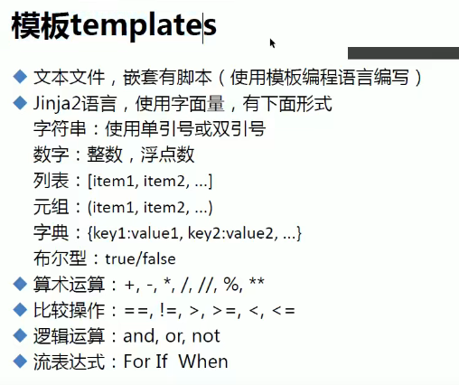
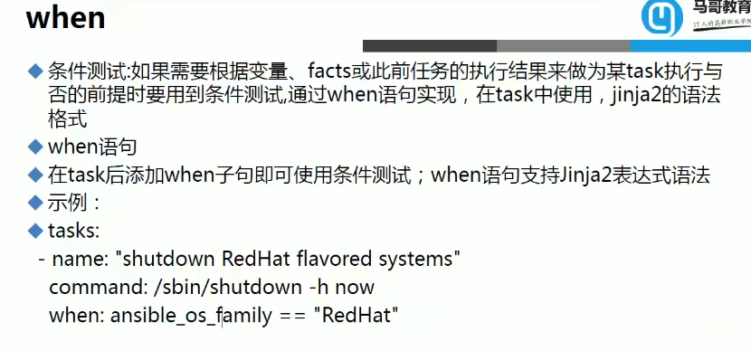
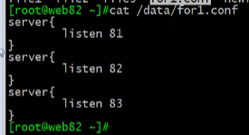
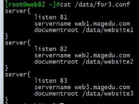
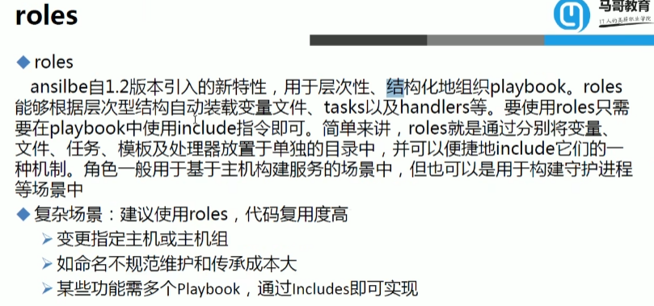

# Ansible命令

Ansible的命令格式为， `ansible 主机群组名 -m 命令模块名 -a "批量执行的操作"`

其中-m不是必须的，默认为command模块，-a也不是必须的，表示命令模块的参数，比如前面的ping模块就没有参数。

可以使用 `ansible-doc -l` 列出所有可用的命令模块， `ansible-doc -s 模块名` 查看指定模块的参数信息

## 查看模块指南

`ansible-doc -s yum`  其中-s显示简略信息

## 执行过程

1. 加载自己的配置文件 默认/etc/ansible/ansible.cfg
2. 加载自己对应的模块文件，如command
3. 通过ansible将模块或命令生成对应的临时py文件，并将该文件传输至远程服务器的对应执行用户$HOME/.ansible/tmp/ansible-tmp-数字/xxx.py文件
4. 给文件+x执行
5. 执行并返回结果
6. 删除临时py文件，sleep 0退出

## 执行状态

绿色：执行成功并且不需要做改变的操作

黄色：执行成功并且对目标主机做变更

红色：执行失败

## 常用命令模块

1.command
command是Ansible的默认模块，不指定-m参数时默认使用command。command可以运行远程主机权限范围内的所有shell命令，但不支持管道操作

```shell
# 查看k8s分组主机内存使用情况
ansible k8s -m command -a "free -g"
```

2.shell
shell基本与command相同，但shell支持管道操作

```shell
#shell支持管道操作 |grep Mem
ansible k8s -m shell -a "free -g|grep Mem"
```

3.script
script就是在远程主机上执行管理端存储的shell脚本文件，相当于scp+shell，不用复制到被管理端

```shell
# /root/echo.sh为管理端本地shell脚本
ansible k8s -m script -a "/root/echo.sh"
```

4.copy
copy实现管理端到远程主机的文件拷贝，相当于scp

```shell
#拷贝本地echo.sh文件到k8s组中远程主机的/tmp目录下，所属用户、组为 root ，权限为 0755
ansible k8s -m copy -a "src=/root/echo.sh dest=/tmp/ owner=root group=root mode=0755"
```

5.yum
软件包安装或删除

```shell
ansible k8s -m yum -a "name=wget state=latest"
```

其中state有如下取值：

- 针对安装，可取值“present，installed，latest”，present，installed即普通安装，两者无区别，latest是使用yum mirror上最新的版本进行安装
- 针对删除，可取值“absent，removed”，两者无差别

6.service
对远程主机的服务进行管理

```shell
ansible k8s -m service -a "name=nginx state=stoped"
```

state可取值“started/stopped/restarted/reloaded”。

7.get_url
在远程主机上下载指定URL到本地

```shell
ansible k8s -m get_url -a "url=http://www.baidu.com dest=/tmp/index.html mode=0440 force=yes"
```

8.setup
获取远程主机的信息

```shell
ansible k8s -m setup
```

9.file
管理远程主机的文件或目录

```shell
ansible k8s -m file -a "dest=/opt/test state=touch"
```

state可取值

- directory：创建目录
- file：如果文件不存在，则创建
- link：创建symbolic link
- absent：删除文件或目录
- touch： 创建一个不存在的空文件

10.cron
管理远程主机的crontab定时任务

```shell
ansible k8s -m cron -a "name='backup servcie' minute=*/5 job='/usr/sbin/ntpdate  time.nist.gov >/dev/null 2>&1'"
```

支持的参数

- state： 取值present表示创建定时任务，absent表示删除定时任务 (很多模块都有这个状态位)
- disabled： yes表示注释掉定时任务，no表示接触注释

### 命令

-u 更换连接用户，-k 输入ssh连接密码

# Ansible playbook

playbook文件遵循yaml的语法格式，运行命令的格式为 `ansible-playbook <filename1.yml> <filename2.yaml> ... [options]`， 常用options包括

- --syntax 检查playbook文件语法是否正确
- --check 或 -C 只检测可能会发生的改变，但不真正执行操作
- --list-hosts 列出运行任务的主机
- --list-tags 列出playbook文件中定义所有的tags
- --list-tasks 列出playbook文件中定义的所有任务集
- --limit 只针对主机列表中的某个主机或者某个组执行
- -f 指定并发数，默认为5个
- -t 指定某个或多个tags运行（前提playbook中有定义tags）
- -v 显示过程 -vv -vvv更详细

下面以批量安装Nginx为例，尽可能介绍playbook各核心元素的用法。

定义palybook yaml文件nginx_playbook.yml

```yaml
---
- hosts: 192.168.40.201,192.168.40.205 # 主机列表，也可以是/etc/ansible/hosts中定义的主机分组名
  remote_user: root # 远程用户
  vars:             # 自定义变量
     version: 1.16.1
  vars_files:
     - ./templates/nginx_locations_vars.yml


  tasks:
     - name: install dependencies          # 定义任务的名称
       yum: name={{item}} state=installed  # 调用模块，具体要做的事情，这里使用with_items迭代多个yum任务安装必要的依赖
       with_items:
          - gcc
          - gcc-c++
          - pcre
          - pcre-devel
          - zlib
          - zlib-devel
          - openssl
          - openssl-devel
     - name: download nginx                # 通过get_url模块下载nginx
       get_url: url=http://nginx.org/download/nginx-{{version}}.tar.gz dest=/tmp/ mode=0755 force=no
     - name: unarchive                     # 通过unarchive模块解压nginx
       unarchive: src=/tmp/nginx-{{version}}.tar.gz dest=/tmp/ mode=0755 copy=no
     - name: configure,make and install    # 通过shell模块执行shell命令编译安装
       shell: cd /tmp/nginx-{{version}} && ./configure --prefix=/usr/local/nginx && make && make install
     - name: start nginx                   # 通过shell模块执行shell命令启动nginx
       shell: /usr/local/nginx/sbin/nginx
     - name: update config                 # 通过template模块动态生成配置文件下发到远程主机目录
       template: src=nginx.conf.j2 dest=/usr/local/nginx/conf/nginx.conf
       notify: reload nginx                # 在结束时触发一个操作，具体操作通过handlers来定义
       tags: reload                        # 对任务定义一个标签，运行时通过-t执行带指定标签的任务

  handlers:
     - name: reload nginx                  # 与notify定义的内容对应
       shell: /usr/local/nginx/sbin/nginx -s reload


```

## 定义主机清单

```shell
[root@ansible_server~]# cd /etc/ansible/
[root@ansible_server/etc/ansible]# ll
total 24
-rw-r--r-- 1 root root 19985 Aug 22 04:07 ansible.cfg
-rw-r--r-- 1 root root  1016 Aug 22 04:07 hosts
drwxr-xr-x 2 root root     6 Aug 22 04:07 roles

# 操作配置文件前，习惯先备份 
[root@ansible_server/etc/ansible]# cp -f hosts hosts.backup
[root@ansible_server/etc/ansible]# ll
total 28
-rw-r--r-- 1 root root 19985 Aug 22 04:07 ansible.cfg
-rw-r--r-- 1 root root  1016 Aug 22 04:07 hosts
-rw-r--r-- 1 root root  1016 Sep 14 15:34 hosts.backup
drwxr-xr-x 2 root root     6 Aug 22 04:07 roles

# 情况hosts 配置文件内容，写hosts文件
[root@ansible_server/etc/ansible]# cat /dev/null > hosts
[root@ansible_server/etc/ansible]# cat hosts

# 写入主机IP ,这些写了[webserver]、[docker] 等都是分组，可以不写(这样不方便管理)
[root@ansible_server/etc/ansible]# cat hosts
[webserver]
10.0.0.5
10.0.0.6

# 管理10.0.0.7 docker服务器
[docker]
10.0.0.7

# 本机也可以管理自己管自己
[manager]
10.0.0.61
[root@ansible_server/etc/ansible]# 

```

## 基于ssh免密登录

```shell
# 第一个历程: 创建秘钥对(管理端服务器)	
	sh-keygen -t 秘钥的类型(dsa|rsa)
#第二个历程: 将公钥进行分发(被管理端服务器)
    ssh-copy-id -i /root/.ssh/id_dsa.pub root@10.0.0.5
    
# 本地生成rsa 密钥对
[root@ansible_server~]# xssh-keygen 
Generating public/private rsa key pair.
Enter file in which to save the key (/root/.ssh/id_rsa):    # 直接回车
Enter passphrase (empty for no passphrase):                 # 直接回车
Enter same passphrase again:                                # 直接回车
Your identification has been saved in /root/.ssh/id_rsa.
Your public key has been saved in /root/.ssh/id_rsa.pub.
The key fingerprint is:
SHA256:HhsjmGY6DJoSREojVpJmSI63vuoXKy6sK2ESh/eQJr0 root@ansible_server
The key's randomart image is:
+---[RSA 2048]----+
|+Bo.             |
|X+o              |
|==..             |
|=.B. o           |
|o*.+= . S        |
|+BE=.  o =       |
|B.= o   o        |
|+o =             |
|X=+              |
+----[SHA256]-----+

# 上传到被管理端
[root@web01_server~]# ssh-copy-id root@10.0.0.5
[root@web01_server~]# ssh-copy-id root@10.0.0.6
[root@web01_server~]# ssh-copy-id root@10.0.0.7
#这里也可以更改成普通用户，如alex@10.0.0.5，这样就y

```

## 管理端运行命令测试

```shell
# 常用参数
 -i    #  指定 host 文件的路径，默认是在 /etc/ansible/hosts ，用的时候可以省略
 -m    # 指定使用的ping模块

[root@ansible_server~]# ansible -i /etc/ansible/hosts 'www' -m ping
10.0.0.5 | SUCCESS => {
    "ansible_facts": {
        "discovered_interpreter_python": "/usr/bin/python"
    }, 
    "changed": false, 
    "ping": "pong"
}
10.0.0.6 | SUCCESS => {
    "ansible_facts": {
        "discovered_interpreter_python": "/usr/bin/python"
    }, 
    "changed": false, 
    "ping": "pong"
}
[root@ansible_server~]# 
```

### Handlers

和tasks并列的关系，可以监控tasks中的一个action动作（也就是一个name下面的操作），如果其中有一个执行成功，则出发下面的所有操作。需要配Notify

```yaml
---
- hosts: k8s
  remote_user:root
  tasks:
    - name: install httpd package
      yum: name=httpd
    - name: copy conf file
      copy: src=files/httpd.conf dest=/etc/httpd/conf/ backup=yes
      notify: restart service
    - name: start servic
      service: name=httpd state=started enabled=yes
      notify: 
      	- Restart Nginx
      	- Check Nginx Process
      
  handlers:
    - name: restart service
      service: name=httpd state=restarted
    - name: Restart Nginx
    - name: Check Nginx Process
```

### tag

多个tag用`,`隔开 `-t tag1,tag2`

### 变量

#### 在playbook 或者 调用命令时定义变量

```yaml
---
- hosts: k8s
  remote_user:root
  vars: 
  	- pkname1: httpd
  	- pkname2: vsftpd
  	
  vars_files:
  	- vars.yml
  	
  tasks:
    - name: install package
      yum: name={{ pkname1 }}
    - name: install package
      yum: name={{ pkname2 }}
    - name: start servic
      service: name={{ pkname1 }} state=started enabled=yes
```

调用：

```bash
ansible-playbook -e 'pkname1=vsftpd pkname2=memcached' app.yml
```

#### 或者在hosts里添加变量

```shell
[k8s]
192.168.0.103 http_port=81
192.168.0.104 http_port=82
[k8s:vars]
nodename=www
domainname=magedu.com
#playbook
- name: set hostname
  hostname: name={{nodename}}{{http_port}}.{{domainname}}
```

同时修改时，命令里优先

变量优先级次序：命令行`-e`>playbook定义>主机清单

## 模板



变量可以来自于setup。

模板可以用来拷贝配置文件，从原拷贝至对应位置，在服务开启时会根据模板里的参数进行调整

默认位置为playbook同级目录下的templates文件夹

## when



```yaml
---
- hosts: k8s
  remote_user:root
  vars: 
  	- http_port: 88
  tasks:
    - name: install package
      yum: name=nginx
    - name: copy template for centos7
      template: src=nginx.conf7.j2 dest=/etc/nginx/nginx.conf
      when: ansible_distribution_major_version == "7"
      notify: restart service
    - name: copy template for centos6
      template: src=nginx.conf6.j2 dest=/etc/nginx/nginx.conf
      when: ansible_distribution_major_version == "6"
      notify: restart service
    - name: start servic
      service: name=nginx state=started enabled=yes

     
  handlers:
    - name: restart service
      service: name=nginx state=restarted
```

## 迭代

### item

```yaml
---
- hosts: k8s
  remote_user:root
  
  tasks: 
  	- name: create some groups
  	  group: name={{item}}
  	  when: ansible_distribution_major_version == "7"
  	  with_items: 
  	  	- g1
  	  	- g2
  	  	- g3
  	- name: create some users
  	  user: name={{item.name}} group={{item.group}}
  	  with_items: 
  	  	- { name: 'user1', group: 'g1' }
  	  	- { name: 'user2', group: 'g2' }
  	  	- { name: 'user3', group: 'g3' }
```

item会循环用with_items的参数

### for

#### 普通用法

playbook

```yaml
---
- hosts: websrvs
  remote_user:root
  vars: 
  	ports: 
  	  - 81
  	  - 82
  	  - 83
  	  
  tasks: 
  	- name: copy conf
  	  template: src=for1.conf.j2 dest=/data/for1.conf
```

for1.conf.j2

```jinja2

server{
	listen {{port}}
}

```

被控端结果：



#### 键值对

playbook

```yaml
---
- hosts: websrvs
  remote_user:root
  vars: 
  	ports: 
  	  - web1: 
  	  	port: 81
  	  	name: web1.magedu.com
  	  	rootdir: /data/website1  #区别
  	  - web2: 
  	  	port: 82
  	  	name: web2.magedu.com
  	  	rootdir: /data/website2
  	  - web3: 
  	  	port: 83
  	  	name: web3.magedu.com
  	  	rootdir: /data/website3
  	  
  tasks: 
  	- name: copy conf
  	  template: src=for1.conf.j2 dest=/data/for1.conf
```

for2.conf.j2

```jinja2

server{
	listen {{ p.port }}  # 区别
	servername {{ p.name }}
	documentroot {{ p.rootdir }}
}

```

被控端结果：



### if

for3.conf.j2

```jinja2

server{
	listen {{ p.port }}  # 区别

	servername {{ p.name }}

	documentroot {{ p.rootdir }}
}

```

# roles



include已是老版本，但仍然可以使用

tasks文件夹必须，里面的yml文件只需要写task就行

```yaml
# task文件夹下
# group文件
- name: create group
  group: name=nginx gid=80
# name文件
- name: create user
  user: name=nginx uid=80 group=nginx system=yes shell=/sbin/nologin
# yum文件
- name: install package
  yum: name=nginx
# start service文件
- name: start service
  service: name=nginx state=started enabled=yes
# templ文件
- name: copy conf
  template: src=nginx.conf.j2 dest=/etc/nginx/nginx.conf
# restart service文件(最好放在handler文件夹下)
- name: start service
  service: name=nginx state=restarted

# main文件
- include: group.yml
- include: user.yml
- include: yum.yml
- include: templ.yml
- include: start.yml
- include: roles/httpd/task/copyfile.yml # 调用其他角色中的任务

# 调用playbook
---
- hosts: websrvs
  remote_user: root
  roles: 
    - role: nginx #或者直接nginx，也可以配置多个角色
    - role: httpd
```

### 带标签

还可以加别的条件

```yaml
---
- hosts: websrvs
  remote_user: root
  roles: 
    - {role: nginx, tags: ['web','nginx']} 
    - {role: httpd, tags: ['web','httpd'], when: ansible_distribution_major_version == "7"} 
    - {role: app, tags: ['app']} 
```


# YAML语言

- 一个name 只能包括一个task(用模块做一件事)

## 语法

### List:

列表，其所有元素均使用"-"打头

### Dictionary:

字典，通常由多个key与value构成

```yaml
name: EXample Developer
job: Developer
#或者
{name: EXample Developer,job: Developer}
```

## 相对路径

默认相对于主控机器/root下

```yaml
copy: src=files/httpd.conf dest=/etc/httpd/conf
```

这里的files就是在/root路径下。但只要playbook和files文件夹内的文件在同一级，就可以直接写对应的文件`httpd.conf`

