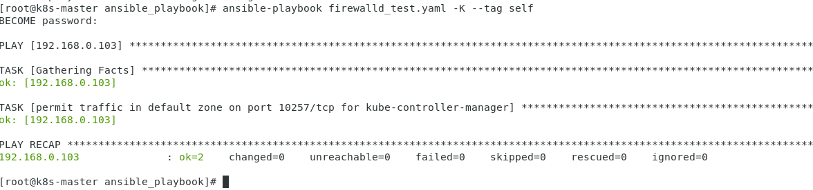

# 本周计划

- k8s基础架构学习即部署
- ansible学习并完成需求

# 本周工作内容

## k8s基础架构学习


k8s架构由各种组件完成，主要分为控制平面组件、节点组件以及一些插件。

### 控制平面组件

控制平面组件可以在集群中的任何节点上运行。 然而，为了简单起见，设置脚本通常会在同一个计算机上启动所有控制平面组件， 并且不会在此计算机上运行用户容器。

#### kube-apiserver

负责处理接受请求的工作。 API 服务器是 Kubernetes 控制平面的前端。

#### etcd

`etcd` 是兼顾一致性与高可用性的键值数据库，可以作为保存 Kubernetes 所有集群数据的后台数据库。

#### kube-scheduler

负责监视新创建的、未指定运行节点（node）的 Pods， 并选择节点来让 Pod 在上面运行。

#### kube-controller-manager

负责运行控制器进程。

从逻辑上讲，每个控制器都是一个单独的进程， 但是为了降低复杂性，它们都被编译到同一个可执行文件，并在同一个进程中运行。

#### cloud-controller-manager

`cloud-controller-manager` 是指嵌入特定云的控制逻辑之控制平面组件。 `cloud-controller-manager` 允许你将你的集群连接到云提供商的 API 之上， 并将与该云平台交互的组件同与你的集群交互的组件分离开来。

### Node 组件

节点组件会在每个节点上运行，负责维护运行的 Pod 并提供 Kubernetes 运行环境。

Pod是一组 具有共享的存储和网络资源 以及如何运行容器的规范 的一个或多个容器。

Pods就是多个Pod。

一台物理机或虚拟机作为节点，该节点中有Pods，其中每个Pod共享一部分存储和网络资源等。如果一个Pod运行一个服务或者程序，那么Pods就是一组服务或程序

#### kubelet

`kubelet` 会在集群中每个节点上运行。它保证容器都运行在Pod中。

kubelet 接收一组通过各类机制提供给它的 PodSpecs， 确保这些 PodSpecs 中描述的容器处于运行状态且健康。 kubelet 不会管理不是由 Kubernetes 创建的容器。

#### kube-proxy

kube-proxy是集群中每个节点（node）所上运行的**网络代理**， 实现 Kubernetes 服务（Service） 概念的一部分。

kube-proxy 维护节点上的一些网络规则， 这些网络规则会允许从集群内部或外部的网络会话与 Pod 进行网络通信。

如果操作系统提供了可用的数据包过滤层，则 kube-proxy 会通过它来实现网络规则。 否则，kube-proxy 仅做流量转发。

### 容器运行时（Container Runtime）

容器运行环境是负责运行容器的软件。

Kubernetes 支持许多容器运行环境，例如 Docker、 containerd、 CRI-O 以及 Kubernetes CRI (容器运行环境接口)的其他任何实现。

## 部署

根据该链接教程用kubeadm搭建1master 1work的集群环境，并安装了flannel插件实现容器互通

https://www.cnblogs.com/xiao987334176/p/12696740.html#autoid-6-1-0

## ansible学习即需求完成

k8s_ansible自动化部署脚本主要用playbook+roles完成

#### Ansible playbook

Ansible的playbook由一个或多个play组成，play的功能就是为归为一组的主机编排要执行的一系列task，其中每一个task就是调用Ansible的一个命令模块。

playbook的核心元素包括：

- hosts：执行任务的远程主机组或列表
- tasks：要执行的任务列表
- variables：内置变量或自定义的变量
- templates：使用模板语法的文件，通常为配置文件
- handlers：和notify结合使用，由特定条件触发，一般用于配置文件变更触发服务重启
- tags：标签，可在运行时通过标签指定运行playbook中的部分任务
- roles：

playbook使用yaml语法，它的基本语法规则如下：

- 大小写敏感
- 使用缩进表示层级关系
- 缩进时不允许使用Tab键，只允许使用空格
- 缩进的空格数目不重要，只要相同层级的元素左侧对齐即可

### 完成的firewall修改和提权测试如下

```yaml
---
- hosts: 192.168.0.103
  remote_user: alex
  tasks:
     - name: checking service
       ansible.builtin.service_facts:
     - name: open firewalld
       become: yes
       service:
         name: firewalld
         state: started
         enabled: yes
       when: ansible_facts.services['firewalld.service'] is defined
       # Control plane
     - name: permit traffic in default zone on port 6443/tcp for Kubernetes API server
       become: yes
       firewalld:
         port: 6443/tcp
         permanent: yes
         state: enabled
     - name: permit traffic in default zone on port 2379-2380/tcp for etcd server client API
       become: yes
       firewalld:
         port: 2379-2380/tcp
         permanent: yes
         state: enabled
     - name: permit traffic in default zone on port 10250/tcp for Kubelet API
       become: yes
       firewalld:
         port: 10250/tcp
         permanent: yes
         state: enabled
     - name: permit traffic in default zone on port 10259/tcp for kube-scheduler
       become: yes
       firewalld:
         port: 10259/tcp
         permanent: yes
         state: enabled
     - name: permit traffic in default zone on port 10257/tcp for kube-controller-manager
       become: yes
firewalld:
         port: 10257/tcp
         permanent: yes
         state: enabled
       tags: self
     - name: reload firewall
       become: yes
       service:
         name: firewalld
         state: reloaded
         enabled: yes
       tags: reload
     - name: check filewall
       become: yes
       shell: firewall-cmd --state && firewall-cmd --list-ports
```

开放控制平面端口，并用tag标记不同角色所要开启的端口



目前提权仍需要手动输入密码，且操作不同主机的用户即密码都需要一致。考虑配合roles完成。