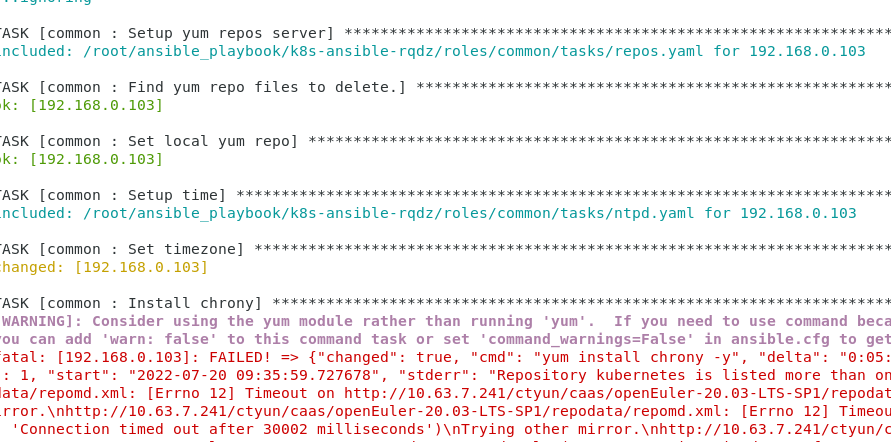

# 本周计划

- ansible role学习和脚本测试
- Shell学习
- Golang学习

# 本周工作内容

## ansible role学习和脚本测试

试着运行了etcd的playbook，但hosts里有很多内网地址，环境不合适，安装不成功，但remote_user+become的变更是成功的，等环境好了进一步测试。

## Shell学习

跟着鸟叔的教程学习了shell的判断式、条件判断以及循环的使用方式，大致内容如下

### 判断式

#### test测试功能

bash中可以用`\&?` 或者 `&&`及`||`来进行判断

> &&与 ；的区别：
>
> ；表示命令的先后执行。而&&只有前一个命令执行成功，后一个命令才会执行。

#### 判断符号

中括号的两端需要有空白字元来分隔。

#### Shell script 的预设变量(\$0, \$1...)

```shell
/path/to/scriptname  opt1  opt2  opt3  opt4 
       $0             $1    $2    $3    $4
```

### 条件判断式

#### if...then

```shell
if [ 条件判断式 ]; then
	当条件判断式成立时，可以进行的指令工作内容;
fi   <==将 if 反过来写，就成为 fi 啦！结束 if 之意！
```

判断式可以用&&和||来连接多个括号

```shell
[ "${yn}" == "Y" -o "${yn}" == "y" ]
上式可以替换为
[ "${yn}" == "Y" ] || [ "${yn}" == "y" ]
```

#### if...else...then

```shell
if [ 条件判断式 ]; then
	当条件判断式成立时，可以进行的指令工作内容;
else
	当条件判断式不成立时，可以进行的指令工作内容;
fi
```

更复杂时

```shell
if [ 条件判断式 ]; then
	当条件判断式一成立时，可以进行的指令工作内容;
elif[ 条件判断式二 ]; then
	当条件判断式二成立时，可以进行的指令工作内容;
else
	当条件判断式一与二均不成立时，可以进行的指令工作内容;
fi
```

#### case...esac

类似switch

```shell
case $变数名称 in   
  "第一个变数内容")
  	    程序段
  	    ;;
  "第二个变数内容")
  	    程序段
  	    ;;  
  *)               #相当于default
  		exit 1
  		;;
esac
```

变数也可以通过输入获取

```shell
read -p "Input your choice: " choice   
case ${choice} in    
esac
```

#### function

```shell
function fname() {
	程式段
}
```

因为 shell script 的执行方式是由上而下，由左而右， 因此在 shell script 当中的 function 一定要在程式的最前面

### 循环

### while do done, until do done

```shell
while [ condition ]  <==中括号内的状态就是判断式
do            <==do 循环的开始
	程式段落
done          <==done 循环结束
```

当 condition 条件成立時，就进行循环，直到 condition 的条件不成立才停止

```shell
until [ condition ]
do
	程式段落
done
```

与 while 相反， 当 condition 条件成立時，就终止循环，否则就持续循环

#### for...do...done 

```shell
for var in con1 con2 con3 ...
do
	程式段
done
```

变量也可以通过`$(seq 1 100) `或`for filename in ${filelist}`传入，其中`filelist=$(ls ${dir}) `

### \$()、\${}、\$(())的区别

\$()与\` \`都是用来做命令替换用。所谓的命令替换是用来重组命令行的。完成引号/括号里的命令行，然后将其结果替换出来，再重组命令行。

```bash
$ echo the last sunday is $(date -d "last sunday" +%Y-%m-%d)
#如此便可方便得到上一星期天的日期了
```

\${ } 用来作变量替换。

\$(( )) 是用来作整数运算的

## Golang学习

暂时只是一些基础，尚未整理。