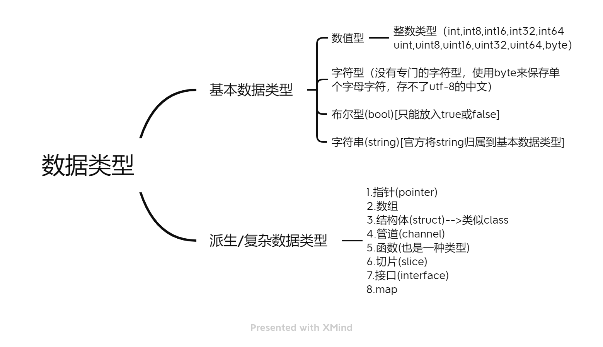

# 本周计划

- Golang学习

# 本周工作内容

本周主要学习了Golang环境安装，以及变量、运算符、流程控制等的特性

## 语言特点

1. 从C语言中继承了很多理念，包括表达式语法，控制结构，基础数据类型，调用参数传值，指针等等，也保留了和C语言一样的编译执行方式及弱化的指针

   ```go
   func testPtr(num *int){
       *num = 20
   }
   ```

2. 引入**包的概念**，用于组织程序结构，Go语言的一个文件都要归属于一个包，而不能单独存在。

   ```go
   package main//一个go文件需要在一个包
   ```

3. 垃圾回收机制，内存自动回收，不需开发人员管理

4. 天然并发（**重要**）

   - 从语言层面支持并发，实现简单
   - goroutine，轻量级线程，可实现大并发处理，高校利用多核。
   - 基于CPS并发模型(Communicating Sequential Processes)实现

5. 吸收了管道通信极值，形成Go语言特有的管道channel，通过管道channel，可以实现不同的goroutine之间的通信

6. 函数可以返回多个值。

   ```go
   func getSumAndSub(n1 int, n2 int)(int,int){
       sum := n1 + n2
       sub := n1 - n2
       return sum , sub
   }
   ```

7. 新的创新：比如切片slice、延时执行defer等

8. 行尾不需要`;`，会自动加

9. 函数或判断循环语句的左大括号`{`只能和函数名或判断循环语句后，不能另起一行

### 编译和运行

编译：`go build -o xxx.exe xxxx.go`

或者直接运行：`go run xxxx.go`

## 变量

1. 变量使用的三种方式

   - 第一种：指定变量类型，声明后若不赋值，就是用默认值

     ```Go
     var i int
     fmt.Println("i=",i)
     //结果为0，int的默认值为0
     ```

   - 根据值自行判定变量类型（类型推导）

     ```Go
     var num = 10.11
     fmt.Println("num=",num)
     ```

   - 省略var，注意 `:=` 左侧的变量不应该是已经声明过的，否则会导致编译错误

     ```Go
     name := "tom"//等价于var name string  name = "tom"
     fmt.Println("name=",name)
     ```

2. 多变量声明

   ```Go
   var n1, n2, n3 int//方式1
   var n1, n2, n3=100, "tom",888//方式2，n1= 100 n2= tom n3= 888
   n1, n2, n3:=100, "tom",888//方式3,此方式不能声明全局变量
   //原因是此语句等于两句 var n3 int  + n3 = 100
   //而n3 = 100这样的语句不能在函数体外执行
   ```

3. 一次性声明多个全局变量

   ```Go
   var(		//局部变量也能这么声明
   	n1=10
   	n2 = 3
   	n3 ="bb"
   )
   ```

4. 变量数据类型不能改变

   ```Go
   var i int = 10
   i=20 //ok
   i=1.3 //error
   ```

5. int默认值0，小数默认值0，字符串默认空串

### 变量数据类型



### 整型使用细节

1. Golang的整型默认声明为int型
2. 查看变量数据类型 `fmt.Printf("n1的类型%T",n1)`
3. 查看变量数据大小 `fmt.Printf("n1占用的字节数是%d",n1,unsafe.Sizeof(n1))`
4. 在保证程序正确运行下，尽量使用占用空间小的数据类型

### 小数

|     类型      | 占用存储空间 |         表数范围          |
| :-----------: | :----------: | :-----------------------: |
| 单精度float32 |    4字节     |  $-3.403E38\sim3.403E38$  |
| 双精度float64 |    8字节     | $-1.798E308\sim1.798E308$ |

Golang的浮点类型默认是float64

### 字符类型

Go中没有专门的字符类型，一般用byte保存

传统的字符串是由字符组成的，而Go的字符串是由字节组成的

输出：

```Go
var c1 byte = 'a'
fmt.Printf("c1=%c",c1)//需要按照字符的方式输出时需要格式化输出fmt.Printf 和%c
```

注意：

1. Go语言的字符使用UTF-8编码，英文字母1个字节，汉字3个字节
2. 在Go中，字符的本质是一个整数，直接输出时，是该字符对应的UTF-8编码码值
3. 可以直接给某个变量赋一个整数，然后按格式化输出的%c，输出对应的unicode（UTF-8编码）字符
4. 字符类型可运算，相当于整数

### 布尔类型

1. 只允许取值true和false，不能存其他整数
2. 占1个字节

### 字符串类型

1. 字符串一旦赋值了，字符串就不能修改了，在Go中字符串是不可变的

2. 字符串的两种形式

   - 双引号，会识别转义字符

   - 反引号（`），以字符串的原生形式输出，包括换行和特殊字符，可以实现防止攻击、输出源代码等效果

3. 字符串可以用`+`拼接
4. 当拼接太长要分行是，需要在行后留"+"（因为默认+";"，有"+"后就不会加了）

### 基本数据类型的转换

区别：**只能显示转换**，不能自动转换，不管是从高精度到低精度，还是从低精度到高精度

转换方式：`变量类型(变量)`

### 基本数据类型和string的转换

方法1：`fmt.Sprintf("%参数",表达式)` 

方法2：strconv包`strconv.FormatInt`等

方法3：strconv包中的函数`Itoa` （但参数若为int64要转换成int）

### string转基本数据类型

`strconv.ParseBool`等方法，但此方法会返回两个参数，一个所求结果，另一个为error。如果不需要error的话需要用`_`来接收

```go
var str string = "true"
var b bool
b , _= strconv.ParseBool(str)
```

注意：在将string类型转成基本数据类型时，要确保string类型能够转成有效的数据。如果不能，Golang直接将其转成0。bool默认为false

## 指针

### 值类型和引用类型

- 值类型：基本数据类型int系列，float，bool，string；数组和结构体struct
- 引用类型：指针，slice切片，map，管道chan，interface等

### 标识符命名规则

注意：

1. 如果变量名、函数名、常量名首字母大写，则可以被其他的包访问；如果首字母小写，则只能在本包中使用。可以简单理解成首字母大写公有，首字母小写私有。**注意**：Golang里没有public、private的关键字
2. “_” 本身就是特殊的标识符，不能单独使用。单独时作为占位符使用

## 运算符

### 算数运算符

- go里面没有三目运算符

- 自增自减只有后置，没有前置。且只能**独立使用**（单独一行），不能形如`b := a++`

其他运算符和c++差不多

## 输入语句

`fmt.Scanln` 。在换行时停止

```go
var name string
fmt.Scanln(&name)
```

`fmt.Scanf` 。在空格停止

```go
fmt.Scanf("%s %d %f %t",&name , &age, &sal, &isPass)
```

注意：变量前需要取地址符号

## 流程控制

### if-else

1. 语句的条件表达式可以不加`()`

2. `{}`必须有，即使代码只有一行。与c++不同

3. golang支持在if中，直接定义一个变量（只能一个变量），如下

   ```go
   if age :=20; age>=18{
   	fmt.Println("成年了")
   }
   ```

4. 多分支时，else不能换行

5. 条件表达式不能是别的表达式(如赋值表达式)，否则编译不通过，与c++不同

### switch

1. 匹配项后面**不需要加break**，默认会有

2. case可以有多个表达式，用`,`隔开

3. case表达式的数据类型要和switch保持一致，否则编译出错

4. case后表达式如果是个**常量(字面量)**，则要求不能重复，如果是变量，即使值相同，编译也能通过

5. switch后也可以不带表达式，类似if-else来使用。其实就是默认switch后是true，case后需要跟条件判断

6. switch后也可以直接声明/定义一个变量，分号结束，不推荐。

7. switch穿透：`fallthrough`，如果在case语句块后增加`fallthrough`，则会继续执行下一个case。只能穿透一层

8. Type Switch：switch语句还可以被用于type-switch来判断某个interface变量中实际指向的变量类型

   ```go
   func test(int ) float32{
   	return 1.0
   }
   func main(){
   	var x interface{}
   
   	x = test
   	switch i := x.(type){
   	case nil:
   		fmt.Printf("x的类型：%T",i)
   	case int:
   		fmt.Printf("x是int型")
   	case float64:
   		fmt.Printf("x是float64")
   	case func(int) float64:
   		fmt.Printf("x是func(int)")
   	case bool,string:
   		fmt.Printf("x是bool或者string")
   	default:
   		fmt.Printf("未知")
   	}
   }
   ```

### for语句

1. 初始化和迭加写在别处，而不用加`;`。但是如果写了三者中的两个，则必须补满`;`

   ```go
   i:=1
   for i<=10{
   	fmt.Println(i)
   	i++
   }
   ```

2. 啥都不加相当于`for(;;)`死循环

3. for-range方式，方便字符串和数组的遍历

   ```go
   var str string = "hello, world!"
   //index也可以置空 _ ，应该是表示不在乎，但必须要有个这个位置
   for index, val:=range str{
   	fmt.Printf("index=%d, val=%c\n",index,val)
   }
   ```

   这种方式即使字符串里存有中文字（不同编码方式），也可以正常输出（但是index会按照字符大小进行增加，汉字3字节），普通方式不行。

   普通方法需要用切片`[]rune`，如下

   ```go
   var str string = "hello!北京"
   str2 := []rune(str)
   for i:=0;i<len(str2);i++{
   	fmt.Printf("%c \n",str2[i])
   }
   ```

### Go语言没有while和do...while，都用for实现

### break

break语句出现在多层嵌套语句块中时，可以通过标签指明要终止到哪一层语句块

```go
lable1:
for i:=0;i<4;i++ {	
	for j:=0;j<10;j++ {
		if j==2 {
			break lable1
		}
		fmt.Println(j)
	}
}
```

### Go语言支持goto


