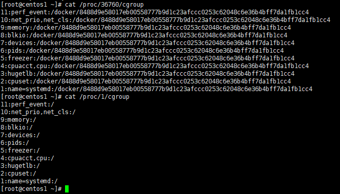

[TOC]

# 本周计划

- 理解docker的整体架构和基本原理
- 使用Dockerfile制作镜像

# 本周工作内容

## Docker基础架构

Docker 采用了 `C/S`架构，包括客户端和服务端。Docker 守护进程作为服务端接受来自客户端的请求，并处理这些请求（创建、运行、分发容器）。

## Docker底层实现

Docker 底层的核心技术包括 Linux 上的命名空间（Namespaces）、控制组（Control groups）、Union 文件系统（Union file systems）和容器格式（Container format）。

命名空间用来隔离权限，保证容器之间彼此互不影响。

控制组用来对共享资源进行隔离、限制、审计等，也就是用控制组来限制容器所使用的资源。

联合文件系统是一种分层、轻量级并且高性能的文件系统，它支持对文件系统的修改作为一次提交来一层层的叠加，同时可以将不同目录挂载到同一个虚拟文件系统下，目前推荐的底层驱动时overlay2。

通过了解docker的构建过程，我对这些底层实现方式有了一些更具象的认识。

## docker的构建过程

当利用 `docker run`来创建容器时，Docker 在后台运行的标准操作包括：

- 检查本地是否存在指定的镜像，不存在就从registry下载
- 利用镜像创建并启动一个容器（包括分配容器（命名空间等？）加载镜像）
- 分配一个文件系统，并在只读的镜像层(rootfs等)外面挂载一层可读写层（容器存储层，upperdir(overlay2)）
- 从宿主主机配置的网桥接口中桥接一个虚拟接口到容器中去（网络命名空间，用户使用 `-net=none` 后，可以自行配置网络）
- 从地址池配置一个 ip 地址给容器
- 执行用户指定的应用程序
- 执行完毕后容器被终止

### 整体认识

容器的轻量源于没有自己的内核，需要利用宿主机的bootfs，再在其上堆砌出运行所需要的其他部件，因此可以想见容器的实质是宿主机中的一个**进程**。若想保证整个容器不会太臃肿，就需要利用**联合文件系统**来一层层的构建所需要的容器，而这个构建的过程就需要镜像来指示完成。同时在此过程中还需要利用**命名空间**来对容器进行隔离，并通过**控制组**来实现资源分配。

### 联合文件系统

镜像的实现主要利用了联合文件系统。镜像的作用更像是通过一系列的命令告诉宿主机如何去产生所需要的容器，除了提供容器运行时所需的程序、库、资源、配置等文件外，还包含了一些为运行时准备的一些配置参数（如匿名卷、环境变量、用户等）。

镜像是由特殊的文件系统叠加而成。基于宿主机的bootfs，在其上构建第二层root文件系统的rootfs，然后再往上可以叠加其他的镜像文件，最终形成一个整体。当从一个镜像启动容器时，Docker会在最顶层加载一个读写文件系统作为容器。


联合文件系统的存储驱动一般都是使用的overlay2。overlay2主要由merged、lowerdir、upperdir、workdir组成。

其中，lowerdir对应底层文件系统，它是能被上层文件系统upperdir所共享的只读层。workdir则可以理解为overlay2运作的一个工作目录，用于完成copy-on-write等操作。overlay2运作时，会将lowerdir、upperdir和workdir联合挂载到merged目录，为使用者提供一个“**统一视图**”。


在宿主机的/var/lib/docker/overlay2 中可以找到这些不同层的文件


其中 `-init` 标记的是可写容器层。

我的Centos上一共有3个容器


其中两个nginx，nginx:v2在nginx的基础上修改了默认网页读出的内容，并用commit生成新的镜像。


通过`docker inspect`可以查看容器的具体信息，在其中可以找到它们的挂载的镜像

`[root@centos1 overlay2]# docker inspect 4ce7`


可以看出，这里面存着该容器的overlay2所使用的镜像。对比两个容器发现在“LowerDir”中，除了第一个运行时的临时可读写层外，nginx:v2只多了一层（commit修改的一层），其他层都是一样的。


由此可见容器在构建时，确实共用了基础镜像。

### 命名空间和控制组

既然容器的实质是进程，那么在容器构建的过程中，应该是通过各种命令来调动内核，利用命名空间完成隔离，利用控制组完成资源限制等，同时这些信息应该都能在宿主机中查看到。

首先启动一个nginx容器，在宿主机中查看它的进程号：


找到`/proc/[pid]/ns`，对比宿主机的进程1，发现ipc、mnt、net、pid、和uts所属的命名空间皆不同。


同样也可以通过 /proc/[pid]/cgroup 来查看指定进程属于哪些 cgroup：每个容器创建后，Linux 会为每个容器创建一个 cgroup 目录，以容器的 ID 命名



每一行包含用冒号隔开的三列，他们的含义分别是：

- cgroup 树的 ID， 和 /proc/cgroups 文件中的 ID 一一对应。
- 和 cgroup 树绑定的所有 subsystem，多个 subsystem 之间用逗号隔开。这里 name=systemd 表示没有和任何 subsystem 绑定，只是给他起了个名字叫 systemd。
- 进程在 cgroup 树中的路径，即进程所属的 cgroup，这个路径是相对于挂载点的相对路径。

我们也可以自己创建cgroup来限制进程的资源利用，利用libcgroup工具来完成，首先创建一个限制cpu的文件夹，或者直接在相应的文件夹下mkdir也可以

`cgreate -g cpu:echo_test`。进入该文件夹发现cgroups 的文件系统会在创建文件目录的时候自动创建这些配置文件


然后我们写一个死循环的进程，发现他很快就占满了cpu


接着修改我们新增的节点中修改所占用cpu的时间份额，接着把该进程放入tasks中。tasks里存放的是使用该节点策略的所以进程。随后发现cpu占用率立刻下降


同时cat 该进程里的cgroup，发现该进程4号cgroup树（绑定的cpuacct,cpu子系统）挂载了我们新建的路径。


### 命名空间和控制组源码分析

#### 命名空间

Linux namespace 实现了 6 项资源隔离，基本上涵盖了一个小型操作系统的运行要素，包括主机名、用户权限、文件系统、网络、进程号、进程间通信。

| namespace | 系统调用参数  | 隔离内容                   | 内核版本 |
| --------- | ------------- | -------------------------- | -------- |
| UTS       | CLONE_NEWUTS  | 主机名和域名               | 2.6.19   |
| IPC       | CLONE_NEWIPC  | 信号量、消息队列和共享内存 | 2.6.19   |
| PID       | CLONE_NEWPID  | 进程编号                   | 2.6.24   |
| Network   | CLONE_NEWNET  | 网络设备、网络栈、端口等   | 2.6.29   |
| Mount     | CLONE_NEWNS   | 挂载点（文件系统）         | 2.4.19   |
| User      | CLONE_NEWUSER | 用户和用户组               | 3.8      |

这 6 项资源隔离分别对应 6 种系统调用，通过传入上表中的参数，调用 clone() 函数来完成。

```c
int clone(int (*child_func)(void *), void *child_stack, int flags, void *arg);
```

通过调用 clone()，并传入需要隔离资源对应的参数，就可以建立一个容器了（隔离什么我们自己控制）。

一个容器进程也可以再 clone() 出一个容器进程，这是容器的嵌套。

在man手册中有一个示例修改uts的命名空间，这儿就不贴过来了，直接运行结果如下：

```bash
[root@centos1 namespace_test]# ./uts_test alex
clone() returned 21696
uts.nodename in child:  alex		#子进程中uts已经改变
uts.nodename in parent: centos1
```

其他namespace基本也可以用clone()来修改。

由于 Linux namespace 是用来做进程资源隔离的，所以在进程描述符中，一定有 namespace 所对应的信息，我们可以从这里开始切入代码。

首先找到描述进程信息 task_struct，找到指向 namespace 的结构 `struct *nsproxy`（sched.h）：

```c
struct task_struct {
......
/* namespaces */
struct nsproxy *nsproxy;
......
}
```

其中 nsproxy 结构体定义在 nsproxy.h 中：

```c
struct nsproxy {
 atomic_t count;
 struct uts_namespace *uts_ns;
 struct ipc_namespace *ipc_ns;
 struct mnt_namespace *mnt_ns;
 struct pid_namespace *pid_ns;
 struct net        *net_ns;
};
extern struct nsproxy init_nsproxy;
```

这个结构是被所有 namespace 所共享的，只要一个 namespace 被 clone 了，nsproxy 也会被 clone。注意到，由于 user namespace 是和其他 namespace 耦合在一起的，所以没出现在上述结构中。

同时，nsproxy.h 中还定义了一些对 namespace 的操作，包括 copy_namespaces 等。

```c
int copy_namespaces(unsigned long flags, struct task_struct *tsk);
void exit_task_namespaces(struct task_struct *tsk);
void switch_task_namespaces(struct task_struct *tsk, struct nsproxy *new);
void free_nsproxy(struct nsproxy *ns);
int unshare_nsproxy_namespaces(unsigned long, struct nsproxy **,
 struct fs_struct *);
```

task_struct，nsproxy，几种 namespace 之间的关系如下所示：


当宿主机要创建容器时，会新建一个进程，修改命名空间也是在这个时候通过clone()函数进行的。在 Linux kernel 中，fork()、vfork()和__clone()库函数都根据各自需要的参数标志去调用clone()，然后由clone()去调用do_fork()。所以关键是这个do_fork()函数。

do_fork() 首先调用 copy_process() 将父进程信息复制给子进程，然后调用 vfork() 完成相关的初始化工作，接着调用 wake_up_new_task() 将进程加入调度器中，为之分配 CPU。最后，等待子进程退出。

copy_process 主要分为三步：首先调用 dup_task_struct() 复制当前的进程描述符信息 task_struct，为新进程分配新的堆栈，第二步调用 sched_fork() 初始化进程数据结构，为其分配 CPU，把进程状态设置为 TASK_RUNNING，最后一步就是调用 copy_namespaces() 复制 namesapces。我们重点关注最后一步 copy_namespaces()。

copy_namespace() 主要基于“旧的” namespace 创建“新的” namespace，核心函数在于 create_new_namespaces。

在create_new_namespaces()中，分别调用 create_nsproxy(), create_utsname(), create_ipcs(), create_pid_ns(), create_net_ns(), create_mnt_ns() 来创建 nsproxy 结构，uts，ipcs，pid，mnt，net。

综上所述，新建容器时，应该也是在copy_process的过程中，通过 copy_namespaces() ->copy_namespace() ->create_new_namespaces()中的各个函数修改了namespaces。而user_namespace耦合在各个namespace中，如果要修改的话，应该这些函数中修改。

#### 控制组

关于cgroups的相关概念主要如下：

- cgroups子系统，cgroups为每种可以控制的资源定义了一个子系统。典型的子系统介绍如下：

  1. cpu 子系统，主要限制进程的 cpu 使用率。
  2. cpuacct 子系统，可以统计 cgroups 中的进程的 cpu 使用报告。
  3. cpuset 子系统，可以为 cgroups 中的进程分配单独的 cpu 节点或者内存节点。
  4. memory 子系统，可以限制进程的 memory 使用量。
  5. blkio 子系统，可以限制进程的块设备 io。
  6. devices 子系统，可以控制进程能够访问某些设备。
  7. net_cls 子系统，可以标记 cgroups 中进程的网络数据包，然后可以使用 tc 模块（traffic control）对数据包进行控制。
  8. freezer 子系统，可以挂起或者恢复 cgroups 中的进程。
  9. ns 子系统，可以使不同 cgroups 下面的进程使用不同的 namespace。

  这里面每一个子系统都需要与内核的其他模块配合来完成资源的控制

- cgroups 层级结构（Hierarchy）

  内核使用 cgroup 结构体来表示一个 control group 对某一个或者某几个 cgroups 子系统的资源限制。cgroup 结构体可以组织成一颗树的形式，每一棵cgroup 结构体组成的树称之为一个 cgroups 层级结构。cgroups层级结构可以 attach 一个或者几个 cgroups 子系统，当前层级结构可以对其 attach 的 cgroups 子系统进行资源的限制。每一个 cgroups 子系统只能被 attach 到一个 cpu 层级结构中。

cgroups与进程：

在创建了 cgroups 层级结构中的节点（cgroup 结构体）之后，可以把进程加入到某一个节点的控制任务列表中，一个节点的控制列表中的所有进程都会受到当前节点的资源限制。同时某一个进程也可以被加入到不同的 cgroups 层级结构的节点中，因为不同的 cgroups 层级结构可以负责不同的系统资源。所以说进程和 cgroup 结构体是一个多对多的关系。一个进程对应一个css_set，一个css_set存储了一组进程跟各子系统相关的信息


为了方便用户（程序员）操作，cgroups 以一个伪文件系统的方式实现，并对外提供 API，用户对文件系统的操作就是对 cgroups 的操作。也就是/sys/fs/cgroup下的内容


每一个文件夹对应的就是一个子系统。在子系统内部的文件夹，则是不同的节点，如上图中的`cgrp1`等。每一个进程的cgroup文件夹(/proc/[pid]/cgroup)下存放的就是对应的节点。宿主机所属进程的子系统存放在默认的根文件下，也就是上图中的`/cpu_cgrp`节点，对应的是/sys/fs/cgroup/cpu文件夹；而docker进程内存放的就是根文件夹下的docker文件夹(/sys/fs/cgroup/cpu/docker)，也就是`/cpu_cgrp`下的节点。


在Linux内核的进程描述符中，和命名空间一样有着属于进程的cgroup结构体。

```c
#ifdef CONFIG_CGROUPS
/* Control Group info protected by css_set_lock */
struct css_set *cgroups;
/* cg_list protected by css_set_lock and tsk->alloc_lock */
struct list_head cg_list;
#endif
```

结构体css_set就是该进程所掌握的资源，结构体内部有着各个子系统的结构体（因为进程需要各个子系统的资源）

```c
struct css_set {
atomic_t refcount;
struct hlist_node hlist;
struct list_head tasks;
struct list_head cg_links;
struct cgroup_subsys_state *subsys[CGROUP_SUBSYS_COUNT]; //子系统
struct rcu_head rcu_head;
};
```

refcount是css_set的引用计数，组里加一个进程，refcount加1

hlist把css_set组织成hash表，使内核可以快速查找特定的css_set。

tasks指向所有连到此 css_set 的进程连成的链表。

cg_links 指向一个由 struct_cg_cgroup_link 连成的链表。

subsys 是一个指针数组，存储一组指向 cgroup_subsys_state 的指针。一个 cgroup_subsys_state 就是进程与一个特定子系统相关的信息。通过这个指针数组，进程就可以获得相应的 cgroups 控制信息了。以此就可以限制进程使用资源了。

---


## Dockerfile

Dockerfile 是一个文本文件，其内包含了一条条的 **指令(Instruction)**，**每一条指令构建一层**，因此每一条指令的内容，就是描述该层应当如何构建。但为了节省层数，只有`RUN`, `COPY`,`ADD`创建图层。其他指令创建临时中间图像，并且不增加构建的大小。

### FROM指定基础镜像

`FROM`是Dockerfile中必备的指令，**且必须是第一条**。有两种选择

- `FROM [基础镜像]`	从基础镜像开始定制
- `FROM scratch`   从空白镜像开始定制

### RUN执行命令

`RUN`是用来执行命令行命令的。其格式有两种：

- shell格式：`RUN <命令>`

```dockerfile
RUN echo '<h1>Hello, Docker! by Dockerfile</h1>' > /usr/share/nginx/html/index.html
```

- exec格式：`RUN ["可执行文件", "参数1", "参数2"]`，这更像是函数调用中的格式。

> 注意：每一个 `RUN` 的行为，都会新建立一层，在其上执行这些命令，执行结束后，`commit` 这一层的修改，构成新的镜像。
>
> 因此，对于同一层中的命令建议用 `&&` 将各个命令串联起来

在命令最后添加清理工作的命令，删除为了编译构造所需的软件，防止镜像变得臃肿

### 构建镜像

使用命令`docker build`

```bash
docker build [选项] <上下文路径/URL/->
# - 表示通过STDIN给出Dockerfile或上下文
```

在 `Dockerfile` 文件所在目录执行：

```bash
[root@centos1 mynginx]# docker build -t nginx:v3 .
Sending build context to Docker daemon  2.048kB
Step 1/2 : FROM nginx
 ---> 55f4b40fe486
Step 2/2 : RUN echo '<h1>Hello, Docker! by Dockerfile</h1>' > /usr/share/nginx/html/index.html
 ---> Running in 4452c01a8ba7
Removing intermediate container 4452c01a8ba7
 ---> 9531517b7769
Successfully built 9531517b7769
Successfully tagged nginx:v3
```

### 镜像构建上下文（Context）

首先Docker是C/S模式设计，像`docker build`这样的命令只是客户端的请求，实际完成镜像构建的是docker的服务端守护进程。

要让服务器端获取本地文件就需要用户指定构建镜像的上下文路径，`docker build` 命令得知这个路径后，会将路径下的所有内容打包，然后上传给 Docker 引擎。这样 Docker 引擎收到这个上下文包后，展开就会获得构建镜像所需的一切文件。

如果在 `Dockerfile` 中这么写：

```dockerfile
COPY ./package.json /app/
```

这并不是要复制执行 `docker build` 命令所在的目录下的 `package.json`，也不是复制 `Dockerfile` 所在目录下的 `package.json`，而是复制 **上下文（context）** 目录下的 `package.json`。

因此，`COPY` 这类指令中的源文件的路径都是*相对路径*。

现在就可以理解刚才的命令 `docker build -t nginx:v3 .` 中的这个 `.`，实际上是在指定上下文的目录，`docker build` 命令会将该目录下的内容打包交给 Docker 引擎以帮助构建镜像。

如果观察 `docker build` 输出，我们其实已经看到了这个发送上下文的过程：

```bash
[root@centos1 mynginx]# docker build -t nginx:v3 .
Sending build context to Docker daemon  2.048kB
...
```

一般来说，应该会将 `Dockerfile` 置于一个空目录下，或者项目根目录下。如果该目录下没有所需文件，那么应该把所需文件复制一份过来。如果目录下有些东西确实不希望构建时传给 Docker 引擎，那么可以用 `.gitignore` 一样的语法写一个 `.dockerignore`，该文件是用于剔除不需要作为上下文传递给 Docker 引擎的。

### 多阶段构建

可以使用脚本语言来完成多阶段的构建，但如此需要维护多个Dockerfile，且用脚本语言也很繁琐，因此可以用多阶段构建

镜像的构建在构建过程的最后**阶段**，利用构建缓存来防止重复生成已有映像

**`Dockerfile`**：

```dockerfile
# syntax=docker/dockerfile:1
FROM golang:latest
WORKDIR /go/src/github.com/alexellis/href-counter/
RUN go get -d -v golang.org/x/net/html  
COPY app.go ./
RUN CGO_ENABLED=0 GOOS=linux go build -a -installsuffix cgo -o app .

FROM alpine:latest  
RUN apk --no-cache add ca-certificates
WORKDIR /root/
COPY --from=0 /go/src/github.com/alexellis/href-counter/app ./
CMD ["./app"]  
```

其中`COPY --from=0`将从阶段0中复制映像到当前阶段并使用，而不用重新建立新的镜像

#### 只构建某一阶段

我们可以使用 `as` 来为某一阶段命名，例如

```dockerfile
FROM golang:1.16 as builder
```

例如当我们只想构建 `builder` 阶段的镜像时，增加 `--target=builder` 参数即可

```bash
$ docker build --target builder -t username/imagename:tag .
```

#### 构建时从其他镜像复制文件

上面例子中我们使用 `COPY --from=0 /go/src/github.com/alexellis/href-counter/app ./`从上一阶段的镜像中复制文件，我们也可以复制任意镜像中的文件。

```dockerfile
COPY --from=nginx:latest /etc/nginx/nginx.conf /nginx.conf
```

#### 使用前一个阶段作为新阶段

使用`FROM`指令时，可以通过引用上一阶段停止的位置来继续。例如：

```dockerfile
# syntax=docker/dockerfile:1
FROM alpine:latest AS builder
RUN apk --no-cache add build-base

FROM builder AS build1
COPY source1.cpp source.cpp
RUN g++ -o /binary source.cpp

FROM builder AS build2
COPY source2.cpp source.cpp
RUN g++ -o /binary source.cpp
```

