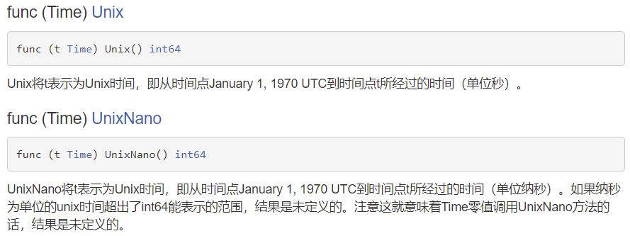
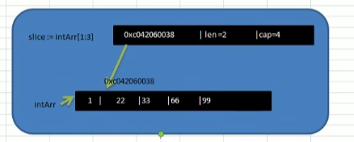

# 本周计划

- Golang学习

# 本周工作内容

本周主要学习了Go的函数、数组、切片、结构体

## 函数

基本语法

```go
func 函数名 (形参列表) (返回值列表) {
    执行语句...
    return 返回值列表
}
```

1. 函数可以有返回值，也可以没有

### 包的引入

包的本质实际上就是创建不同的**文件夹**，来存放程序文件

go的每一个文件都是属于一个包的，也就是说go是以包的形式来管理文件和项目目录结构的

#### 包的作用

1. 区分相同名字的函数、变量等标识符
2. 当程序文件很多时，可以很好的管理项目
3. 控制函数、变量等访问范围，即作用域

#### 包的基本语法

打包：`package 包名`

引入包：`import "包的路径"`

- 由于go是以包的形式来管理文件和项目目录结构的，则一个包就是一个文件夹，因此go的每个文件都要属于一个文件夹（包）
- 包的路径：环境变量`${GOPATH}/src`开始，到包的**文件夹**

#### 包的注意事项

1. 在给一个文件打包时，该包对应一个文件夹。比如utils文件夹对应的包名就是utils，文件的包名**通常**和文件所在的文件夹名一致，一般为小写字母。

2. 当一个文件要使用其他包函数或变量时，需要先引入对应的包

   1. package在第一行，然后是import
   2. 在import包时，路径从$GOPATH的src下开始，不用带src，编译器会自动从src下开始引入

3. 为了让其他包的文件，可以访问到本包的函数，则该函数名的首字母需要大写，类似其他语言的public，这样才能跨包访问。

4. 在访问其他包函数时，语法是`包名.函数名`

5. 如果包名较长，Go支持给包去别名，取别名后，原来的包名就不能使用了

6. 在同一个包下，不能有相同的函数名，否则报重复定义

7. 如果要编译成一个可执行文件，就需要将这个包声明为main，即package main。这个就是一个语法规范

   编译时需要编译main包所在的文件夹

   编译后生成一个有默认名的可执行文件，在$GOPATH目录下，可以指定名字和目录，比如：放在bin目录下：`go build -o bin/my.exe go_code/project/main`。（路径默认带src）

8. 编译完后会生成一个和src同级的文件夹pkg，里面包含一个.a的库文件

### return语句

1. 如果返回多个值时，在接收时，希望忽略某个返回值，则使用`_`符号表示占位忽略
2. 如果返回值只有一个，(返回值类型列表)可以不写()

### 函数注意事项和细节

1. 函数的形参列表可以是多个，返回值列表也可以是多个

2. 形参列表和返回值列表的数据类型可以是值类型和引用类型。

3. 函数的命名遵循标识符命名规范，首字母不能是数字，首字母大写该函数可以被本包文件和其他包文件使用，类似public，首字母小写，只能被本包文件使用，其他包文件不能使用，类似private

4. 函数中的变量是局部的，函数外不生效

5. 基本数据类型和数组默认都是值传递，即进行值拷贝。在函数内修改，不会影响到原来的值

6. 如果希望函数内的变量能修改函数外的变量，可以传入变量的地址&，函数内以指针的方式操作变量。从效果上看类似引用

7. **Go函数不支持重载！**

8. 在Go中，函数也是一种数据类型，可以赋值给一个变量，则该变量就是一个函数类型的变量了。通过该变量可以对函数调用。

9. 函数既然是一种数据类型，因此在Go中，函数可以作为形参，并且调用

10. 为了简化数据类型定义，Go支持自定义数据类型

    基本语法：`type 自定义数据类型名 数据类型`  （相当于一个别名，相当于typename）。但是Go语言会认为这两个是不同类型

11. 支持对函数返回值命名

    ```go
    func cal(n1 int,n2 int)(sum int, sub int){
    	sum = n1 + n2
        sub = n1 - n2
        return
    }
    ```

12. 使用`_`标识符，忽略返回值

13. Go中支持可变参数

    ```go
    //支持0到多个参数
    func sum(args... int) (sum int){
        
    }
    //支持1到多个参数
    func sum(n1 int, args... int) (sum int){
        
    }
    ```

    1. args是slice切片，通过args[index] 可以访问到各个值。
    2. 如果一个函数的形参列表中有可变参数，则可变参数需要放在形参列表最后


### init函数

每一个源文件都可以包含一个init函数，该函数会在main函数执行前，被Go运行框架调用，也就是说init会在main函数前被调用。

通常可以在init函数中，完成初始化工作

#### 注意事项和细节

1. 如果一个文件同时包含全局变量定义，init函数和main函数，则执行的流程是变量定义->init函数->main函数
2. init函数最主要的作用，就是完成一些初始化工作。可以在引入包中进行初始化，这样main执行时，**先执行包的初始化**

### 匿名函数

Go支持匿名函数，如果某个函数只是希望使用一次，可以考虑使用匿名函数，匿名函数也可以实现多次调用。

#### 使用方式

1. 在定义匿名函数时直接使用

   ```go
   func main(){
   	res1 := func (n1 int,n2 int) int {
   		return n1+n2
       }(10,20)  //定义到}为止，后面(10,20)直接调用
   
   	fmt.Println("res1=",res1)
   }
   ```

   

2. 将匿名函数赋给一个变量（函数变量），再通过该变量来调用匿名函数

   ```go
   	a := func (n1 int,n2 int) int {
   		return n1+n2
   	}
   	res1:=a(1,2)
   	fmt.Println("res1=",res1)
   ```

3. 全局匿名函数

   如果将匿名函数赋值给一个全局变量，那么这个匿名函数，就称为一个全局匿名函数，可以在程序有效


### 闭包

基本介绍：闭包就是一个函数和与其相关的引用环境组合的一个整体（实体）


```go
//累加器
func AddUpper() func(int) int {
	var n int =10
	return func(x int) int{
		n+=x
		return n
	}
}

func main(){
	a:=AddUpper()
	var res int
	res=a(1)
	fmt.Println("res=",res)
	res=a(2)
	fmt.Println("res=",res)
}
```

上面代码说明：

1. `AddUpper`是一个函数，返回的数据类型是`func(int) int`

2. 闭包说明

   ```go
   var n int =10
   return func(x int) int{
   	n+=x
   	return n
   }
   ```

   `AddUpper`返回的是一个匿名函数，但是这个匿名函数引用到函数外的`n`。因此这个匿名函数就和n形成一个整体，构成闭包。

3. 可以理解为：闭包是类，函数是操作，`n`是字段。函数和它使用到的`n`构成闭包

4. 当我们反复的调用f函数时，因为`n`初始化一次，因此每次调用`n`都会进行累加

5. 要搞清楚闭包的关键，就是要分析出返回的函数使用到哪些变量。因为函数和它引用道德变量共同构成闭包

> Go语言能通过escape analyze识别出变量的作用域，自动将变量在堆上分配。

```go
//由于n1没有形成闭包，因此会在栈上创建，而n在堆上
func AddUpper() func(int) int {
	var n int =10
	var n1 int =20
	return func(x int) int{
		n+=x
		fmt.Println("n=",n,"n1=",n1)
		return n
	}
}
a:=AddUpper()//这里不能省略这个()，类似于类的构造函数。称作返回一个闭包
	res=a(1)
	fmt.Println("res=",res)//n= 11 n1= 20 res= 11
	res=a(1)
	fmt.Println("res=",res)//n= 12 n1= 20 res= 12
```

传统函数虽然也能实现，但是每次都需要重新传入后缀名。用闭包可以向类一样确定好就不用再写了

### defer

在函数中，程序员经常需要创建资源（比如：数据库连接、文件句柄、锁等），为了在函数执行完毕后，及时释放资源，Go的设计者提供defer（延时机制）


```go
func sum (n1 int,n2 int) int{
	//当执行到defer时，暂时不执行，会将defer后面的语句压入到独立的栈（defer栈）
	//当函数执行完毕后，再从defer栈，按照先入后出的方式出栈，执行
	defer fmt.Println("ok1 n1=",n1)
	defer fmt.Println("ok2 n2=",n2)
    n1++
	n2++
	res := n1 +n2
	fmt.Println("ok3 res=",res)
	return res
}

func main(){
	res := sum(10,20)
	fmt.Println("res=",res)
}
```

#### defer的细节说明

1. 当执行到defer时，暂时不执行，会将defer后面的语句压入到独立的栈，然后继续执行函数下一个语句。
2. 当函数执行完毕后，再从defer栈中，依次从栈顶取出语句执行（遵从先入后出）
3. 在defer将语句放入到栈时，也会将相关的值拷贝同时入栈

defer最主要的价值在于，当函数执行完毕后，可以及时的释放函数创建的资源。

```go
func test(){
	file = openfile("xxx")
	defer file.close()
}
```

### 参数传递方式

- 值传递：复制变量
- 引用传递：相当于C++的地址传递，复制地址

### 变量作用域

和c++差不多

注意：变量可以在函数体外进行全局变量定义及初始化，但是不能赋值（使用`=`）

### 字符串常用的系统函数

1. 统计字符串的长度，按字节`len(str)`。中文字符3字节，比如`hello北`，输出为8

2. 字符串遍历，同时处理有中文的问题 `r:=[]rune(str)`

3. 字符串转整数：`n,err := strconv.Atoi("12")`

4. 整数转字符串：`str = strconv.Itoa(12345)`

5. 字符串转`[]byte`

   ```go
   var bytes = []byte("hello go")
   fmt.Printf("bytes=%v\n",bytes)
   ```

6. `[]byte`转字符串

   ```go
   str = string([]byte{97,98,99})//对应结果为abc（对应ascii码）
   ```

7. 10进制转2，8，16进制（字符串）：

   ```go
   str := strconv.FormatInt(123,2)
   fmt.Printf("123对应的二进制是=%v\n",str)
   str = strconv.FormatInt(123,16)
   fmt.Printf("123对应的16进制是=%v\n",str)
   ```

8. 查找子串是否在指定的字符串中，返回`bool`

   ```go
   b:=strings.Contains("seafood","foo")
   fmt.Printf("是否含有=%v\n",b)
   ```

9. 统计一个字符串有几个指定的子串：

   ```go
   num := strings.Count("ceheEs","e")
   fmt.Printf("num=%v",num)//结果：2
   ```

10. 不区分大小写的字符串比较（==是区分字母大小写的）

    ```go
    b = strings.EqualFold("abc","Abc")
    fmt.Printf("b=%v\n",b)//true
    ```

11. 返回子串在字符串第一次出现的index值，如果没有，返回`-1`

    ```go
    index := strings.Index("NLT_abc","abc")
    fmt.Printf("index=%v\n",index)//4
    ```

12. 返回子串在字符串最后一次出现的index，如没有，返回`-1`

    ```go
    index := strings.LastIndex("go golang","go")
    fmt.Printf("lasindex=%v\n",index)//3
    ```

13. 将指定的子串替换成另外一个子串：`func Replace(s, old, new string, n int) string`    （`n`可以指定你希望替换几个，如果`n=-1`表示全部替换）

    ```go
    str := strings.Replace("go golang","go","北京",-1)//返回一个新串
    fmt.Printf("str=%v\n",str)
    ```

14. 按照指定的某个字符(如`,`)为分割标识，将一个字符串拆分成字符串数组

    ```go
    strArr := strings.Split("hello,world,ok",",")
    fmt.Printf("strArr=%v\n",strArr)
    ```

15. 将字符串的字母进行大小写转换：

    ```go
    str="Hello goLang"
    str=strings.ToLower(str)//转小写，ToUpper转大写
    fmt.Printf("str=%v\n",str)//hello golang
    ```

16. 将字符串左右两边的空格去掉：

    ```go
    str=strings.TrimSpace("    Hello goLang         ")
    fmt.Printf("str=%q\n",str)//%q 会加上双引号："Hello goLang"
    ```

17. 将字符串左右两边指定的字符去掉：

    ```go
    str=strings.Trim("!   ! Hello goLang!  !!"," !")
    fmt.Printf("str=%q\n",str)
    ```

18. 去掉左边（或右边）：`strings.TrimLeft`（`strings.TrimRight`）

19. 判断字符串是否以指定的字符串开头：

    ```go
    b=strings.HasPrefix("ftp://192.168.10.1","ftp")
    fmt.Printf("b=%v\n",b)
    ```

20. 判断字符串是否以指定的字符串结束：`strings.HasSuffix`

#### 时间和日期相关函数

1. 需要导入`time`包

2. `time.Time`类型，用来表示时间

   ```go
   now := time.Now()//获取当前时间
   fmt.Printf("Now: %v,类型%T",now,now)
   //Now: 2022-08-03 15:47:48.2543597 +0800 CST m=+0.003611801,类型time.Time
   ```

3. 如何获取到其他日期信息

   ```go
   //通过now可以获取到年月日，时分秒
   fmt.Printf("年: %v\n",now.Year())		//年: 2022
   fmt.Printf("月: %v\n",now.Month())		//月: August	
   fmt.Printf("月: %v\n",int(now.Month()))	//月: 8
   fmt.Printf("日: %v\n",now.Day())			//日: 3
   fmt.Printf("时: %v\n",now.Hour())		//时: 15
   fmt.Printf("分: %v\n",now.Minute())		//分: 53
   fmt.Printf("秒: %v\n",now.Second())		//秒: 0
   ```

4. 格式化日期时间

   方式1：就是使用Printf或者Sprintf

   ```go
   fmt.Printf("当前年月日 %d-%d-%d  %d:%d:%d\n",now.Year(),now.Month(),now.Day(),
   now.Hour(),now.Minute(),now.Second())
   
   dateStr:= fmt.Sprintf("当前年月日 %d-%d-%d  %d:%d:%d",now.Year(),now.Month(),now.Day(),
   now.Hour(),now.Minute(),now.Second())
   fmt.Println(dateStr)
   //当前年月日 2022-8-3  15:58:19
   //当前年月日 2022-8-3  15:58:19
   ```

   方式2：`fmt.Printf(now.Format("2006/01/02 15:04:05"))`

   这个时间是固定的（间隔符可以改变），**必须这么写**。但是可以自由组合，只显示日期，或者时间

   ```go
   fmt.Printf(now.Format("2006/01/02 15:04:05"))
   fmt.Println()
   fmt.Printf(now.Format("2006-01-02"))
   fmt.Println()
   fmt.Printf(now.Format("15 04 05"))
   fmt.Println()
   /*
   2022/08/03 16:02:19
   2022-08-03
   16 02 19
   */
   ```

5. 时间的常量

   定义在time包中

   ```go
   const (
       Nanosecond  Duration = 1//纳秒
       Microsecond          = 1000 * Nanosecond//微秒
       Millisecond          = 1000 * Microsecond//毫秒
       Second               = 1000 * Millisecond//秒
       Minute               = 60 * Second//分钟
       Hour                 = 60 * Minute//小时
   )
   //使用
   100*time.Millisecond
   ```

6. 结合使用`sleep()`使用常量

7. Unix时间戳和Unixnano时间戳（作用是可以获取随机数字）

   下面的形式叫方法，与函数有一些区别

   

   ```go
   fmt.Printf("Unix:%v,UnixNano:%v\n",now.Unix(),now.UnixNano())
   //Unix:1659514601,UnixNano:1659514601927962800
   ```

8. 获取间隔秒数

   ```go
   start := time.Now().Unix()
   test()
   end:= time.Now().Unix()
   fmt.Printf("执行test()耗费的时间为%v秒",end-start)
   ```

### 内置函数

1. len
2. new：用来分配内存，主要用来分配值类型，如`int`,`float64`，返回指针
3. make：用来分配内存，主要用来分配引用类型，比如`channel`、`map`、`slice`。

make和new都是在堆上分配内存

### 错误处理机制

1. 在默认情况下，当发生错误后（panic），程序就会退出
2. 如果希望发生错误时，可以捕获到错误，并进行处理，保证程序可以继续执行。还可以在捕获到错误后，给管理员一个提示

#### 基本说明

1. 不支持`try...catch...finally`
2. Go处理方式：`defer`,`panic`,`recover`
3. Go中可以抛出一个`panic`的异常，然后在`defer`中通过`recover`捕获这个异常，然后正常处理

#### 自定义错误

Go程序中，也支持自定义错误，使用erroes.New和panic内置函数

1. errors.New("错误说明")。会返回一个error类型的值，表示一个错误
2. panic内置函数。接收一个interface()类型的值（也就是任何值）作为参数。可以接收error类型的变量，输出错误信息，并退出程序

## 数组

1. 数组的地址可以同过 `&数组名` 方式获取（与c++不同的是，c++的数组名本身就是指向数组头地址的指针）
2. 数组的第一个元素的地址，就是数组的首地址
3. 数组的各个元素的地址间隔是依据数组的类型决定（int32->4， int64->8）

### 四种初始化数组的方式

```go
var numArr01 [3] int = [3] int{1,2,3}
fmt.Println("numArr01=",numArr01)//numArr01= [1 2 3]

var numArr02  = [3] int{5,6,7}
fmt.Println("numArr01=",numArr02)//numArr01= [5 6 7]

var numArr03  = [...] int{8,9,10}//自行推导。注意：...是规定写法，不能改
fmt.Println("numArr01=",numArr03)//numArr01= [8 9 10]

numArr04 := [...] int{1:800, 0:900,2:999}//指定下标的初始化方法，
fmt.Println("numArr01=",numArr04)//numArr01= [900 800 999]
```

### 数组的遍历

方式1：常规遍历

方式2：`for-range`结构遍历

```go
for index,value := range array01{
    ...
}
```

说明：

1. 第一个返回值index是数组的下标
2. 第二个`value`是在该下标位置的值
3. 他们都是仅在for循环内部可见的局部变量
4. 遍历数组元素的时候，如果不想使用下标`index`，可以直接把下标`index`标为下划线`_`
5. `index`和`value`的名称不是固定的，即程序员可以自行指定，一般命名为`index`和`value`

### 数组使用注意事项和细节

1. 数组是多个相同类型数据的组合，一个数组一旦声明/定义了，其长度是固定的，不能动态变化。
2. `var arr []int` 这时`arr`就是一个slice切片
3. 数组中的元素可以是任何数据类型，包括值类型和引用类型，但是不能混用。
4. 长度是**数组类型的一部分**，在传递函数参数时，需要考虑数组的长度。

## 切片

动态数组，但和数组有些区别

### 基本介绍

1. 切片是数组的一个引用，因此切片是引用类型，在进行传递时，遵守引用传递的机制
2. 切片的使用和数组类似，遍历切片、访问切片的元素和求切片长度len(slice)都一样
3. 切片的长度是可以变化的，因此切片是一个可以动态变化的数组

### 基本语法

```go
//var 切片名 []类型
var a []int
```

### 切片在内存中形式



```go
fmt.Printf("slice的地址=%p,slice[0]的地址=%p,intArr[1]的地址=%p",&slice,&slice[0],&intArr[1])
//slice的地址=0xc000096060,slice[0]的地址=0xc000086068,intArr[1]的地址=0xc000086068
```

slice其实是一个数据结构

```go
type slice struct{
	ptr *[2]int//如果只有2个数据
	len int
	cap int
}
```

### 切片的使用

方式1：引用已经创建好的数组

方式2：通过make来创建切片

1. 通过make方式创建切片可以指定切片的大小和容量
2. 如果没有给切片的各个元素赋值，那么就会使用默认值
3. 通过make方式创建的切片对应的数组是由make底层维护，对外不可见，即只能通过slice去访问各个元素

方式3：定义一个切片，直接就指定具体数组，使用原理类似make的方式

### 切片的注意事项

1. 切片初始化时 `var slice = arr[startIndex:endIndex]`

   从`arr`数组下标`startIndex`，取到下标为`endIndex`的元素（不含`arr[endIndex]`）

2. 切片初始化时，仍然不能越界。范围在[0-len(arr)]之间，但是可以动态增长

   1. `var slice = arr[0:end]`可以简写`var slice = arr[:end]`
   2. `var slice = arr[start:len(arr)]`可以简写：`var slice = arr[start:]`
   3. `var slice = arr[0:len(arr)]`可以简写：`var slice = arr[:]`

3. `cap`是一个内置函数，用于统计切片的容量，即最大可以存放多少个元素

4. 切片定义完后，还不能使用，因为本身是一个空的，需要让其引用到一个数组，或者`make`一个空间供切片来使用

5. 切片可以继续切片：`slice2 := slice[1:2]`

6. 用`append`内置函数，可以对切片进行动态追加

   底层原理：

   1. 切片`append`操作的本质就是对数组扩容
   2. go底层会创建一下新的数组newArr（安装扩容后大小）
   3. 将slice原来包含的元素拷贝到新的数组newArr
   4. slice重新引用到newArr
   5. 注意newArr是底层用来维护的，程序员不可见

7. 切片的拷贝操作

   切片使用copy内置函数完成拷贝

   ```go
   copy(slice2,slice1)//slice2和slice1都是切片类型，把slice1复制给slice2
   ```

   如果slice大小不够，也不会有什么问题，有多少存多少

8. 切片是引用类型，所以在传递时 ，遵守引用传递机制。

### string和slice

1. string底层是一个byte数组，因此string也可以进行切片处理

```go
str:="hello@atguigu"
slice:=str[6:]
fmt.Println("slice=",slice)//slice= atguigu
```

2. string是不可变的，也就是不能通过`str[0]='z'`来修改字符串

3. 如果需要修改字符串，可以先将`string-->[]byte/[]rune`（byte切片或rune切片）然后修改，再转为`string`

## 二维数组

使用方式1：先定义后赋值：语法：`var 数组名 [大小][大小] 类型`

内存分布：按行排列的连续空间

## map

### 基本语法

```go
var 变量名 map[keytypre] valuetype
```

key可以是bool，数字，string，指针，channel。还可以是只包含前面几个类型的接口，结构体，数组

> 注意：slice，map还有function不可以做key，因为这几个没法用==来判断
>
> 声明是不会分配内存的，初始化需要make，分配内存后才能赋值和使用。

说明：

1. map用之前一定要make，大小可以省略，默认为1
2. map的key重复使用会覆盖
3. map的value可以重复
4. map是无序的

### map的使用

1. 定义并make

   ```go
   cities:=make(map[int]string)
   cities[1]="北京"
   cities[2]="New York"
   fmt.Println(cities)
   ```

2. 定义时直接赋值

   ```go
   heros := map[int]map[string]int{
   	1: {"iron man":3,"black widow":5},
   	2: {"阿童木":4},//这里的','不能缺
   }
   fmt.Println(heros)
   ```

### map删除

`delete(map,"key")`，delete是一个内置函数，如果key存在，就删除该key-value，如果不存在，不操作也不报错

1. 如果要删除map的所有key，没有专门一次删除的方法，可以遍历key，逐个删除

2. 或者`map=make(...)`，make一个新的，让原来的成位垃圾，被gc回收

### map查找

```go
val,ok:=heroes[1] //val为返回的值，ok为一个true/false的bool值，用于返回z
if ok {
	fmt.Println("has value",val)
}else{
	fmt.Println("no value")
}
```

### map遍历

只能for-range遍历

### map切片

用切片，map的个数就可以动态增加。相当于map数组

### map排序

1. golang中没有一个专门的方法针对map的key进行排序
2. golang中的map默认是无序的，注意也不是按照添加的顺序存放的，每次遍历得到的输出可能不一样
3. golang中map的排序，是先将key进行排序，然后根据key值遍历输出即可

### map使用细节

1. map是引用类型，遵守引用类型传递的机制，在一个函数接收map，修改后，会直接修改原来的map
2. map的容量达到后，再想map增加元素，会自动扩容，并不会发生panic，也就是说map能动态的增长键值对（key-value）
3. map的value也经常使用struct类型，更适合管理复杂的数据（比前面value是一个map更好）

## 结构体

### Golang语言面向对象编程说明

1. Golang也支持面向对象编程（OOP），但是和传统的面向对象编程有区别，并不是纯粹的面向对象语言。所以我们说Golang支持面向对象编程特性是比较准确的。
2. Golang没有类（class），Go语言的结构体（struct）和其他编程语言的类（class）有同等的地位，你可以理解Golang是基于`struct`来实现OOP特性的
3. Golang面向对象编程非常简洁，去掉了传统OOP语言的继承、方法重载、构造函数和析构函数、隐藏的this指针等等。
4. Golang仍然有面向对象编程的继承，封装和多态的特性，只是实现的方式和其他OOP语言不一样，**比如继承**：Golang没有`extends`关键字，继承是通过匿名字段来实现
5. Golang面向对象（OOP）很优雅，OOP本身就是语言类型系统（type system）的一部分，通过接口（interface）关联，**耦合性低**，也非常灵活。在Golang中**面向接口编程**是非常重要的特性。

### 结构体的声明

```go
type 标识符 struct{
	field1 type
    field2 type
}
```

字段的类型可以为：基本类型、数组或引用类型，也可以是结构体

注意：字段里有引用类型时，要先make再用，如map、slice

### 创建实例

1. 快捷声明并定义

   ```go
   cat1:= Cat{}
   cat1.Name="heizi"
   cat1.Age=3
   //或
   cat2:=Cat{"二狗",1}
   fmt.Println(cat1,cat2)
   ```

2. new

   ```go
   var cat3 *Cat = new(Cat)
   (*cat3).Name="peter"
   cat3.Age=4 //为了简化也能直接用指针这样赋值，类似c++的->操作符，Go编译器自动转换
   fmt.Println(*cat3)
   ```

3. `&结构体{}`

   ```go
   var cat4 *Cat = &Cat{"niuniu",8}//也可以置空，后面再赋值
   fmt.Println(*cat4)
   ```

### 注意事项和使用细节

1. 结构体是用户单独定义的类型，和其他类型进行转换时需要有**完全相同的字段**（名字、个数和类型）

2. 结构体进行type重新定义（相当于取别名），Golang认为是新的数据类型，但是相互之间可以强转（因为满足1的条件）

3. struct的每个字段上，可以写上一个tag，该tag可以通过反射机制获取，常见的使用场景就是序列化和反序列化

   由于结构体无论是自身命名还是成员命名都需要首字母大写才能在包外使用，因此当需要将其转为其他格式（如JSON）时，名字也只能大写，这时可以用tag进行辅助转换

   ```go
   type Cat struct {
   	Name string `json:"name"`// `json:"name"` 就是strcut tag ，注意不是单引号
   	Age int `json:"age"`
   }
   cat1:= Cat{}
   cat1.Name="小白"
   cat1.Age=3
   jsoncat,_:=json.Marshal(cat1)//返回[]byte,error
   fmt.Println("jsoncat",string(jsoncat))
   ```

   