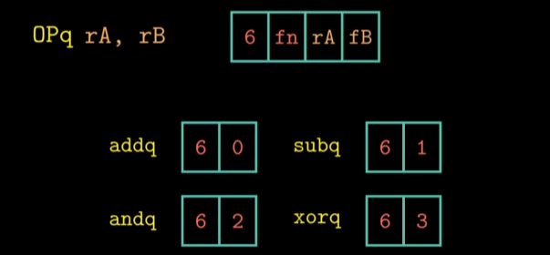
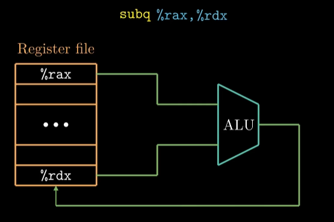
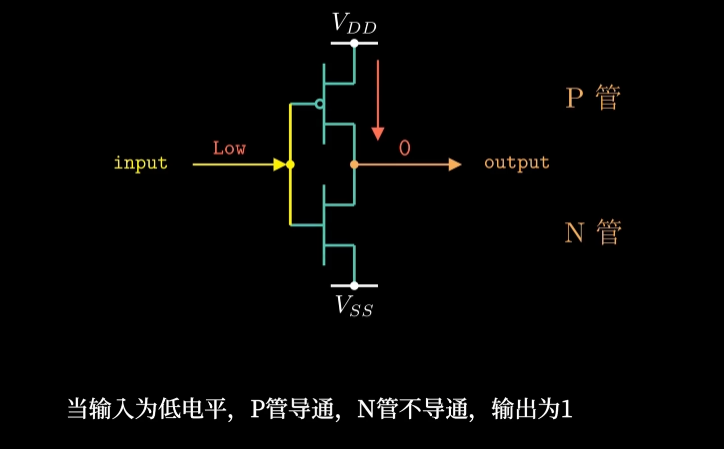

# 指令系统结构

Y86-64，模仿X86-64系统实现的简化版

## 对数据传送指令进行编码

指令的第一个字节代表指令的类型，分为两部分，每个部分4bit，高4位代表指令代码，低4位代表指令功能

当指令中有寄存器类型的操作数时，会附加一个字节，称为寄存器指示符字节，用来指定1个或2个寄存器，因此还需要对寄存器进行编码

### 寄存器编码

寄存器编号用十六进制数0~0xE表示，0xF表示没有寄存器操作数


### 4个整数操作指令

addq、subq、andq、xorq，他们只能对寄存器进行操作，而x86系统还允许对内存数据进行这些操作。还会设置3个条件码ZF、SF、OF（零、符号和溢出）。他们的**指令代码**相同，但功能不同



### 7个条件跳转指令


### 6个条件转送指令


### halt指令

x86-64也有hlt指令，但不用


### call和ret


### pushq和popq


### 示例


其中rmmovq的指令代码和功能代码分别位0x4和0x0

寄存器%rsp对应0x4，基址寄存器%rdx对应0x2

指令编码中偏移量占8个字节，我们需要在该偏移量的前面通过填0来补齐8个字节。由于x86-64采用小端法存储，因此需要对偏移量进行字节反序操作，最终得到长度位10个字节的二进制指令。

### 程序状态码

描述了程序执行的总体状态


1表示正常运行，2表示执行了halt，3表示程序试图从非法地址读取数据或者向非法地址写入数据，4表示程序遇到了非法指令。

# 数字电路与处理器设计

## 寄存器文件

在处理器内部，寄存器文件和算术逻辑单元（ALU）是串联的，寄存器文件的输出端口与ALU的输入端口相连



寄存器文件有一个读端口一个写端口，端口的数据位宽是64位，规定读写操作公用地址线，由于一共15个寄存器，因此地址线宽度只需要4位


### 寄存器文件内部结构


当执行读取操作时，使用地址线来传输寄存器的编号，多路选择器根据地址信号筛选出寄存器的值，最终数值会通过输出信号输出，红线和白线为时钟信号和复位信号


输入数据信号线与每一个寄存器单元都相连，能不能执行写操作由we信号线来确定，we是write enable的缩写，这个例子中地址信号线是读操作和写操作共用的，经过地址解析后的信号与we信号共同来确定对哪个寄存器执行写操作

## 数字电路相关知识

逻辑门用晶体管和电路实现，cmos管（分为P管和N管）

非门的基本组成和工作原理



与门和或门实现起来不如与非门和或非门高效，所以在设计CMOS电路时最好用与非门和或非门实现

### 多路选择器


### 寄存器文件内部的存储部件

D触发器


门级实现（与非门）


#### Verilog实现

```verilog
module dflipflop(
	input		D,
    input		C,
    input		G,
    output reg	Q
);
    always @(posedge C) begin
        if(G) Q<=D;
    end
endmodule
```

D、C、G表示输入，Q表示输出。这条always语句表示当时钟C上升沿的时候，如果G为1，就把输入D的值赋给触发器的输出Q，否则Q保持不变

Verrlog程序是并行执行的，而C语言是串行实现的。

#### 组合逻辑与时序逻辑

差别：是否含有存储单元

组合只与当前的输入有关，而时序不仅如此，与原来的状态也有关。

#### 3种语句

1. assign，用于描述组合逻辑
2. always @(posedge clock)，用于描述时序逻辑
3. 模块调用

## Y86-64的顺序实现

```c
long sum(long *start, long count)
{
    long sum=0;
    while(count){
        sum+=*start;
        start ++;
        count --;
    }
    return sum;
}
```

对应的Y86汇编代码，即Y86产生的机器代码

```assembly
sum:									0x056:
	irmovq $8, %r8						0x056:30f80800000000000000
	irmovq $1, %r9						0x060:30f90100000000000000
	xorq %rax, %rax						0x06a:6300
	andq %rsi, %rsi						0x06c:6266
	jmp test							0x06e:7087000000000000000
loop:									0x077:
	mrmovq (%rdi), %r10					0x077:50a70000000000000000
	addq %r10, %rax						0x081:60a0
	...									...
```

## 6个指令执行基本阶段

并不是所有指令都要执行这6个阶段


### 取指阶段

会根据指令代码判断指令是否含有寄存器指示符，是否含有常数，从而计算出当前指令的指令长度，是否含有常数，从而计算出当前指令的指令长度。

### 译码阶段

从寄存器文件中读取数据

### 执行阶段

3类操作

1. 执行算术逻辑运算
2. 计算内存引用的有效地址
3. 针对push和pop指令

### 访存阶段

针对内存的读写操作，既可以从内存读，也可以往内存写。

### 写回阶段

向寄存器文件内写数据

### 更新PC

将PCC设置成下一条指令的**地址**

### 示例：

#### 减法指令操作

不用访问内存


#### 数据传送指令操作（寄存器操作）

不用从寄存器读取数据，也不用ALU，因此ALU执行+0的操作


#### 数据传送指令操作（基址操作）


#### pushq操作流程

译码阶段不仅需要读%rdx的值，还需要读%rsp的值，因为指令pushq要将寄存器%rdx的值保存到栈（内存）上


#### 跳转指令

标号为Cond的硬件单元根据条件码和指令功能来判断是否执行跳转，这个模块产生一个信号Cnd，如果Cnd等于1执行跳转，等于0不执行跳转

