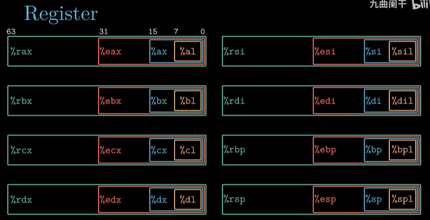
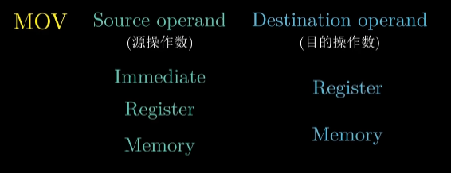
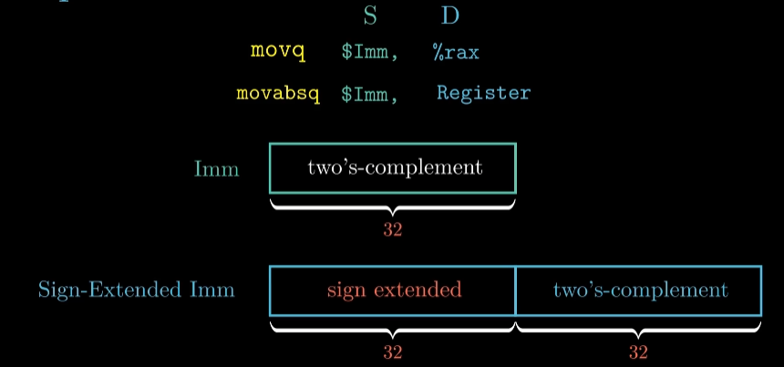
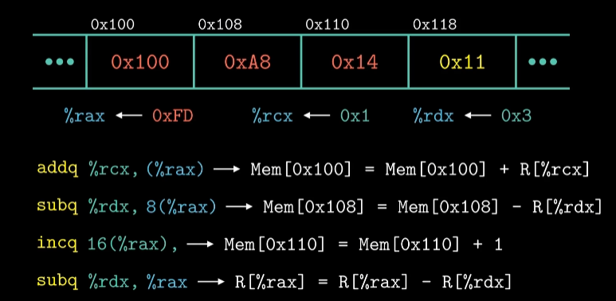
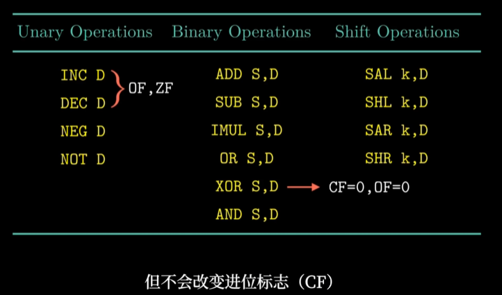
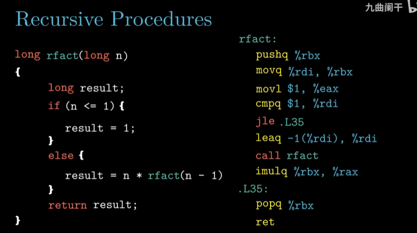
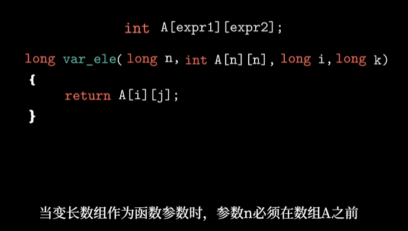

# 第三章

## 3.1 程序的机器级表示

### 汇编

```shell
gcc -Og -S mstore.c
```

产生汇编文件

其中以“.”开头是指导汇编器和链接器工作的伪指令，可以忽略

剩余部分与原C代码相关


```assembly
multstore:
	pushq	%rbx 			#调用者保存，被送到栈中
	movq	%rdx,	%rbx	#将寄存器rdx里的值送到rbx中保存，rdx里是dest的地址
	call	mult2			#调用函数，返回值保存在寄存器%rax
	movq	%rax,(%rbx)		#将寄存器rax的值送到内存中，内存的地址就存放在rbx中
	popq	%rbx			#从栈中弹出
	ret
```

### 生成机器代码

```shell
gcc -o mstore.c 		#生成机器代码
objdump -d mstore.o		#反汇编器，将机器代码编程汇编代码	
```


### 寄存器

在Intel x86-64的处理器中包含了16个通用目的的寄存器


#### 调用者保存寄存器（Caller）/被调用者保存寄存器（Callee）

P173页明确了两者的区别，**被调用者保存**是指当前栈桢修改寄存器的值时，需先压入栈中保存，返回前再弹出旧值；**调用者保存**是指当前栈桢可随意修改寄存器的值，因此父桢在调用当前桢之前需保存好寄存器中的数据。


A调用B，则A称为调用者，B称为被调用者

逻辑上寄存器rbx的内容在调用函数B的前后应该保持一致（栈），因此可以用两种方式，一种是被调用者保存（也就是B），另一种是调用者保存（也就是A）（如上所述）

不同的寄存器被定义成不同的策略


#### x86-64处理器中数据类型的大小


## 3.2 寄存器与数据传送指令

### 寄存器

随着处理器的升级，寄存器大小从16位到32位，再到64位。寄存器的个数也从8个变为16个



各个寄存器都有相应的作用：


### 指令

指令分为操作码和操作数，操作码决定了CPU执行操作的类型


#### 操作数大致可以分为三类：立即数，寄存器，内存引用

立即数：$8（\$+整数）

寄存器：8-64位的寄存器都可以作为操作数。带（）的寄存器表示内存引用

内存引用：通常将内存抽象成一个字节数组，当需要从内存中存取数据时，需要获得目的数据的起始地址`addr`，以及数据长度`b`。用$M_b[addr]$表示内存引用。

最常用的内存引用包括四部分：一个立即数、一个基址寄存器、一个变址寄存器和一个比例因子。引用数组元素时，会用到这种通用的形式，有效地址是通过立即数与基址寄存器的值相加，再加上变址寄存器与比例因子的乘积，比例因子s的举止必须是1、2、4、8。具体的计算方法如图所示：


比例因子的取值与源代码中定义的数组类型是相关的，编译器会根据数组的类型来确定比例因子的数值。例如char类型的数组，比例因子就是1，int类型，比例因子就是4，double类型比例因子就是8。

其他内存引用形式都是变种


特别注意不带\$的立即数，和带了括号的寄存器

#### 指令的结构



源操作数可以为立即数、寄存器、内存引用。而目的操作数要么是寄存器，要么是内存引用，不能是立即数

> x86-64处理器有一条限制：mov指令的源操作数和目的操作数不能都是内存的地址。因此需要两条指令
>
> 

指令的后缀与寄存器的大小一定要匹配

### mov指令的特殊情况

- 当movq指令的源操作数是立即数时，该立即数只能是32位补码表示，然后对该数值进行符号位扩展，将得到的64位数传送到目的位置。

​		当立即数是64位时，用movabsq，目的操作数只能是寄存器



- 当movl的目的操作数是寄存器是，它会把该寄存器的高4字节设置为0。任何位寄存器生成32位值得指令都会把该寄存器的高位部分置为0

### 源操作数的数位小于目的操作数时

 需要对目的操作数剩余的字节进行零扩展或者符号位扩展


> 符号扩展多一个movslq，为什么零扩展没用movzlq的指令呢？
>
> 因为可以用movl实现

cltq的源操作数总是寄存器eax，目的操作数总是寄存器rax

## 3.3 栈与数据传送指令


主存储器：内存

MAR：地址寄存器

MDR：数据寄存器

CPU:

控制器：

​	PC：程序计数器，存放当前欲执行指令的**地址**，可自动加1形成下一条指令，与MAR之间又一条直接的通路

​	IR：指令计数器，存放当前的指令，内容来自主存的MDR，操作码送到CU，地址码送到MAR

​	CU：控制单元，接收IR中的操作码

运算器：

​	ACC：累加器

​	MQ：乘商寄存器

​	X：操作数寄存器

​	IX：变址寄存器

​	BR：基址寄存器

寄存器是CPU内数据存储的部件，只不过容量比较小

数据从硬盘到内存，再从内存到寄存器计算，计算完从寄存器再到内存

### 数据传输示例：

第一个参数存储在%rdi，第二个参数存储在%rsi


`push`操作可以用如下两个操作代替，区别是`push`只占1字节，而下面两个共占8字节。`pop`同理

`subq $8,%rsp`改变栈顶地址

`movq %rax,(%rsp)`将数据写到栈顶地址所指向的位置

`pop`后`0x123`依然存在在`0x100`内，直到下次`push`操作再覆盖

## 算术和逻辑操作的指令

#### LEAQ

`leaq S,D`加载有效地址，相当于取地址符号&，64位CPU上地址是64，所以不存在leaw等。将S的地址给D（换成mov就是将地址的值给D）

`leaq 7(%rdx,%rdx,4),%rax`，将有效地址复制到`%rax`中，有效地址的计算公式和内存引用一致


这条指令是直接把$5x+7$复制到`%rax`，而不是$5x+7$里的值


#### 一元操作


操作数可以是寄存器，也可以是内存地址

### 二元操作


第一个操作数可以是三种，第二个操作数不能是立即数



#### 移位运算

左移相同，右移分为算术和逻辑


移位量只允许用寄存器`%cl`存储，大小为8


移动双字低5位决定，四字低6位


乘法指令会消耗更多时间

#### 其他指令


## 指令与条件码

ALU：算术逻辑单元


减法操作用到ALU，计算完后ALU设置条件码寄存器

### 条件码寄存器

条件码寄存器是由CPU来维护的，长度是单个比特位


CF：进位标志符，当需要进1是置1

ZF：零标志，当计算结果为0是置1

SF：符号标志，当最近的操作结果小于0时置1

OF：溢出标志，针对有符号数，最近的操作导致正溢出或负溢出时置1 

条件码寄存器的值，是由ALU在执行算术和运算指令时写入的，如下图这些指令



另外**还有两个指令**可以设置条件码寄存器：`cmp`和`test`指令

`cmpq %rax,%rdx` 与 `subq`类似，也是利用差来设置，不同的是cmp指令只是设置条件码寄存器，不会改变目的寄存器的值，test同理

例子：


`sete`：e为equal，在相等时设置。`setl`：l为less


其他：


针对无符号数，指令`cmp`会设置进位标志


## 3.6 跳转指令和循环

跳转语句


将判断语句改成另一种写法


基于条件语句(`cmovge`)的代码比基于跳转语句的代码效率高


现代处理器通过流水线来获得高性能，当遇到跳转指令时，处理器会根据分支预测器来猜测每条跳转指令是否执行，当发生错误预测时，会浪费大量的时间，导致程序性能严重下降

`for,while,do_while`等循环语句是通过条件测试与跳转的结合来实现的

实现N的阶乘示例

### do_while


### while


对比两者，判断和执行计算的先后顺序不同

### For循环


两者汇编代码 -Og选项产生


### switch语句


C代码将跳转表声明为一个长度为7的数组，每个元素都是一个指向代码位置的指针

缺失的case1和case5用默认标号

处理很长分支是，switch比if_else高效，因为switch只要一次跳转

## 3.7 过程（函数调用）


### 指令call和指令ret


程序指令寄存器：`%rip`


call指令对应multstore函数的调用，call不仅把multistore的第一条指令的地址写入到`%rip`中，以此实现函数调用，同时还要将返回地址压入栈中，返回地址就是函数multistore调用执行完毕后，下一条指令的地址。

当函数multstore执行完毕，指令ret从栈中将返回地址弹出，写入到指令寄存器`%rip`中，函数返回，继续执行main函数中相关的操作

### 参数传递

寄存器只能传递6个参数，多的参数要用栈传递，按照8个字节单位对齐来传递（局部变量不用对齐），虽然a4只有1个字节，仍然分配了8个字节的栈


寄存器的使用是有特殊顺序规定的


当函数对局部变量使用取地址符时，要在栈中开辟出空间（即便不用取地址符，应该也要开辟）

例一：


例二：


参数要对齐8字节，局部变量不用

递归调用例子




## 3.8 数组的分配和访问

### 普通数组的访问

指针的+1和数组元素类型大小有关：char 占一个字节，所以地址+1，int占4个字节，所以地址+4

数组的访问两种方式：1. `A[5] ` 2. `*(p+3)` 

### 二维数组的访问

二维数组在内存中是按照“行优先”的顺序进行存储的


地址计算：$x_D$表示数组起始地址，$L$的大小和元素类型有关，$C$一行的数组大小


### 编译器对定长多维数组的优化


计算内积为例，首先用四行代码计算三个数组元素的地址


%rdi存储Aptr，%rcx存储Bptr，%rsi存储Bend


这两个addq分别对Aptr和Bptr加一，指向下两个相乘的数据

最后比较Bptr的值和Bend来确定是否达到了最后一个数据

### 变长数组




## 3.9 结构体和联合体


`movl (%rdi),%eax`将%rdi里的值传给%eax，%rdi里存放的是结构体的地址(也就是第一个元素的地址)，而这个地址里存放的是第一个元素。

`movl %eax,4(%rdi)`：4(%rdi)这个地址里存放的是j的元素地址，也就是r的值+4

### 结构体的数据存储


地址对齐原则：任何K字节的基本对象的地址必须是K的倍数，末端会按照对齐原则进行填充，对齐上限（对其基数）根据系统不同，64位为8字节

### 联合体的数据存储


联合体中的所有字段共享同一存储区域，联合体的大小取决于最大字段的大小

如果两个字段互斥，可以把两个字段申明成联合体，可以节省空间

## 缓冲区溢出


实际上分配了24个字节的空间，如果输入小于23（加上"\0"作为结束标志）倒没什么大问题，如果超过24字节，会覆盖返回地址，导致程序返回到一个意想不到的地方


### 对抗缓冲区溢出攻击

- 栈随机化

  - 栈的位置在程序每次运行时都有变化，64位Linux系统中，栈地址范围：0x7fff0001b698~0x7ffffffaa4a8
  - 使用的是地址空间布局随机化技术（ASLR）

- 栈破坏检测

  - canary金丝雀值，在汇编代码中加入

  - 在缓冲区与栈保存的状态值之间存储一个特殊值canary，金丝雀值是每次随机产生的，在函数返回之前，检测金丝雀值是否被修改来判断是否遭受攻击

    

  - 

    从内存中读取一个数值，存放的位置与程序中定义的缓冲区是相邻的，%fs:40可以简单理解为一个内存地址，属于特殊的段，被操作系统标记为只读，最后用xor检查是否被修改

- 限制可执行代码区域

  - 消除攻击者向系统中插入可执行代码的能力
  - 引入不可执行位，把可读和可执行位分开
