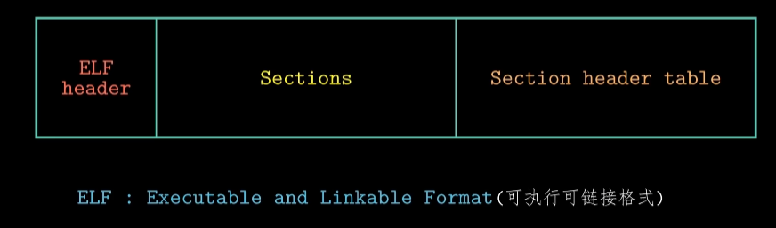
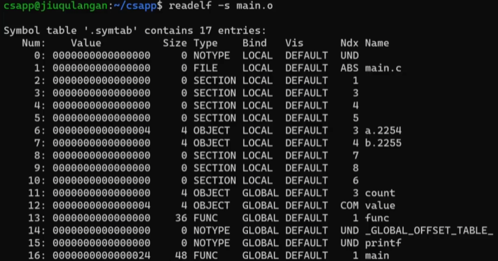

# 编译器驱动程序

### 预处理

```shell
cpp -o main.i main.c #cpp:c预处理器
gcc -E -o main.i main.c
```

得到的 .i 文件是预处理后的文件，一个ASCII码的中间文件

### 编译

```shell
cc -S -o main.s main.i #cc:c编译器
gcc -S -o main.s mian.i
```

得到汇编文件main.s

### 汇编

将main.s 翻译成一个可重定位目标文件main.o

```shell
as -o main.o main.s #as:汇编器
gcc -c
```

### 链接

将可重定位目标文件以及必要的系统文件组合起来，生成一个可执行目标文件的操作

```shell
ld -static -o prog main.o sum.o
```


除了main.o和sum.o外还需要五个文件：`crt1.o /crti.o/ crtbeginT.o /crtend.o/ crtn.o`crt:c runtime的缩写

### 运行

shell调用操作系统中的加载器（loader）函数来实现的，加载器将可执行文件prog种代码和数据复制到内存中，然后将CPU的控制权转移到prog的程序开头，随后程序prog开始执行

# 可重定位目标文件


每个可重定位文件（.o）可大致分为三个部分



### 使用readelf命令查看.o文件， -h表示只看header


#### 开头的16个字节

最开始的四个字节被称为ELF的魔数，用来确认文件类型，操作系统加载可执行文件时，会确认魔数是否正确


#### Type

可重定位文件

#### size of this headers

头部一共64字节，也就是ELF header一共64字节。则section起始位置位0x40

#### start of section headers

最后的表在elf文件种起始位置时1064

#### Number of section headers

一共13个表项

#### Size of section headers

一个表64字节


### -S 查看Section表


.text：存放已编译好的机器代码：`objdump -s -d main.o`反汇编器

.data：存放已初始化的全局变量和静态变量的值

- 由于采用小端法，存储的字节顺序与实际数值的字节顺序相反（Contents of section .data）

.bss：未初始化或初始化为0的全局变量和静态变量

- 实际是占位符，4字节，为了节省空间，当程序运行时，会在内存中分配这些变量，并把初始值设为0

.rodata：存放只读数据。如printf语句中的格式串和switch语句中的跳转表


.symtab，符号：可以看作链接中的粘合剂



Type：类型，如func 和 main表示的就是函数。OBJECT：数据对象，count和value

Bind：Global 全局可见

Ndx：索引值，与具体的section有对应关系，可以看section header table来确定。如索引1就在.text里

> COMMON	未初始化的全局变量
>
> .bss				未初始化的静态变量，初始化为0的全局或静态变量

Value：函数相对于.text section起始位置的偏移量（或者其他对应section）

Size：所占字节数

Vis：在c语言中未使用，可忽略

> 三种symblos（应该是对应Bind）
>
> - Global Symbols（全局符号）:main.c中定义的函数func以及count value全局变量
> - Externals Symbols（外部符号）：被其他模块定义，被该模块引用
> - Local Symbols（局部符号）：只能在文件内部使用
>   - static

# 符号解析与静态库

强符号：函数和已初始化的全局变量

弱符号：未初始化的全局变量

连接器不允许有多个同名的强符号出现，同名弱符号会覆盖，在编译时添加-fno-common的编译选项，当遇到多重定义的全局符号时，出现错误。或-Werror，会把所有警告变成错误

### 静态库

linux系统中，以一种称为archive的特殊文件格式存放在磁盘上，可重定位目标文件集合


扫描的过程中，连接器一共维护了三个集合

集合E：发现可重定位目标文件，就放入该集合，链接即将完成时这些文件会组成可执行文件

集合U：引用了但尚未定义的符号

集合D：已定义的符号


如果扫描完后集合U非空，则传出错误并终止

如果调换两个文件的输入顺序，就会出错，因为线找静态库，此使U时空的，再扫描main.o，里面的符号就不会被找到定义，因此出错

# 重定位

两个步骤

- 重定位节和符号定义
- 重定位符号引用

重定位条目：汇编时遇到最终位置不确定的符号引用时，生成，用来告诉链接器如何修改这个条目，对于代码的重定位条目，放在.rel.text中，已初始化数据的重定位条目放在.rel.data中

结构体定义


# 可执行程序


左可执行文件，又.o文件


代码段和数据段先进入内存，代码段的0x69c大小的内容包括ELF header、程序头部表以及.init、.text和.rodata节的内容

数据段多出的8个字节存放.bss section，需要初始化为0

# 共享库

链接过程知识复制了符号表和一些重定位信息，链接器会发现一个动态连接器，也是个.so文件，由动态连接器执行可重定位

RTLD_LAZY：推迟符号解析至代码执行时

