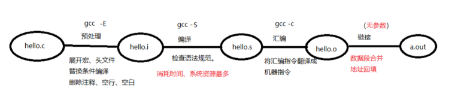
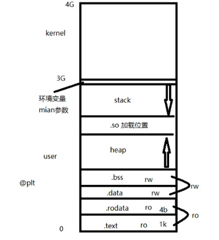

# 四步骤

预处理、编译、汇编、链接



```shell
:~$ gcc -I    指定头文件所在目录位置
:~$ gcc -c    只做预处理，编译，汇编。得到二进制文件
:~$ gcc -Wall 显示所有警告信息
:~$ gcc -D    向程序中“动态”注册宏定义
:~$ gcc -l    指定动态库库名
:~$ gcc -L    指定动态库路径
```

### 链接部分

在使用动态库时，会有地址回填的步骤，写在源代码里的函数，相对main函数偏移是一定的，连接时，回填main函数地址之后，其他源代码里的函数也就得到了地址。

动态库里的函数会用一个@plt来标识，当动态库加载到内存时，再用加载进去的地址将@plt替换掉。

## 数据段合并

4K—内存页（page）：使用内存时一次至少一个内存页

磁盘使用一次至少512



因此合并数据段就是将可以合并的数据合在一起以节省空间，处于链接阶段
