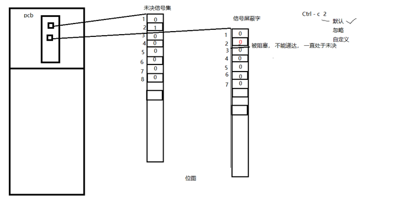
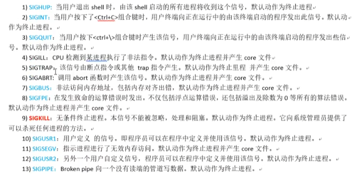
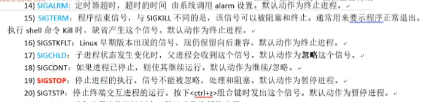
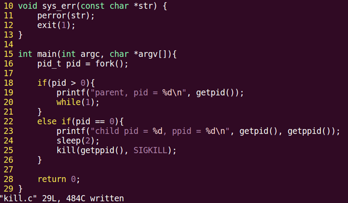
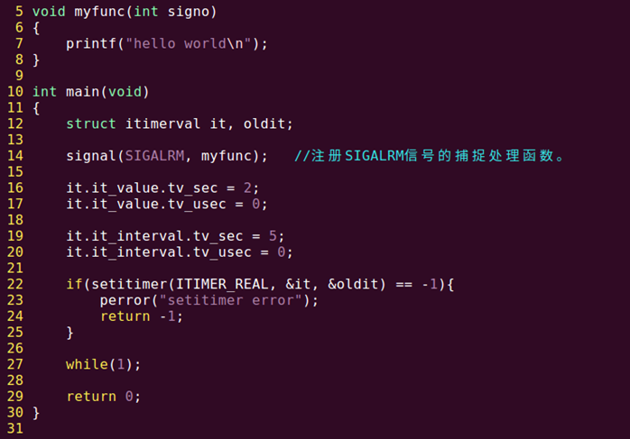
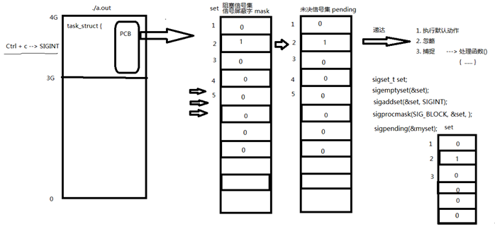
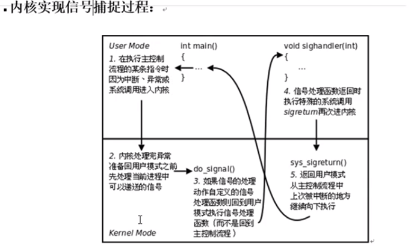
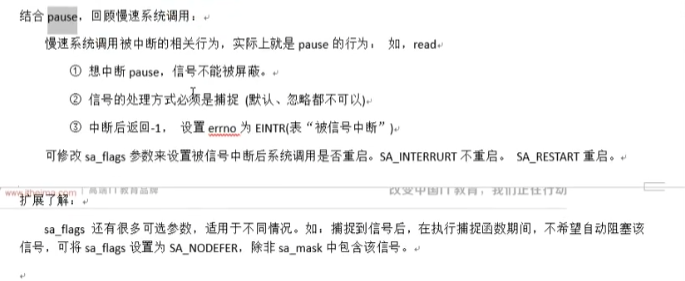

# 信号

## 信号的概念

信号共性：

1. 简单
2. 不能携带大量信息
3. 满足条件才发送

信号的特质：

信号是软件层面上的“中断”。一旦信号产生，无论程序执行到什么位置，必须立即停止运行，处理信号，处理结束，再继续执行后续指令。

所有信号的产生及处理全部都是由【内核】完成的。

信号相关的概念：

- 产生信号：

1. 按键产生
2. 系统调用产生
3. 软件条件产生
4. 硬件异常产生
5. 命令产生

- 概念：

**未决**：产生与递达之间状态。 等待（Pending）状态

**递达**：产生并且送达到进程。直接被内核处理掉。

**信号处理方式**： 执行默认处理动作、忽略、捕捉（自定义）

**阻塞信号集**（信号屏蔽字）： 本质：位图。用来记录信号的屏蔽状态。一旦被屏蔽的信号，在解除屏蔽前，一直处于未决态。

**未决信号集**：本质：位图。用来记录信号的处理状态。该信号集中的信号，表示，已经产生，但尚未被处理。

>  阻塞信号集和未决信号集在PCB表里

## 信号屏蔽字和未决信号集

阻塞信号集和未决信号集在PCB表里



## 信号四要素和常规信号一览

```shell
kill -l #查看当前系统中常规信号
```

信号4要素：编号、名称、对应事件、默认处理动作。

> 信号使用之前，应先确定其4要素，而后再用！！！





## kill函数和kill命令

```c
#include <signal.h>
int kill(pid_t pid, int signum);
//参数：
pid:  
	> 0：发送信号给指定进程
	= 0：发送信号给跟调用kill函数的那个进程处于同一进程组的进程。
	< -1: 取绝对值，发送信号给该绝对值所对应的进程组的所有组员。
	= -1：发送信号给，有权限发送的所有进程。
signum：待发送的信号
//返回值：
成功： 0
失败： -1 errno    
```

小例子，子进程发送信号kill父进程：



kill -9 -groupname 杀一个进程组

权限保护：super用户(root)可以发送信号给任意用户，普通用户是不能向系统用户发送信号的。kill -9 (root用户的pid)是不可以的。同样，普通用户也不能向其他普通用户发送信号，终止其进程。只能向自己创建的进程发送信号。普通用户基本规则是：发送者实际或有效用户ID == 接收者实际或有效用户ID

## alarm函数

alarm 函数：使用自然计时法。

定时发送SIGALRM给当前进程。

```c
unsigned int alarm(unsigned int seconds);
/*
seconds：定时秒数

返回值：上次定时剩余时间。

无错误现象。

alarm（0）； 取消闹钟。
*/
```

time 命令 ： 查看程序执行时间。  实际时间 = 用户时间 + 内核时间 + 等待时间。-->优化瓶颈 IO

## setitimer函数

```c
int setitimer(int which, const struct itimerval *new_value, struct itimerval *old_value);
```

参数：

```c
which：
ITIMER_REAL： //采用自然计时。 ——> SIGALRM
ITIMER_VIRTUAL: //采用用户空间计时  ---> SIGVTALRM
ITIMER_PROF: 采用内核+用户空间计时 ---> SIGPROF
		
new_value：定时秒数
类型：
struct itimerval {
    struct timeval it_interval;/*next value*/--->// 周期定时秒数,间隔秒数到了重新设置
    struct timeval it_value;/*current value*/
};
struct timeval {
time_t      tv_sec;         /* seconds */
suseconds_t tv_usec;        /* micros  econds */
};

old_value：传出参数，上次定时剩余时间。
```

 返回值：

```
成功： 0
失败： -1 errno
```

例子

```c
struct itimerval new_t;	
struct itimerval old_t;	

new_t.it_interval.tv_sec = 0;
new_t.it_interval.tv_usec = 0;
new_t.it_value.tv_sec = 1;
new_t.it_value.tv_usec = 0;

int ret = setitimer(&new_t, &old_t);  定时1秒

```

小例子，使用setitimer定时，向屏幕打印信息：



第一次信息打印是两秒间隔，之后都是5秒间隔打印一次。可以理解为第一次是有个定时器，什么时候触发打印，之后就是间隔时间。

## 信号集操作函数



```c
//信号集操作函数：
	sigset_t set;  //自定义信号集。
	sigemptyset(sigset_t *set);	//清空信号集
	sigfillset(sigset_t *set);	//全部置1
	sigaddset(sigset_t *set, int signum);	//将一个信号添加到集合中
	sigdelset(sigset_t *set, int signum);	//将一个信号从集合中移除
	sigismember（const sigset_t *set，int signum); //判断一个信号是否在集合中。在-->1，不在-->0
//设置信号屏蔽字和解除屏蔽：
	int sigprocmask(int how, const sigset_t *set, sigset_t *oldset);
	how:	SIG_BLOCK:	//设置阻塞
			SIG_UNBLOCK:	//取消阻塞
			SIG_SETMASK:	//用自定义set替换mask。
	set：	//自定义set
	oldset：//旧有的 mask。
//查看未决信号集：
	int sigpending(sigset_t *set);
	set： //传出的 未决信号集。
 	返回值：成功0，失败-1；
```

### 信号集操作函数练习

```c
1.	#include <stdio.h>  
2.	#include <signal.h>  
3.	#include <stdlib.h>  
4.	#include <string.h>  
5.	#include <unistd.h>  
6.	#include <errno.h>  
7.	#include <pthread.h>  
8.	  
9.	void sys_err(const char *str)  
10.	{  
11.	    perror(str);  
12.	    exit(1);  
13.	}  
14.	  
15.	void print_set(sigset_t *set)  
16.	{  
17.	    int i;  
18.	    for (i = 1; i<32; i++) {  
19.	        if (sigismember(set, i))   
20.	            putchar('1');  
21.	        else   
22.	            putchar('0');  
23.	    }  
24.	    printf("\n");  
25.	}  
26.	int main(int argc, char *argv[])  
27.	{  
28.	    sigset_t set, oldset, pedset;  
29.	    int ret = 0;  
30.	  
31.	    sigemptyset(&set);  
32.	    sigaddset(&set, SIGINT);  
33.	    sigaddset(&set, SIGQUIT);  
34.	    sigaddset(&set, SIGBUS);  
35.	    sigaddset(&set, SIGKILL);  
36.	  
37.	    ret = sigprocmask(SIG_BLOCK, &set, &oldset);//阻塞信号集为mask
38.	    if (ret == -1)  
39.	        sys_err("sigprocmask error");  
40.	  
41.	    while (1) {  
42.	        ret = sigpending(&pedset);  
43.	        print_set(&pedset);  
44.	        sleep(1);  
45.	    }  
46.	  
47.	    return 0;  
48.	}  
```

## 信号捕捉

### signal()

```c
#include <signal.h>
typedef void (*sighandler_t)(int);
sighandler_t signal(int signum, sighandler_t handler);
//参数：
	signum ：待捕捉信号
	handler：捕捉信号后的操纵函数
//返回值
	成功：返回signal handel的前一个值
    失败：SIG_ERR
```

### sigaction()

```c
#include <signal.h>
int sigaction(int signum, const struct sigaction *act, struct sigaction *oldact);

//struct sigaction
struct sigaction{
   void		(*sa_handler)(int);
   void		(*sa_sigaction)(int, siginfo_t *, void *);
   sigset_t	sa_mask;
   int		sa_flages；
   void 	(*sa_restorer)(void);
};
//返回值
成功：返回0
失败：返回-1，设置errn
```

### 信号捕捉特性：

1. 捕捉函数执行期间，信号屏蔽字 由 mask --> sa_mask , 捕捉函数执行结束。 恢复回mask
2. 捕捉函数执行期间，本信号自动被屏蔽(sa_flgs = 0).
3. 捕捉函数执行期间，被屏蔽信号多次发送，解除屏蔽后只处理一次！

### 内核实现信号捕捉简析



## SIGCHLD信号

### 产生条件

1. 子进程终止时
2. 子进程接收到SIGSTOP
3. 子进程处于停止态，接收到SIGCONT后唤醒时

下面是一个例子，创建子进程，并使用信号回收：

```c
//
// Created by alex on 2022/4/19.
//
#include <stdio.h>
#include <signal.h>
#include <stdlib.h>
#include <string.h>
#include <sys/wait.h>
#include <fcntl.h>
#include <errno.h>
#include <unistd.h>
#include <pthread.h>

void sys_error(const char * str){
    perror(str);
    exit(1);
}

void sig_catch(int singo){
    int status;
    pid_t wpid;
    
    while((wpid=waitpid(-1,&status,0))!=-1) {//循环回收（调用一次wait/waitpid只能回收一个子进程），如果在内核调用sig_catch时有多个子进程结束，则一次全回收，否则可能会因为阻塞了SIGCHLD而产生僵尸子进程
        if (WIFEXITED(status)) {
            int ret = WEXITSTATUS(status);
            printf("child done success,ret=%d\n", ret);
        }
        if (WIFSIGNALED(status)) {//如果异常结束，获取异常信号
            int sig = WTERMSIG(status);
            printf("child done error ,sig=%d\n", sig);
        }
        printf("------catch child id %d\n", wpid);
    }
    return;
}


int main(int argc,char *argv[])
{
    pid_t pid;
    //阻塞
    sigset_t sigset,oldset;
    sigemptyset(&sigset);
    sigaddset(&sigset,SIGCHLD);
    sigprocmask(SIG_BLOCK,&sigset,&oldset);//阻塞CHILD信号，防止信号捕捉还没绑定，子进程就结束了。
    
    int i;
    for(i=0;i<10;++i){
        pid=fork();
        if(pid==0){
            break;
        }
    }
    if(i==10){
        struct sigaction act;
        act.sa_handler=sig_catch;
        sigemptyset(&act.sa_mask);
        act.sa_flags=0;
       
        sigaction(SIGCHLD,&act,NULL);
        
        sigprocmask(SIG_UNBLOCK,&sigset,&oldset);//绑定好信号捕捉后，解除阻塞
        
        printf("i'm parent ,pid=%d\n",getpid());
        while(1);
    }else{
        printf("i'm child pid = %d \n",getpid());
        return i;
    }
    return 0;
}
```

可能会产生的问题

1. 一次回调只回收一个子进程这里。同时出现多个子进程死亡时，其中一个子进程死亡信号被捕捉，父进程去处理这个信号，此时其他子进程死亡信号发送过来，由于相同信号的不排队原则，就只会回收累积信号中的一个子进程。所以需要用循环来回收

2. 有可能父进程还没注册完捕捉函数，子进程就死亡了，解决这个问题的方法，首先是让子进程sleep，但这个不太科学。在fork之前注册也行，但这个也不是很科学。

   最科学的方法是在int i之前设置屏蔽，等父进程注册完捕捉函数再解除屏蔽。这样即使子进程先死亡了，信号也因为被屏蔽而无法到达父进程。解除屏蔽过后，父进程就能处理累积起来的信号了。

## 中断系统调用

### 慢速系统调用：

可能会使进程永久阻塞的一类。如果在阻塞期间收到一个信号，该系统调用就被中断，不再继续执行(早期)，也可以设定系统调用是否重启。如read, write, pause,wait…



