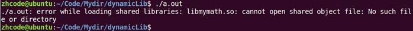

# 动态库制作

### 制作动态库的步骤

1. 生成位置无关的.o文件

   gcc -c add.c -o add.o -fPIC

   使用这个参数过后，生成的函数就和位置无关，挂上@plt标识，等待动态绑定

2. 使用gcc -shared 制作动态库

3. 编译可执行程序时指定所使用的动态库。-I(大写i):指定库名 -L:指定库路径

   gcc test.c -o a.out -I mymath -L ./lib

## 过程演示：

步骤一：生成位置无关的.o文件

 

步骤二：制作动态库 gcc -shared -o lib库名.so add.o sub.o div.o

 

步骤三：编译程序

文件分布如下：动态库在lib目录下，头文件在inc目录下

下面编译文件

步骤四：执行文件，出错

 

## 动态库加载错误原因及解决方式

出错原因分析：

链接器：       工作于链接阶段，工作时需要-l 和 -L

动态链接器：工作于程序运行阶段，工作时需要提供动态库所在目录位置

指定动态库路径并使其生效，然后再执行文件

通过环境变量指定动态库所在位置：export LD_LIBRARY_PATH=动态库路径

当关闭终端，再次执行a.out时，又报错。

这是因为，环境变量是进程的概念，关闭终端之后再打开，是两个进程，环境变量发生了变化。

要想永久生效，需要修改bash的配置文件：vi ~./bashrc

修改后要使配置文件立即生效：. .bashrc 或者source .bashrc 或者重开终端让其自己加载，再执行a.out就不会报错了

## 动态库加在错误原因及解决方式2

解决方式：

1. 通过环境变量：export LD_LIBRARY_PATH=动态库路径  ./a.out成功（临时生效，终端重启环境变量失效）
2. 永久生效：写入终端配置文件。.bashrc建议使用绝对路径。
   1. vi ~/.bashrc
   2. 写入export LD_LIBRARY_PATH=动态库路径  保存
   3. . .bashrc/ source .bashrc  / 重启终端  —>让修改后的.bashrc生效
   4. ./a.out成功
3. 拷贝自定义动态库到/lib(标准C库所在目录位置)
4. 配置文件法
   1. sudo vi /etc/ld.so.conf
   2. 写入 动态库绝对路径 保存
   3. sudo ldconfig -v 使配置文件生效。
   4. ./a.out 成功  —使用ldd a.out 查看