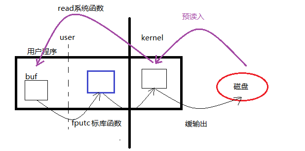
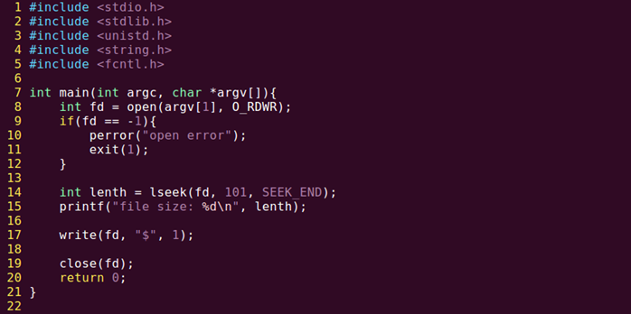
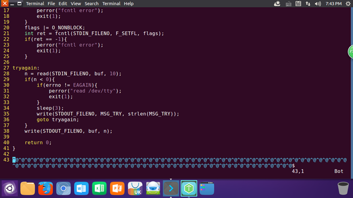

# open/close函数

### 头文件

```c
#include <sys/types.h>
#include <sys/stat.h>
#include <fcntl.h>

int open(const char *filepath, int flags);
int open(const char *filepath, int flags, mode_t mode);//mode_t 八进制整型 mode设置权限

int close(int fd);
```

### 常用参数

  pathname: 欲打开的文件路径名

  flags：文件打开方式：  #include <fcntl.h>

  O_RDONLY|O_WRONLY|O_RDWR O_CREAT|O_APPEND|O_TRUNC|O_EXCL|O_NONBLOCK ....

返回值：

成功： 打开文件所得到对应的 文件描述符（整数） 

失败： -1， 设置errno  

```c
#include <unistd.h>//使用open(),包含#include <sys/types.h>，#include <sys/stat.h>
#include <fcntl.h>//宏：O_RDONLY
#include <stdio.h>
#include <errno.h>//errno的头文件
#include <string.h>//strerror()的头文件，对errno进行翻译
int main(int argc, char * argv[]){
	int fd;
    fd=open("file.txt",O_RDONLY|O_CREAT|O_TRUNC,0644);//创建文件时，权限受umask影响，mode&umask
    
    printf("fd=%d\n",fd);
    
    close(fd);
    
    return 0;
}
```

O_TRUNC：相当于清空（把文件截断成0）

创建文件时，权限受umask影响，文件权限 = mode&~umask。

指定 0777(0表示8进制)，umask=0002，最后权限为0775

# read和write实现cp

## read

```c
#include <unistd.h>

ssize_t read(int fd,void *buf,size_t count);//ssize_t 有符号数，count缓冲区大小
//读完返回值为0，其他成功返回读到的字节数
```

### 参数

- fd：文件描述符
- buf：存数据的缓冲区
- count：缓冲区大小

### 返回值：

- 0：读到文件末尾
- 成功：读到的字节数
- 失败：-1，设置errno
- -1：并且errno = EAGAIN或EWOULDBLOCK，说明不是read失败，而是read在以非阻塞读一个设备文件（网络文件），并且文件无数据。

## write

```c
#include <unistd.h>

ssize_t write(int fd,const void *buf,size_t count);//ssize_t 有符号数，count实际要写出的大小
```

### 参数

- fd：文件描述符
- buf：待写出数据的缓冲区
- count：数据大小

### 返回值：

- 成功：写入的字节数
- 失败：-1，设置errno

## 实现cp操作

```c
//perror
void perror(const char *s);
```


```c
//read_cmp_wirte
#include <stdio.h>//perror
#include <stdlib.h>//exit(1)
#include <string.h>
#include <unistd.h>
#include <fcntl.h>

int main(int argc,char *argv[])
{
    char buf[1024];
    
    int n=0;
    
    int fd1=open(argv[1],O_RDONLY);// read
    if(fd1 == -1){
        perror("open argv1 error");
        exit(1);
    }
    int fd2=open(argv[2],O_RDWR|O_CREAT|O_TRUNC,0664);
    if(fd2 == -1){
        perror("open argv2 error");
        exit(1);
    }
    
    while((n=read(fd1,buf,1024))!=0){
        if(n < 0){
        	perror("read error");
        	break;
        }
        write(fd2, buf, n);
    }
    
    close(fd1);
    close(fd2);
    
    return 0;
}
```

用fputc写copy函数。由于fputc是用户函数，所以还是要调用write函数

```c
//read_cmp_fputc
#include <stdio.h>
#include <stdlib.h>

int main(void)
{
    FILE *fp,*fp_out;
    int n;
    
    fp=fopen("dict.txt","r");
    if(fp==NULL){
        perror("fopen error");
        exit(1);
    }
    fp_out=fopen("dict.cp","w");
    if(fp_out==NULL){
        perror("fopen error");
        exit(1);
    }
    
    while((n=fgetc(fp))!=EOF){
        fputc(n,fp_out);
    }
    
    fclose(fp);
    fclose(fp_out);
    
    return 0;
}
```

### 记录时间

strace ./read_cmp

> 如果将read_cmp_write.c 改成一次读一个字符，和fputc类似，那么这两个函数运行谁快呢？

如果把write 的buf设置成1，则buf一旦满了就会写入内核缓冲区，而内核缓冲区默认4096字节

而fputc虽然也是一个字符的读，但写入的是用户空间的缓冲区，而将用户空间写入内核的时间耗时巨大



## 缓冲区

read、write函数常常被称为Unbuffered I/O。指的是无用户级缓冲区，但不保证不适用内核缓冲区

## 补充：内核什么时候将东西写入磁盘

https://blog.csdn.net/zhangyanfei01/article/details/109524744


在上面的流程图里，所有的写操作最终到哪儿了呢？在最后面的__block_commit_write中，只是make dirty。然后大部分情况下你的函数调用就返回了（稍后再说balance_dirty_pages_ratelimited）。数据现在还在内存中的PageCache里，并没有真正写到硬盘。

为什么要这样实现，不直接写硬盘呢？原因就在于硬盘尤其是机械硬盘，性能是在是太慢了。一块服务器级别的万转盘，最坏随机访问平均延迟都是毫秒级别的，换算成IOPS只有100多不到200。设想一下，假如你的后端接口里每个用户来访问都需要一次随机磁盘IO，不管你多牛的服务器，每秒200的qps都将直接打爆你的硬盘，相信作为为百万/千万/过亿用户提供接口的你，这个是你绝对不能忍的。

Linux这么搞也是有副作用的，如果接下来服务器发生掉电，内存里东西全丢。所以Linux还有另外一个“补丁”-延迟写，帮我们缓解这个问题。注意下，我说的是缓解，并没有彻底解决。

再说下balance_dirty_pages_ratelimited，虽然绝大部分情况下，都是直接写到Page Cache里就返回了。但在一种情况下，用户进程必须得等待写入完成才可以返回，那就是对balance_dirty_pages_ratelimited的判断如果超出限制了。该函数判断当前脏页是否已经超过脏页上限dirty_bytes、dirty_ratio，超过了就必须得等待。这两个参数只有一个会生效，另外1个是0。拿dirty_ratio来说，如果设置的是30，就说明如果脏页比例超过内存的30%，则write函数调用就必须等待写入完成才能返回。可以在你的机器下的/proc/sys/vm/目录来查看这两个配置。

```bash
# cat /proc/sys/vm/dirty_bytes
0
# cat /proc/sys/vm/dirty_ratio
30
```

### 内核延迟写

内核是什么时候真正把数据写到硬盘中呢？为了快速摸清楚全貌，我想到的办法是用systemtap工具，找到内核写IO过程中的一个关键函数，然后在其中把函数调用堆栈打出来。查了半天资料以后，我决定用do_writepages这个函数。

```bash
#!/usr/bin/stap
probe kernel.function("do_writepages")
{
    printf("--------------------------------------------------------\n"); 
    print_backtrace(); 
    printf("--------------------------------------------------------\n"); 
}
```

systemtab跟踪以后，打印信息如下:

```bash
 0xffffffff8118efe0 : do_writepages+0x0/0x40 [kernel]
 0xffffffff8122d7d0 : __writeback_single_inode+0x40/0x220 [kernel]
 0xffffffff8122e414 : writeback_sb_inodes+0x1c4/0x490 [kernel]
 0xffffffff8122e77f : __writeback_inodes_wb+0x9f/0xd0 [kernel]
 0xffffffff8122efb3 : wb_writeback+0x263/0x2f0 [kernel]
 0xffffffff8122f35c : bdi_writeback_workfn+0x1cc/0x460 [kernel]
 0xffffffff810a881a : process_one_work+0x17a/0x440 [kernel]
 0xffffffff810a94e6 : worker_thread+0x126/0x3c0 [kernel]
 0xffffffff810b098f : kthread+0xcf/0xe0 [kernel]
 0xffffffff816b4f18 : ret_from_fork+0x58/0x90 [kernel]
```

从上面的输出我们可以看出，真正的写文件过程操作是由worker内核线程发出来的（和我们自己的应用程序进程没有半毛钱关系，此时我们的应用程序的write函数调用早就返回了）。这个worker线程写回是周期性执行的，它的周期取决于内核参数dirty_writeback_centisecs的设置，根据参数名也大概能看出来，它的**单位是百分之一秒**。

```bash
# cat /proc/sys/vm/dirty_writeback_centisecs
500
```

我查看到我的配置是500，就是说每5秒会周期性地来执行一遍。回顾我们的问题，我们最关心的问题的啥时候写入的，围绕这个思路不过多发散。于是沿着这个调用栈不断地跟踪，跳转，终于找到了下面的代码。如下代码里我们看到，如果是for_background模式，且over_bground_thresh判断成功，就会开始回写了。

```c
static long wb_writeback(struct bdi_writeback *wb,
                         struct wb_writeback_work *work)
{
    work->older_than_this = &oldest_jif;
    ...
    if (work->for_background && !over_bground_thresh(wb->bdi))
        break;
    ...

    if (work->for_kupdate) {
        oldest_jif = jiffies -
                msecs_to_jiffies(dirty_expire_interval * 10);
    } else ...
}
static long wb_check_background_flush(struct bdi_writeback *wb)
{
    if (over_bground_thresh(wb->bdi)) {
           ...
        return wb_writeback(wb, &work);
    }
}
```

那么`over_bground_thresh`函数判断的是啥呢？其实就是判断当前的脏页是不是超过内核参数里dirty_background_ratio或dirty_background_bytes的配置，没超过的话就不写了（代码位于fs/fs-writeback.c：1440，限于篇幅我就不贴了）。这两个参数只有一个会真正生效，其中dirty_background_ratio配置的是比例、dirty_background_bytes配置的是字节。

在我的机器上的这两个参数配置如下，表示脏页比例超过10%就开始回写。

```bash
# cat /proc/sys/vm/dirty_background_bytes
0
# cat /proc/sys/vm/dirty_background_ratio
10
```

那如果脏页一直都不超过这个比例怎么办呢，就不写了吗？ 不是的。在上面的wb_writeback函数中我们看到了，如果是for_kupdate模式，会记录一个过期标记到work->older_than_this，再往后面的代码中把符合这个条件的页面也写回了。dirty_expire_interval这个变量是从哪儿来的呢？ 在kernel/sysctl.c里，我们发现了蛛丝马迹。哦，原来它是来自/proc/sys/vm/dirty_expire_centisecs这个配置。

```bash
1158         {
1159                 .procname       = "dirty_expire_centisecs",
1160                 .data           = &dirty_expire_interval,
1161                 .maxlen         = sizeof(dirty_expire_interval),
1162                 .mode           = 0644,
1163                 .proc_handler   = proc_dointvec_minmax,
1164                 .extra1         = &zero,
1165         },
```

在我的机器上，它的值是3000。单位是百分之一秒，所以就是脏页过了30秒就会被内核线程认为需要写回到磁盘了。

```bash
# cat /proc/sys/vm/dirty_expire_centisecs
3000
```

### 结论

我们demo代码中的写入，其实绝大部分情况都是写入到PageCache中就返回了，这时并没有真正写入磁盘。我们的数据会在如下三个时机下被真正发起写磁盘IO请求：

- 第一种情况，如果write系统调用时，如果发现PageCache中脏页占比太多，超过了dirty_ratio或dirty_bytes，write就必须等待了。
- 第二种情况，write写到PageCache就已经返回了。worker内核线程异步运行的时候，再次判断脏页占比，如果超过了dirty_background_ratio或dirty_background_bytes，也发起写回请求。
- 第三种情况，这时同样write调用已经返回了。worker内核线程异步运行的时候，虽然系统内脏页一直没有超过dirty_background_ratio或dirty_background_bytes，但是脏页在内存中呆的时间超过dirty_expire_centisecs了，也会发起会写。

如果对以上配置不满意，你可以自己通过修改/etc/sysctl.conf来调整，修改完了别忘了执行sysctl -p。

最后我们要认识到，这套write pagecache+回写的机制第一目标是性能，不是保证不丢失我们写入的数据的。如果这时候掉电，脏页时间未超过dirty_expire_centisecs的就真的丢了。如果你做的是和钱相关非常重要的业务，必须保证落盘完成才能返回，那么你就可能需要考虑使用fsync。

# 文件描述符表

PCB进程控制块本质是一个结构体

```c
struct task_struct{
    成员：文件描述符表
}
```

内含一个文件描述符表的指针，指向一个文件描述符表，里面的每一个元素是个<key,value>映射，value是个指针

指向一个文件结构体

struct file{}。包含文件的一系列描述信息

文字描述符 0 1 2 保留，与标准的输入输出流对应(共0~1023)

0：STDIN_FILENO

1：STDOUT_FILENO

2：STDERR_FILENO

进程启动时默认打开三个I/O设备文件：标准输入文件stdin，标准输出文件stdout，标准错误输出文件stderr

# 阻塞、非阻塞

读常规文件是不会阻塞的。阻塞、非阻塞是设备文件、网络文件的**文件属性**。

产生阻塞的场景。读设备文件。读网络文件。（读常规文件无阻塞概念。）

终端文件：/dev/tty

```c
//block_readtty
#include <unistd.h>
#include <stdlib.h>
#include <stdio.h>

int main(void)
{
    char buf[10];
    int n;
    
    n=read(STDIN_FILENO, buf, 10);//能直接读说明已经打开了STDIN_FILENO文件
    if(n<0){
        perror("read STDIN_FILENO");
        exit(1);
    }
    write(STDOUT_FILENO, buf, n);
    return 0;
}
```

执行程序，就会发现程序在阻塞等待输入


由于阻塞、非阻塞是设备文件、网络文件的**文件属性**，因此在打开时可以修改这些文件的属性

flags：O_NONBLOCK

```c
open("/dev/tty", O_RDWR|O_NONBLOCK) // 设置 /dev/tty 非阻塞状态。(默认为阻塞状态)
```

如果打开了O_NONBLOCK的设备文件（网络文件）且无输入，则fd=-1，且errno设置为EAGAIN或者EWOULDBLOCK。

```c
//修改
1.	#include <unistd.h>  
2.	#include <fcntl.h>  
3.	#include <errno.h>  
4.	#include <stdio.h>  
5.	#include <stdlib.h>  
6.	#include <string.h>  
7.	  
8.	#define MSG_TRY "try again\n"  
9.	  
10.	int main(void)  
11.	{  
12.	    char buf[10];  
13.	    int flags, n;  
14.	  
15.	    flags = fcntl(STDIN_FILENO, F_GETFL); //获取stdin属性信息  
16.	    if(flags == -1){  
17.	        perror("fcntl error");  
18.	        exit(1);  
19.	    }  
20.	    flags |= O_NONBLOCK;  
21.	    int ret = fcntl(STDIN_FILENO, F_SETFL, flags);  
22.	    if(ret == -1){  
23.	        perror("fcntl error");  
24.	        exit(1);  
25.	    }  
26.	  
27.	tryagain:  
28.	    n = read(STDIN_FILENO, buf, 10);  
29.	    if(n < 0){  
30.	        if(errno != EAGAIN){          
31.	            perror("read /dev/tty");  
32.	            exit(1);  
33.	        }  
34.	        sleep(3);  
35.	        write(STDOUT_FILENO, MSG_TRY, strlen(MSG_TRY));  
36.	        goto tryagain;  
37.	    }  
38.	    write(STDOUT_FILENO, buf, n);  
39.	  
40.	    return 0;  
41.	}  
```

# fcntl函数

改变一个**已经打开**的文件的访问控制属性

```c
int fcntl(int fd, int cmd,.../*args*/);
```

```c
int flgs = fcntl(fd, F_GETFL);
flgs |= O_NONBLOCK
fcntl(fd, F_SETFL, flgs);
```

获取文件状态： F_GETFL

设置文件状态： F_SETFL

# lseek函数

```c
#include <sys/types.h>
#include <unistd.h>
off_t lseek(int fd, off_t offset, int whence);
```

### 参数

​	fd：文件描述符

​	offset：偏移量

​	whence：起始偏移位置：SEEK_SET/SEEK_CUR/SEEK_END

### 返回值

​	成功：较文件起始位置偏移量

​	失败：-1 errno

### 应用场景

1. 文件的“读”、“写”使用同一偏移位置。

2. 使用lseek获取、拓展文件大小。int len=lseek(fd,0,SEEK_END);

3. 使用lseek拓展文件大小：要想使文件大小真正拓展，必须引起IO操作（整个write函数）。int len=lseek(fd,111,SEEK_END);

   使用truncate函数，直接拓展文件。int ret= truncate("dict.cp",250);



打开fcntl.c查看，如下：



简单小结一下：

对于写文件再读取那个例子，由于文件写完之后未关闭，读写指针在文件末尾，所以不调节指针，直接读取不到内容。

lseek读取的文件大小总是相对文件头部而言。

用lseek读取文件大小实际用的是读写指针初末位置的偏移差，一个新开文件，读写指针初位置都在文件开头。如果用这个来扩展文件大小，必须引起IO才行，于是就至少要写入一个字符。上面代码出现lseek返回799，ls查看为800的原因是，lseek读取到偏移差的时候，还没有写入最后的‘$’符号.

末尾那一大堆^@，是文件空洞，如果自己写进去的也想保持队形，就写入“\0”。

# 传入传出参数

传入参数：

1. 指针作为函数参数。
2. 通常有const关键字修饰
3. 指针指向有效区域，在函数内部做读操作。

传出参数：

1. 指针作为函数参数。
2. 在函数调用之前，指针指向的空间可以无意义，但必须有效。
3. 在函数内部，做写操作。
4. 函数调用结束后，充当函数返回值。

传入传出参数：

1. 指针作为函数参数。
2. 在函数调用之前，指针指向的空间有实际意义
3. 在函数内部，先做读操作，后做写操作。
4. 函数调用结束后，充当函数返回值。