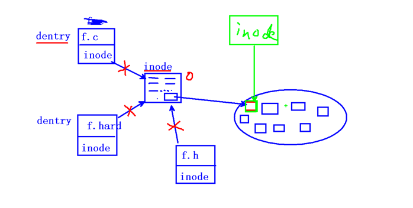
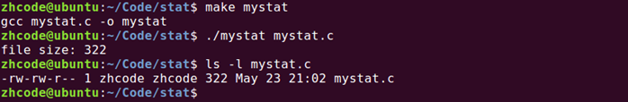
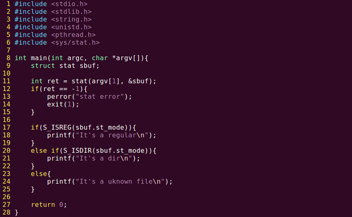
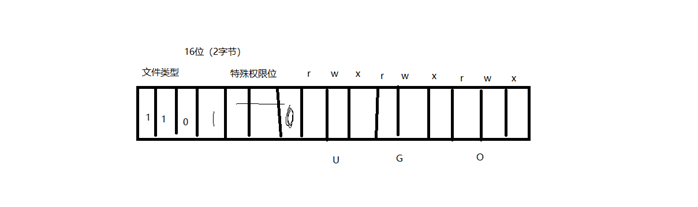
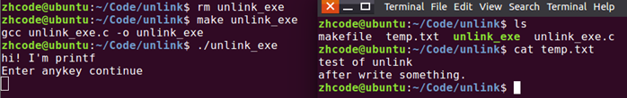
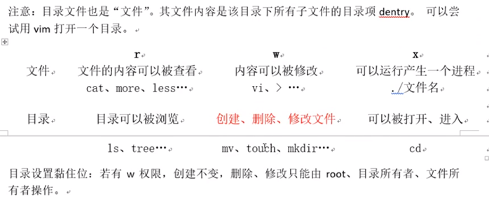
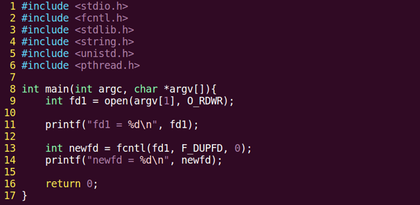

# 文件存储

### inode

本质是结构体，存储文件的属性信息。如：权限、类型、大小、时间、用户、盘块位置……(ls -l显示的一些信息)



一个文件主要由两部分组成，dentry（目录项包含文件名和inode号）和inode

少量常用、近期使用的inode会被缓存到内存中。

所谓的删除文件，就是删除inode，但是数据其实还是在硬盘上，以后会覆盖掉。

# stat函数

获取文件属性，（从inode结构体中获取）

```c
#include <sys/types.h>
#include <sys/stat.h>//stat的头文件
#include <unistd.h>//包含<sys/types.h>
int stat(const char *path, struct stat *buf);
```

### 参数

path：文件路径

buf：（传出参数）存放文件属性。

### 返回值

成功：0

失败：-1 errno

获取文件大小：buf.st_size

获取文件类型：buf.st_mode

获取文件权限：buf.st_mode

符号穿透（穿透符号链接：软链接）：stat会。lstat不会。这导致stat一个软链接会显示原文件的属性

下面这个例子是获取文件大小的正规军解法，用stat：

```c
#include <stdio.h>
#include <stdlib.h>
#include <string.h>
#include <unistd.h>
#include <pthread.h>
#include <sys/stat.h>

int main(int argc,char *argv[])
{
    struct stat sbuf;
    
    int ret = stat(argv[1],&sbuf);
    int(ret==-1){
        perror("stat error");
        exit(1);
    }
    printf("file size: %ld\n",sbuf.st_size);
    return 0;
}
```

编译运行，并查看mystat.c文件的大小，如下：



# lstat和stat

用stat查看文件类型，代码如下：



编译运行，查看一波mystat.c文件：


stat会拿到符号链接指向那个文件或目录的属性。

不想穿透符号就用lstat



# link函数和unlink隐式回收

```c
#include <unistd.h>

int link(const char * oldpath, const char *newpath);
```

用link实现mv

```c
#include <unistd.h>  
#include <fcntl.h>  
#include <stdlib.h>  
#include <string.h>  
#include <stdio.h>  

int main 
{
    link(argv[1],argv[2]);
    unlink(argv[1]);
    
    return 0;
}
```

unlink是删除一个文件的目录项dentry，使硬链接数-1

unlink函数的特征：清除文件时，如果文件的硬链接数到0了，没有dentry对应，但该文件仍不会马上被释放，要等到所有打开文件的进程关闭该文件，系统才会挑时间将该文件释放掉。

下面用一段代码来验证unlink是删除dentry：

```c
1.	/* 
2.	 *unlink函数是删除一个dentry 
3.	 */  
4.	#include <unistd.h>  
5.	#include <fcntl.h>  
6.	#include <stdlib.h>  
7.	#include <string.h>  
8.	#include <stdio.h>  
9.	  
10.	  
11.	int main(void)  
12.	{  
13.	    int fd, ret;  
14.	    char *p = "test of unlink\n";  
15.	    char *p2 = "after write something.\n";  
16.	  
17.	    fd = open("temp.txt", O_RDWR|O_CREAT|O_TRUNC, 0644);  
18.	    if(fd < 0){  
19.	        perror("open temp error");  
20.	        exit(1);  
21.	    }  
22.	  
23.	    ret = write(fd, p, strlen(p));  
24.	    if (ret == -1) {  
25.	        perror("-----write error");  
26.	    }  
27.	  
28.	    printf("hi! I'm printf\n");  
29.	    ret = write(fd, p2, strlen(p2));  
30.	    if (ret == -1) {  
31.	        perror("-----write error");  
32.	    }  
33.	  
34.	    printf("Enter anykey continue\n");  
35.	    getchar();  //阻塞程序，只有获得交互才能继续进行
36.	  
37.	    ret = unlink("temp.txt");        //具备了被释放的条件  
38.	    if(ret < 0){  
39.	        perror("unlink error");  
40.	        exit(1);  
41.	    }  
42.	  
43.	    close(fd);  
44.	  
45.	    return 0;  
46.	}  
```

编译程序并运行，程序阻塞，此时打开新终端查看临时文件temp.c如下：



可以看到，临时文件没有被删除，这是因为当前进程没结束。

输入字符使当前进程结束后，temp.txt就不见了


下面开始搞事，在程序中加入段错误成分，段错误在unlink之前，由于发生段错误，程序后续删除temp.txt的dentry部分就不会再执行，temp.txt就保留了下来，这是不科学的。

解决办法是检测fd有效性后，立即释放temp.txt，由于进程未结束，虽然temp.txt的硬链接数已经为0，但还不会立即释放，仍然存在，要等到程序执行完才会释放。这样就能避免程序出错导致临时文件保留下来。

因为文件创建后，硬链接数立马减为0，即使程序异常退出，这个文件也会被清理掉。这时候的内容是写在内核空间的缓冲区。

修改后代码如下：

```c
1.	/* 
2.	 *unlink函数是删除一个dentry 
3.	 */  
4.	#include <unistd.h>  
5.	#include <fcntl.h>  
6.	#include <stdlib.h>  
7.	#include <string.h>  
8.	#include <stdio.h>  
9.	  
10.	  
11.	int main(void)  
12.	{  
13.	    int fd, ret;  
14.	    char *p = "test of unlink\n";  
15.	    char *p2 = "after write something.\n";  
16.	  
17.	    fd = open("temp.txt", O_RDWR|O_CREAT|O_TRUNC, 0644);  
18.	    if(fd < 0){  
19.	        perror("open temp error");  
20.	        exit(1);  
21.	    }  
22.	  
23.	    ret = unlink("temp.txt");        //具备了被释放的条件  
24.	    if(ret < 0){  
25.	        perror("unlink error");  
26.	        exit(1);  
27.	    }  
28.	  
29.	    ret = write(fd, p, strlen(p));  
30.	    if (ret == -1) {  
31.	        perror("-----write error");  
32.	    }  
33.	  
34.	    printf("hi! I'm printf\n");  
35.	    ret = write(fd, p2, strlen(p2));  
36.	    if (ret == -1) {  
37.	        perror("-----write error");  
38.	    }  
39.	  
40.	    printf("Enter anykey continue\n");  
41.	    getchar();  
42.	  
43.	    close(fd);  
44.	  
45.	    return 0;  
46.	}  

```

### 隐式回收：

当进程结束运行时，所有进程打开的文件会被关闭，申请的内存空间会被释放。系统的这一特性称之为隐式回收系统资源。

比如上面那个程序，要是没有在程序中关闭文件描述符，没有隐式回收的话，这个文件描述符会保留，多次出现这种情况会导致系统文件描述符耗尽。所以隐式回收会在程序结束时收回它打开的文件使用的文件描述符。

# 目录操作

## 文件目录权限

vi 目录

会得到目录项的列表



## 目录操作函数

```c
#include <sys/types.h>
#include <dirent.h>

DIR * opendir(char *name);//库函数

int closedir(DIR *dirp);

struct dirent *readdir(DIR * dp);
	struct dirent {
        //主要用这俩
		ino_t	d_ino;//inode
		char d_name[256];//文件名
        //其他
        off_t	d_off;
        unsigned short d_reclen;//记录的长度
        unsigned char  d_type;
	}

```

没有写目录操作，因为目录写操作就是创建文件。可以用touch，mkdir

下面用目录操作函数实现一个ls操作：

```c
#include <stdio.h>
#include <stdlib.h>
#include <string.h>
#include <unistd.h>
#include <pthread.h>
#include <dirent.h>

int main(int argc, char *argv[])
{
	DIR *dp;
	struct dirent *sdp;
	
	dp = opendir(argv[1]);
	if(dp==NULL){
		perror("opendir error");
		exit(1);
	}
	
	while((sdp = readdir(dp))!= NULL){
        if(strcmp(sdp->d_name,".")==0){//去掉"."目录
            continue;
        }
        printf("%s\t",spd->d_name);
    }
    printf("\n");
	closedir(dp);
	
	return 0;
}
```

## 应用程序的系统调用过程

应用程序->标库函数->系统调用->驱动->硬件

## 递归遍历目录

任务需求：使用opendir  closedir  readdir  stat实现一个递归遍历目录的程序

输入一个指定目录，默认为当前目录。递归列出目录中的文件，同时显示文件大小。

思路分析

递归遍历目录：ls -R.c

1. 判断命令行参数，获取用户要查询的目录名。  argv[1]   argc==1  -->访问./

2. 判断用户指定的是否是目录。stat   S_ISDIR();  --> 封装函数  isFile

3. 读目录：opendir()->while(readdir())->closedir()

   ```
   opendir（dir）
   while （readdir（））{
   	普通文件，直接打印
   	目录：
   		拼接目录访问绝对路径。sprintf(path, "%s/%s", dir, d_name) 
   		递归调用自己。--》 opendir（path） readdir closedir
   	}
   closedir（）
   ```

### 代码预览

```c
1.	#include <stdio.h>  
2.	#include <stdlib.h>  
3.	#include <string.h>  
4.	#include <unistd.h>  
5.	#include <sys/stat.h>  
6.	#include <dirent.h>  
7.	#include <pthread.h>  
8.	  
9.	void isFile(char *name);  
10.	  
11.	// 打开目录读取,处理目录  
12.	void read_dir(char *dir, void (*func)(char *))  
13.	{  
14.	    char path[256];  
15.	    DIR *dp;  
16.	    struct dirent *sdp;  
17.	  
18.	    dp = opendir(dir);  
19.	    if (dp == NULL) {  
20.	        perror("opendir error");  
21.	        return;  
22.	    }  
23.	    // 读取目录项  
24.	    while((sdp = readdir(dp)) != NULL) {  
25.	        if (strcmp(sdp->d_name, ".") == 0 || strcmp(sdp->d_name, "..") == 0) {  
26.	            continue;  
27.	        }  
28.	        //fprintf();  
29.	        // 目录项本身不可访问, 拼接. 目录/目录项  
30.	        sprintf(path, "%s/%s", dir, sdp->d_name);  
31.	  
32.	        // 判断文件类型,目录递归进入,文件显示名字/大小  
33.	        //isFile(path);      
34.	        (*func)(path);  //回调函数
35.	    }  
36.	  
37.	    closedir(dp);  
38.	  
39.	    return ;  
40.	}  
41.	  
42.	void isFile(char *name)  
43.	{  
44.	    int ret = 0;  
45.	    struct stat sb;  
46.	  
47.	    // 获取文件属性, 判断文件类型  
48.	    ret = stat(name, &sb);  
49.	    if (ret == -1) {  
50.	        perror("stat error");  
51.	        return ;  
52.	    }  
53.	    // 是目录文件  
54.	    if (S_ISDIR(sb.st_mode)) {  
55.	        read_dir(name, isFile);  
56.	    }  
57.	    // 是普通文件, 显示名字/大小  
58.	    printf("%10s\t\t%ld\n", name, sb.st_size);  
59.	  
60.	    return;  
61.	}  
62.	  
63.	  
64.	int main(int argc, char *argv[])  
65.	{  
66.	    // 判断命令行参数  
67.	    if (argc == 1) {  
68.	        isFile(".");  
69.	    } else {  
70.	        isFile(argv[1]);  
71.	    }  
72.	  
73.	    return 0;  
74.	}  
```

### 自己实现

```c++
#include <stdio.h>  
#include <stdlib.h>  
#include <string.h>  
#include <unistd.h>  
#include <sys/stat.h>  
#include <dirent.h>  
#include <pthread.h>  
void isFile(char *name);
//打开目录读取，处理目录
void read_dir(char *dir)
    {	
        char path[256];
        DIR * dp;
        struct dirent *sdp;
        
        dp=opendir(dir);
        if(dp==NULL){
            perror("opendir error");
            return;
        }
    	//读取目录项
        while((sdp=readdir(dp))!=NULL){
            if(strcmp(sdp->d_name,".")==0||strcmp(sdp->d_name,"..")==0){
                continue;
            }
            // 目录项本身不可访问，拼接  目录/目录项
            sprintf(path,"%s/%s",dir,sdp->name);
            
            //判断文件类型，目录递归进入，文件显示名字/大小
            isFile(path);
        }
        closedir(dp);
        return ;
    }
void isFile(char *name)
{
    //打开文件名
    int ret=0;
    struct stat sbuf;//用来取出name的stat信息
    
    //获取文件属性，判断文件类型
    ret= stat(name,&sbuf);
    if(ret==-1){
        perror("stat error");
        return ;
    }
    //是目录文件
    if(S_ISDIR(sbuf.st_mode)){
        read_dir(name);
    }
    //是普通文件，直接显示名字/大小
    printf("%10s\t\t%ld\n",name,sbuf.st_size);
    return;
}

int main (int argc, char *argv[])
{
    //判断命令行参数
	if(argc==1){
        isFile(".");
    } eles{
        isFile(argv[1]);
    }
    return 0;
}
```

# 重定向dup()、dup2()

### dup()

```c
#include <unistd.h>
int dup(int oldfd);
```

参数

1. oldfd:已有文件描述符

返回

1. 新文件描述符，这个描述符和oldfd指向相同内容

### dup2()

```c
#include <unistd.h>
int dup2(int oldfd,int newfd);//文件描述符复制，oldfd拷贝给newfd。返回newfd
```

例子

```c
#include <stdio.h>
#include <stdlib.h>
#include <string.h>
#include <fcntl.h>
#include <unistd.h>
#include <pthread.h>

int main(int argc, char *argv[])
{
    int fd1=open(argv[1],O_RDWR);
    int fd2=open(argv[2],O_RDWR);

    int fdret=dup2(fd1,fd2);
    printf("fdret=%d\n",fdret);

    int ret=write(fd2,"1234567",7);
    printf("ret=%d",ret);

    dup2(fd1,STDOUT_FILENO);

    printf("----------------------886\n");
    return 0;
}
```

# fcntl实现dup描述符

```c
int fcntl(int fd,int cmd,...)
```

- cmd: F_DUPFD

- 参数3：
  - 被占用的，返回最小可用的。
  - 未被占用的，返回=该值的文件描述符



对于fcntl中的参数0，这个表示0被占用，fcntl使用文件描述符表中的最小文件描述符返回

假设传入0，传一个7，且7未被占用，则会返回7

