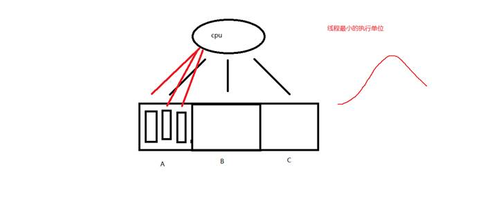
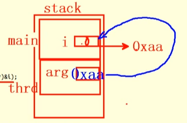
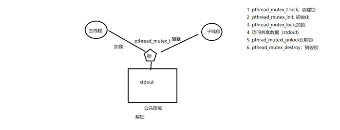
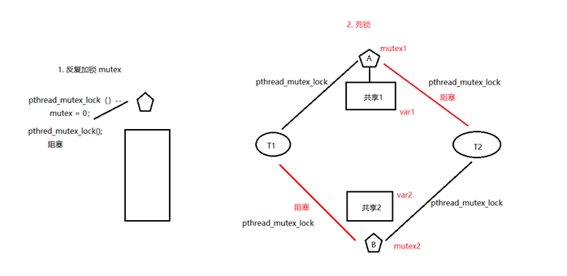
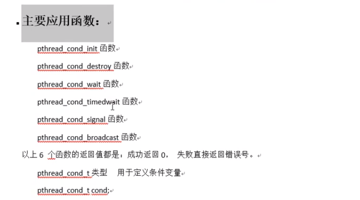
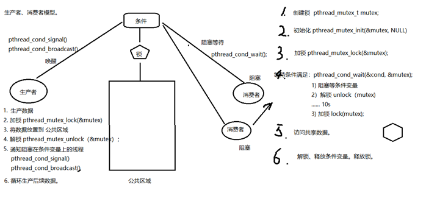

# 线程

## 线程概念

进程：有独立的 进程地址空间。有独立的pcb。  分配资源的最小单位。

 线程：有独立的pcb。没有独立的进程地址空间。 最小单位的执行。

 ps -Lf 进程id   ---> 线程号。LWP --》cpu 执行的最小单位。


 



 ps -Lf 进程号   查看进程的线程

### 三级映射


## 线程共享与非共享

### 线程共享资源

1. 文件描述符表
2. 每种信号的处理方式
3. 当前工作目录
4. 用户ID和组ID
5. 内存地址空间（.text/.data/.bss/heap/共享库）（除了栈）

### 线程非共享资源

1. 线程ID
2. 处理器现场和栈指针（内核栈）
3. 独立的栈空间（用户空间栈）
4. errno变量
5. 信号屏蔽字
6. 调度优先级

### 线程优、缺点

优点：

1. 提高程序并发性
2. 开销小
3. 数据通信、共享数据方便

缺点：

1. 库函数，不稳定
2. 调试、编写困难、gdb不支持(现在应该支持了)
3. 对信号支持不好

优点相对突出，缺点均不是硬伤。Linux下由于实现方法导致进程、线程差别不是很大。

## 创建线程

```c
#include <pthread.h>
pthread_t pthread_self(void);	//获取线程id。 线程id是在进程地址空间内部，用来标识线程身份的id号。
//返回值：
本线程id


int pthread_create(pthread_t *thread, const pthread_attr_t *attr,
                          void *(*start_routine) (void *), void *arg);//创建子线程
//参数
参1：传出参数，表新创建的子线程 id
参2：线程属性。传NULL表使用默认属性。
参3：子线程回调函数。创建成功，ptherad_create函数返回时，该函数会被自动调用。
参4：参3的参数。没有的话，传NULL
//返回值：
成功：0
失败：errno

```

例子实现子线程

```c
#include <stdio.h>
#include <stdlib.h>
#include <string.h>
#include <fcntl.h>
#include <unistd.h>
#include <pthread.h>

void * thread_test(void *arg){
    printf("i'm thread, pid=%d,tid=%lu\n",getpid(),pthread_self());
    return NULL;
}

int main(int argc,char *argv[])
{
    pthread_t tid;
    int ret=pthread_create(&tid,NULL,thread_test,NULL);
    if(ret!=0){
        perror("pthread_create error");
    }
    printf("main:i'm pid=%d,tid=%lu\n",getpid(),pthread_self());
    sleep(1);
    return 0;
}
```

### 循环创建子线程

下面的例子，循环创建多个子线程：

```c
#include <stdio.h>
#include <stdlib.h>
#include <string.h>
#include <fcntl.h>
#include <unistd.h>
#include <pthread.h>

void * thread_test(void *arg){
    sleep((int)arg);
    printf("i'm %dth thread, pid=%d,tid=%lu\n",(int)arg+1,getpid(),pthread_self());
    return NULL;
}

int main(int argc,char *argv[])
{
    pthread_t tid;
    int ret;
    int i;
    for(i=0;i<5;++i){
        ret=pthread_create(&tid,NULL,thread_test,(void *)i);
        if(ret!=0){
            perror("pthread_create error");
        }
    }
    sleep(i);
    printf("main:i'm pid=%d,tid=%lu\n",getpid(),pthread_self());

    return 0;
}
```

编译时会出现类型强转的警告，指针4字节转int的8字节，不过不存在精度损失，忽略就行。

### 细节分析

如果将$i$取地址后再传入线程创建函数里，就是说

当前传的是：`(void *)i`

改成：`  (void *)&i`

相应的，修改回调函数：`int i = *((int *)arg)`

运行代码，会出现如下结果：

```bash
alex@ubuntu:~/system_code$ ./pthrd_more 
i'm 6th thread, pid=4079,tid=140032557221632
i'm 6th thread, pid=4079,tid=140032548828928
i'm 6th thread, pid=4079,tid=140032540436224
i'm 6th thread, pid=4079,tid=140032532043520
i'm 6th thread, pid=4079,tid=140032523650816
main:i'm pid=4079,tid=140032565511936
```

如果多次运行都只有主线程的输出，将主线程等待时长从`i`改为大于6的数即可。因为子线程等待时间`i`是不定的，但都小于等于6秒，由于抢cpu时没抢过主线程，导致没有子线程的输出。

错误原因在于，子线程如果用引用传递`i`，会去读取主线程里的`i`值，而主线程里的`i`是动态变化的，不固定。所以，应该采用值传递，不用引用传递。



 

### pthread_exit()

```c
void pthread_exit(void *retval); //退出当前线程。
//参数
retval：退出值。 无退出值时，NULL
```

`exit();`  退出当前进程。
`return: `返回到调用者那里去。
`pthread_exit(): `退出当前线程。 

如果在回调函数里加一段代码：

```c
if(i == 2)
exit(0);
```

看起来好像是退出了第三个子线程，然而运行时，发现后续的4,5也没了。这是因为，exit是退出进程。

一、修改一下，换成：

```c
if(i == 2)
return NULL;
```

这样运行一下，发现后续线程不会凉凉，说明return是可以达到退出线程的目的。然而真正意义上，return是返回到函数调用者那里去，线程并没有退出。

二、再修改一下，再定义一个函数func，直接返回那种

```c
void *func(void){
  return NULL;
}

if(i == 2)
func();
```

运行，发现1,2,3,4,5线程都还在，说明没有达到退出目的。

三、再次修改：

```c
void *func(void){
  pthread_exit(NULL);
  return NULL;
}

if(i == 2)
func();
```

编译运行，发现3没了，看起来很科学的样子。pthread_exit表示将当前线程退出。放在函数里，还是直接调用，都可以。

回到之前说的一个问题，由于主线程可能先于子线程结束，所以子线程的输出可能不会打印出来，当时是用主线程sleep等待子线程结束来解决的。现在就可以使用pthread_exit来解决了。方法就是将return 0替换为pthread_exit，只退出当先线程，不会对其他线程造成影响。

```
void pthread_exit(void *retval); 退出当前线程。

retval：退出值。 无退出值时，NULL 

exit();  退出当前进程。

return: 返回到调用者那里去。

pthread_exit(): 退出当前线程。
 
```

### pthread_join()

```c
int pthread_join(pthread_t thread, void **retval);	阻塞 回收线程。
//参数
thread: 待回收的线程id
retval：传出参数。 回收的那个线程的退出值。
//返回值：
成功：0
失败：errno
线程异常结束，值为 -1。
```

例子：

```c
#include <stdio.h>
#include <stdlib.h>
#include <string.h>
#include <fcntl.h>
#include <unistd.h>
#include <pthread.h>
void sys_error(const char * str){
    perror(str);
    exit(1);
}
struct thrd{
    int val;
    char str[256];
};

void * tfn(void * arg){
    struct thrd *tval;
    tval=malloc(sizeof (struct thrd));
    tval->val=100;
    strcpy(tval->str,"hello thread");
    return (void *) tval;
}
int main()
{
    pthread_t tid;
    struct thrd *retval;

    int ret = pthread_create(&tid,NULL,tfn,NULL);
    if(ret!=0){//这儿其实不应该这么传出错误了
        sys_error("pthread_create error");
    }
    /*
    fprintf(stderr)
    */

    ret = pthread_join(tid,(void **)&retval);
    if(ret != 0){
        sys_error("pthread_join error");
    }

    printf("child thread exit with var=%d ,str= %s\n",retval->val,retval->str);
    return 0;
}
```

### pthread_cancel()

```c
int pthread_cancel(pthread_t thread);		//杀死一个线程。  需要到达取消点（保存点）
//其实是向线程发送一个cancel请求，但是如何处理这个请求由线程决定。默认是到达取消点处理，取消点还包括一些系统调用
//返回值
成功：0
失败：errno
    
如果，子线程没有到达取消点， 那么 pthread_cancel 无效。
我们可以在程序中，手动添加一个取消点。使用 pthread_testcancel();
成功被 pthread_cancel() 杀死的线程，返回 -1.使用pthead_join 回收。
```

### 线程分离pthread_detach()

```c
int pthread_detach(pthread_t thread);//设置线程分离
//参数
thread: 待分离的线程id
//返回值
成功：0
失败：errno
```

线程分离后，系统会自动回收资源，用pthread_join去回收已经被系统回收的线程，那个线程号就是无效参数。

```c
#include <stdio.h>  
#include <stdlib.h>  
#include <string.h>  
#include <unistd.h>  
#include <errno.h>  
#include <pthread.h>  
void *tfn(void *arg)

int main(int argc, char *argv[])
{
    pthread_t tid;

    int ret = pthread_create(&tid,NULL,tfn,NULL);
    if(ret!=0){
        perror("pthread_create error");
    }

    ret = pthread_detach(tid);// 设置线程分离，线程终止,会自动清理pcb,无需回收 
    if(ret != 0){
        perror("pthread_join error");
    }
    sleep(1);
    ret = pthread_join(tid, NULL);
    printf("join ret = %d\n", ret);
    if (ret != 0) {
        fprintf(stderr,"pthread_join error:%s\n",strerror(ret));
    }

    return 0;
    
}
```

```c
//线程中检查出错返回
fprintf(stderr,"pthread_join error:%s\n",strerror(ret));
```

## 进程和线程控制原语对比

|   线程控制原语   |   进程控制原语   |
| :--------------: | :--------------: |
| pthread_create() |      fork()      |
|  pthread_self()  |     getpid()     |
|  pthread_exit()  |      exit()      |
|  pthread_join()  | wait()/waitpid() |
| pthread_cancel() |      kill()      |
| pthread_detach() |                  |

## 线程属性设置分离线程

```c
pthread_attr_t attr;					//创建一个线程属性结构体变量
pthread_attr_init(&attr);				//初始化线程属性
pthread_attr_setdetachstate(&attr,  PTHREAD_CREATE_DETACHED);		//设置线程属性为 分离态
pthread_create(&tid, &attr, tfn, NULL); //借助修改后的 设置线程属性 创建为分离态的新线程
pthread_attr_destroy(&attr);			//销毁线程属性
```


# 线程同步

线程同步：协同步调，对公共区域数据按序访问。防止数据混乱，产生与时间有关的错误。


数据混乱的原因：

1. 资源共享(独享资源则不会)
2. 调度随机(意味着数据访问会出现竞争)
3. 线程间缺乏必要同步机制

## 锁的使用：

建议锁！对公共数据进行保护。所有线程【应该】在访问公共数据前先拿锁再访问。但，锁本身不具备强制性

## 函数

```c
//主要应用函数：
int pthread_mutex_init(pthread_mutex_t *restrict mutex,const pthread_mutexattr_t *restrict attr);
int pthread_mutex_destroy(pthread_mutex_t *mutex)
    
int pthread_mutex_lock(pthread_mutex_t *mutex)
int pthread_mutex_unlock(pthread_mutex_t *mutex)
int pthread_mutex_trylock(pthread_mutex_t *mutex)

以上5个函数的返回值都是：成功返回0，失败返回错误号

```

`pthread_mutex_t` 类型，其本质是一个结构体。为简化理解，应用时可忽略其实现细节，简单当成整数看待

`pthread_mutex_t mutex`；变量`mutex`只有两种取值：0,1



使用mutex(互斥量、互斥锁)一般步骤：

```c
pthread_mutex_t lock; //创建锁

pthread_mutex_init; //初始化  1

pthread_mutex_lock;//加锁   1-- --> 0
 
//访问共享数据（stdout)  

pthrad_mutext_unlock();//解锁   0++ --> 1

pthead_mutex_destroy；//销毁锁
```


```c
int pthread_mutex_init(pthread_mutex_t *restrict mutex, 

const pthread_mutexattr_t *restrict attr);
```

这里的restrict关键字，表示指针指向的内容只能通过这个指针进行修改

```
restrict关键字：

用来限定指针变量。被该关键字限定的指针变量所指向的内存操作，必须由本指针完成。

初始化互斥量：
```

 

```c
pthread_mutex_t mutex;

pthread_mutex_init(&mutex, NULL);       //动态初始化。

pthread_mutex_t mutex = PTHREAD_MUTEX_INITIALIZER;  //静态初始化。
```

 使用锁实现互斥访问共享区：

```c
#include <stdio.h>
#include <stdlib.h>
#include <string.h>
#include <fcntl.h>
#include <unistd.h>
#include <pthread.h>
pthread_mutex_t  mutex;
void * tfn(void * arg){
    while(1){
        pthread_mutex_lock(&mutex);
        printf("hello ");
        sleep(2);
        printf("world\n");
        pthread_mutex_unlock(&mutex);
        sleep(2);
//        pthread_mutex_unlock(&mutex);
    }
    return NULL;
}
int main()
{
    pthread_t tid;
    int ret=pthread_mutex_init(&mutex,NULL);
    if(ret!=0){
        fprintf(stderr,"pthread_create error:%s\n",strerror(ret));
        exit(1);
    }

    ret=pthread_create(&tid,NULL,tfn,NULL);
    if(ret!=0){
        fprintf(stderr,"pthread_create error:%s\n",strerror(ret));
        exit(1);
    }
    while(1){
        pthread_mutex_lock(&mutex);
        printf("HELLO ");
        sleep(2);
        printf("WORLD\n");
        pthread_mutex_unlock(&mutex);
        sleep(2);
//        pthread_mutex_unlock(&mutex);
    }
    pthread_join(tid, NULL);

    pthread_mutex_destroy(&mutex);

    return 0;
}
```


## 互斥锁使用技巧

注意事项：

- 尽量保证锁的粒度， 越小越好。（访问共享数据前，加锁。访问结束【立即】解锁。）
- 互斥锁，本质是结构体。 我们可以看成整数。 初值为 1。（pthread_mutex_init() 函数调用成功。）
- 加锁： --操作， 阻塞线程。
- 解锁： ++操作， 唤醒阻塞在锁上的线程。
- try锁：尝试加锁，成功--。失败，返回。同时设置错误号 EBUSY

### try锁

try锁：尝试加锁，成功--，加锁失败直接返回错误号(如EBUSY)，不阻塞

## 死锁

【死锁】：是使用锁不恰当导致的现象：

1. 对一个锁反复lock。
2. 两个线程，各自持有一把锁，请求另一把。



## 读写锁

锁只有一把。以读方式给数据加锁——读锁。以写方式给数据加锁——写锁。

读共享，写独占。

写锁优先级高。

相较于互斥量而言，当读线程多的时候，提高访问效率


### 函数原型

```c
pthread_rwlock_t  rwlock;

int pthread_rwlock_init(pthread_rwlock_t *restrict rwlock,const pthread_rwlockattr_t *restrict attr);

int pthread_rwlock_rdlock(pthread_rwlock_t *rwlock);
int pthread_rwlock_wrlock(pthread_rwlock_t *rwlock);

int pthread_rwlock_tryrdlock(pthread_rwlock_t *rwlock);//不阻塞
int pthread_rwlock_trywrlock(pthread_rwlock_t *rwlock);

int pthread_rwlock_unlock(pthread_rwlock_t *rwlock);

int pthread_rwlock_destroy(pthread_rwlock_t *rwlock);
//以上函数都是成功返回0，失败返回错误号。
```

一个读写锁的例子：核心还是读共享，写独占。写锁优先级高

```c
1.	/* 3个线程不定时 "写" 全局资源，5个线程不定时 "读" 同一全局资源 */  
2.
3.  #include <stdio.h>  
4.	#include <unistd.h>  
5.	#include <pthread.h>  
6.	  
7.	int counter;                          //全局资源  
8.	pthread_rwlock_t rwlock;  
9.	  
10.	void *th_write(void *arg)  
11.	{  
12.	    int t;  
13.	    int i = (int)arg;  
14.	  
15.	    while (1) {  
16.	        t = counter;                    // 保存写之前的值  
17.	        usleep(1000);  
18.	  
19.	        pthread_rwlock_wrlock(&rwlock);  
20.	        printf("=======write %d: %lu: counter=%d ++counter=%d\n", i, pthread_self(), t, ++counter);  
21.	        pthread_rwlock_unlock(&rwlock);  
22.	  
23.	        usleep(9000);               // 给 r 锁提供机会  
24.	    }  
25.	    return NULL;  
26.	}  
27.	  
28.	void *th_read(void *arg)  
29.	{  
30.	    int i = (int)arg;  
31.	  
32.	    while (1) {  
33.	        pthread_rwlock_rdlock(&rwlock);  
34.	        printf("----------------------------read %d: %lu: %d\n", i, pthread_self(), counter);  
35.	        pthread_rwlock_unlock(&rwlock);  
36.	  
37.	        usleep(2000);                // 给写锁提供机会  
38.	    }  
39.	    return NULL;  
40.	}  
41.	  
42.	int main(void)  
43.	{  
44.	    int i;  
45.	    pthread_t tid[8];  
46.	  
47.	    pthread_rwlock_init(&rwlock, NULL);  
48.	  
49.	    for (i = 0; i < 3; i++)  
50.	        pthread_create(&tid[i], NULL, th_write, (void *)i);  
51.	  
52.	    for (i = 0; i < 5; i++)  
53.	        pthread_create(&tid[i+3], NULL, th_read, (void *)i);  
54.	  
55.	    for (i = 0; i < 8; i++)  
56.	        pthread_join(tid[i], NULL);  
57.	  
58.	    pthread_rwlock_destroy(&rwlock);            //释放读写琐  
59.	  
60.	    return 0;  
61.	}  
```

## 静态初始化条件变量和互斥量

条件变量：本身不是锁！ 但是通常结合锁来使用。 mutex

主要应用函数：



```c
pthread_cond_t cond;

//初始化条件变量：
pthread_cond_init(&cond, NULL);      		 	 //动态初始化。
pthread_cond_t cond = PTHREAD_COND_INITIALIZER;  //静态初始化。
```

### 条件变量和相关函数wait

```c
//阻塞等待条件：
pthread_cond_wait(&cond, &mutex);
```

作用： 

1. 阻塞等待条件变量满足
2. 解锁已经加锁成功的信号量 （相当于`pthread_mutex_unlock(&mutex)`），1、2两步为一个原子操作
3. 当条件满足，函数返回时，解除阻塞并重新申请获取互斥锁。重新加锁信号量 （相当于， `pthread_mutex_lock(&mutex);`）


 

### 条件变量的生产者消费者模型分析



### 条件变量生产者消费者代码

```c
1.	/*借助条件变量模拟 生产者-消费者 问题*/  
2.	#include <stdlib.h>  
3.	#include <unistd.h>  
4.	#include <pthread.h>  
5.	#include <stdio.h>  
6.	  
7.	/*链表作为公享数据,需被互斥量保护*/  
8.	struct msg {  
9.	    struct msg *next;  
10.	    int num;  
11.	};  
12.	  
13.	struct msg *head;  
14.	  
15.	/* 静态初始化 一个条件变量 和 一个互斥量*/  
16.	pthread_cond_t has_product = PTHREAD_COND_INITIALIZER;  
17.	pthread_mutex_t lock = PTHREAD_MUTEX_INITIALIZER;  
18.	  
19.	void *consumer(void *p)  
20.	{  
21.	    struct msg *mp;  
22.	  
23.	    for (;;) {  
24.	        pthread_mutex_lock(&lock);  
25.	        while (head == NULL) {           //头指针为空,说明没有节点    可以为if吗  
26.	            pthread_cond_wait(&has_product, &lock);   // 解锁，并阻塞等待  
27.	        }  
28.	        mp = head;        
29.	        head = mp->next;                 //模拟消费掉一个产品  
30.	        pthread_mutex_unlock(&lock);  
31.	  
32.	        printf("-Consume %lu---%d\n", pthread_self(), mp->num);  
33.	        free(mp);  
34.	        sleep(rand() % 5);  
35.	    }  
36.	}  
37.	  
38.	void *producer(void *p)  
39.	{  
40.	    struct msg *mp;  
41.	  
42.	    for (;;) {  
43.	        mp = malloc(sizeof(struct msg));  
44.	        mp->num = rand() % 1000 + 1;        //模拟生产一个产品  
45.	        printf("-Produce ---------------------%d\n", mp->num);  
46.	  
47.	        pthread_mutex_lock(&lock);  
48.	        mp->next = head;  
49.	        head = mp;  
50.	        pthread_mutex_unlock(&lock);  
51.	  
52.	        pthread_cond_signal(&has_product);  //将等待在该条件变量上的一个线程唤醒  
53.	        sleep(rand() % 5);  
54.	    }  
55.	}  
56.	  
57.	int main(int argc, char *argv[])  
58.	{  
59.	    pthread_t pid, cid;  
60.	    srand(time(NULL));  
61.	  
62.	    pthread_create(&pid, NULL, producer, NULL);  
63.	    pthread_create(&cid, NULL, consumer, NULL);  
64.	  
65.	    pthread_join(pid, NULL);  
66.	    pthread_join(cid, NULL);  
67.	  
68.	    return 0;  
69.	}  
```

### 条件变量signal注意事项

```c
pthread_cond_signal();// 唤醒阻塞在条件变量上的 (至少)一个线程。

pthread_cond_broadcast();//唤醒阻塞在条件变量上的 所有线程。
```

## 信号量概念及其相关操作函数

信号量： 应用于线程、进程间同步。

 相当于 初始化值为 N 的互斥量。 N值，表示可以同时访问共享数据区的线程数。

 

```c
//函数：
sem_t sem; //定义类型。
int sem_init(sem_t *sem, int pshared, unsigned int value);

//参数：
sem //信号量 
pshared：   0： //用于线程间同步
			1： //用于进程间同步
value：N值。（指定同时访问的线程数）
//返回值：
成功：0
失败：-1

sem_destroy();

 
sem_wait();    //一次调用，做一次-- 操作， 当信号量的值为 0 时，再次 -- 就会阻塞。 （对比 pthread_mutex_lock）
sem_post();    //一次调用，做一次++ 操作. 当信号量的值为 N 时, 再次 ++ 就会阻塞。（对比 pthread_mutex_unlock）
```

### 信号量实现的生产者消费者


代码如下：

```c
1.	/*信号量实现 生产者 消费者问题*/  
2.	  
3.	#include <stdlib.h>  
4.	#include <unistd.h>  
5.	#include <pthread.h>  
6.	#include <stdio.h>  
7.	#include <semaphore.h>  
8.	  
9.	#define NUM 5                 
10.	  
11.	int queue[NUM];                                     //全局数组实现环形队列  
12.	sem_t blank_number, product_number;                 //空格子信号量, 产品信号量  
13.	  
14.	void *producer(void *arg)  
15.	{  
16.	    int i = 0;  
17.	  
18.	    while (1) {  
19.	        sem_wait(&blank_number);                    //生产者将空格子数--,为0则阻塞等待  
20.	        queue[i] = rand() % 1000 + 1;               //生产一个产品  
21.	        printf("----Produce---%d\n", queue[i]);          
22.	        sem_post(&product_number);                  //将产品数++  
23.	  
24.	        i = (i+1) % NUM;                            //借助下标实现环形  
25.	        sleep(rand()%1);  
26.	    }  
27.	}  
28.	  
29.	void *consumer(void *arg)  
30.	{  
31.	    int i = 0;  
32.	  
33.	    while (1) {  
34.	        sem_wait(&product_number);                  //消费者将产品数--,为0则阻塞等待  
35.	        printf("-Consume---%d\n", queue[i]);  
36.	        queue[i] = 0;                               //消费一个产品   
37.	        sem_post(&blank_number);                    //消费掉以后,将空格子数++  
38.	  
39.	        i = (i+1) % NUM;  
40.	        sleep(rand()%3);  
41.	    }  
42.	}  
43.	  
44.	int main(int argc, char *argv[])  
45.	{  
46.	    pthread_t pid, cid;  
47.	  
48.	    sem_init(&blank_number, 0, NUM);                //初始化空格子信号量为5, 线程间共享 -- 0  
49.	    sem_init(&product_number, 0, 0);                //产品数为0  
50.	  
51.	    pthread_create(&pid, NULL, producer, NULL);  
52.	    pthread_create(&cid, NULL, consumer, NULL);  
53.	  
54.	    pthread_join(pid, NULL);  
55.	    pthread_join(cid, NULL);  
56.	  
57.	    sem_destroy(&blank_number);  
58.	    sem_destroy(&product_number);  
59.	  
60.	    return 0;  
61.	} 
```
