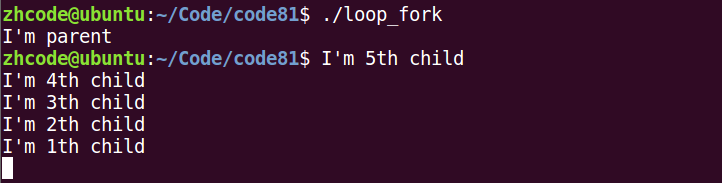
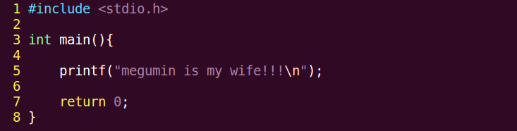

# 进程和程序以及cpu相关

进程：

- 程序：死的。只占用磁盘空间
- 进程：活的。运行起来的程序。占用内存、cpu等系统资源

并发和并行：并发是宏观上并行，微观上串行

- 并发：两个或多个事件在同一时间间隔发生，微观上可以是串行。在同一个实体上
- 并行：两个或多个事件在同一时刻发生。在不同的实体上


MMU：内存管理单元，有时称作分页内存管理单元。负责处理CPU的内存访问请求的计算机硬件。功能包括[虚拟地址](https://baike.baidu.com/item/虚拟地址)到[物理地址](https://baike.baidu.com/item/物理地址)的转换（即[虚拟内存](https://baike.baidu.com/item/虚拟内存)管理）、内存保护、中央处理器[高速缓存](https://baike.baidu.com/item/高速缓存)的控制，在较为简单的计算机体系结构中，负责[总线](https://baike.baidu.com/item/总线)的[仲裁](https://baike.baidu.com/item/仲裁)以及存储体切换（bank switching，尤其是在8位的系统上）。

# 虚拟内存和物理内存映射关系

程序变成进程会产生4G(32位系统，$2^{32}$)虚拟内存空间，其中3G-4G为内核区。

内核区中有一片区域存放了PCB进程块(struct)

内核区地址各进程都映射在同一物理内存区域，用户区映射到不同物理内存区域


MMU除了将虚拟地址转换为物理地址外，还完成权级切换（linux分两级，0和3，0对应内核区，3对应用户区）

# 进程控制块（PCB）

```shell
#ps aux  //linux查看进程
```

```c
struct task_struct {
volatile long state;  //说明了该进程是否可以执行,还是可中断等信息
unsigned long flags;  //Flage 是进程号,在调用fork()时给出
intsigpending;   //进程上是否有待处理的信号
mm_segment_taddr_limit; //进程地址空间,区分内核进程与普通进程在内存存放的位置不同
                       //0-0xBFFFFFFF foruser-thead
                       //0-0xFFFFFFFF forkernel-thread
//调度标志,表示该进程是否需要重新调度,若非0,则当从内核态返回到用户态,会发生调度
volatilelong need_resched;
int lock_depth;  //锁深度
longnice;       //进程的基本时间片
//进程的调度策略,有三种,实时进程:SCHED_FIFO,SCHED_RR,分时进程:SCHED_OTHER
unsigned long policy;
struct mm_struct *mm; //进程内存管理信息
int processor;
//若进程不在任何CPU上运行, cpus_runnable 的值是0，否则是1这个值在运行队列被锁时更新
unsigned long cpus_runnable, cpus_allowed;
struct list_head run_list; //指向运行队列的指针
unsigned longsleep_time;  //进程的睡眠时间
//用于将系统中所有的进程连成一个双向循环链表,其根是init_task
struct task_struct *next_task, *prev_task;
struct mm_struct *active_mm;
struct list_headlocal_pages;       //指向本地页面      
unsigned int allocation_order, nr_local_pages;
struct linux_binfmt *binfmt;  //进程所运行的可执行文件的格式
int exit_code, exit_signal;
intpdeath_signal;    //父进程终止是向子进程发送的信号
unsigned longpersonality;
//Linux可以运行由其他UNIX操作系统生成的符合iBCS2标准的程序
intdid_exec:1; 
pid_tpid;    //进程标识符,用来代表一个进程
pid_tpgrp;   //进程组标识,表示进程所属的进程组
pid_t tty_old_pgrp;  //进程控制终端所在的组标识
pid_tsession;  //进程的会话标识
pid_t tgid;
intleader;     //表示进程是否为会话主管
struct task_struct*p_opptr,*p_pptr,*p_cptr,*p_ysptr,*p_osptr;
struct list_head thread_group;  //线程链表
struct task_struct*pidhash_next; //用于将进程链入HASH表
struct task_struct**pidhash_pprev;
wait_queue_head_t wait_chldexit;  //供wait4()使用
struct completion*vfork_done;  //供vfork()使用
unsigned long rt_priority; //实时优先级，用它计算实时进程调度时的weight值
 
//it_real_value，it_real_incr用于REAL定时器，单位为jiffies,系统根据it_real_value
//设置定时器的第一个终止时间.在定时器到期时，向进程发送SIGALRM信号，同时根据
//it_real_incr重置终止时间，it_prof_value，it_prof_incr用于Profile定时器，单位为jiffies。
//当进程运行时，不管在何种状态下，每个tick都使it_prof_value值减一，当减到0时，向进程发送
//信号SIGPROF，并根据it_prof_incr重置时间.
//it_virt_value，it_virt_value用于Virtual定时器，单位为jiffies。当进程运行时，不管在何种
//状态下，每个tick都使it_virt_value值减一当减到0时，向进程发送信号SIGVTALRM，根据
//it_virt_incr重置初值。
unsigned long it_real_value, it_prof_value, it_virt_value;
unsigned long it_real_incr, it_prof_incr, it_virt_value;
struct timer_listreal_timer;   //指向实时定时器的指针
struct tmstimes;     //记录进程消耗的时间
unsigned longstart_time;  //进程创建的时间
//记录进程在每个CPU上所消耗的用户态时间和核心态时间
longper_cpu_utime[NR_CPUS],per_cpu_stime[NR_CPUS]; 
//内存缺页和交换信息:
//min_flt, maj_flt累计进程的次缺页数（Copyon　Write页和匿名页）和主缺页数（从映射文件或交换
//设备读入的页面数）；nswap记录进程累计换出的页面数，即写到交换设备上的页面数。
//cmin_flt, cmaj_flt,cnswap记录本进程为祖先的所有子孙进程的累计次缺页数，主缺页数和换出页面数。
//在父进程回收终止的子进程时，父进程会将子进程的这些信息累计到自己结构的这些域中
unsignedlong min_flt, maj_flt, nswap, cmin_flt, cmaj_flt, cnswap;
int swappable:1; //表示进程的虚拟地址空间是否允许换出
//进程认证信息
//uid,gid为运行该进程的用户的用户标识符和组标识符，通常是进程创建者的uid，gid
//euid，egid为有效uid,gid
//fsuid，fsgid为文件系统uid,gid，这两个ID号通常与有效uid,gid相等，在检查对于文件
//系统的访问权限时使用他们。
//suid，sgid为备份uid,gid
uid_t uid,euid,suid,fsuid;
gid_t gid,egid,sgid,fsgid;
int ngroups; //记录进程在多少个用户组中
gid_t groups[NGROUPS]; //记录进程所在的组
//进程的权能，分别是有效位集合，继承位集合，允许位集合
kernel_cap_tcap_effective, cap_inheritable, cap_permitted;
int keep_capabilities:1;
struct user_struct *user;
struct rlimit rlim[RLIM_NLIMITS];  //与进程相关的资源限制信息
unsigned shortused_math;   //是否使用FPU
charcomm[16];   //进程正在运行的可执行文件名
 //文件系统信息
int link_count, total_link_count;
//NULL if no tty进程所在的控制终端，如果不需要控制终端，则该指针为空
struct tty_struct*tty;
unsigned int locks;
//进程间通信信息
struct sem_undo*semundo;  //进程在信号灯上的所有undo操作
struct sem_queue *semsleeping; //当进程因为信号灯操作而挂起时，他在该队列中记录等待的操作
//进程的CPU状态，切换时，要保存到停止进程的task_struct中
structthread_struct thread;
  //文件系统信息
struct fs_struct *fs;
  //打开文件信息
struct files_struct *files;
  //信号处理函数
spinlock_t sigmask_lock;
struct signal_struct *sig; //信号处理函数
sigset_t blocked;  //进程当前要阻塞的信号，每个信号对应一位
struct sigpendingpending;  //进程上是否有待处理的信号
unsigned long sas_ss_sp;
size_t sas_ss_size;
int (*notifier)(void *priv);
void *notifier_data;
sigset_t *notifier_mask;
u32 parent_exec_id;
u32 self_exec_id;
 
spinlock_t alloc_lock;
void *journal_info;
};
```

主要掌握以下信息：

- 进程id
- 文件描述符表
- 进程状态：初始态、就绪态、运行态、挂起态、终止态。
- 进程工作目录位置
- 信号相关信息资源
- 用户id和组id
- *umask掩码

# 环境变量

echo $PATH  查看环境变量

path环境变量里记录了一系列的值，当运行一个可执行文件时，系统会去环境变量记录的位置里查找这个文件并执行。

echo $TERM 查看终端

echo $LANG 查看语言

env     查看所有环境变量

# 进程控制

## fork()函数

```c
pid_t fork(void)//创建子进程。父子进程各自返回。父进程返回子进程pid。 子进程返回 0.
    
getpid();getppid();//循环创建N个子进程模型。 每个子进程标识自己的身份。
```


## fork创建子进程

下面是一个fork函数的例子，代码如下：


编译运行，如下：


关于这里为啥终端提示符和输出信息混在了一起，循环创建多个子进程（后面第二节）那一节会进行分析，现在先不用管。

fork之前的代码，父子进程都有，但是只有父进程执行了，子进程没有执行，fork之后的代码，父子进程都有机会执行。

两个函数：

pid_t getpid()    获取当前进程id

pid_t getppid()   获取当前进程的父进程id

## getpid和getppid

来个小例子，就是在上面一个fork例子里面加入这两个函数：


编译运行，如下：


这里，问题出现了。视频里，父进程子进程id能相互对应上，但这里没有对应上。

先看图里子进程的输出：子进程pid=3140， 父进程pid=1630

再看图里父进程的输出：子进程pid=3140， 自己进程pid=3139， 父进程pid=2911

这很有问题，3139作为父进程创建了3140这个子进程，然而3140这个子进程说1630是它的父进程。这里感受到了一股老王的气息。

于是，为了搞清楚这是不是个例，再运行了几次程序，结果如下：


从这个图可以看到，所有父进程的子进程pid=父进程pid+1，而子进程的父进程均为1630，这个1630多次出现，显然不是偶然。这里做出一个推测，假设图中所有进程都是父进程先结束，导致子进程成孤儿，于是回收到孤儿院，看起来合情合理。 

修改一下代码，给父进程增加一个等待命令，这样能保证子进程完成时，父进程处于执行状态，子进程就不会成孤儿。同时，这里也解决了终端提示符和输出混在一起的问题，这个问题会在下一节分析，不用管，代码如下：


 编译运行，如下：


2477子进程是2478,2478父进程是2477，没有问题。错怪1630了，它不是老王。 

再看，父进程的父进程pid=2259，查看一下这是个啥：


如图，这是bash，其实我们写的所有进程都是bash的子进程

那么疯狂收孤儿的1630呢，如下：


这里的upstart，就是进程孤儿院。

## 循环创建子进程

如果只是如下

```
for(int i=0;i<5;++i){
	fork();
}
```

就会像下面这样


所以，直接用个for循环是要出事情的，因为子进程也会fork新的进程

这里，对调用fork的进程进行判定，只让父进程fork新的进程就行，代码如下：


编译执行，如图：


出现了问题：进程多了一个，而且不是按顺序来的。这里多出的一个，是父进程，因为父进程才有i=5跳出循环这一步。所以，对父进程进行判定并处理

修改代码如下：


编译运行，结果如下：



现在还有两个问题，

一个就是包括父进程在内的所有进程不是按顺序出现，多运行几次，发现是随机序列出现的。这是要因为，对操作系统而言，这几个子进程几乎是同时出现的，它们和父进程一起争夺cpu，谁抢到，谁打印，所以出现顺序是随机的。

第二问题就是终端提示符混在了输出里，这个是因为，loop_fork是终端的子进程，一旦loop_fork执行完，终端就会打印提示符。就像之前没有子进程的程序，一旦执行完，就出现了终端提示符。这里也就是这个道理，loop_fork执行完了，终端提示符出现，然而loop_fork的子进程还没执行完，所以输出就混在一起了。

下面通过sleep延时来解决父进程先结束这个问题。代码如下，就是给父进程加了个sleep：


编译运行，结果如下：


可以看到，更改之后，父进程在所有子进程后结束，所以终端提示符最后出现。

这里和视频里有一点差异，我这里“I’m parent”是先于子进程的输出的，因为我这里是父进程在sleep之前就打印信息了，视频里是sleep之后打印。这个不是大问题，怎么写都行，因为父进程虽然在打印之前fork了子进程，照理来说子进程会和父进程抢cpu，打印顺序会乱。但是由于父进程已经处于执行状态，所以一般来说父进程一定会先于子进程打印。当然这个对于不同操作系统不太一样，万一时间片再短点，父进程在打印之前，时间片到了，子进程抢到cpu就开始打印了，那么父进程打印信息就不一定在第一位了。道理是这么个道理，最好还是先sleep再打印吧，这样父进程一定是最后输出的。

## 进程共享

### 父子进程共享

- 父子进程相同：

​		刚fork后。 data段、text段、堆、栈、环境变量、全局变量、宿主目录位置、进程工作目录位置、信号处理方式

- 父子进程不同：

​		进程id、返回值、各自的父进程、进程创建时间、闹钟、未决信号集

​		似乎，子进程复制了父进程0-3G用户空间内容，以及父进程的PCB，但pid不同。但其实不是，父子进程间遵循读时共享写时复制的原则，这样设计，无论子进程执行父进程的逻辑还是执行自己的逻辑都能节省内存开销。

读时共享、写时复制。———————— 全局变量。

- 父子进程共享：
  - 文件描述符（打开文件的结构体）
  - mmap建立的映射区（进程间通信详解）

## 父子进程gdb调试

gdb调试：

  设置父进程调试路径：set follow-fork-mode parent (默认)

  设置子进程调试路径：set follow-fork-mode child

注意，一定要在fork函数调用之前设置才有效。


## exec函数族


### execlp函数

p代表PATH

加载一个进程，借助PATH环境变量

```c
int execlp(const char *file, const char *arg,...);
/*
参1： 程序名
参2： argv0  参数从argv[0]开始
参3： argv1
...： argvN
哨兵：NULL
*/
```

### execl函数

```c
int execl(const char *path, const char *arg, ...);	//-->	自己指定待执行程序路径。
```

int返回只有在出错时才会返回，如果成功就不会返回

示例代码，通过execlp让子进程去执行ls命令：


编译运行，结果如下：


只有父进程正确执行并输出了，子进程的ls输出有问题。

问题出在参数上，可变参数那里，是从argv[0]开始计算的。

修改代码，就是将缺失的argv[0]补上，然后让父进程延时1秒，保证终端提示符不和输出干扰。如下：


第一个"ls"借助ls的PATH来执行；execlp()如果执行成功，下面的perror()就不会执行了，否则会返回并执行

编译执行，如下：


这个看起来就很科学了。于是子进程就能随意调用可执行程序了，这个可执行程序可以是系统的，也可以是自定义的。

下面使用execl来让子程序调用自定义的程序。

int execl(const char *path, const char *arg, …)

这里要注意，和execlp不同的是，第一个参数是路径，不是文件名。

这个路径用相对路径和绝对路径都行。

调用的代码如下：



exec代码如下：


编译执行，如下：


这就很强势了。

用execl也能执行ls这些，把路径给出来就行，但是这样麻烦，所以对于系统指令一般还是用execlp

 ### 小练习

写一个程序，使用execlp执行进程查看，并将结果输出到文件里。

要用到open, execlp, dup2

代码如下：


close(fd);实际不会执行

编译执行，如下：


exec函数族一般规律：

exec函数一旦调用成功，即执行新的程序，不返回。只有失败才返回，错误值-1，所以通常我们直接在exec函数调用后直接调用perror()，和exit()，无需if判断。

l(list) 	      	命令行参数列表

p(path)    	   搜索file时使用path变量

v(vector)    	使用命令行参数数组

e(environment)    使用环境变量数组，不适用进程原有的环境变量，设置新加载程序运行的环境变量

事实上，只有execve是真正的系统调用，其他5个函数最终都调用execve，是库函数，所以execve在man手册第二节，其它函数在man手册第3节。

## 回收子进程

### 孤儿进程：

  父进程先于子进终止，子进程沦为“孤儿进程”，会被 init 进程领养。

### 僵尸进程：

  子进程终止，父进程尚未对子进程进行回收，在此期间，子进程为“僵尸进程”。 kill 对其无效。这里要注意，每个进程结束后都必然会经历僵尸态，时间长短的差别而已。

  子进程终止时，子进程残留资源PCB存放于内核中，PCB记录了进程结束原因，进程回收就是回收PCB。回收僵尸进程，得kill它的父进程，让孤儿院去回收它。

### wait函数

回收子进程退出资源，阻塞回收任意一个

```c
#include <sys/wait.h>
#include <sys/types.h>
pid_t wait(int *status);
//参数：（传出） 回收进程的状态。
//返回值：成功： 回收进程的pid
//失败： -1， errno
```

函数作用1：  阻塞等待子进程退出

函数作用2：  清理子进程残留在内核的 pcb 资源

函数作用3：  通过传出参数，得到子进程结束状态

获取子进程正常终止值：

​	WIFEXITED(status) --> 为真 -->调用 WEXITSTATUS(status) --> 得到 子进程 退出值。

获取导致子进程异常终止信号： 

​	WIFSIGNALED(status) --> 为真 -->调用 WTERMSIG(status) --> 得到 导致子进程异常终止的信号编号。

一个进程终止时会关闭所有文件描述符，释放在用户空间分配的内存，但它的PCB还保留着，内核在其中保存了一些信息：如果是正常终止则保存着退出状态，如果是异常终止则保存着导致该进程终止的信号是哪个。这个进程的父进程可以调用wait或者waitpid获取这些信息，然后彻底清除掉这个进程。我们知道一个进程的退出状态可以在shell中用特殊变量$？查看，因为shell是它的父进程，当它终止时，shell调用wait或者waitpid得到它的退出状态，同时彻底清除掉这个进程。

下面这个例子，使用wait来阻塞回收子进程

```c
#include <stdio.h>
#include <stdlib.h>
#include <string.h>
#include <fcntl.h>
#include <unistd.h>
#include <pthread.h>
#include <sys/wait.h>
#include <sys/types.h>

int main(int argc, char *argv[])
{
    pid_t pid,wpid;
    int status;

    pid=fork();
    if(pid==0){
        printf("i'm a child ,my pid :%d,my parent:%d,going to sleep 5s\n",getpid(),getppid());
        sleep(10);
        printf("-------child die---------\n");
        return 73;
    }else if (pid>0){
        //wpid=wait(NULL);直接回收，不管回收的子进程时为何结束
        wpid=wait(&status);//一次wait/waitpid函数调用，只能回收一个子进程。
        if(wpid==-1){
            perror("wait error");
            exit(1);
        }
        if(WIFEXITED(status)){//如果正常结束，获取返回值
            int ret =WEXITSTATUS(status);
            printf("-----child done success,ret=%d\n",ret);
        }
        if(WIFSIGNALED(status)){//如果异常结束，获取异常信号
            int sig=WTERMSIG(status);
            printf("-----child done error ,sig=%d\n",sig);
        }
        printf("parent wait finish,wpid=%d\n",wpid);
    }else{
        perror("fork error");
        return 1;
    }
    return -1;
}
```

### waitpid函数

指定某一个进程进行回收。可以设置非阻塞。

```c
#include <sys/wait.h>
#include <sys/types.h>
pid_t waitpid(pid_t pid, int *status, int options);
//waitpid(-1, &status, 0) == wait(&status);
//参数：
	pid：指定回收某一个子进程pid
		> 0: 待回收的子进程pid
		-1：任意子进程
		0：同组的子进程。
        <-1：回收指定进程组内的任意子进程，该组id为该值的绝对值
	status：（传出） 回收进程的状态。
	options：WNOHANG 指定回收方式为，非阻塞。没有结束的子进程，父进程直接返回0
//返回值：
	> 0 : 表成功回收的子进程 pid
	0 : 函数调用时， 参3 指定了WNOHANG， 并且，没有子进程结束。
	-1: 失败。errno
```

一次wait/waitpid函数调用，只能回收一个子进程。上一个例子，父进程产生了5个子进程，wait会随机回收一个，捡到哪个算哪个。

演示代码，使用WNOHANG非阻塞，需要让父进程sleep等待子进程结束，若不等待且想回收指定子进程，就将WNOHANG改为0，改成阻塞。

```c
1.	#include <stdio.h>  
2.	#include <stdlib.h>  
3.	#include <string.h>  
4.	#include <unistd.h>  
5.	#include <sys/wait.h>  
6.	#include <pthread.h>  
7.	  
8.	  
9.	int main(int argc, char *argv[])  
10.	{  
11.	    int i;  
12.	    pid_t pid, wpid, tmpid;  
13.	  
14.	    for (i = 0; i < 5; i++) {         
15.	        pid = fork();  
16.	        if (pid == 0) {       // 循环期间, 子进程不 fork   
17.	            break;  
18.	        }  
19.	        if (i == 2) {  
20.	            tmpid = pid;  
21.	            printf("--------pid = %d\n", tmpid);  
22.	        }  
23.	    }  
24.	  
25.	    if (5 == i) {       // 父进程, 从 表达式 2 跳出  
26.	        sleep(5);  
27.	  
28.	        //wait(NULL);                           // 一次wait/waitpid函数调用,只能回收一个子进程.  
29.	        //wpid = waitpid(-1, NULL, WNOHANG);    //回收任意子进程,没有结束的子进程,父进程直接返回0   
30.	        //wpid = waitpid(tmpid, NULL, 0);       //指定一个进程回收, 阻塞等待  
31.	        printf("i am parent , before waitpid, pid = %d\n", tmpid);  
32.	  
33.	        wpid = waitpid(tmpid, NULL, WNOHANG);   //指定一个进程回收, 不阻塞  
34.	        //wpid = waitpid(tmpid, NULL, 0);         //指定一个进程回收, 阻塞回收  
35.	        if (wpid == -1) {  
36.	            perror("waitpid error");  
37.	            exit(1);  
38.	        }  
39.	        printf("I'm parent, wait a child finish : %d \n", wpid);  
40.	  
41.	    } else {            // 子进程, 从 break 跳出  
42.	        sleep(i);  
43.	        printf("I'm %dth child, pid= %d\n", i+1, getpid());  
44.	    }  
45.	  
46.	    return 0;  
47.	}
```

### waitpid回收多个子进程

要想回收多个，就要循环使用waitpid

```c
1.	// 回收多个子进程  
2.	#include <stdio.h>  
3.	#include <stdlib.h>  
4.	#include <string.h>  
5.	#include <unistd.h>  
6.	#include <sys/wait.h>  
7.	#include <pthread.h>  
8.	  
9.	int main(int argc, char *argv[])  
10.	{  
11.	    int i;  
12.	    pid_t pid, wpid;  
13.	  
14.	    for (i = 0; i < 5; i++) {         
15.	        pid = fork();  
16.	        if (pid == 0) {       // 循环期间, 子进程不 fork   
17.	            break;  
18.	        }  
19.	    }  
20.	  
21.	    if (5 == i) {       // 父进程, 从 表达式 2 跳出  
22.	        /* 
23.	        while ((wpid = waitpid(-1, NULL, 0))>0) {     // 使用阻塞方式回收子进程 
24.	            printf("wait child %d \n", wpid); 
25.	        } 
26.	        */  
27.	        while ((wpid = waitpid(-1, NULL, WNOHANG)) != -1) {     //使用非阻塞方式,回收子进程.  
28.	            if (wpid > 0) {  
29.	                printf("wait child %d \n", wpid);  
30.	            } else if (wpid == 0) {  //s
31.	                sleep(1);  
32.	                continue;  
33.	            }  
34.	        }  
35.	  
36.	    } else {            // 子进程, 从 break 跳出  
37.	        sleep(i);  
38.	        printf("I'm %dth child, pid= %d\n", i+1, getpid());  
39.	    }  
40.	  
41.	    return 0;  
42.	}  
```

