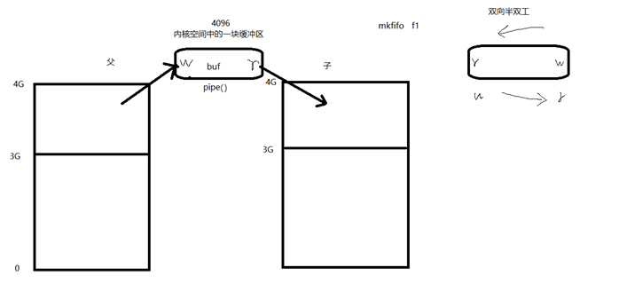
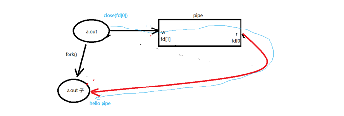
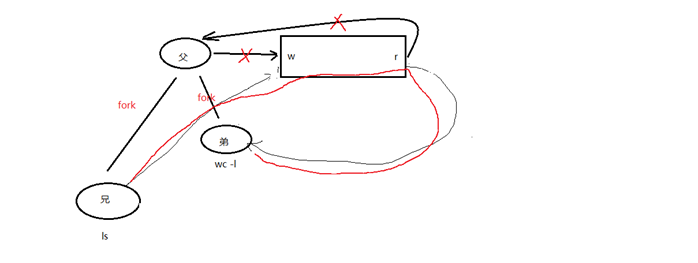
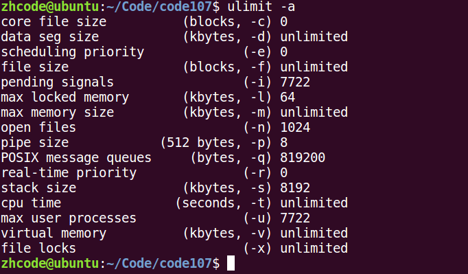
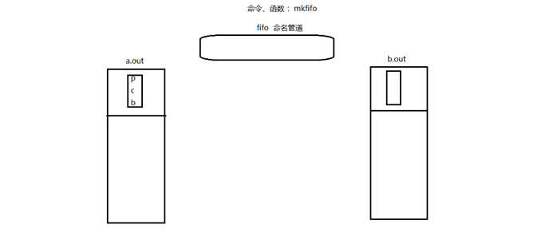
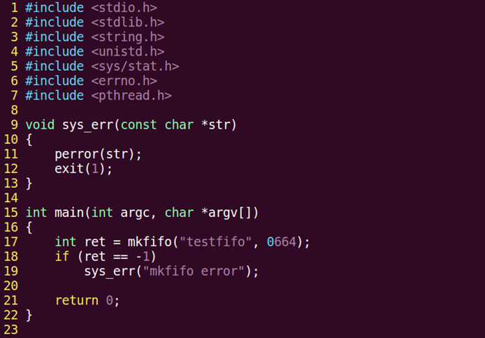
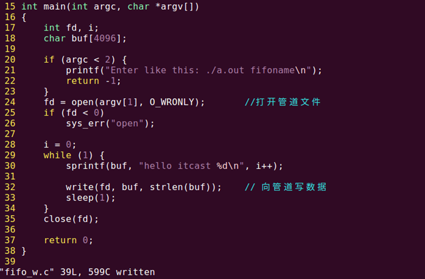
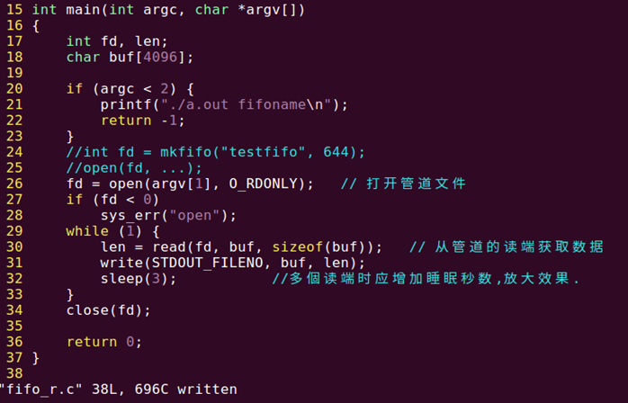
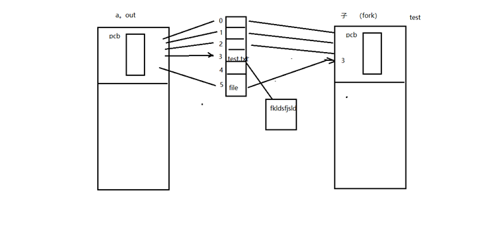
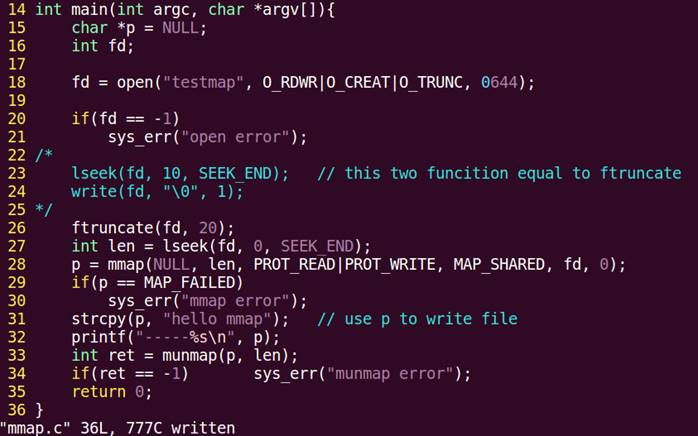

# 进程间通信常见方式

IPC(Inter Process Communication)进程间通信



进程间通信的常用方式，特征：

1. 管道：简单（但需要有血缘关系）【匿名管道】
2. FIFO：有名管道，可以非血缘使用
3. 信号：开销小 
4. mmap映射：非血缘关系进程间
5. socket（本地套接字）：稳定

# 管道

## 管道的概念

管道： 

实现原理： 内核借助环形队列机制，使用内核缓冲区实现。

特质：

1. 伪文件（不占用磁盘空间）占用的包括：普通文件，目录，软链接，其他都不占用
   - 不占用其实是因为只有在实际需要时才会创建，与一般的环形队列还不同

2. 管道中的数据只能一次读取。

3. 数据在管道中，只能单向流动。

 局限性：

1. 自己写，不能自己读。

2. 数据不可以反复读。

3. 半双工通信。

4. 血缘关系进程间可用。因为管道没有路径名，只有通过父子进程的复制获取

## 管道的基本用法

### pipe函数

创建，并打开管道

```c
int pipe(int fd[2]);

//参数：	
	fd[0]: 读端。
	fd[1]: 写端。
//返回值： 
    成功： 0
	失败： -1 errno

```

### 管道通信原理：



一个管道通信的示例，父进程往管道里写，子进程从管道读，然后打印读取的内容：

```c
1.	#include <stdio.h>  
2.	#include <stdlib.h>  
3.	#include <string.h>  
4.	#include <unistd.h>  
5.	#include <errno.h>  
6.	#include <pthread.h>  
7.	  
8.	void sys_err(const char *str)  
9.	{  
10.	    perror(str);  
11.	    exit(1);  
12.	}  
13.	  
14.	int main(int argc, char *argv[])  
15.	{  
16.	    int ret;  
17.	    int fd[2];  
18.	    pid_t pid;  
19.	  
20.	    char *str = "hello pipe\n";  
21.	    char buf[1024];  
22.	  
23.	    ret = pipe(fd);  
24.	    if (ret == -1)  
25.	        sys_err("pipe error");  
26.	  
27.	    pid = fork();  
28.	    if (pid > 0) {  
29.	        close(fd[0]);       // 关闭读段  
30.	        //sleep(3);  
31.	        write(fd[1], str, strlen(str));  
32.	        close(fd[1]);  
33.	    } else if (pid == 0) {  
34.	        close(fd[1]);       // 子进程关闭写段  
35.	        ret = read(fd[0], buf, sizeof(buf));  
36.	        printf("child read ret = %d\n", ret);  
37.	        write(STDOUT_FILENO, buf, ret);  
38.	  
39.	        close(fd[0]);  
40.	    }  
41.	  
42.	    return 0;  
43.	}  
```

要是不想让终端提示和输出混杂在一起，就在父进程写入内容之后sleep一秒钟。

### 管道的读写行为

读管道：

1. 管道有数据：read返回实际读到的字节数。
2. 管道无数据：
   1. 无写端：read返回0（类似读到文件结尾）。
   2. 有写端：read阻塞等待。

写管道：

1. 无读端，异常终止。（SIGPIPE导致的）
2. 有读端：
   1. 管道已满，阻塞等待。
   2. 管道未满，返回写出的字节个数。

### 底层实现：

只有读管道的指针，没有写的指针。写指针=读指针+已有数据长度

https://www.sohu.com/a/506115243_121124360

### 父子进程通信练习

练习：使用管道实现父子进程间通信，完成：ls | wc -l 假定父进程实现ls，子进程实现wc

ls命令正常会将结果集写到stdout，但现在会写入管道写端

wc -l命令正常应该从stdin读取数据，但此时会从管道的读端读。

要用到 pipe dup2 exec

例子如下

```c
#include <stdio.h>
#include <stdlib.h>
#include <string.h>
#include <fcntl.h>
#include <unistd.h>
#include <pthread.h>
#include <sys/wait.h>
#include <sys/types.h>
int main(int argc,char *argv[])
{
    int ret;
    int fd[2];
    pid_t pid;

    ret = pipe(fd);
    if(ret==-1){
        perror("pipe error\n");
        exit(1);
    }
    pid=fork();
    if(pid==-1){
        perror("fork error\n");
        exit(1);
    }else if(pid >0){
        close(fd[0]);
        dup2(fd[1],STDOUT_FILENO);
        execlp("ls","ls",NULL);
        perror("exec error\n");
        exit(1);
    }else if(pid==0){
        close(fd[1]);
        dup2(fd[0],STDIN_FILENO);
        execlp("wc","wc","-l",NULL);
        perror("exec error\n");
        exit(1);
    }
    return 0;
}
```

如果父进程执行ls，子进程执行wc，有可能在父进程结束后，子进程才结束，则输出会乱。因此可以子进程写入ls，父进程独出再执行wc，可以确保父进程后执行。

### 兄弟进程通信练习

测试：

​    是否允许，一个pipe有一个写端多个读端？可

​    是否允许，一个pipe有多个写端一个读端？可



```c
//
// Created by alex on 2022/4/14.
//


#include <stdio.h>
#include <stdlib.h>
#include <string.h>
#include <fcntl.h>
#include <unistd.h>
#include <pthread.h>
#include <sys/wait.h>
#include <sys/types.h>
int main(int argc,char *argv[])
{
    int ret;
    int fd[2];
    pid_t pid;
    int i;
    ret = pipe(fd);
    if(ret==-1){
        perror("pipe error\n");
        exit(1);
    }
    for(i=0;i<2;++i){
        pid=fork();
        if(pid==-1){
            perror("fork error\n");
            exit(1);
        }
        if(pid==0){
            break;
        }
    }
    if(i==2){
        //close(fd[0]);
        close(fd[1]);//如果父进程不关闭写端，当管道里东西读完，弟继续进行wc读出的时候，因为还有写端，所以一直等待x
        wait(NULL);
        wait(NULL);
    }else if(i==0){
        close(fd[0]);
        dup2(fd[1],STDOUT_FILENO);
        execlp("ls","ls",NULL);
        perror("exec error\n");
        exit(1);
    }else if(i==1){
        close(fd[1]);
        dup2(fd[0],STDIN_FILENO);
        execlp("wc","wc","-l",NULL);
        perror("exec error\n");
        exit(1);
    }
    return 0;
}
```

### 多个读写端操作管道和管道缓冲区大小

管道大小，默认4096



 ## 命名管道fifo的创建和原理图

管道的优劣：

- 优点：简单，相比信号，套接字实现进程通信，简单很多
- 缺点：
  - 只能单向通信，双向通信需建立两个管道
  - 只能用于有血缘关系的进程间通信。该问题后来使用fifo命名管道解决。



### fifo管道：可以用于无血缘关系的进程间通信。

命名管道： mkfifo 

无血缘关系进程间通信：

```c
//读端
fd=open(fifo,O_RDONLY);
read(fd,buf,size);

//写端
fd=open(fifo,O_WRONLY);
write(fd,buf,len);
```

fifo操作起来像文件

下面的代码创建一个fifo：



### 实现非血缘关系进程间通信

下面这个例子，一个写fifo，一个读fifo，操作起来就像文件一样的：

写：



读：



# 共享存储映射

### 文件用于进程间通信

打开的文件是内核中的一块缓冲区。多个无血缘关系的进程，可以同时访问该文件。



文件通信这个，有没有血缘关系都行，只是有血缘关系的进程对于同一个文件，使用的同一个文件描述符，没有血缘关系的进程，对同一个文件使用的文件描述符可能不同。这些都不是问题，打开的是同一个文件就行。

### mmap函数原型

存储映射I/O(Memory-mapped I/O) 使一个磁盘文件与存储空间中的一个缓冲区相映射。于是从缓冲区中取数据，就相当于读文件中的相应字节。与此类似，将数据存入缓冲区，则相应的字节就自动写入文件。这样，就可在不使用read和write函数的情况下，使地址指针完成I/O操作。

使用这种方法:首先应该通知内核，将一个指定文件映射到存储区域中。这个映射工作可以通过mmap函数来实现。

```c
//创建共享内存映射
void *mmap(void *addr, size_t length, int prot, int flags, int fd, off_t offset);
//参数：
addr： 	指定映射区的首地址。通常传NULL，表示让系统自动分配
length：	共享内存映射区的大小。（<= 文件的实际大小）
prot：	共享内存映射区的读写属性。PROT_READ、PROT_WRITE、PROT_READ|PROT_WRITE
flags：	标注共享内存的共享属性。MAP_SHARED、MAP_PRIVATE（建立一个写入时拷贝的私有映射。内存区域的写入不			会影响到原文件）
fd:		用于创建共享内存映射区的那个文件的 文件描述符。
offset： 默认0，表示映射文件全部。偏移位置。需是 4k 的整数倍。
//返回值：
成功：映射区的首地址。
失败：MAP_FAILED (void*(-1))， errno

//释放映射区。
int munmap(void *addr, size_t length);	
//参数：
addr：mmap 的返回值
length：大小

```

### mmap原理

#### mmap内存映射实现过程
mmap内存映射的实现过程，总的来说可以分为三个阶段：

（一）进程启动映射过程，并在虚拟地址空间中为映射创建虚拟映射区域
1、进程在用户空间调用库函数mmap，原型：void *mmap(void *start, size_t length, int prot, int flags, int fd, off_t offset);
2、在当前进程的虚拟地址空间中，寻找一段空闲的满足要求的连续的虚拟地址
3、为此虚拟区分配一个vm_area_struct结构，接着对这个结构的各个域进行了初始化
4、将新建的虚拟区结构（vm_area_struct）插入进程的虚拟地址区域链表或树中

（二）调用内核空间的系统调用函数mmap（不同于用户空间函数），实现文件物理地址和进程虚拟地址的一一映射关系

5、为映射分配了新的虚拟地址区域后，通过待映射的文件指针，在文件描述符表中找到对应的文件描述符，通过文件描述符，链接到内核“已打开文件集”中该文件的文件结构体（struct file），每个文件结构体维护着和这个已打开文件相关各项信息。
6、通过该文件的文件结构体，链接到file_operations模块，调用内核函数mmap，其原型为：int mmap(struct file *filp, struct vm_area_struct *vma)，不同于用户空间库函数。
7、内核mmap函数通过虚拟文件系统inode模块定位到文件磁盘物理地址。
8、通过remap_pfn_range函数建立页表，即实现了文件地址和虚拟地址区域的映射关系。此时，这片虚拟地址并没有任何数据关联到主存中。

（三）进程发起对这片映射空间的访问，引发缺页异常，实现文件内容到物理内存（主存）的拷贝

注：前两个阶段仅在于创建虚拟区间并完成地址映射，但是并没有将任何文件数据的拷贝至主存。真正的文件读取是当进程发起读或写操作时。

9、进程的读或写操作访问虚拟地址空间这一段映射地址，通过查询页表，发现这一段地址并不在物理页面上。因为目前只建立了地址映射，真正的硬盘数据还没有拷贝到内存中，因此引发缺页异常。
10、缺页异常进行一系列判断，确定无非法操作后，内核发起请求调页过程。
11、调页过程先在交换缓存空间（swap cache）中寻找需要访问的内存页，如果没有则调用nopage函数把所缺的页从磁盘装入到主存中。
12、之后进程即可对这片主存进行读或者写的操作，如果写操作改变了其内容，一定时间后系统会自动回写脏页面到对应磁盘地址，也即完成了写入到文件的过程。
注：修改过的脏页面并不会立即更新回文件中，而是有一段时间的延迟，可以调用msync()来强制同步, 这样所写的内容就能立即保存到文件里了。

#### mmap通过/dev/mem映射物理内存

linux 内核为用户提供了一个/dev/mem的驱动程序，使用户直接访问系统物理内存成为可能，利用mmap和/dev/mem可以建立起直接读写系统物理内存的渠道。
/dev/mem是linux下的一个字符设备，源文件是kernel/drivers/char/mem.c，这个设备文件是专门用来读写物理地址用的。里面的内容是所有物理内存的地址以及内容信息。通常只有root用户对其有读写权限。也就是说，使用mmap时，通过/dev/mem做了一个巧妙的转换，原本填文件句柄的参数，只需要填上open /dev/mem之后的文件句柄，就可以直接完成对物理内存的映射。
另外值得注意的就是mmap的入参*off_t offset*，原本是被映射文件的偏移，如果是通过/dev/mem映射物理内存则是填需要被映射的**物理内存的起点**。

https://blog.csdn.net/weixin_42937012/article/details/121269058

### mmap建立映射区

下面这个示例代码，使用mmap创建一个映射区（共享内存），并往映射区里写入内容：



编译运行，如下所示：


 ### mmap使用注意事项

使用注意事项：

1. 用于创建映射区的文件大小为 0，实际指定非0大小创建映射区，出 “总线错误”。
2. 用于创建映射区的文件大小为 0，实际制定0大小创建映射区， 出 “无效参数”。
3. 用于创建映射区的文件读写属性为，只读。映射区属性为 读、写。 出 “无效参数”。
4. 创建映射区，需要read权限。当访问权限指定为 “共享”MAP_SHARED时， mmap的读写权限，应该 <=文件的open权限。 只写不行。
5. 文件描述符fd，在mmap创建映射区完成即可关闭。后续访问文件，用 地址访问。
6. offset 必须是 4096的整数倍。（MMU 映射的最小单位 4k ）。
7. 对申请的映射区内存，不能越界访问。 
8. munmap用于释放的 地址，必须是mmap申请返回的地址。
9. 映射区访问权限为 “私有”MAP_PRIVATE, 对内存所做的所有修改，只在内存有效，不会反应到物理磁盘上。
10. 映射区访问权限为 “私有”MAP_PRIVATE, 只需要open文件时，有读权限，用于创建映射区即可。

mmap函数的保险调用方式：

```c
fd = open（"文件名"， O_RDWR）;
mmap(NULL, 有效文件大小， PROT_READ|PROT_WRITE, MAP_SHARED, fd, 0);
```

> **x86中的MMU不支持可写但不可读（也就是只有PROT_WRITE）的页面.这样设定**！！！！！！
>
> 所以只设置PROT_WRITE仍然可以从中读出，因为相当于什么都没做
>
> mmap创建映射区出错概率非常高，一定要检查返回值，确保映射区建立成功再进行后续操作。

## 父子进程间mmap通信

父进程 先 创建映射区。 open（ O_RDWR） mmap( MAP_SHARED );

1. 指定 MAP_SHARED 权限
2. fork() 创建子进程。
3. 一个进程读， 另外一个进程写。

 下面这段代码，父子进程mmap通信，共享内存是一个int变量：

```c
1.	#include <stdio.h>  
2.	#include <stdlib.h>  
3.	#include <unistd.h>  
4.	#include <fcntl.h>  
5.	#include <sys/mman.h>  
6.	#include <sys/wait.h>  
7.	  
8.	int var = 100;  
9.	  
10.	int main(void)  
11.	{  
12.	    int *p;  
13.	    pid_t pid;  
14.	  
15.	    int fd;  
16.	    fd = open("temp", O_RDWR|O_CREAT|O_TRUNC, 0644);  
17.	    if(fd < 0){  
18.	        perror("open error");  
19.	        exit(1);  
20.	    }  
21.	    ftruncate(fd, 4);  
22.	  
23.	    p = (int *)mmap(NULL, 4, PROT_READ|PROT_WRITE, MAP_SHARED, fd, 0);  
24.	    //p = (int *)mmap(NULL, 4, PROT_READ|PROT_WRITE, MAP_PRIVATE, fd, 0);  
25.	    if(p == MAP_FAILED){        //注意:不是p == NULL  
26.	        perror("mmap error");  
27.	        exit(1);  
28.	    }  
29.	    close(fd);                  //映射区建立完毕,即可关闭文件  
30.	  
31.	    pid = fork();               //创建子进程  
32.	    if(pid == 0){  
33.	       *p = 7000;               // 写共享内存  
34.	        var = 1000;  
35.	        printf("child, *p = %d, var = %d\n", *p, var);  
36.	    } else {  
37.	        sleep(1);  
38.	        printf("parent, *p = %d, var = %d\n", *p, var);     // 读共享内存  
39.	        wait(NULL);  
40.	  
41.	        int ret = munmap(p, 4);             //释放映射区  
42.	        if (ret == -1) {  
43.	            perror("munmap error");  
44.	            exit(1);  
45.	        }  
46.	    }  
47.	  
48.	    return 0;  
49.	}  
```

## 无血缘关系进程间mmap通信

无血缘关系进程间 mmap 通信：       【会写】

1. 两个进程 打开同一个文件，创建映射区。
2. 指定flags 为 MAP_SHARED。
3. 一个进程写入，另外一个进程读出。

 【注意】：无血缘关系进程间通信。mmap：数据可以重复读取。

 fifo：数据只能一次读取。

下面是两个无血缘关系的通信代码，先是写进程：

```c
1.	#include <stdio.h>  
2.	#include <sys/stat.h>  
3.	#include <sys/types.h>  
4.	#include <fcntl.h>  
5.	#include <unistd.h>  
6.	#include <stdlib.h>  
7.	#include <sys/mman.h>  
8.	#include <string.h>  
9.	  
10.	struct STU {  
11.	    int id;  
12.	    char name[20];  
13.	    char sex;  
14.	};  
15.	  
16.	void sys_err(char *str)  
17.	{  
18.	    perror(str);  
19.	    exit(1);  
20.	}  
21.	  
22.	int main(int argc, char *argv[])  
23.	{  
24.	    int fd;  
25.	    struct STU student = {10, "xiaoming", 'm'};  
26.	    char *mm;  
27.	  
28.	    if (argc < 2) {  
29.	        printf("./a.out file_shared\n");  
30.	        exit(-1);  
31.	    }  
32.	  
33.	    fd = open(argv[1], O_RDWR | O_CREAT, 0664);  
34.	    ftruncate(fd, sizeof(student));  
35.	  
36.	    mm = mmap(NULL, sizeof(student), PROT_READ|PROT_WRITE, MAP_SHARED, fd, 0);  
37.	    if (mm == MAP_FAILED)  
38.	        sys_err("mmap");  
39.	  
40.	    close(fd);  
41.	  
42.	    while (1) {  
43.	        memcpy(mm, &student, sizeof(student));  
44.	        student.id++;  
45.	        sleep(1);  
46.	    }  
47.	  
48.	    munmap(mm, sizeof(student));  
49.	  
50.	    return 0;  
51.	}  
```

然后是读进程：

```c
1.	#include <stdio.h>  
2.	#include <sys/stat.h>  
3.	#include <fcntl.h>  
4.	#include <unistd.h>  
5.	#include <stdlib.h>  
6.	#include <sys/mman.h>  
7.	#include <string.h>  
8.	  
9.	struct STU {  
10.	    int id;  
11.	    char name[20];  
12.	    char sex;  
13.	};  
14.	  
15.	void sys_err(char *str)  
16.	{  
17.	    perror(str);  
18.	    exit(-1);  
19.	}  
20.	  
21.	int main(int argc, char *argv[])  
22.	{  
23.	    int fd;  
24.	    struct STU student;  
25.	    struct STU *mm;  
26.	  
27.	    if (argc < 2) {  
28.	        printf("./a.out file_shared\n");  
29.	        exit(-1);  
30.	    }  
31.	  
32.	    fd = open(argv[1], O_RDONLY);  
33.	    if (fd == -1)  
34.	        sys_err("open error");  
35.	  
36.	    mm = mmap(NULL, sizeof(student), PROT_READ, MAP_SHARED, fd, 0);  
37.	    if (mm == MAP_FAILED)  
38.	        sys_err("mmap error");  
39.	      
40.	    close(fd);  
41.	  
42.	    while (1) {  
43.	        printf("id=%d\tname=%s\t%c\n", mm->id, mm->name, mm->sex);  
44.	        sleep(2);  
45.	    }  
46.	    munmap(mm, sizeof(student));  
47.	  
48.	    return 0;  
49.	}  
```

多个写端一个读端也没问题，打开多个写进程即可，读进程会读到所有写进程写入的内容。

这里要注意一个，内容被读走之后不会消失，所以如果读进程的读取时间间隔短，它会读到很多重复内容，就是因为写进程没来得及写入新内容。

## mmap匿名映射区

匿名映射：只能用于 血缘关系进程间通信。

```c
p = (int *)mmap(NULL, 40, PROT_READ|PROT_WRITE, MAP_SHARED|MAP_ANONYMOUS, -1, 0);
//大小随便写
```

只有Linux有MAP_ANONYMOUS，其他类Unix系统没有

可以使用默认的文件

```C
int fd=open("/dev/zero",O_RDWR);
p = (int *)mmap(NULL, 40, PROT_READ|PROT_WRITE, MAP_SHARED, fd, 0);
//大小随便写
```

