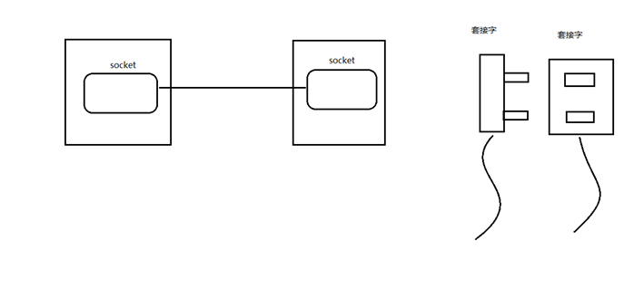
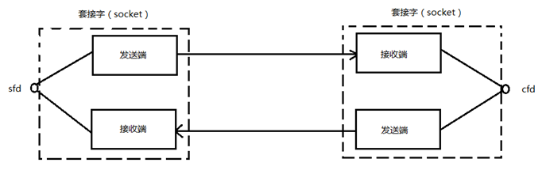
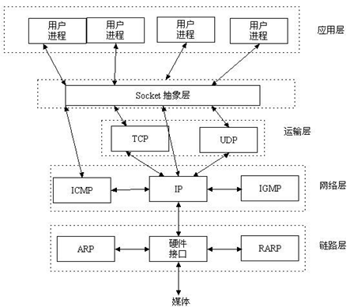
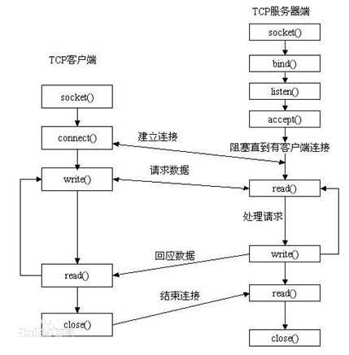

# Socket

## BS和CS模型对比

c/s模型：

  client-server

b/s模型： 

  browser-server 

|      |                           C/S                            |                     B/S                      |
| :--: | :------------------------------------------------------: | :------------------------------------------: |
| 优点 |            缓存大量数据、协议选择灵活、速度快            | 安全性(全网协议统一)、跨平台、开发工作量较小 |
| 缺点 | 安全性(客户端可能夹带私货)、不支持跨平台、开发工作量较大 |       不能缓存大量数据、严格遵守 http        |

## 套接字

网络套接字：socket

在**通信过程**中，套接字一定是成对出现的。客户端和服务端各一个

一个文件描述符指向一个套接字（该套接字内部由内核借助两个缓冲区实现。）





#### 怎么观察 socket 缓冲区

如果想要查看 socket 缓冲区，可以在linux环境下执行 `netstat -nt` 命令。

```bash
# netstat -nt
Active Internet connections (w/o servers)
Proto Recv-Q Send-Q Local Address           Foreign Address         State      
tcp        0     60 172.22.66.69:22         122.14.220.252:59889    ESTABLISHED
```

TCP/IP协议最早在BSD UNIX上实现，为TCP/IP协议设计的应用层编程接口称为socket API

这上面表明了，这里有一个协议（Proto）类型为 TCP 的连接，同时还有本地（Local Address）和远端（Foreign Address）的IP信息，状态（State）是已连接。

- **Send-Q 是发送缓冲区**，下面的数字60是指，当前还有60 Byte在发送缓冲区中未发送。
-  **Recv-Q 代表接收缓冲区**， 此时是空的，数据都被应用进程接收干净了。

关于socket缓冲区的各部分状态可以参考https://blog.csdn.net/summer_fish/article/details/121740570

### 半关闭状态下怎么接收FIN和发送ACK

一端close后会调用tcp_close函数，函数的最后会执行sk_stream_wait_close(sk, timeout);以进入等待状态，此状态中会对接收到的报文进行确认，主要区分是不是（SYN,FIN,其他）再根据不同的报文处理。https://www.programminghunter.com/article/7318656287/

```c
enum tcp_tw_status
tcp_timewait_state_process(struct inet_timewait_sock *tw, struct sk_buff *skb,
      const struct tcphdr *th);
//判断接收到的报文，如果接收到的是对端的FIN包，则将time_wait控制块的子状态设置为TCP_TIME_WAIT，此时才是进入真正的TIME_WAIT状态。然后根据TIME_WAIT的持续时间的长短来确定是加入到twcal_row队列还是启动一个定时器，最后会返回TCP_TW_ACK，给对端发送TCP连接关闭时最后的ACK包。
```



## 网络字节序

小端法：（pc本地存储） 	 高位存高地址。地位存低地址。  int a = 0x12345678

大端法：（网络存储） 		高位存低地址。地位存高地址。

### 转换字节序函数：

```c
uint32_t htonl(uint32_t hostlong); //本地-->网络（IP）------>192.168.1.11 --> string --> atoi --> int --> htonl --> 网络字节序
uint16_t htons(uint16_t hostshort);//本地-->网络（port）
uint32_t htohl(uint32_t netlong);//网络-->本地（IP）
uint16_t htohs(uint16_t netshort);//网络-->本地（port）
```

```c
long htonl(long value)
{
return ((value <<24 )|((value<<8)&0x00FF0000)|((value>>8)&0x0000FF00)|(value>>24));
}
```

函数其实很好理解，就是小端装换成大端，因为网络地址是大端，而正常的网络地址是小端。原理很好理解，一个四个值分别为：(假设value值为0x12345678，转化后数据为：0x78563412)

```
1. value <<24				得到0x7800 0000
2. (value<<8)&0x00FF0000)	得到0x0056 0000
3. (value>>8)&0x0000FF00)	得到0x0000 3400
4. value>>24				得到0x0000 0012
```

但是问题在于value <<24 和value>>24能否想要的值。在windows的编译器上，能够成功的得到。**但是在Linux上得到的值是错误的**，因为value<<24得到的值并非0x7800 0000 而是0x7812 3456

保险起见使用一下自定义函数：

```c
long htonl(long value)

{

return (((value <<24 )&0xFF000000)|((value<<8)&0x00FF0000)|((value>>8)&0x0000FF00)|((value>>24)&0x000000FF));

}
```


## IP地址转换函数

```c
#include <arpa/inet.h>
int inet_pton(int af, const char *src, void *dst);//本地字节序（string IP） ---> 网络字节序
/*
参数：
	af：协议类型(ipv4/ipv6)，AF_INET、AF_INET6
	src：传入，IP地址（点分十进制）
	dst：传出，转换后的 网络字节序的 IP地址。

返回值：
	成功：1
	异常：0，说明src指向的不是一个有效的ip地址。（网络中没有）
	失败：-1
*/
const char *inet_ntop(int af, const void *src, char *dst, socklen_t size);//网络字节序---> 本地字节序（string IP）
/*
参数：
	af：协议类型(ipv4/ipv6)，AF_INET、AF_INET6
	src：网络字节序IP地址
	dst：本地字节序（string IP）
	size：dst的大小。
返回值：
	成功：dst
	失败：NULL
*/
```

## sockaddr地址结构

sockaddr地址结构：  IP + port --> 在网络环境中唯一标识一个进程。

```c
struct sockaddr_in addr;
addr.sin_family = AF_INET/AF_INET6				//man 7 ip
addr.sin_port = htons(9527);
	int dst;
	inet_pton(AF_INET, "192.157.22.45", (void *)&dst);
addr.sin_addr.s_addr = dst;
//【*】addr.sin_addr.s_addr = htonl(INADDR_ANY);		//取出系统中有效的任意IP地址。二进制类型。
//INADDR_ANY就是指定地址为0.0.0.0的地址
bind(fd, (struct sockaddr *)&addr, size);

```

## socket模型创建流程分析



## 服务器函数

### socket函数

```c
#include <sys/socket.h>
int socket(int domain, int type, int protocol);//创建一个套接字
/*
参数：
	domain：AF_INET、AF_INET6、AF_UNIX
	type：SOCK_STREAM、SOCK_DGRAM
		sock_stream 是有保障的(即能保证数据正确传送到对方)面向连接的SOCKET，多用于资料(如文件)传送。
		sock_dgram 	是无保障的面向消息的socket ， 主要用于在网络上发广播信息。
	protocol：0
返回值：
	成功：新套接字所对应的文件描述符
	失败：-1 errno
*/
```

### bind函数

```c
#include <arpa/inet.h>
int bind(int sockfd, const sockaddr *addr,socklen_t addrlen);//给socket绑定一个 地址结构 (IP+port)
/*
参数：
	sockfd：socket函数返回值
	
	struct sockaddr_in addr;
	addr.sin_family = AF_INET;
	addr.sin_port = htons(8888)
	addr.sin_addr.s_addr = htonl(INADDR_ANY);
	
	addr：传入参数(struct sockaddr *)&addr
	
	addrlen：sizeof(addr)地址结构的大小
返回值：
	成功：0
	失败：-1 errno
*/
```


### listen函数

当socket函数创建一个套接字时，它被假设为一个主动套接字，也就是说，它是一个将调用connect连接的客户套接字。listen函数把一个未连接的套接字转换成一个被动套接字，指示内核应该接受指向该套接字的连接请求。如下图所示，调用listen导致套接字从CLOSED状态转换到LISTEN状态。


```c
int listen(int sockfd, int backlog);//设置同时与服务器建立连接的上限数。（同时进行3次握手的客户端数量）将Socket从Closed状态转为Listen状态
/*
参数：
	sockfd：socket函数返回值
	backlog：上限数值。最大128
返回值：
	成功：0
	失败：-1 errno
*/
```

### accept函数

```c
#include <sys/socket.h>
int accept(int sockfd, struct sockaddr *addr, socklen_t *addrlen);//阻塞等待客户端建立连接，成功的话，返回一个与客户端成功连接的socket文件描述符。
/*
参数：
	sockfd：	socket函数返回值
	addr：	传出参数。成功与服务器建立连接的那个客户端的地址结构（IP+port）
	
	
			socklen_t clit_addr_len = sizeof(addr)
	addrlen：传入传出。&clit_addr_len
				入：addr的大小。出：客户端addr的实际大小。
返回值：
	成功：能与服务器进行数据通信的 socket 对应的文件描述符（服务端）
	失败：-1，errno
*/
```

## 客户端函数

### connect函数

```c
int connect(int sockfd, const struct sockaddr *addr, socklen_t addrlen);//使用现有的 socket 与服务器建立连接
/*
参数：
	sockfd： socket 函数返回值
		struct sockaddr_in srv_addr;		// 服务器地址结构
		srv_addr.sin_family = AF_INET;
		srv_addr.sin_port = 9527 	跟服务器bind时设定的 port 完全一致。
		inet_pton(AF_INET, "服务器的IP地址"，&srv_adrr.sin_addr.s_addr);
		
	addr：传入参数。服务器的地址结构
	addrlen：服务器的地址结构的大小
	
返回值：
	成功：0
	失败：-1 errno
*/
```

如果不使用bind绑定客户端地址结构, 采用"隐式绑定"

## C/S模型的TCP通信分析

### server

1. socket()		创建socket
2. bind()            绑定服务器地址结构
3. listen()           设置监听上限
4. accept()         阻塞监听客户端连接
5. read(fd)         读socket获取客户端数据
6. 小--大写          toupper() `#include <ctype.h>`
7. write(fd)         
8. close()

### client

1. socket()         创建socket
2. connect()       与服务器建立连接
3. write()             写数据到socket
4. read()              读转换后的数据
5. 显示读取结果
6. close()

## server实现

```c
#include <stdio.h>
#include <stdlib.h>
#include <string.h>
#include <unistd.h>
#include <errno.h>
#include <pthread.h>
#include <ctype.h>
#include <sys/socket.h>
#include <arpa/inet.h>

#define SER_PORT 9527
void sys_err(const char *str)
{
    perror(str);
    exit(1);
}

int main(int argc,char *argv[])
{
    int lfd,cfd;
    int ret=0,i;

    char buf[BUFSIZ],client_ip[BUFSIZ];
    struct sockaddr_in server_addr,clien_addr;
    server_addr.sin_family=AF_INET;
    server_addr.sin_port=htons(SER_PORT);
    server_addr.sin_addr.s_addr=htonl(INADDR_ANY);


    lfd=socket(AF_INET,SOCK_STREAM,0);
    if(lfd==-1)
        sys_err("socket error");

    ret=bind(lfd,(struct sockaddr*)&server_addr,sizeof(server_addr));
    if(ret==-1)
        sys_err("bind error");

    ret=listen(lfd,128);
    if(ret==-1)
        sys_err("listen error");

    socklen_t clien_addr_len=sizeof(clien_addr);
    cfd=accept(lfd,(struct sockaddr*)&clien_addr,&clien_addr_len);//返回用于传输的socket
    if(cfd==-1)
        sys_err("accept error");

    printf("client ip:%s port:%d\n",inet_ntop(AF_INET,&clien_addr.sin_addr.s_addr,client_ip,sizeof(client_ip)),ntohs(clien_addr.sin_port));//获取客户端地址

    while(1){
        ret=read(cfd,buf,sizeof(buf));
        write(STDOUT_FILENO,buf,ret);

        for(i=0;i<ret;++i)
            buf[i]=toupper(buf[i]);

        write(cfd,buf,ret);
    }
    close(lfd);
    close(cfd);

    return 0;
}
```

## client实现

```c
#include <stdio.h>
#include <stdlib.h>
#include <string.h>
#include <unistd.h>
#include <errno.h>
#include <pthread.h>

#include <ctype.h>
#include <sys/socket.h>
#include <arpa/inet.h>
#define SER_PORT 9527
void sys_err(const char *str)
{
    perror(str);
    exit(1);
}
int main ()
{
    int cfd,count=10;
    char buf[BUFSIZ];
    cfd=socket(AF_INET,SOCK_STREAM,0);
    if(cfd==-1){
        sys_err("socket err");
    }
    struct sockaddr_in server_addr;
    server_addr.sin_family=AF_INET;
    server_addr.sin_port=htons(SER_PORT);
    inet_pton(AF_INET,"127.0.0.1",&server_addr.sin_addr.s_addr);

    int ret=connect(cfd,(struct sockaddr*)&server_addr,sizeof(server_addr));
    if(ret==-1){
        sys_err("connect err");
    }

    while(count--){
        write(cfd,"hello\n",6);
        ret=read(cfd,buf,sizeof(buf));
        write(STDOUT_FILENO,buf,ret);
        sleep(1);
    }
    close(cfd);
    return 0;
}
```

## 错误处理函数的封装思路

wrap.h文件如下，就是包裹函数的声明

```c
1.	#ifndef __WRAP_H_  
2.	#define __WRAP_H_  
3.	  
4.	void perr_exit(const char *s);  
5.	int Accept(int fd, struct sockaddr *sa, socklen_t *salenptr);  
6.	int Bind(int fd, const struct sockaddr *sa, socklen_t salen);  
7.	int Connect(int fd, const struct sockaddr *sa, socklen_t salen);  
8.	int Listen(int fd, int backlog);  
9.	int Socket(int family, int type, int protocol);  
10.	ssize_t Read(int fd, void *ptr, size_t nbytes);  
11.	ssize_t Write(int fd, const void *ptr, size_t nbytes);  
12.	int Close(int fd);  
13.	ssize_t Readn(int fd, void *vptr, size_t n);  
14.	ssize_t Writen(int fd, const void *vptr, size_t n);  
15.	ssize_t my_read(int fd, char *ptr);  
16.	ssize_t Readline(int fd, void *vptr, size_t maxlen);  
17.	  
18.	#endif 
```

wrap.c随便取一部分，如下，就是包裹函数的代码：

```c
1.	#include <stdlib.h>  
2.	#include <stdio.h>  
3.	#include <unistd.h>  
4.	#include <errno.h>  
5.	#include <sys/socket.h>  
6.	  
7.	void perr_exit(const char *s)  
8.	{  
9.	    perror(s);  
10.	    exit(-1);  
11.	}  
12.	  
13.	int Accept(int fd, struct sockaddr *sa, socklen_t *salenptr)  
14.	{  
15.	    int n;  
16.	  
17.	again:  
18.	    if ((n = accept(fd, sa, salenptr)) < 0) {  
19.	        if ((errno == ECONNABORTED) || (errno == EINTR))  
20.	            goto again;  
21.	        else  
22.	            perr_exit("accept error");  
23.	    }  
24.	    return n;  
25.	}  
26.	  
27.	int Bind(int fd, const struct sockaddr *sa, socklen_t salen)  
28.	{  
29.	    int n;  
30.	  
31.	    if ((n = bind(fd, sa, salen)) < 0)  
32.	        perr_exit("bind error");  
33.	  
34.	    return n;  
35.	}  
```

### 封装总结

```c
//wrap.c
#include <stdlib.h>
#include <errno.h>
#include <sys/socket.h>
void perr_exit(const char *s)
{
	perror(s);
	exit(1);
}
int Accept(int fd, struct sockaddr *sa, socklen_t *salenptr)
{
	int n;
	again:
	if ( (n = accept(fd, sa, salenptr)) < 0) {
		if ((errno == ECONNABORTED) || (errno == EINTR))
			goto again;
		else
			perr_exit("accept error");
	}
	return n;
}
int Bind(int fd, const struct sockaddr *sa, socklen_t salen)
{
	int n;
	if ((n = bind(fd, sa, salen)) < 0)
		perr_exit("bind error");
	return n;
}
int Connect(int fd, const struct sockaddr *sa, socklen_t salen)
{
	int n;
	if ((n = connect(fd, sa, salen)) < 0)
		perr_exit("connect error");
	return n;
}
int Listen(int fd, int backlog)
{
	int n;
	if ((n = listen(fd, backlog)) < 0)
		perr_exit("listen error");
	return n;
}
int Socket(int family, int type, int protocol)
{
	int n;
	if ( (n = socket(family, type, protocol)) < 0)
		perr_exit("socket error");
	return n;
}
ssize_t Read(int fd, void *ptr, size_t nbytes)
{
	ssize_t n;
again:
	if ( (n = read(fd, ptr, nbytes)) == -1) {
		if (errno == EINTR)
			goto again;
		else
			return -1;
	}
	return n;
}
ssize_t Write(int fd, const void *ptr, size_t nbytes)
{
	ssize_t n;
again:
	if ( (n = write(fd, ptr, nbytes)) == -1) {
		if (errno == EINTR)
			goto again;
		else
			return -1;
	}
	return n;
}
int Close(int fd)
{
	int n;
	if ((n = close(fd)) == -1)
		perr_exit("close error");
	return n;
}
ssize_t Readn(int fd, void *vptr, size_t n)
{
	size_t nleft;
	ssize_t nread;
	char *ptr;

	ptr = vptr;
	nleft = n;

	while (nleft > 0) {
		if ( (nread = read(fd, ptr, nleft)) < 0) {
			if (errno == EINTR)
				nread = 0;
			else
				return -1;
		} else if (nread == 0)
			break;
		nleft -= nread;
		ptr += nread;
	}
	return n - nleft;
}

ssize_t Writen(int fd, const void *vptr, size_t n)
{
	size_t nleft;
	ssize_t nwritten;
	const char *ptr;

	ptr = vptr;
	nleft = n;

	while (nleft > 0) {
		if ( (nwritten = write(fd, ptr, nleft)) <= 0) {
			if (nwritten < 0 && errno == EINTR)
				nwritten = 0;
			else
				return -1;
		}
		nleft -= nwritten;
		ptr += nwritten;
	}
	return n;
}

static ssize_t my_read(int fd, char *ptr)
{
	static int read_cnt;
	static char *read_ptr;
	static char read_buf[100];

	if (read_cnt <= 0) {
again:
		if ((read_cnt = read(fd, read_buf, sizeof(read_buf))) < 0) {
			if (errno == EINTR)
				goto again;
			return -1;	
		} else if (read_cnt == 0)
			return 0;
		read_ptr = read_buf;
	}
	read_cnt--;
	*ptr = *read_ptr++;
	return 1;
}

ssize_t Readline(int fd, void *vptr, size_t maxlen)
{
	ssize_t n, rc;
	char c, *ptr;
	ptr = vptr;

	for (n = 1; n < maxlen; n++) {
		if ( (rc = my_read(fd, &c)) == 1) {
			*ptr++ = c;
			if (c == '\n')
				break;
		} else if (rc == 0) {
			*ptr = 0;
			return n - 1;
		} else
			return -1;
	}
	*ptr = 0;
	return n;
}
```

```c
//wrap.h
#ifndef __WRAP_H_
#define __WRAP_H_
void perr_exit(const char *s);
int Accept(int fd, struct sockaddr *sa, socklen_t *salenptr);
int Bind(int fd, const struct sockaddr *sa, socklen_t salen);
int Connect(int fd, const struct sockaddr *sa, socklen_t salen);
int Listen(int fd, int backlog);
int Socket(int family, int type, int protocol);
ssize_t Read(int fd, void *ptr, size_t nbytes);
ssize_t Write(int fd, const void *ptr, size_t nbytes);
int Close(int fd);
ssize_t Readn(int fd, void *vptr, size_t n);
ssize_t Writen(int fd, const void *vptr, size_t n);
ssize_t my_read(int fd, char *ptr);
ssize_t Readline(int fd, void *vptr, size_t maxlen);
#endif
```

