# 网络基础

## 协议

一组规则

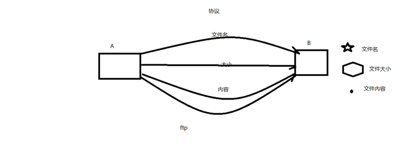

## 7层模型和4层模型及代表协议

  OSI七层模型： 物、数、网、传、会、表、应

  TCP/IP 4层模型：网（链路层/网络接口层）、网、传、应

### 各层协议：

​    应用层：http、ftp、nfs、ssh、telnet、OSPF、DNS。。。

​    传输层：TCP、UDP

​    网络层：IP、ICMP、IGMP

​    链路层：以太网帧协议、ARP

## 网络传输数据封装流程

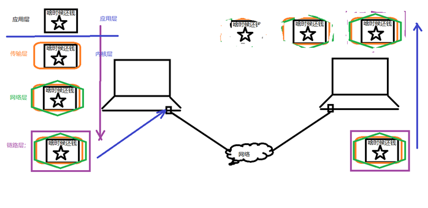

网络传输流程：

  数据没有封装之前，是不能在网络中传递。

  数据-->应用层-->传输层-->网络层-->链路层 -->网络环境

## 以太网帧和ARP请求

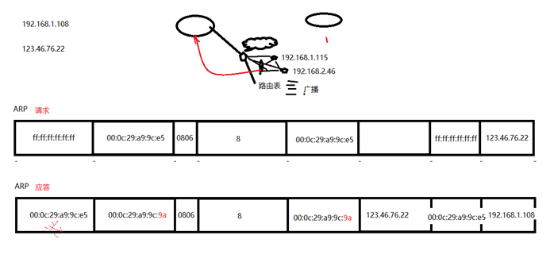

以太网帧协议：

  ARP协议：根据 Ip 地址获取 mac 地址。

  以太网帧协议：根据mac地址，完成数据包传输。

## IP协议

IP协议：

  版本： IPv4、IPv6 -- 4位

  TTL： time to live 。 设置数据包在路由节点中的跳转上限。每经过一个路由节点，该值-1， 减为0的路由，有义务将该数据包丢弃

  源IP： 32位。--- 4字节   192.168.1.108 --- 点分十进制 IP地址（string） --- 二进制 

  目的IP：32位。--- 4字节

 

​                               

### IP数据报

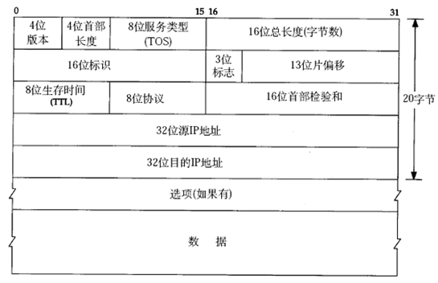

## UDP协议

UDP：

  16位：源端口号。 2^16 = 65536 

  16位：目的端口号。

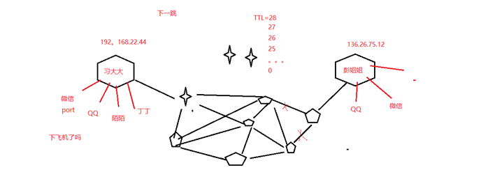

IP地址：可以在网络环境中，唯一标识一台主机。

端口号：可以网络的一台主机上，唯一标识一个进程。 

ip地址+端口号：可以在网络环境中，唯一标识一个进程。

### UDP数据段

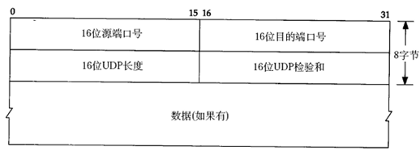

## TCP协议

TCP协议：

  16位：源端口号。 2^16 = 65536 

  16位：目的端口号。

  32序号;

  32确认序号。 

  6个标志位。

  6位窗口大小。  2^16 = 65536

### TCP数据段


### TCP通信时序(三次握手四次握手)

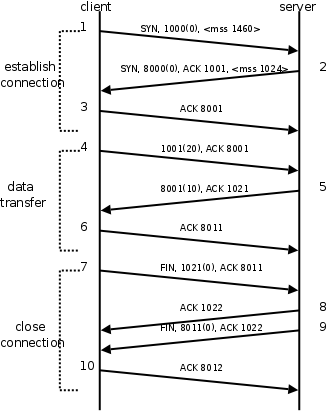

### 数据通信

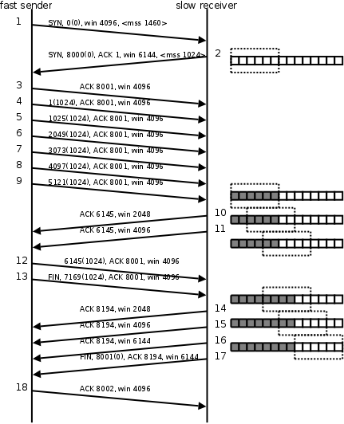

并不是一次发送，一次应答。也可以批量应答

### 四次挥手

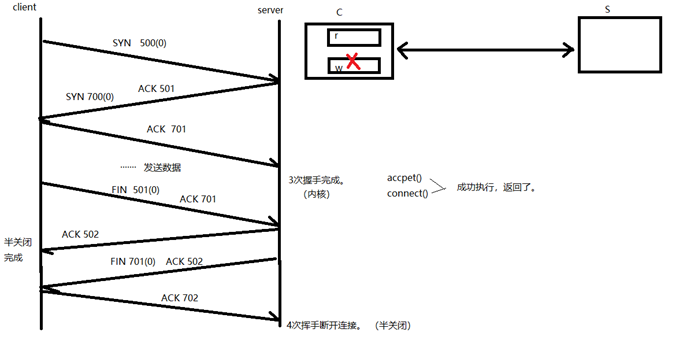

#### 半关闭：

这里其实就是想说明，完成两次挥手后，不是说两端的连接断开了，主动端关闭了写缓冲区，不能再向对端发送数据，被动端关闭了读缓冲区，不能再从对端读取数据。然而主动端还是能够读取对端发来的数据。（只是不用缓冲，ACK会直接发出）

https://blog.csdn.net/summer_fish/article/details/121740570

深入理解TCP协议及其源码

https://www.cnblogs.com/shizijuzi/p/12104635.html

```c++
if (sk->state == TCP_FIN_WAIT1)
    {
 
        if (!sk->dead)
            sk->state_change(sk);
        // 对端已经收到本端的数据的序列号等于下一个应用层数据的序列号，说明本端的数据发送完毕
        if (sk->rcv_ack_seq == sk->write_seq)
        {
            flag |= 1;
            // 写端关闭
            sk->shutdown |= SEND_SHUTDOWN;
            tcp_set_state(sk, TCP_FIN_WAIT2);
        }
    }  
```

### 滑动窗口


滑动窗口：

发送给连接对端，本端的缓冲区大小（实时），保证数据不会丢失

### TCP数据报文

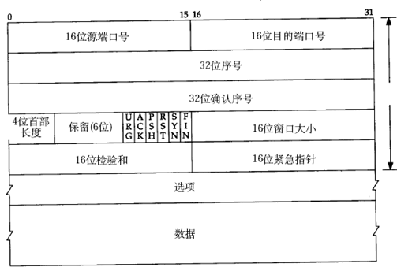

### 通信时序与代码对应关系

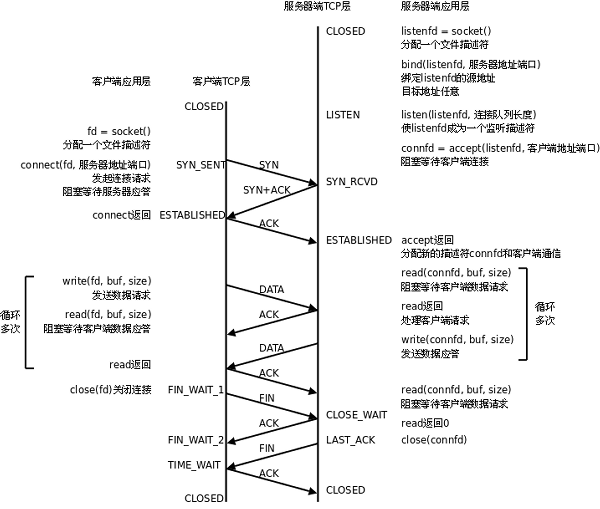

### TCP状态转移

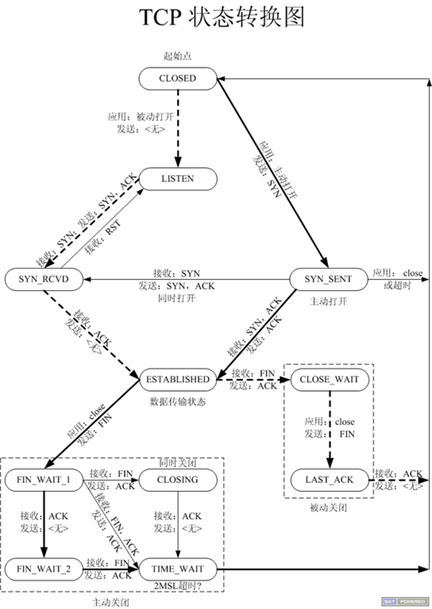

```shell
netstat -apn | grep client    	查看客户端网络连接状态
netstat -apn | grep port	  	查看端口的网络连接状态
netstat -apn | grep 端口号
```

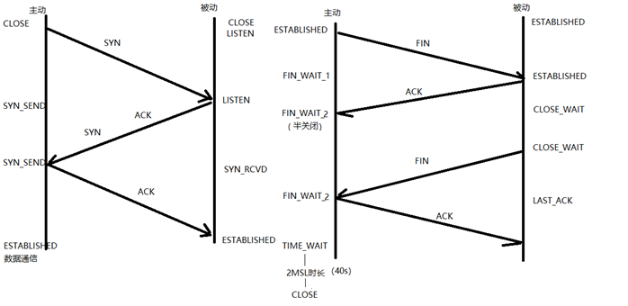

1. 主动发起连接请求端：CLOSE -- 发送SYN -- SEND_SYN -- 接收 ACK、SYN -- SEND_SYN -- 发送 ACK -- ESTABLISHED（数据通信态）

2. 主动关闭连接请求端：ESTABLISHED（数据通信态） -- 发送 FIN -- FIN_WAIT_1 -- 接收ACK -- FIN_WAIT_2（半关闭）

   接收对端发送FIN -- FIN_WAIT_2（半关闭）-- 回发ACK -- TIME_WAIT（只有主动关闭连接方，会经历该状态）

   等 2MSL时长 -- CLOSE

3. 被动接收连接请求端： CLOSE -- LISTEN -- 接收 SYN -- LISTEN -- 发送 ACK、SYN -- SYN_RCVD -- 接收ACK -- ESTABLISHED（数据通信态）

4. 被动关闭连接请求端： ESTABLISHED（数据通信态） -- 接收 FIN -- ESTABLISHED（数据通信态） -- 发送ACK 

   CLOSE_WAIT (说明对端【主动关闭连接端】处于半关闭状态) -- 发送FIN -- LAST_ACK -- 接收ACK -- CLOSE

#### 2MSL时长

一定出现在【主动关闭连接请求端】。 --- 对应 TIME_WAIT 状态

保证，最后一个 ACK 能成功被对端接收。（等待期间，对端没收到我发的ACK，对端会再次发送FIN请求。）

