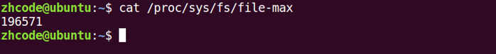

# select

## 多路IO转接服务器设计思路


## select函数参数简介

```c
int select(int nfds, fd_set *readfds, fd_set *writefds,fd_set *exceptfds, struct timeval *timeout);
/*
nfds：			监听的所有文件描述符中，最大文件描述符+1
readfds： 		读 文件描述符监听集合。	传入、传出参数  位图，对应文件描述符表
writefds：		写 文件描述符监听集合。	传入、传出参数		NULL
exceptfds：		异常 文件描述符监听集合	传入、传出参数		NULL
timeout： 	> 0	: 设置监听超时时长。
		   NULL  : 阻塞监听
			  0	 ：非阻塞监听，轮询
返回值：
			> 0:	所有监听集合（3个）中， 满足对应事件的总数。
			  0：	没有满足监听条件的文件描述符
			 -1：	errno

*/
```

传入表示要监听的，传出表示实际有数据的

#### 文件描述符集合操作

```c
void FD_CLR(int fd, fd_set *set)		//把某一个fd清除出去
int FD_ISSET(int fd, fd_set *set)		//判定某个fd是否在位图中
void FD_SET(int fd, fd_set *set)		//把某一个fd添加到位图
void FD_ZERO(fd_set *set)				//位图所有二进制位置零
```

## select多路IO转接：

原理： 借助内核， select 来监听， 客户端连接、数据通信事件。

```c
void FD_ZERO(fd_set *set);				//清空一个文件描述符集合
	fd_set rset;
	FD_ZERO(&rset);

void FD_SET(int fd, fd_set *set);		//将待监听的文件描述符，添加到监听集合中
	FD_SET(3,&rset);					//一次只能传一个
	FD_SET(5,&rset);
	FD_SET(6,&rset);
void FD_CLR(int fd, fd_set *set)		//将一个文件描述符从监听集合中移除。
    FD_CLR(4,&rset);
int FD_ISSET(int fd, fd_set *set)		//判断一个文件描述符是否在监听集合中。
    //返回值：1（在）0（不在）
    FD_ISSET(4,&rset);
```

### 设计思路

```c
int lfd=socket();			//创建套接字
bind();						//绑定地址结构
listen();					//设置监听上限，进入listen状态
fd_set rset,allset;			//创建r监听集合
FD_ZERO(&rset);				//将r监听集合清空
FD_SET(lfd,&rset);			//将lfd添加到r集合中
int maxfd=lfd;
int ret=0;
while(1){
    rset=allset;			//每次循环都要更新rset，因为rset在之前被修改了
    ret = select(maxfd+1,&rset,NULL,NULL,NULL);
    if(ret > 0){
    	if(FD_ISSET(lfd,&rset)){
        	cfd = accept();
            maxfd=cfd;
        	FD_SET(cfd,&allset);
    	}
    	for(int i=lfd+1;i<=maxfd;++i){
        	if(FD_ISSET(i,&rset)){		//有read、write事件
            	read();
            	小--大;
            	write();
        	}
    	}
	}
}
```

### 代码review

```c
//
// Created by alex on 2022/6/20.
//

#include <stdio.h>
#include <unistd.h>
#include <sys/types.h>
#include <sys/socket.h>
#include <strings.h>
#include <string.h>
#include <ctype.h>
#include <arpa/inet.h>
//select头文件
#include <sys/select.h>

#include "wrap.h"

#define SERV_PORT 6666
#define MAX_LINE 8192
#define BACKLOG 64

int main(void){
int listenfd,cfd;

listenfd=Socket(AF_INET,SOCK_STREAM,0);
struct sockaddr_in  serv_addr,client_addr;
memset(&serv_addr,0, sizeof(serv_addr));
serv_addr.sin_family=AF_INET;
serv_addr.sin_port=htons(SERV_PORT);
serv_addr.sin_addr.s_addr=htonl(INADDR_ANY);

Bind(listenfd,(struct sockaddr*)&serv_addr,sizeof(serv_addr));

Listen(listenfd,BACKLOG);
fd_set rset,allset;						//定义读集合，备份集合allset
FD_ZERO(&allset);						//清空监听集合
FD_SET(listenfd,&allset);				//将待监听fd添加到监听集合中
int maxfd=listenfd;						//最大文件描述符
int ret=0;

socklen_t client_addr_len= sizeof(client_addr);
char buf[MAX_LINE],clie_IP[BUFSIZ];
while(1){
    rset=allset;						//备份
    ret = select(maxfd+1,&rset,NULL,NULL,NULL);	//使用select监听
    if(ret>0){
        if(FD_ISSET(listenfd,&rset)){	//说明listenfd满足监听的 读事件
            cfd=Accept(listenfd, (struct sockaddr *)&client_addr, &client_addr_len);//建立链接--不会阻塞
            printf("cfd = ----%d\n", cfd);
            printf("client IP: %s  port:%d\n",
                   inet_ntop(AF_INET, &client_addr.sin_addr.s_addr, clie_IP, sizeof(clie_IP)),
                   ntohs(client_addr.sin_port));
            if(maxfd<cfd)				//修改maxfd
                maxfd=cfd;
            FD_SET(cfd,&allset);		//将新产生的fd添加到监听集合中
            if(0==--ret)				//说明select只返回一个，并且是listenfd，后续无须执行
                continue;
        }
        for(int i=listenfd+1;i<=maxfd;++i){		//处理满足读事件的fd
            if(FD_ISSET(i,&rset)){		//找到满足读事件的fd
                int len;
                len = Read(i, buf, sizeof(buf))；
                if(len ==-1){
                    perr_exit("read error");
                }else if(len==0){
                    Close(i);
                    FD_CLR(i,&allset);
                }else if(len >0){
                    Write(STDOUT_FILENO, buf, len);
                    for (int j = 0; j < len; ++j)
                        buf[j] = toupper(buf[j]);
                    Write(i, buf, len);
                }

            }

        }
    }
}
Close(listenfd);
return 0;
}
```

## select的优缺点


select优缺点：

- 缺点： 监听上限受文件描述符限制。 最大 1024.

  检测满足条件的fd，只能自己添加业务逻辑提高小（比如用数组记录监听的fd）。 提高了编码难度。

- 优点： 跨平台。win、linux、macOS、Unix、类Unix、mips

```c++
//select优化
//新增一个数组来存储监听的fd，这样遍历时只需要遍历数组中的fd就行
1.	#include <stdio.h>  
2.	#include <stdlib.h>  
3.	#include <unistd.h>  
4.	#include <string.h>  
5.	#include <arpa/inet.h>  
6.	#include <ctype.h>  
7.	  
8.	#include "wrap.h"  
9.	  
10.	#define SERV_PORT 6666  
11.	  
12.	int main(int argc, char *argv[])  
13.	{  
14.	    int i, j, n, maxi;  
15.	  
16.	    int nready, client[FD_SETSIZE];   /* 自定义数组client, 防止遍历1024个文件描述符  FD_SETSIZE默认为1024 */  
17.	    int maxfd, listenfd, connfd, sockfd;  
18.	    char buf[BUFSIZ], str[INET_ADDRSTRLEN];     /* #define INET_ADDRSTRLEN 16 */  
19.	  
20.	    struct sockaddr_in clie_addr, serv_addr;  
21.	    socklen_t clie_addr_len;  
22.	    fd_set rset, allset;                        /* rset 读事件文件描述符集合 allset用来暂存 */  
23.	  
24.	    listenfd = Socket(AF_INET, SOCK_STREAM, 0);  
25.	  
26.	    int opt = 1;  
27.	    setsockopt(listenfd, SOL_SOCKET, SO_REUSEADDR, &opt, sizeof(opt));  //s
28.	  
29.	    bzero(&serv_addr, sizeof(serv_addr));  
30.	    serv_addr.sin_family= AF_INET;  
31.	    serv_addr.sin_addr.s_addr = htonl(INADDR_ANY);  
32.	    serv_addr.sin_port= htons(SERV_PORT);  
33.	  
34.	    Bind(listenfd, (struct sockaddr *)&serv_addr, sizeof(serv_addr));  
35.	    Listen(listenfd, 128);  
36.	  
37.	    maxfd = listenfd;     		/* 起初 listenfd 即为最大文件描述符 */  
38.	  
39.	    maxi = -1;                 	/* 将来用作client[]的下标, 初始值指向0个元素之前下标位置 */  
40.	    for (i = 0; i < FD_SETSIZE; i++)  
41.	        client[i] = -1;         /* 用-1初始化client[] */  
42.	  
43.	    FD_ZERO(&allset);  
44.	    FD_SET(listenfd, &allset);  /* 构造select监控文件描述符集 */  
45.	  
46.	    while (1) {     
47.	        rset = allset;          /* 每次循环时都重新设置select监控信号集 */  
48.	  
49.	        nready = select(maxfd+1, &rset, NULL, NULL, NULL);  //2  1--lfd  1--connfd  
50.	        if (nready < 0)  
51.	            perr_exit("select error");  
52.	  
53.	        if (FD_ISSET(listenfd, &rset)) { /* 说明有新的客户端链接请求 */  
54.	  
55.	            clie_addr_len = sizeof(clie_addr);  
56.	            connfd = Accept(listenfd, (struct sockaddr *)&clie_addr, &clie_addr_len);       /* Accept 不会阻塞 */  
57.	            printf("received from %s at PORT %d\n",  
58.	                    inet_ntop(AF_INET, &clie_addr.sin_addr, str, sizeof(str)),  
59.	                    ntohs(clie_addr.sin_port));  
60.	  
61.	            for (i = 0; i < FD_SETSIZE; i++)  
62.	                if (client[i] < 0) {             /* 找client[]中没有使用的位置 */  
63.	                    client[i] = connfd;         /* 保存accept返回的文件描述符到client[]里 */  
64.	                    break;  
65.	                }  
66.	  
67.	            if (i == FD_SETSIZE) {          /* 达到select能监控的文件个数上限 1024 */  
68.	                fputs("too many clients\n", stderr);  
69.	                exit(1);  
70.	            }  
71.	  
72.	            FD_SET(connfd, &allset);         /* 向监控文件描述符集合allset添加新的文件描述符connfd */  
73.	  
74.	            if (connfd > maxfd)  
75.	                maxfd = connfd;             /* select第一个参数需要 */  
76.	  
77.	            if (i > maxi)  
78.	                maxi = i;                   /* 保证maxi存的总是client[]最后一个元素下标 */  
79.	  
80.	            if (--nready == 0)  
81.	                continue;  
82.	        }   
83.	  
84.	        for (i = 0; i <= maxi; i++) {      /* 检测哪个clients 有数据就绪 */  
85.	  
86.	            if ((sockfd = client[i]) < 0)  
87.	                continue;  
88.	            if (FD_ISSET(sockfd, &rset)) {  
89.	  
90.	                if ((n = Read(sockfd, buf, sizeof(buf))) == 0) {   /* 当client关闭链接时,服务器端也关闭对应链接 */  
91.	                    Close(sockfd);  
92.	                    FD_CLR(sockfd, &allset);      /* 解除select对此文件描述符的监控 */  
93.	                    client[i] = -1;  
94.	                } else if (n > 0) {  
95.	                    for (j = 0; j < n; j++)  
96.	                        buf[j] = toupper(buf[j]);  
97.	                    Write(sockfd, buf, n);  
98.	                    Write(STDOUT_FILENO, buf, n);  
99.	                }  
100.	                if (--nready == 0)  
101.	                    break;                   /* 跳出for, 但还在while中 */  
102.	            }  
103.	        }  
104.	    }  
105.	    Close(listenfd);  
106.	    return 0;  
107.	}  
```

# poll

## poll函数原型分析

poll是对select的改进，但是它是个半成品，相对select提升不大。最终版本是epoll，所以poll了解一下就完事儿，重点掌握epoll。

```c++
int poll(struct pollfd *fds, nfds_t nfds, int timeout);
/*
fds：监听的文件描述符【数组】
struct pollfd {
int fd：	待监听的文件描述符
short events：	待监听的文件描述符对应的监听事件
				取值：POLLIN、POLLOUT、POLLERR
short revnets：传入时， 给0。 
				如果满足对应事件的话，返回 非0 --> POLLIN、POLLOUT、POLLERR
}
nfds: 监听数组的，实际有效监听个数。
timeout:	>0:超时时长。单位：毫秒。
			-1:阻塞等待
			0：不阻塞
返回值：返回满足对应监听事件的文件描述符 总个数。
*/
```

### poll函数使用注意事项示例


## 代码

```c
1.	/* server.c */  
2.	#include <stdio.h>  
3.	#include <stdlib.h>  
4.	#include <string.h>  
5.	#include <netinet/in.h>  
6.	#include <arpa/inet.h>  
7.	#include <poll.h>  
8.	#include <errno.h>  
9.	#include "wrap.h"  
10.	  
11.	#define MAXLINE 80  
12.	#define SERV_PORT 6666  
13.	#define OPEN_MAX 1024  
14.	  
15.	int main(int argc, char *argv[])  
16.	{  
17.	    int i, j, maxi, listenfd, connfd, sockfd;  
18.	    int nready;  
19.	    ssize_t n;  
20.	    char buf[MAXLINE], str[INET_ADDRSTRLEN];  
21.	    socklen_t clilen;  
22.	    struct pollfd client[OPEN_MAX];  
23.	    struct sockaddr_in cliaddr, servaddr;  
24.	  
25.	    listenfd = Socket(AF_INET, SOCK_STREAM, 0);  
26.	  
27.	    bzero(&servaddr, sizeof(servaddr));  
28.	    servaddr.sin_family = AF_INET;  
29.	    servaddr.sin_addr.s_addr = htonl(INADDR_ANY);  
30.	    servaddr.sin_port = htons(SERV_PORT);  
31.	  
32.	    Bind(listenfd, (struct sockaddr *)&servaddr, sizeof(servaddr));  
33.	  
34.	    Listen(listenfd, 20);  
35.	  
36.	    client[0].fd = listenfd;  
37.	    client[0].events = POLLRDNORM;                  /* listenfd监听普通读事件 */  
38.	  
39.	    for (i = 1; i < OPEN_MAX; i++)  
40.	        client[i].fd = -1;                          /* 用-1初始化client[]里剩下元素 */  
41.	    maxi = 0;                                       /* client[]数组有效元素中最大元素下标 */  
42.	  
43.	    for ( ; ; ) {  
44.	        nready = poll(client, maxi+1, -1);          /* 阻塞 */  
45.	        if (client[0].revents & POLLRDNORM) {       /* 有客户端链接请求 */  
46.	            clilen = sizeof(cliaddr);  
47.	            connfd = Accept(listenfd, (struct sockaddr *)&cliaddr, &clilen);  
48.	            printf("received from %s at PORT %d\n",  
49.	                    inet_ntop(AF_INET, &cliaddr.sin_addr, str, sizeof(str)),  
50.	                    ntohs(cliaddr.sin_port));  
51.	            for (i = 1; i < OPEN_MAX; i++) {  
52.	                if (client[i].fd < 0) {  
53.	                    client[i].fd = connfd;  /* 找到client[]中空闲的位置，存放accept返回的connfd */  
54.	                    break;  
55.	                }  
56.	            }  
57.	  
58.	            if (i == OPEN_MAX)  
59.	                perr_exit("too many clients");  
60.	  
61.	            client[i].events = POLLRDNORM;      /* 设置刚刚返回的connfd，监控读事件 */  
62.	            if (i > maxi)  
63.	                maxi = i;                       /* 更新client[]中最大元素下标 */  
64.	            if (--nready <= 0)  
65.	                continue;                       /* 没有更多就绪事件时,继续回到poll阻塞 */  
66.	        }  
67.	        for (i = 1; i <= maxi; i++) {            /* 检测client[] */  
68.	            if ((sockfd = client[i].fd) < 0)  
69.	                continue;  
70.	            if (client[i].revents & (POLLRDNORM | POLLERR)) {  
71.	                if ((n = Read(sockfd, buf, MAXLINE)) < 0) {  
72.	                    if (errno == ECONNRESET) { /* 当收到 RST标志时 */  
73.	                        /* connection reset by client */  
74.	                        printf("client[%d] aborted connection\n", i);  
75.	                        Close(sockfd);  
76.	                        client[i].fd = -1;  
77.	                    } else {  
78.	                        perr_exit("read error");  
79.	                    }  
80.	                } else if (n == 0) {  
81.	                    /* connection closed by client */  
82.	                    printf("client[%d] closed connection\n", i);  
83.	                    Close(sockfd);  
84.	                    client[i].fd = -1;  
85.	                } else {  
86.	                    for (j = 0; j < n; j++)  
87.	                        buf[j] = toupper(buf[j]);  
88.	                        Writen(sockfd, buf, n);  
89.	                }  
90.	                if (--nready <= 0)  
91.	                    break;              /* no more readable descriptors */  
92.	            }  
93.	        }  
94.	    }  
95.	    return 0;  
96.	}  

```

## poll总结

- 优点
  - 自带数据结构。可以将监听事件集合和返回事件集合分离。
  - 拓展监听上限。超出1024限制。
- 缺点
  - 不能跨平台。Linux
  - 无法直接定位满足监听事件的文件描述符，编码难度大

## 突破1024文件描述符设置

```
cat /proc/sys/fs/file-max  --> 当前计算机所能打开的最大文件个数。 受硬件影响。

ulimit -a	——> 当前用户下的进程，默认打开文件描述符个数。  缺省为 1024
```

### 修改：

```
打开 sudo vi /etc/security/limits.conf， 写入：
*	soft	nofile	65536			--> 设置默认值， 可以直接借助命令修改。 【注销用户，使其生效】
*	hard	nofile 	100000			--> 命令修改上限。
```

cat /proc/sys/fs/file-max    查看最大文件描述符上限



ulimit -a  

 

sudo vi /etc/security/limits.conf 修改上限 

修改之后，注销用户重新登录，查看文件描述符上限：

如图，已经修改成功了。

如果使用ulimit -n 来修改，会受到之前设置的hard的限制：


 

> 用ulimit -n设置上调之后，往下调可以，往上调需要注销用户再登录。

# epoll

## epoll_create和epoll_ctl

```c
int epoll_create(int size);		//创建一个监听红黑树
/*
size:	创建的红黑树的监听节点数量。（仅供内核参考。）
返回值：	指向新创建的红黑树的根节点的 fd。
*/

int epoll_ctl(int epfd, int op, int fd, struct epoll_event *event);	//操作监听红黑树
/*
epfd：epoll_create 函数的返回值。 epfd
op：对该监听红黑数所做的操作。
	EPOLL_CTL_ADD 添加fd到 监听红黑树
	EPOLL_CTL_MOD 修改fd在 监听红黑树上的监听事件。
	EPOLL_CTL_DEL 将一个fd 从监听红黑树上摘下（取消监听）
fd：
	待监听的fd
event：	本质 struct epoll_event 结构体 地址
	成员 events：	EPOLLIN / EPOLLOUT / EPOLLERR
	成员 data： 联合体（共用体）：
			int fd;	  对应监听事件的 fd
			void *ptr； 
			uint32_t u32;
			uint64_t u64;
	返回值：成功 0； 失败： -1 errno
*/
```

## epoll_wait

```c
int epoll_wait(int epfd, struct epoll_event *events, int maxevents, int timeout); 	 //阻塞监听。
/*
epfd：epoll_create 函数的返回值。 epfd
events：传出参数，【数组】， 满足监听条件的 那些 fd 结构体。
maxevents：数组 元素的总个数。 1024
	struct epoll_event evnets[1024];
timeout：
	-1: 阻塞
	0： 不阻塞
	>0: 超时时间 （毫秒）
返回值：
	>0: 满足监听的 总个数。 可以用作循环上限。
	0： 没有fd满足监听事件
	-1：失败。 errno
*/
```


## 代码实现

```c
#include <stdio.h>
#include <unistd.h>
#include <sys/types.h>
#include <sys/socket.h>
#include <strings.h>
#include <string.h>
#include <ctype.h>
#include <arpa/inet.h>
//epoll头文件
#include <sys/epoll.h>

#include "wrap.h"

#define SERV_PORT 6666
#define MAX_LINE 8192
#define BACKLOG 64
#define OPEN_MAX 5000
int main(int argc,char *argv[])
{
	int listenfd,cfd;
	listenfd=Socket(AF_INET,SOCK_STREAM,0);
    int opt=1;
    setsockopt(listenfd,SOL_SOCKET,SO_REUSEADDR,&opt, sizeof(opt));//端口复用
    struct sockaddr_in serv_addr,client_addr;
    memset(&serv_addr,0,sizeof(serv_addr));
    serv_addr.sin_family=AF_INET;
    serv_addr.sin_port=htons(SERV_PORT);
    serv_addr.sin_addr.s_addr=htonl(INADDR_ANY);
    Bind(listenfd,(struct sockaddr*)&serv_addr, sizeof(serv_addr));
    Listen(listenfd,BACKLOG);


    int efd;
    efd=epoll_create(OPEN_MAX);			//创建epoll模型, efd指向红黑树根节点
    if(efd==-1) perr_exit("epoll_create error");

    struct epoll_event tep,ep[OPEN_MAX];//tep: epoll_ctl参数  ep[] : epoll_wait参数
    tep.events=EPOLLIN;
    tep.data.fd=listenfd;	//指定lfd的监听时间为"读

    int res = epoll_ctl(efd,EPOLL_CTL_ADD,listenfd,&tep);//将lfd及对应的结构体设置到树上,efd可找到该树  
    if(res==-1) perr_exit("epoll_ctl error");

    int nready,i;
    char buf[MAX_LINE],clie_IP[BUFSIZ];
    socklen_t client_addr_len= sizeof(client_addr);
    //epoll为server阻塞监听事件, ep为struct epoll_event类型数组, OPEN_MAX为数组容量, -1表永久阻塞
    while(1){
        nready=epoll_wait(efd,ep,OPEN_MAX,-1);
        if(nready==-1) perr_exit("epoll_wait error");
        for(i=0;i<nready;++i){
            if (!(ep[i].events & EPOLLIN))      //如果不是"读"事件, 继续循环  
                continue;
            if(ep[i].data.fd==listenfd){		//判断满足事件的fd是不是lfd
                cfd=Accept(listenfd, (struct sockaddr *)&client_addr, &client_addr_len);//接受链接
                printf("cfd = ----%d\n", cfd);
                printf("client IP: %s  port:%d\n",
                       inet_ntop(AF_INET, &client_addr.sin_addr.s_addr, clie_IP, sizeof(clie_IP)),
                       ntohs(client_addr.sin_port));
                tep.events=EPOLLIN;
                tep.data.fd=cfd;
                res=epoll_ctl(efd,EPOLL_CTL_ADD,cfd,&tep);				//加入红黑树
                if(res==-1) perr_exit("epoll_ctl error");
            }else{														//不是lfd
                int sockfd=ep[i].data.fd;
                int n=Read(sockfd,buf,MAX_LINE);
                if(n==0){												//读到0,说明客户端关闭链接
                    res=epoll_ctl(efd,EPOLL_CTL_DEL,sockfd,NULL);		//将该文件描述符从红黑树摘除
                    Close(sockfd);
                    printf("client[%d] closed connection\n", sockfd);
                }else if(n<0){											//出错
                    perror("read n < 0 error: ");
                    res = epoll_ctl(efd, EPOLL_CTL_DEL, sockfd, NULL); 	//摘除节点
                    Close(sockfd);
                }else{													//实际读到了字节数								
                     for (int j = 0; j < n; ++j)
                         buf[j] = toupper(buf[j]);						//转大写,写回给客户端
                     Write(STDOUT_FILENO, buf, n);
                     Write(sockfd, buf, n);
                    }
                }
            }
        }
    Close(listenfd);
    Close(efd);
    return 0;
}

```

## epoll进阶

​		epoll是Linux下多路复用IO接口select/poll的增强版本，它能显著提高程序在大量并发连接中只有少量活跃的情况下的系统CPU利用率，因为它会复用文件描述符集合来传递结果而不用迫使开发者每次等待事件之前都必须重新准备要被侦听的文件描述符集合，另一点原因就是获取事件的时候，它无须遍历整个被侦听的描述符集，只要遍历那些被内核IO事件异步唤醒而加入Ready队列的描述符集合就行了。


### epoll事件有两种模型：

- Edge Triggered（ET）边缘触发只有数据到来才触发，不管缓存区中是否还有数据。
  - 缓冲区剩余未读尽的数据**不会**导致epoll_wait返回。新的事件满足，才会触发。
- Level Triggered（LT）水平触发只要有数据都会触发。（默认采用）
  - 缓冲区剩余未读尽的数据**会**导致epoll_wait返回。

### 测试示例

epoll（或者select/poll）不是只能用在socket里，还可以读取别的文件描述符

```c
1.	#include <stdio.h>  
2.	#include <stdlib.h>  
3.	#include <sys/epoll.h>  
4.	#include <errno.h>  
5.	#include <unistd.h>  
6.	  
7.	#define MAXLINE 10  
8.	  
9.	int main(int argc, char *argv[])  
10.	{  
11.	    int efd, i;  
12.	    int pfd[2];  
13.	    pid_t pid;  
14.	    char buf[MAXLINE], ch = 'a';  
15.	  
16.	    pipe(pfd);  
17.	    pid = fork();  
18.	  
19.	    if (pid == 0) {             //子 写  
20.	        close(pfd[0]);  
21.	        while (1) {  
22.	            //aaaa\n  
23.	            for (i = 0; i < MAXLINE/2; i++)  
24.	                buf[i] = ch;  
25.	            buf[i-1] = '\n';  
26.	            ch++;  
27.	            //bbbb\n  
28.	            for (; i < MAXLINE; i++)  
29.	                buf[i] = ch;  
30.	            buf[i-1] = '\n';  
31.	            ch++;  
32.	            //aaaa\nbbbb\n  
33.	            write(pfd[1], buf, sizeof(buf));  
34.	            sleep(5);  
35.	        }  
36.	        close(pfd[1]);  
37.	  
38.	    } else if (pid > 0) {       //父 读  
39.	        struct epoll_event event;  
40.	        struct epoll_event resevent[10];        //epoll_wait就绪返回event  
41.	        int res, len;  
42.	  
43.	        close(pfd[1]);  
44.	        efd = epoll_create(10);  
45.	  
46.	        event.events = EPOLLIN | EPOLLET;     // ET 边沿触发  
47.	       // event.events = EPOLLIN;                 // LT 水平触发 (默认)  
48.	        event.data.fd = pfd[0];  
49.	        epoll_ctl(efd, EPOLL_CTL_ADD, pfd[0], &event);  
50.	  
51.	        while (1) {  
52.	            res = epoll_wait(efd, resevent, 10, -1);  
53.	            printf("res %d\n", res);  
54.	            if (resevent[0].data.fd == pfd[0]) {  
55.	                len = read(pfd[0], buf, MAXLINE/2);  
56.	                write(STDOUT_FILENO, buf, len);  
57.	            }  
58.	        }  
59.	  
60.	        close(pfd[0]);  
61.	        close(efd);  
62.	  
63.	    } else {  
64.	        perror("fork");  
65.	        exit(-1);  
66.	    }  
67.	  
68.	    return 0;  
69.	}  
```

### 网络中ET和LT模式

#### server：

```c
1.	#include <stdio.h>  
2.	#include <string.h>  
3.	#include <netinet/in.h>  
4.	#include <arpa/inet.h>  
5.	#include <signal.h>  
6.	#include <sys/wait.h>  
7.	#include <sys/types.h>  
8.	#include <sys/epoll.h>  
9.	#include <unistd.h>  
10.	  
11.	#define MAXLINE 10  
12.	#define SERV_PORT 9000  
13.	  
14.	int main(void)  
15.	{  
16.	    struct sockaddr_in servaddr, cliaddr;  
17.	    socklen_t cliaddr_len;  
18.	    int listenfd, connfd;  
19.	    char buf[MAXLINE];  
20.	    char str[INET_ADDRSTRLEN];  
21.	    int efd;  
22.	  
23.	    listenfd = socket(AF_INET, SOCK_STREAM, 0);  
24.	  
25.	    bzero(&servaddr, sizeof(servaddr));  
26.	    servaddr.sin_family = AF_INET;  
27.	    servaddr.sin_addr.s_addr = htonl(INADDR_ANY);  
28.	    servaddr.sin_port = htons(SERV_PORT);  
29.	  
30.	    bind(listenfd, (struct sockaddr *)&servaddr, sizeof(servaddr));  
31.	  
32.	    listen(listenfd, 20);  
33.	  
34.	    struct epoll_event event;  
35.	    struct epoll_event resevent[10];  
36.	    int res, len;  
37.	  
38.	    efd = epoll_create(10);  
39.	    event.events = EPOLLIN | EPOLLET;     /* ET 边沿触发 */  
40.	    //event.events = EPOLLIN;                 /* 默认 LT 水平触发 */  
41.	  
42.	    printf("Accepting connections ...\n");  
43.	  
44.	    cliaddr_len = sizeof(cliaddr);  
45.	    connfd = accept(listenfd, (struct sockaddr *)&cliaddr, &cliaddr_len);  
46.	    printf("received from %s at PORT %d\n",  
47.	            inet_ntop(AF_INET, &cliaddr.sin_addr, str, sizeof(str)),  
48.	            ntohs(cliaddr.sin_port));  
49.	  
50.	    event.data.fd = connfd;  
51.	    epoll_ctl(efd, EPOLL_CTL_ADD, connfd, &event);  
52.	  
53.	    while (1) {  
54.	        res = epoll_wait(efd, resevent, 10, -1);  
55.	  
56.	        printf("res %d\n", res);  
57.	        if (resevent[0].data.fd == connfd) {  
58.	            len = read(connfd, buf, MAXLINE/2);         //readn(500)     
59.	            write(STDOUT_FILENO, buf, len);  
60.	        }  
61.	    }  
62.	  
63.	    return 0;  
64.	}  
```

#### client

```c
1.	#include <stdio.h>  
2.	#include <string.h>  
3.	#include <unistd.h>  
4.	#include <arpa/inet.h>  
5.	#include <netinet/in.h>  
6.	  
7.	#define MAXLINE 10  
8.	#define SERV_PORT 9000  
9.	  
10.	int main(int argc, char *argv[])  
11.	{  
12.	    struct sockaddr_in servaddr;  
13.	    char buf[MAXLINE];  
14.	    int sockfd, i;  
15.	    char ch = 'a';  
16.	  
17.	    sockfd = socket(AF_INET, SOCK_STREAM, 0);  
18.	  
19.	    bzero(&servaddr, sizeof(servaddr));  
20.	    servaddr.sin_family = AF_INET;  
21.	    inet_pton(AF_INET, "127.0.0.1", &servaddr.sin_addr);  
22.	    servaddr.sin_port = htons(SERV_PORT);  
23.	  
24.	    connect(sockfd, (struct sockaddr *)&servaddr, sizeof(servaddr));  
25.	  
26.	    while (1) {  
27.	        //aaaa\n  
28.	        for (i = 0; i < MAXLINE/2; i++)  
29.	            buf[i] = ch;  
30.	        buf[i-1] = '\n';  
31.	        ch++;  
32.	        //bbbb\n  
33.	        for (; i < MAXLINE; i++)  
34.	            buf[i] = ch;  
35.	        buf[i-1] = '\n';  
36.	        ch++;  
37.	        //aaaa\nbbbb\n  
38.	        write(sockfd, buf, sizeof(buf));  
39.	        sleep(5);  
40.	    }  
41.	    close(sockfd);  
42.	  
43.	    return 0;  
44.	} 
```

server边沿触发，编译运行，结果如下：


运行后，每过5秒钟服务器才输出一组字符，这是就是边沿触发的效果。


更改服务器为水平触发模式，运行程序，如下：


运行后，每5秒输出两组字符串，这是因为只写入了两组，这个模式的服务器，缓冲区有多少读多少。

ET模式：（边沿触发）缓冲区剩余未读尽的数据不会导致 epoll_wait 返回。 新的事件满足，才会触发。

```c
struct epoll_event event;
event.events = EPOLLIN | EPOLLET;
```

LT模式：（水平触发，默认）缓冲区剩余未读尽的数据会导致 epoll_wait 返回。

### epoll的ET非阻塞模式

readn调用的阻塞，比如设定读500个字符，但是只读到498，完事儿阻塞了，等另剩下的2个字符，然而在server代码里，一旦read变为readn阻塞了，它就不会被唤醒了，因为epoll_wait因为readn的阻塞不会循环执行，读不到新数据。有点死锁的意思，差俩字符所以阻塞，因为阻塞，读不到新字符。

LT(level triggered)：LT是缺省的工作方式，并且同时支持block和no-block socket。在这种做法中，内核告诉你一个文件描述符是否就绪了，然后你可以对这个就绪的fd进行IO操作。如果你不作任何操作，内核还是会继续通知你的，所以，这种模式编程出错误可能性要小一点。传统的select/poll都是这种模型的代表。

ET(edge-triggered)：ET是高速工作方式，只支持no-block socket。在这种模式下，当描述符从未就绪变为就绪时，内核通过epoll告诉你。然后它会假设你知道文件描述符已经就绪，并且不会再为那个文件描述符发送更多的就绪通知。请注意，如果一直不对这个fd作IO操作(从而导致它再次变成未就绪)，内核不会发送更多的通知(only once)。

用fcntl设置阻塞

#### 非阻塞epoll的服务器代码如下

```c
//
// Created by skyyw on 2022/6/30.
//

#include <stdio.h>
#include <string.h>
#include <netinet/in.h>
#include <arpa/inet.h>
#include <sys/wait.h>
#include <sys/types.h>
#include <sys/epoll.h>
#include <unistd.h>
#include <fcntl.h>

#define MAXLINE 10
#define SERV_PORT 8000

int main(void)
{
    struct sockaddr_in servaddr, cliaddr;
    socklen_t cliaddr_len;
    int listenfd, connfd;
    char buf[MAXLINE];
    char str[INET_ADDRSTRLEN];
    int efd, flag;

    listenfd = socket(AF_INET, SOCK_STREAM, 0);

    bzero(&servaddr, sizeof(servaddr));
    servaddr.sin_family = AF_INET;
    servaddr.sin_addr.s_addr = htonl(INADDR_ANY);
    servaddr.sin_port = htons(SERV_PORT);

    bind(listenfd, (struct sockaddr *)&servaddr, sizeof(servaddr));

    listen(listenfd, 20);

    ///////////////////////////////////////////////////////////////////////
    struct epoll_event event;
    struct epoll_event res_event[10];
    int res, len;

    efd = epoll_create(10);

    event.events = EPOLLIN | EPOLLET;     /* ET 边沿触发，默认是水平触发 */

    //event.events = EPOLLIN;
    printf("Accepting connections ...\n");
    cliaddr_len = sizeof(cliaddr);
    connfd = accept(listenfd, (struct sockaddr *)&cliaddr, &cliaddr_len);
    printf("received from %s at PORT %d\n",
           inet_ntop(AF_INET, &cliaddr.sin_addr, str, sizeof(str)),
           ntohs(cliaddr.sin_port));

    flag = fcntl(connfd, F_GETFL);          /* 修改connfd为非阻塞读 */
    flag |= O_NONBLOCK;
    fcntl(connfd, F_SETFL, flag);

    event.data.fd = connfd;
    epoll_ctl(efd, EPOLL_CTL_ADD, connfd, &event);      //将connfd加入监听红黑树
    while (1) {
        printf("epoll_wait begin\n");
        res = epoll_wait(efd, res_event, 10, -1);        //最多10个, 阻塞监听
        printf("epoll_wait end res %d\n", res);

        if (res_event[0].data.fd == connfd) {
            while ((len = read(connfd, buf, MAXLINE/2)) >0 )    //非阻塞读, 轮询
                write(STDOUT_FILENO, buf, len);
        }
    }

    return 0;
}
```

其实就是多了这几行：


#### 结论：

epoll 的 ET模式， 高效模式，但是只支持 非阻塞模式。 --- 忙轮询。

```c
struct epoll_event event;
event.events = EPOLLIN | EPOLLET;
epoll_ctl(epfd, EPOLL_CTL_ADD, cfd， &event);
int flg = fcntl(cfd, F_GETFL);
flg |= O_NONBLOCK;
fcntl(cfd, F_SETFL, flg);
```

### epoll优缺点总结

优点：

- 高效。突破1024文件描述符。

缺点：

- 不能跨平台。Linux

后面使用epoll就用这种非阻塞的

### 补充对比ET和LT 

这里重要的就一点，当使用非阻塞读时，读取数据需要轮询。

比如使用readn的时候，数据没读够，因为非阻塞，跑了，想读剩下的，就得轮询。

## epoll反应堆模型总述

### epoll 反应堆模型：

epoll ET模式 + 非阻塞、轮询 + void *ptr。

### 旧版本：

```c
socket、bind、listen
epoll_create() 创建监听 红黑树
返回 epfd
epoll_ctl() 向树上添加一个监听fd
while(1){
	 epoll_wait 监听
	 对应监听fd有事件产生
	 返回 监听满足数组
	 判断返回数组元素
	 for(){
	 	if(lfd满足){
		 	Accept
		 }else if(cfd 满足){
		 	read()
            小->大 
            write回去
		 }
	 }
}
```

### 反应堆：

不但要监听 cfd 的读事件、还要监听cfd的写事件。

```c
socket、bind、listen
epoll_create() 创建监听 红黑树
返回 epfd
epoll_ctl() 向树上添加一个监听fd
while(1){
	epoll_wait 监听
	对应监听fd有事件产生
	返回 监听满足数组
	判断返回数组元素
	for(){
	 	if(lfd满足){
		 	Accept
		 }else if(cfd 满足){
		 	read()
            小->大 
            cfd从监听红黑树上摘下
            EPOLLOUT
            回调函数
            epoll_ctl() -- EPOLL_CTL_ADD 重新放到红黑上监听写事件
            等待 epoll_wait 返回
            说明 cfd 可写
            write回去
            cfd从监听红黑树上摘下
            EPOLLIN
            epoll_ctl() -- EPOLL_CTL_ADD 重新放到红黑上监听读事件
            epoll_wait 监听
		 }
	 }
}
```

## epoll反应堆整体代码

```c
/*
*epoll基于非阻塞I/O事件驱动
*/
#include <stdio.h>
#include <sys/socket.h>
#include <sys/epoll.h>
#include <arpa/inet.h>
#include <fcntl.h>
#include <unistd.h>
#include <errno.h>
#include <string.h>
#include <stdlib.h>
#include <time.h>

#define MAX_EVENTS  1024                                    //监听上限数
#define BUFLEN 4096
#define SERV_PORT   8080

void recvdata(int fd, int events, void *arg);
void senddata(int fd, int events, void *arg);

/* 描述就绪文件描述符相关信息 */

struct myevent_s {
    int fd;                                                 //要监听的文件描述符
    int events;                                             //对应的监听事件
    void *arg;                                              //泛型参数
    void (*call_back)(int fd, int events, void *arg);       //回调函数
    int status;                                             //是否在监听:1->在红黑树上(监听), 0->不在(不监听)
    char buf[BUFLEN];
    int len;
    long last_active;                                       //记录每次加入红黑树 g_efd 的时间值
};

int g_efd;                                                  //全局变量, 保存epoll_create返回的文件描述符
struct myevent_s g_events[MAX_EVENTS+1];                    //自定义结构体类型数组. +1-->listen fd


/*将结构体 myevent_s 成员变量 初始化*/

void eventset(struct myevent_s *ev, int fd, void (*call_back)(int, int, void *), void *arg){
    ev->fd = fd;
    ev->call_back = call_back;
    ev->events = 0;
    ev->arg = arg;
    ev->status = 0;
    memset(ev->buf, 0, sizeof(ev->buf));
    ev->len = 0;
    ev->last_active = time(NULL);                       //调用eventset函数的时间

    return;
}

/* 向 epoll监听的红黑树 添加一个 文件描述符 */

//eventadd(efd, EPOLLIN, &g_events[MAX_EVENTS]);
void eventadd(int efd, int events, struct myevent_s *ev)
{
    struct epoll_event epv = {0, {0}};
    int op;
    epv.data.ptr = ev;
    epv.events = ev->events = events;       //EPOLLIN 或 EPOLLOUT

    if (ev->status == 0) {                                          //不在红黑树 g_efd 里
        op = EPOLL_CTL_ADD;                 //将其加入红黑树 g_efd, 并将status置1
        ev->status = 1;
    }

    if (epoll_ctl(efd, op, ev->fd, &epv) < 0)                       //实际添加/修改
        printf("event add failed [fd=%d], events[%d]\n", ev->fd, events);
    else
        printf("event add OK [fd=%d], op=%d, events[%0X]\n", ev->fd, op, events);

    return ;
}

/* 从epoll 监听的 红黑树中删除一个 文件描述符*/

void eventdel(int efd, struct myevent_s *ev)
{
    struct epoll_event epv = {0, {0}};

    if (ev->status != 1)                                        //不在红黑树上
        return ;

    //epv.data.ptr = ev;
    epv.data.ptr = NULL;
    ev->status = 0;                                             //修改状态
    epoll_ctl(efd, EPOLL_CTL_DEL, ev->fd, &epv);                //从红黑树 efd 上将 ev->fd 摘除

    return ;
}

/*  当有文件描述符就绪, epoll返回, 调用该函数 与客户端建立链接 */

void acceptconn(int lfd, int events, void *arg)
{
    struct sockaddr_in cin;
    socklen_t len = sizeof(cin);
    int cfd, i;

    if ((cfd = accept(lfd, (struct sockaddr *)&cin, &len)) == -1) {
        if (errno != EAGAIN && errno != EINTR) {
            /* 暂时不做出错处理 */
        }
        printf("%s: accept, %s\n", __func__, strerror(errno));
        return ;
    }

    do {
        for (i = 0; i < MAX_EVENTS; i++)                                //从全局数组g_events中找一个空闲元素
            if (g_events[i].status == 0)                                //类似于select中找值为-1的元素
                break;                                                  //跳出 for

        if (i == MAX_EVENTS) {
            printf("%s: max connect limit[%d]\n", __func__, MAX_EVENTS);
            break;                                                      //跳出do while(0) 不执行后续代码
        }

        int flag = 0;
        if ((flag = fcntl(cfd, F_SETFL, O_NONBLOCK)) < 0) {             //将cfd也设置为非阻塞
            printf("%s: fcntl nonblocking failed, %s\n", __func__, strerror(errno));
            break;
        }

        /* 给cfd设置一个 myevent_s 结构体, 回调函数 设置为 recvdata */
        eventset(&g_events[i], cfd, recvdata, &g_events[i]);
        eventadd(g_efd, EPOLLIN, &g_events[i]);                         //将cfd添加到红黑树g_efd中,监听读事件

    } while(0);

    printf("new connect [%s:%d][time:%ld], pos[%d]\n",
           inet_ntoa(cin.sin_addr), ntohs(cin.sin_port), g_events[i].last_active, i);
    return ;
}

void recvdata(int fd, int events, void *arg)
{
    struct myevent_s *ev = (struct myevent_s *)arg;
    int len;

    len = recv(fd, ev->buf, sizeof(ev->buf), 0);            //读文件描述符, 数据存入myevent_s成员buf中

    eventdel(g_efd, ev);        //将该节点从红黑树上摘除

    if (len > 0) {

        ev->len = len;
        ev->buf[len] = '\0';                                //手动添加字符串结束标记
        printf("C[%d]:%s\n", fd, ev->buf);

        eventset(ev, fd, senddata, ev);                     //设置该 fd 对应的回调函数为 senddata
        eventadd(g_efd, EPOLLOUT, ev);                      //将fd加入红黑树g_efd中,监听其写事件

    } else if (len == 0) {
        close(ev->fd);
        /* ev-g_events 地址相减得到偏移元素位置 */
        printf("[fd=%d] pos[%ld], closed\n", fd, ev-g_events);
    } else {
        close(ev->fd);
        printf("recv[fd=%d] error[%d]:%s\n", fd, errno, strerror(errno));
    }

    return;
}

void senddata(int fd, int events, void *arg)
{
    struct myevent_s *ev = (struct myevent_s *)arg;
    int len;

    len = send(fd, ev->buf, ev->len, 0);                    //直接将数据 回写给客户端。未作处理

    eventdel(g_efd, ev);                                //从红黑树g_efd中移除

    if (len > 0) {

        printf("send[fd=%d], [%d]%s\n", fd, len, ev->buf);
        eventset(ev, fd, recvdata, ev);                     //将该fd的 回调函数改为 recvdata
        eventadd(g_efd, EPOLLIN, ev);                       //从新添加到红黑树上， 设为监听读事件

    } else {
        close(ev->fd);                                      //关闭链接
        printf("send[fd=%d] error %s\n", fd, strerror(errno));
    }

    return ;
}

/*创建 socket, 初始化lfd */

void initlistensocket(int efd, short port)
{
    struct sockaddr_in sin;

    int lfd = socket(AF_INET, SOCK_STREAM, 0);
    fcntl(lfd, F_SETFL, O_NONBLOCK);                                            //将socket设为非阻塞

    memset(&sin, 0, sizeof(sin));                                               //bzero(&sin, sizeof(sin))
    sin.sin_family = AF_INET;
    sin.sin_addr.s_addr = INADDR_ANY;
    sin.sin_port = htons(port);

    bind(lfd, (struct sockaddr *)&sin, sizeof(sin));

    listen(lfd, 20);

    /* void eventset(struct myevent_s *ev, int fd, void (*call_back)(int, int, void *), void *arg);  */
    eventset(&g_events[MAX_EVENTS], lfd, acceptconn, &g_events[MAX_EVENTS]);

    /* void eventadd(int efd, int events, struct myevent_s *ev) */
    eventadd(efd, EPOLLIN, &g_events[MAX_EVENTS]);

    return ;
}

int main(int argc, char *argv[]) 
{
    unsigned short port = SERV_PORT;

    if (argc == 2)
        port = atoi(argv[1]);                           //使用用户指定端口.如未指定,用默认端口

    g_efd = epoll_create(MAX_EVENTS + 1);                 //创建红黑树,返回给全局 g_efd
    if (g_efd <= 0)
        printf("create efd in %s err %s\n", __func__, strerror(errno));

    initlistensocket(g_efd, port);                      //初始化监听socket,并将监听socket挂上红黑树

    struct epoll_event events[MAX_EVENTS + 1];            //保存已经满足就绪事件的文件描述符数组
    printf("server running:port[%d]\n", port);

    int checkpos = 0, i;
    while (1) {
        /* 超时验证，每次测试100个链接，不测试listenfd 当客户端60秒内没有和服务器通信，则关闭此客户端链接 */

        long now = time(NULL);                          //当前时间
        for (i = 0; i < 100; i++, checkpos++) {         //一次循环检测100个。 使用checkpos控制检测对象
            if (checkpos == MAX_EVENTS)
                checkpos = 0;
            if (g_events[checkpos].status != 1)         //不在红黑树 g_efd 上
                continue;

            long duration = now - g_events[checkpos].last_active;       //客户端不活跃的世间

            if (duration >= 60) {
                close(g_events[checkpos].fd);                           //关闭与该客户端链接
                printf("[fd=%d] timeout\n", g_events[checkpos].fd);
                eventdel(g_efd, &g_events[checkpos]);                   //将该客户端 从红黑树 g_efd移除
            }
        }

        /*监听红黑树g_efd, 将满足的事件的文件描述符加至events数组中, 1秒没有事件满足, 返回 0*/
        int nfd = epoll_wait(g_efd, events, MAX_EVENTS + 1, 1000);
        if (nfd < 0) {
            printf("epoll_wait error, exit\n");
            break;
        }

        for (i = 0; i < nfd; i++) {
            /*使用自定义结构体myevent_s类型指针, 接收 联合体data的void *ptr成员*/
            struct myevent_s *ev = (struct myevent_s *) events[i].data.ptr;

            if ((events[i].events & EPOLLIN) && (ev->events & EPOLLIN)) {           //读就绪事件
                ev->call_back(ev->fd, events[i].events, ev->arg);
                //lfd  EPOLLIN
            }
            if ((events[i].events & EPOLLOUT) && (ev->events & EPOLLOUT)) {         //写就绪事件
                ev->call_back(ev->fd, events[i].events, ev->arg);
            }
        }
    }

    /* 退出前释放所有资源 */
    
    return 0;
}
```

main逻辑：创建套接字-->初始化连接-->超时验证-->监听-->处理读事件和写事件

### 给lfd和cfd指定调用函数

eventset函数指定了不同事件对应的回调函数，所以虽然读写事件都用的call_back来回调，但实际上调用的是不同的函数。

```c
for (i = 0; i < nfd; i++) {
      /*使用自定义结构体myevent_s类型指针, 接收 联合体data的void *ptr成员*/
      struct myevent_s *ev = (struct myevent_s *) events[i].data.ptr;

      if ((events[i].events & EPOLLIN) && (ev->events & EPOLLIN)) {           //读就绪事件
      	ev->call_back(ev->fd, events[i].events, ev->arg);
      	//lfd  EPOLLIN
      }
      if ((events[i].events & EPOLLOUT) && (ev->events & EPOLLOUT)) {         //写就绪事件
       	ev->call_back(ev->fd, events[i].events, ev->arg);
      }
}
```

### initlistensocket小总结

eventset函数：设置回调函数

- lfd --> acceptconn()
- cfd--> recvdata()/senddata

eventadd函数：将一个fd， 添加到 监听红黑树。 设置监听 read事件，还是监听写事件。

## ctags


